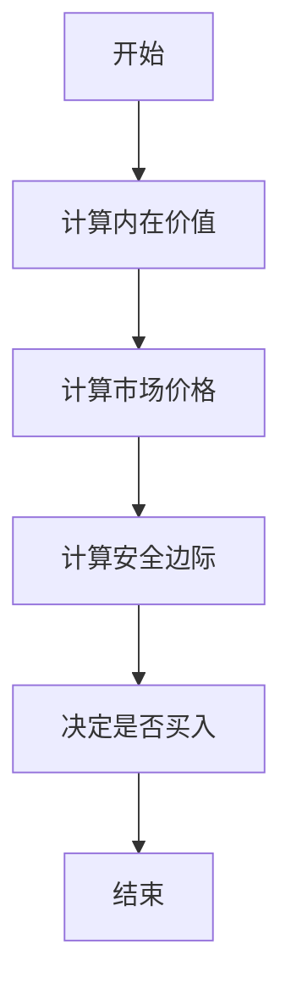

                 


# 费雪的十五个投资点及其现代应用

> 关键词：费雪投资理论、现代投资、价值投资、技术分析、量化投资

> 摘要：本文详细探讨了费雪的投资理论及其在现代投资环境中的应用。通过对费雪十五个投资点的分析，结合现代技术手段，如技术分析和量化投资，探讨如何在当前市场中应用这些理论以实现稳健投资。文章结构包括背景介绍、核心概念、算法原理、系统分析和项目实战，旨在为投资者提供深入的理论支持和实际指导。

---

## 第一部分：背景介绍

### 第1章：费雪投资理论的起源与发展

#### 1.1 费雪的生平简介
- **菲利普·费雪**（Philip Fisher）是20世纪著名的投资家，以“成长股投资”闻名。
- 他提出了许多经典的投资观点，尤其是在选股和投资策略方面。

#### 1.2 费雪投资理论的核心观点
- **投资的第一原则**：投资的首要目标是找到那些具有持续增长潜力的公司。
- **安全边际**：在投资时，必须确保买入价格低于内在价值，以降低风险。
- **内在价值**：公司的内在价值是其未来现金流的现值，是投资的核心依据。

#### 1.3 现代投资环境的变化
- **技术进步**：大数据、人工智能等技术为投资分析提供了新的工具。
- **市场复杂性**：全球化和金融工具的多样化增加了市场的复杂性。

---

## 第二部分：费雪的十五个投资点解析

### 第2章：投资的基本原则

#### 2.1 投资的第一原则
- **定义**：投资的第一原则是寻找具有持续增长潜力的公司。
- **实际应用**：通过分析公司的财务报表和行业地位来判断其增长潜力。

#### 2.2 投资的安全边际
- **定义**：安全边际是指买入价格低于内在价值的部分。
- **计算方法**：通过贴现现金流模型计算内在价值，然后与市场价格比较。

#### 2.3 投资的内在价值
- **定义**：内在价值是公司未来现金流的现值。
- **计算模型**：使用股利折现模型（DDM）或自由现金流模型（FCFF）。

### 第3章：投资的市场分析与趋势判断

#### 3.1 市场分析的基本原则
- **技术分析**：通过价格走势预测市场趋势。
- **基本面分析**：通过公司财务状况判断市场走势。

#### 3.2 投资趋势的判断
- **趋势分析**：通过移动平均线、RSI等指标判断市场趋势。
- **量化分析**：使用机器学习模型预测市场走势。

---

## 第三部分：算法原理

### 第4章：费雪投资理论的数学模型

#### 4.1 内在价值计算模型
- **公式**：
  $$
  V = \frac{C}{(1+r)^n}
  $$
  其中，\( C \) 是未来现金流，\( r \) 是贴现率，\( n \) 是时间跨度。

#### 4.2 安全边际计算模型
- **公式**：
  $$
  \text{安全边际} = V - P
  $$
  其中，\( V \) 是内在价值，\( P \) 是市场价格。

#### 4.3 算法流程图


---

## 第四部分：系统分析

### 第5章：投资系统的架构设计

#### 5.1 系统功能设计
- **数据采集**：收集公司财务数据和市场数据。
- **数据分析**：使用算法计算内在价值和安全边际。
- **投资决策**：根据分析结果生成投资策略。

#### 5.2 系统架构图


---

## 第五部分：项目实战

### 第6章：基于费雪理论的投资系统实现

#### 6.1 环境安装
- **工具**：Python、Pandas、Matplotlib。

#### 6.2 核心代码实现
```python
def calculate_intrinsic_value(cash_flows, discount_rate):
    return sum(cash_flow / (1 + discount_rate) ** n for n, cash_flow in enumerate(cash_flows))
```

#### 6.3 案例分析
- **案例**：分析苹果公司的投资价值。
- **步骤**：
  1. 收集苹果公司过去5年的现金流数据。
  2. 计算其内在价值。
  3. 对比市场价格，判断是否存在安全边际。

---

## 第六部分：总结

### 第7章：总结与展望

#### 7.1 最佳实践
- **长期投资**：避免短期波动的干扰。
- **持续学习**：不断更新投资知识和技能。

#### 7.2 小结
- 费雪的投资理论在现代投资中仍然具有重要的指导意义。

#### 7.3 注意事项
- **风险管理**：即使找到优质公司，也需注意市场波动带来的风险。

#### 7.4 拓展阅读
- 推荐阅读《巴菲特的五种投资策略》和《技术分析实战技巧》。

---

## 作者：AI天才研究院/AI Genius Institute & 禅与计算机程序设计艺术 /Zen And The Art of Computer Programming

---

本文通过详细分析费雪的十五个投资点，结合现代投资技术，为投资者提供了理论支持和实践指导。希望读者能够从中获得启发，实现稳健的投资收益。

