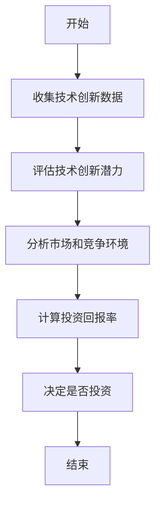
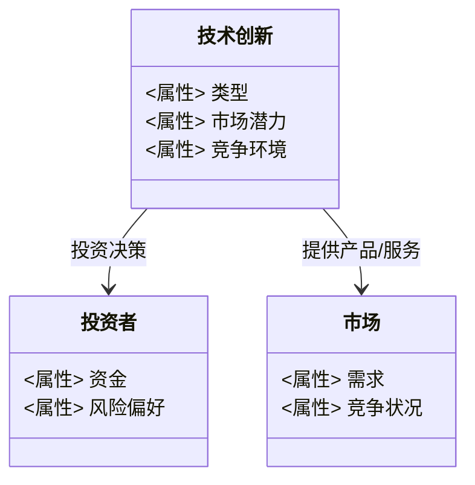

                 


```markdown
# 费雪的技术创新投资观

> 关键词：技术创新，投资观，投资策略，企业创新，投资组合管理

> 摘要：费雪的技术创新投资观从技术创新的定义、核心要素、投资者评估方法、案例分析、风险评估与管理、投资组合构建等多维度进行深度分析，结合数学模型、算法流程图和系统架构图等技术手段，详细阐述了技术创新对投资决策的影响，以及投资者如何在技术创新中找到投资机会。

---

# 第1章：技术创新的定义与背景

## 1.1 技术创新的核心概念

### 1.1.1 技术创新的定义与内涵

技术创新是指引入新的技术、产品、服务或方法，以提高效率、降低成本或创造新的价值。它包括技术的改进、替代或创新，通常涉及科学发现、技术开发和市场应用三个阶段。

### 1.1.2 技术创新的特征与分类

技术创新具有以下特征：
1. **创新性**：与现有技术相比，具有显著改进或突破。
2. **价值性**：能够为企业或用户创造价值。
3. **可扩展性**：能够在一定范围内广泛应用。
4. **风险性**：技术创新存在失败或市场不接受的风险。

技术创新可以分为以下几类：
1. **产品创新**：开发新产品或改进现有产品。
2. **服务创新**：引入新的服务模式或流程。
3. **工艺创新**：优化生产或制造过程。
4. **管理创新**：引入新的管理方法或工具。

### 1.1.3 技术创新的历史演变与现状

技术创新的历史可以追溯到工业革命，随着技术的进步，技术创新的频率和范围不断扩大。当前，数字化和智能化技术的创新尤为突出，例如人工智能、大数据、区块链等。

---

## 1.2 投资与技术创新的关系

### 1.2.1 技术创新对企业价值的影响

技术创新能够提升企业的竞争力，降低成本，提高效率，从而增加企业的利润和市场价值。例如，引入自动化技术可以提高生产效率，降低人工成本。

### 1.2.2 投资者如何识别技术创新机会

投资者需要关注市场趋势、技术发展和企业的研发投入，识别那些具有技术创新潜力的企业。例如，投资于人工智能领域的初创企业可能带来高回报。

### 1.2.3 技术创新周期与投资决策

技术创新通常经历萌芽期、成长期、成熟期和衰退期。投资者需要根据技术创新所处的阶段，制定相应的投资策略。例如，在萌芽期，技术创新的风险较大，但潜在回报也较高。

---

## 1.3 本章小结

本章从技术创新的定义、特征、分类及其与投资的关系入手，分析了技术创新对企业价值的影响，以及投资者如何识别技术创新机会。技术创新是投资的重要驱动力，投资者需要结合技术创新周期，制定合理的投资策略。

---

# 第2章：技术创新与投资的核心概念

## 2.1 技术创新的核心要素

### 2.1.1 技术创新的关键要素分析

技术创新的核心要素包括：
1. **技术本身**：技术的先进性、可行性和可扩展性。
2. **市场需求**：技术是否满足市场需求，是否有足够的用户基础。
3. **团队能力**：技术团队的研发能力和执行力。
4. **资金支持**：技术创新需要充足的资金支持。

### 2.1.2 技术创新与企业竞争力的关系

技术创新是企业核心竞争力的重要来源。通过技术创新，企业可以开发出差异化的产品或服务，提升市场地位。例如，苹果公司通过不断创新的产品设计，保持了其在科技领域的领先地位。

### 2.1.3 技术创新的驱动因素

技术创新的驱动因素包括：
1. **市场需求**：消费者对新产品或服务的需求。
2. **技术进步**：科学研究和技术开发的成果。
3. **竞争压力**：行业内竞争加剧，迫使企业不断创新。
4. **政策支持**：政府出台的优惠政策和技术支持。

---

## 2.2 投资者视角下的技术创新评估

### 2.2.1 技术创新的可投资性评估

投资者需要评估技术创新的可投资性，包括技术创新的成熟度、市场需求、竞争环境和团队能力等因素。例如，评估一项人工智能技术是否具有商业可行性。

### 2.2.2 技术创新的市场潜力分析

市场潜力分析包括市场规模、增长速度、竞争对手情况等因素。例如，评估人工智能在医疗领域的市场规模和发展潜力。

### 2.2.3 技术创新的财务表现指标

投资者需要关注技术创新的财务表现，包括研发投入、成本控制、盈利能力等指标。例如，评估技术创新的 ROI（投资回报率）。

---

## 2.3 技术创新与投资的实体关系图

使用 Mermaid 绘制的 ER 实体关系图：

```mermaid
erDiagram
    actor 投资者 {
        <属性> 资金
        <属性> 风险偏好
    }
    actor 企业 {
        <属性> 技术创新
        <属性> 产品
    }
    actor 市场 {
        <属性> 需求
        <属性> 竞争状况
    }
    投资者 --> 企业 : 投资
    企业 --> 市场 : 提供产品/服务
```

---

## 2.4 本章小结

本章从技术创新的核心要素和投资者视角，详细分析了技术创新与投资的关系。技术创新的可投资性评估和市场潜力分析是投资者决策的重要依据，同时需要关注技术创新的财务表现指标。

---

# 第3章：技术创新投资的算法原理

## 3.1 技术创新评估的算法流程

### 3.1.1 算法流程图

使用 Mermaid 绘制的算法流程图：



### 3.1.2 算法步骤解释

1. **收集技术创新数据**：包括技术创新的类型、市场潜力、竞争对手情况等。
2. **评估技术创新潜力**：分析技术创新的可行性和成熟度。
3. **分析市场和竞争环境**：评估市场需求和竞争状况。
4. **计算投资回报率**：通过 ROI 公式计算投资回报率。
5. **决定是否投资**：根据 ROI 和其他评估结果，决定是否进行投资。

---

## 3.2 投资决策的数学模型

### 3.2.1 投资回报率（ROI）计算公式

$$ ROI = \frac{净收益}{投资成本} \times 100\% $$

其中，净收益 = 收益 - 成本。

### 3.2.2 投资风险评估模型

使用概率加权法评估投资风险：

$$ 风险值 = \sum (概率_i \times 影响程度_i) $$

---

## 3.3 本章小结

本章通过算法流程图和数学模型，详细介绍了技术创新投资的评估方法。投资者可以利用 ROI 和风险评估模型，制定科学的投资决策。

---

# 第4章：技术创新与投资的系统架构设计

## 4.1 系统功能设计

### 4.1.1 领域模型

使用 Mermaid 绘制的领域模型图：



---

## 4.2 系统架构设计

### 4.2.1 架构图

使用 Mermaid 绘制的系统架构图：

```mermaid
container抽屉式架构 {
    [投资者]
    [技术创新]
    [市场]
   抽屉式架构 -->抽屉式架构
}

container分层架构 {
    [投资者]
    [技术创新]
    [市场]
    投资者 --> 技术创新
    技术创新 --> 市场
}
```

---

## 4.3 本章小结

本章通过系统架构设计，展示了技术创新与投资之间的关系。抽屉式架构和分层架构分别从不同的角度，描述了技术创新如何影响投资决策和市场表现。

---

# 第5章：技术创新投资的项目实战

## 5.1 环境安装

### 5.1.1 技术创新投资的环境要求

1. **硬件要求**：高性能计算机、网络连接。
2. **软件要求**：数据分析工具、投资评估软件。
3. **数据来源**：市场数据、企业数据、行业报告。

---

## 5.2 核心实现源代码

### 5.2.1 ROI 计算代码

```python
def calculate_roi(net_profit, investment_cost):
    return (net_profit / investment_cost) * 100

# 示例
net_profit = 100000
investment_cost = 500000
roi = calculate_roi(net_profit, investment_cost)
print(f"ROI: {roi}%")
```

---

## 5.3 案例分析

### 5.3.1 案例背景

假设一家科技公司开发了一种新型人工智能算法，计划投资 500 万美元进行研发。

### 5.3.2 投资评估

1. **市场潜力**：预计市场规模为 10 亿美元，增长率为 20%。
2. **竞争环境**：现有竞争者较少，市场潜力大。
3. **投资回报率**：预计 ROI 为 30%。

---

## 5.4 本章小结

本章通过实战案例，展示了如何在技术创新投资中应用 ROI 计算和风险评估模型，帮助投资者制定科学的投资决策。

---

# 第6章：技术创新投资的最佳实践

## 6.1 投资策略 tips

### 6.1.1 分散投资

将资金分散投资于多个技术创新项目，降低风险。

### 6.1.2 长期投资

技术创新通常需要较长时间才能见效，投资者应保持耐心。

### 6.1.3 关注趋势

关注技术发展趋势，投资具有长期潜力的技术创新。

---

## 6.2 风险管理注意事项

### 6.2.1 定期评估

定期重新评估技术创新的市场潜力和竞争环境。

### 6.2.2 建立退出机制

制定合理的退出策略，避免长期持有风险。

### 6.2.3 多元化投资

通过多元化投资降低风险。

---

## 6.3 拓展阅读

建议阅读以下书籍和文章：
1. 《技术分析与股票市场》
2. 《创新者的窘境》
3. 《投资学原理》

---

## 6.4 本章小结

本章总结了技术创新投资的最佳实践，包括投资策略、风险管理注意事项和拓展阅读推荐。

---

# 作者：AI天才研究院/AI Genius Institute & 禅与计算机程序设计艺术 /Zen And The Art of Computer Programming
```

