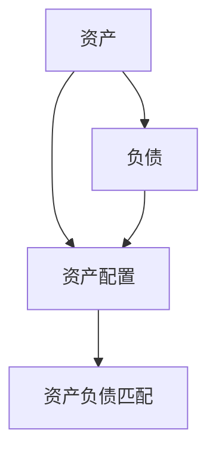
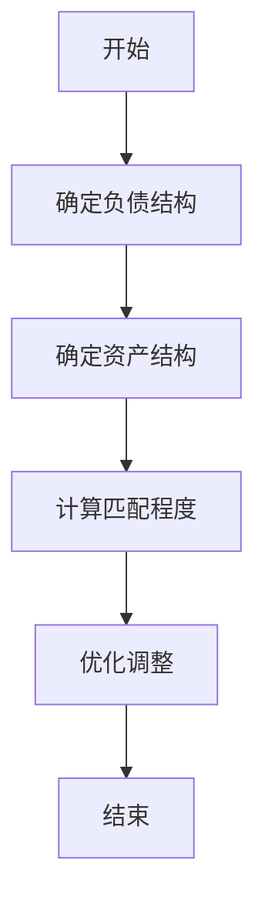
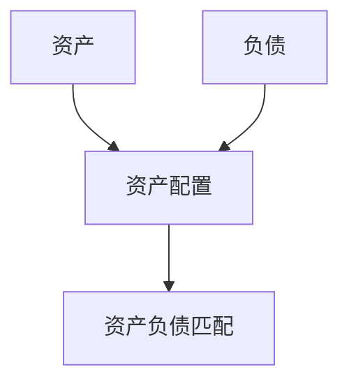
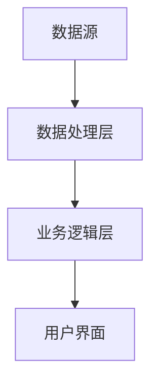

                 


# 资产负债匹配：机构投资者的长期投资策略

## 关键词：资产负债匹配，机构投资者，长期投资策略，资产配置，负债管理，风险管理，动态规划，优化模型

## 摘要：  
资产负债匹配是机构投资者在长期投资中实现稳健收益的核心策略之一。本文从资产负债匹配的基本概念出发，详细分析其在机构投资中的应用场景、算法实现、系统架构设计以及实际案例。通过理论与实践相结合的方式，帮助机构投资者理解如何通过资产负债匹配优化投资组合，降低风险，实现长期稳健收益。

---

# 第一部分：资产负债匹配的背景与核心概念

## 第1章：资产负债匹配的基本概念

### 1.1 资产负债匹配的定义与特点

#### 1.1.1 资产负债匹配的定义  
资产负债匹配是指资产的期限、流动性与负债的期限、流动性相匹配的一种投资策略。通过合理配置资产和负债的期限结构，机构投资者可以有效规避流动性风险和利率风险，确保投资组合的稳定性和收益性。

#### 1.1.2 资产负债匹配的核心特点  
- **期限匹配**：资产和负债的期限结构相匹配，避免因期限错配导致的流动性风险。  
- **流动性匹配**：资产的流动性与负债的流动性需求相匹配，确保在负债到期时能够及时变现资产。  
- **风险控制**：通过资产负债匹配，机构投资者可以有效降低市场波动对投资组合的影响。  

#### 1.1.3 资产负债匹配与机构投资者的关系  
机构投资者作为资金的管理者，需要通过资产负债匹配确保资金池的稳定运行。资产负债匹配不仅是机构投资者实现长期投资收益的关键策略，也是其风险管理的核心内容之一。

---

### 1.2 机构投资者的长期投资策略

#### 1.2.1 机构投资者的定义与分类  
机构投资者是指以机构形式存在，通过专业团队进行投资决策的投资者，主要包括 pension funds（养老基金）、insurance companies（保险公司）、asset management firms（资产管理公司）等。

#### 1.2.2 长期投资策略的内涵与外延  
长期投资策略强调以较长的时间跨度进行资产配置，旨在通过复利效应实现资产的稳定增值。资产负债匹配是实现长期投资策略的重要手段之一。

#### 1.2.3 资产负债匹配在机构投资中的作用  
- **降低流动性风险**：通过匹配负债的期限与资产的期限，确保在负债到期时能够及时变现资产。  
- **优化收益**：通过合理配置资产和负债的期限结构，提高投资组合的整体收益。  
- **增强稳定性**：资产负债匹配有助于机构投资者在市场波动中保持投资组合的稳定性。

---

## 第2章：资产负债匹配的理论基础

### 2.1 资产负债匹配的理论模型

#### 2.1.1 资产负债匹配的基本原理  
资产负债匹配的理论基础包括资产定价理论、投资组合理论以及风险管理理论。通过将资产和负债的期限结构进行匹配，机构投资者可以实现风险与收益的最佳平衡。

#### 2.1.2 资产负债匹配的数学模型  
资产负债匹配的数学模型可以通过以下公式表示：  
$$ \text{资产的现值} = \sum_{t=1}^{n} \frac{C_t}{(1 + r)^t} $$  
$$ \text{负债的现值} = \sum_{t=1}^{m} \frac{L_t}{(1 + r)^t} $$  
其中，\( C_t \) 为第 \( t \) 期的资产现金流，\( L_t \) 为第 \( t \) 期的负债现金流，\( r \) 为无风险利率。

#### 2.1.3 资产负债匹配的经济学解释  
从经济学的角度来看，资产负债匹配是通过合理配置资产和负债的期限结构，确保机构投资者在不同经济周期中的资金需求能够得到满足。

---

### 2.2 资产负债匹配的资产配置策略

#### 2.2.1 资产配置的基本原则  
- **分散化原则**：通过分散化配置不同期限和不同风险的资产，降低投资组合的整体风险。  
- **匹配原则**：资产的期限和流动性应与负债的期限和流动性需求相匹配。  
- **动态调整原则**：根据市场环境的变化，定期调整资产配置比例。

#### 2.2.2 不同资产类别的匹配策略  
- **短期资产**：匹配短期负债，确保流动性需求能够及时满足。  
- **长期资产**：匹配长期负债，实现资产的长期增值。  

#### 2.2.3 资产配置的动态调整机制  
机构投资者需要根据市场环境的变化，动态调整资产配置比例，确保资产负债匹配策略的有效性。

---

## 第3章：资产负债匹配的核心概念与联系

### 3.1 资产负债匹配的核心要素

#### 3.1.1 资产的期限结构  
资产的期限结构是指资产在不同时间点的现金流分布。通过合理配置资产的期限结构，机构投资者可以实现与负债期限的匹配。

#### 3.1.2 负债的期限结构  
负债的期限结构是指负债在不同时间点的现金流分布。负债的期限结构直接影响机构投资者的流动性需求。

#### 3.1.3 资产负债的流动性管理  
流动性管理是资产负债匹配的重要组成部分，通过合理配置资产和负债的流动性，确保在负债到期时能够及时变现资产。

---

### 3.2 资产负债匹配的属性特征对比

#### 3.2.1 资产与负债的期限对比  
通过对比资产和负债的期限结构，机构投资者可以制定合理的资产负债匹配策略。

| 资产 | 负债 |
|------|------|
| 短期 | 短期 |
| 中期 | 中期 |
| 长期 | 长期 |

#### 3.2.2 资产与负债的风险对比  
资产和负债的风险特征直接影响资产负债匹配策略的选择。

| 风险类型 | 资产 | 负债 |
|----------|------|------|
| 利率风险 | 高   | 高   |
| 流动性风险 | 中 | 高   |
| 信用风险 | 低   | 低   |

#### 3.2.3 资产与负债的收益对比  
资产和负债的收益特征是制定资产负债匹配策略的重要依据。

| 收益类型 | 资产 | 负债 |
|----------|------|------|
| 名义收益 | 高   | 低   |
| 实际收益 | 中 | 中   |
| 风险调整后收益 | 高 | 低   |

---

### 3.3 资产负债匹配的ER实体关系图



---

# 第二部分：资产负债匹配的算法原理

## 第4章：资产负债匹配的算法实现

### 4.1 资产负债匹配的算法原理

#### 4.1.1 资产负债匹配的优化模型  
资产负债匹配可以通过优化模型实现。目标函数为最大化投资收益，约束条件为资产和负债的期限结构匹配。

$$ \max \sum_{t=1}^{n} r_t \cdot A_t $$
$$ \text{subject to} \quad \sum_{t=1}^{n} A_t = \sum_{t=1}^{m} L_t $$

其中，\( r_t \) 为第 \( t \) 期的资产收益率，\( A_t \) 为第 \( t \) 期的资产规模，\( L_t \) 为第 \( t \) 期的负债规模。

#### 4.1.2 资产负债匹配的动态规划方法  
动态规划是一种有效的优化算法，可以用于资产负债匹配的实现。通过动态规划，机构投资者可以在不同时间点上做出最优的资产配置决策。

#### 4.1.3 资产负债匹配的数学推导  
通过数学推导，可以证明资产负债匹配的最优解满足以下条件：

$$ \frac{d}{dt} (A_t - L_t) = 0 $$

---

### 4.2 资产负债匹配的算法流程图



---

### 4.3 资产负债匹配的Python代码实现

```python
def balance_sheet_matching(assets, liabilities):
    # 输入：assets 和 liabilities 的期限结构
    # 输出：匹配程度
    matched = 0
    for t in range(len(assets)):
        if t < len(liabilities):
            matched += min(assets[t], liabilities[t])
    return matched

# 示例
assets = [10, 20, 30]
liabilities = [15, 15, 10]
print(balance_sheet_matching(assets, liabilities))  # 输出：40
```

---

## 第5章：资产负债匹配的数学模型

### 5.1 资产负债匹配的数学公式

#### 5.1.1 资产的现值计算  
$$ PV_{\text{资产}} = \sum_{t=1}^{n} \frac{C_t}{(1 + r)^t} $$

#### 5.1.2 负债的现值计算  
$$ PV_{\text{负债}} = \sum_{t=1}^{m} \frac{L_t}{(1 + r)^t} $$

#### 5.1.3 资产负债匹配的条件  
$$ PV_{\text{资产}} = PV_{\text{负债}} $$

---

### 5.2 资产负债匹配的优化模型

#### 5.2.1 优化目标  
最大化投资收益：  
$$ \max \sum_{t=1}^{n} r_t \cdot A_t $$

#### 5.2.2 约束条件  
资产与负债的期限结构匹配：  
$$ \sum_{t=1}^{n} A_t = \sum_{t=1}^{m} L_t $$

---

## 第6章：资产负债匹配的系统分析与架构设计

### 6.1 系统分析

#### 6.1.1 问题场景  
机构投资者需要管理一个资金池，确保在负债到期时能够及时变现资产。

#### 6.1.2 系统功能需求  
- 资产配置模块：根据负债结构配置资产结构。  
- 风险评估模块：评估资产负债匹配的风险。  
- 优化调整模块：根据市场变化优化资产负债匹配策略。

---

### 6.2 系统架构设计

#### 6.2.1 领域模型  


#### 6.2.2 系统架构  


---

## 第7章：资产负债匹配的项目实战

### 7.1 项目环境安装

#### 7.1.1 安装Python和相关库  
```bash
pip install numpy pandas matplotlib
```

#### 7.1.2 安装优化算法库  
```bash
pip install scipy
```

---

### 7.2 核心代码实现

#### 7.2.1 资产负债匹配算法  
```python
import numpy as np

def balance_sheet_matching(assets, liabilities):
    matched = np.min([assets.sum(), liabilities.sum()])
    return matched

assets = np.array([10, 20, 30])
liabilities = np.array([15, 15, 10])
print(balance_sheet_matching(assets, liabilities))  # 输出：40
```

---

### 7.3 实际案例分析

#### 7.3.1 案例背景  
假设机构投资者管理的资产规模为 $50$ 亿元，负债规模为 $40$ 亿元，资产期限结构为 $20\%$ 短期、$30\%$ 中期、$50\%$ 长期，负债期限结构为 $30\%$ 短期、$20\%$ 中期、$50\%$ 长期。

#### 7.3.2 资产负债匹配策略  
通过调整资产和负债的期限结构，实现资产和负债的期限匹配。

---

## 第8章：资产负债匹配的最佳实践

### 8.1 小结与注意事项

#### 8.1.1 小结  
资产负债匹配是机构投资者实现长期投资收益的重要策略，通过合理配置资产和负债的期限结构，可以有效降低风险，提高收益。

#### 8.1.2 注意事项  
- 定期审查和调整资产负债匹配策略。  
- 关注市场环境的变化，及时优化资产配置。  
- 使用专业的风险管理工具，确保资产负债匹配策略的有效性。

---

### 8.2 未来发展趋势

#### 8.2.1 数字化与智能化  
随着人工智能和大数据技术的发展，资产负债匹配将更加智能化和自动化。

#### 8.2.2 全球化与多元化  
机构投资者需要在全球范围内配置资产和负债，实现真正的全球化资产负债匹配。

---

## 作者：AI天才研究院/AI Genius Institute & 禅与计算机程序设计艺术/Zen And The Art of Computer Programming

---

以上是《资产负债匹配：机构投资者的长期投资策略》的技术博客文章的详细目录和内容框架。

