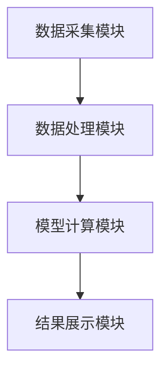

                 


# 资产配置模型：优化风险收益比的科学方法

> 关键词：资产配置模型、风险收益优化、投资组合优化、现代投资组理论、资产类别分配

> 摘要：本文详细探讨了资产配置模型的构建与优化方法，从理论基础到实际应用，结合数学模型和算法实现，分析如何科学地优化风险与收益的平衡，帮助投资者制定最优的投资策略。

---

# 第一部分：资产配置模型的背景与核心概念

## 第1章：资产配置模型概述

### 1.1 资产配置的基本概念

#### 1.1.1 资产配置的定义
资产配置是指将资金分配到不同的资产类别（如股票、债券、房地产等）以在风险与收益之间找到最佳平衡点的过程。其核心目标是在满足投资目标的前提下，最大化收益或最小化风险。

#### 1.1.2 资产配置的目的与重要性
- **目的**：通过分散投资降低风险，优化投资组合的收益。
- **重要性**：资产配置是投资决策的核心，直接影响投资组合的绩效。科学的资产配置能够帮助投资者在不同市场环境下保持稳健的投资回报。

#### 1.1.3 资产配置的分类与特点
资产配置主要分为**战略配置**和**战术配置**：
- **战略配置**：基于长期投资目标和市场预期，确定资产类别权重。
- **战术配置**：根据市场短期变化，动态调整资产权重以捕捉机会或规避风险。

### 1.2 资产配置的传统方法与现代方法

#### 1.2.1 传统资产配置方法的优缺点
- **优点**：简单易懂，操作性强。
- **缺点**：缺乏科学性，容易受主观因素影响，难以应对复杂市场环境。

#### 1.2.2 现代资产配置方法的兴起
现代方法引入了数学模型和优化算法，通过量化分析提升配置的科学性和准确性。例如，基于现代投资组理论的优化方法。

#### 1.2.3 科学化资产配置的必要性
随着金融市场的复杂化，传统方法已难以应对。科学化资产配置能够通过数据驱动的方式，更精准地优化风险收益比。

### 1.3 资产配置模型的核心要素

#### 1.3.1 资产类别与权重分配
- **资产类别**：股票、债券、现金、房地产等。
- **权重分配**：每个资产类别的投资比例。

#### 1.3.2 风险收益的权衡
- **风险**：资产组合的波动性或损失可能性。
- **收益**：资产组合的预期回报。

#### 1.3.3 优化目标与约束条件
- **优化目标**：最大化收益或最小化风险。
- **约束条件**：投资比例限制、流动性要求、税收影响等。

---

## 第2章：资产配置模型的数学基础

### 2.1 现代投资组优化理论

#### 2.1.1 均值-方差模型
均值-方差模型由哈里·马科维茨提出，目标是最小化投资组合的波动性（风险）或在给定风险下最大化收益。

- **公式**：
  $$\text{Minimize } \sigma_p^2 \text{ s.t. } \mathbf{w}^T\mathbf{r} = \mu$$
  其中，$\sigma_p$ 是投资组合的波动性，$\mathbf{w}$ 是权重向量，$\mathbf{r}$ 是资产收益均值，$\mu$ 是目标收益。

- **步骤**：
  1. 计算各资产的收益均值和协方差矩阵。
  2. 使用优化算法求解权重向量 $\mathbf{w}$。

#### 2.1.2 风险中性模型
风险中性模型旨在在给定风险偏好下找到最优配置，通常用于对冲基金等复杂投资场景。

- **公式**：
  $$\text{Maximize } \mathbf{w}^T\mathbf{r} - \lambda \cdot \text{RiskMeasure}(\mathbf{w})$$
  其中，$\lambda$ 是风险厌恶系数。

#### 2.1.3 资产配置的数学表达
通过矩阵运算和优化理论，资产配置问题可以转化为一个凸优化问题，利用拉格朗日乘数法或二次规划算法求解。

---

## 第3章：资产配置模型的核心算法

### 3.1 现代投资组优化算法

#### 3.1.1 均值-方差模型的求解
使用 Python 的 `scipy.optimize` 库中的 `minimize` 函数实现：

```python
import numpy as np
from scipy.optimize import minimize

# 假设 r 是各资产的收益均值，cov 是协方差矩阵
def objective(w, r, cov):
    return (w @ r)  # 最大化收益

# 约束：权重之和为1，波动性最小
cons = ({
    'type': 'eq',
    'fun': lambda w: np.sum(w) - 1
},
{
    'type': 'eq',
    'fun': lambda w: np.sqrt(np.dot(w.T, cov @ w)) - target_volatility
})

result = minimize(objective, np.ones(n_assets)/n_assets, constraints=cons)
```

#### 3.1.2 风险中性模型的实现
通过引入风险厌恶系数 $\lambda$，构建目标函数并求解：

```python
def objective_risk_neutral(w, r, risk_matrix, lambda_val):
    return - (w @ r) + lambda_val * (w @ risk_matrix @ w.T)

# 使用 minimize 求解
result = minimize(objective_risk_neutral, np.ones(n_assets)/n_assets, constraints=cons)
```

#### 3.1.3 资产配置的优化步骤
1. 数据采集与预处理：获取各资产的历史数据，计算收益和风险指标。
2. 模型构建：选择合适的优化模型（如均值-方差模型）。
3. 参数设置：定义目标函数、约束条件和优化算法。
4. 求解与分析：运行优化算法，分析结果并调整参数。

---

## 第4章：资产配置模型的系统架构设计

### 4.1 系统功能模块设计

#### 4.1.1 数据采集模块
- **功能**：从数据源获取资产价格、收益等信息。
- **工具**：使用 `pandas`、`Yahoo Finance API` 等。

#### 4.1.2 模型计算模块
- **功能**：运行优化算法，生成最优资产配置方案。
- **工具**：Python 的 `scipy.optimize`、`cvxpy` 等优化库。

#### 4.1.3 结果展示模块
- **功能**：以可视化方式呈现配置结果。
- **工具**：`matplotlib`、`seaborn` 等绘图库。

### 4.2 系统架构设计

#### 4.2.1 系统架构图


#### 4.2.2 模块之间的交互流程
1. 数据采集模块获取数据并传递给数据处理模块。
2. 数据处理模块计算收益、协方差矩阵等，传递给模型计算模块。
3. 模型计算模块运行优化算法，生成结果。
4. 结果展示模块以图表形式呈现配置方案。

#### 4.2.3 系统的可扩展性设计
通过模块化设计，系统可以方便地扩展新的资产类别或优化算法。

---

## 第5章：资产配置模型的项目实战

### 5.1 项目背景与目标

#### 5.1.1 项目背景
假设我们有三个资产类别：股票、债券和现金。目标是找到在风险可控下的最优配置。

#### 5.1.2 项目目标
通过 Python 实现一个简单的资产配置模型，优化风险收益比。

### 5.2 项目核心实现

#### 5.2.1 环境安装与配置
```bash
pip install numpy scipy pandas matplotlib
```

#### 5.2.2 核心代码实现
```python
import numpy as np
from scipy.optimize import minimize

# 示例数据：假设三个资产的收益均值和协方差矩阵
n_assets = 3
r = np.array([0.1, 0.05, 0.02])
cov = np.array([
    [0.16, 0.05, 0.02],
    [0.05, 0.09, 0.01],
    [0.02, 0.01, 0.04]
])

# 定义目标函数（最小化波动性）
def objective(w, r, cov):
    return np.dot(w.T, np.dot(cov, w))

# 约束条件
cons = ({
    'type': 'eq',
    'fun': lambda w: np.sum(w) - 1
})

# 初始猜测
w0 = np.array([1/3, 1/3, 1/3])

# 求解
result = minimize(objective, w0, args=(r, cov), method='SLSQP')

print("最优权重：", result.x)
print("最小波动性：", np.sqrt(objective(result.x, r, cov)))
```

#### 5.2.3 代码功能解读
- **目标函数**：最小化投资组合的波动性。
- **约束条件**：权重之和为1。
- **优化算法**：使用 `SLSQP` 方法求解。

### 5.3 项目案例分析

#### 5.3.1 数据处理与分析
- 计算各资产的收益和协方差矩阵。
- 确定目标波动性或目标收益。

#### 5.3.2 模型实现与优化
- 根据数据运行优化算法，得到最优权重。
- 分析结果是否合理，是否符合投资目标。

#### 5.3.3 实际案例的详细解读
以实际市场数据为例，展示如何调整资产配置以应对市场变化。

---

## 第6章：资产配置模型的总结与展望

### 6.1 本章总结
资产配置模型通过科学的方法优化风险收益比，帮助投资者制定更有效的投资策略。本文从理论到实践，详细讲解了模型的构建与实现。

### 6.2 未来研究方向
- 更复杂的资产类别和风险模型。
- 引入机器学习方法提升预测精度。
- 实时监控与动态调整配置方案。

### 6.3 最佳实践 Tips
- 定期重新评估和调整配置。
- 结合市场环境和自身风险偏好。
- 使用工具辅助分析和决策。

### 6.4 作者信息
作者：AI天才研究院 & 禅与计算机程序设计艺术

---

# 结语
资产配置模型是金融投资中的科学工具，通过系统的方法和优化算法，能够显著提升投资效率。希望本文能够为读者提供有价值的指导，帮助他们在复杂多变的市场中优化风险收益比，实现稳健的投资回报。

---

**作者：AI天才研究院**

