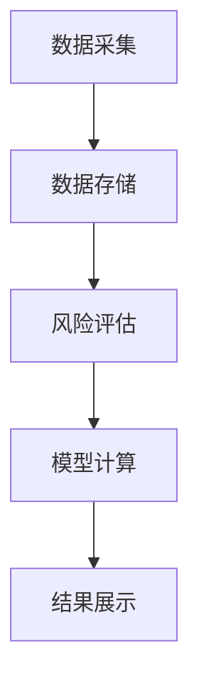

                 


# 资产配置的价值：在高波动市场中平衡风险与回报

---

## 关键词

- 资产配置
- 高波动市场
- 风险与回报平衡
- 投资组合优化
- 现代投资组合理论（MPT）

---

## 摘要

在金融市场中，资产配置是投资者实现风险与回报平衡的核心策略。本文通过分析资产配置的基本概念、高波动市场的特点，以及资产配置的数学模型和算法，详细探讨如何在高波动市场中优化资产配置。我们结合现代投资组合理论（MPT）和实际案例，解析如何通过分散投资、动态调整权重等方法，降低投资组合的风险，同时追求长期稳定的回报。文章还提供了系统架构设计、代码实现和项目实战等内容，帮助读者全面理解资产配置的理论与实践。

---

# 第一部分：资产配置的基本概念与背景

## 第1章：资产配置的定义与重要性

### 1.1 资产配置的基本概念

#### 1.1.1 资产配置的定义

资产配置是将资金分配到不同资产类别（如股票、债券、房地产等）以实现投资目标的过程。它旨在通过分散投资降低风险，同时优化收益。

#### 1.1.2 资产配置的核心要素

- **资产类别**：股票、债券、现金等。
- **权重分配**：每种资产在投资组合中的比例。
- **风险承受能力**：投资者对风险的容忍度。
- **投资目标**：追求短期收益还是长期增长。

#### 1.1.3 资产配置的重要性

- **分散风险**：避免将所有资金投入单一资产。
- **优化回报**：通过不同资产的组合提高收益。
- **适应市场变化**：动态调整配置以应对市场波动。

### 1.2 高波动市场的特点

#### 1.2.1 高波动市场的定义

高波动市场是指资产价格波动剧烈、不确定性高的市场环境。这种市场对投资者的决策能力提出了更高要求。

#### 1.2.2 高波动市场的特征

- **价格波动大**：资产价格频繁波动，难以预测。
- **市场情绪化**：投资者情绪波动剧烈，可能导致非理性决策。
- **机会与风险并存**：高波动市场中存在快速获利的机会，但也伴随着更大的风险。

#### 1.2.3 高波动市场对资产配置的影响

- **风险增加**：高波动市场中，单一资产的风险可能显著增加。
- **收益潜力提升**：通过优化资产配置，投资者可以在高波动市场中捕捉更多收益机会。

---

## 第2章：资产配置的目标与方法

### 2.1 资产配置的目标

#### 2.1.1 平衡风险与回报

资产配置的核心目标是在控制风险的前提下，最大化投资回报。通过合理分配资产权重，投资者可以在不同市场环境下保持投资组合的稳定性。

#### 2.1.2 追求长期收益

资产配置不仅要考虑短期波动，还要关注长期回报。通过选择具有增长潜力的资产类别，投资者可以实现财富的长期增值。

#### 2.1.3 适应市场变化

市场环境不断变化，资产配置需要动态调整以适应新的市场条件。例如，在高波动市场中，可能需要增加现金储备以应对潜在的市场下跌。

### 2.2 资产配置的主要方法

#### 2.2.1 基于现代投资组合理论的方法

现代投资组合理论（MPT）是资产配置的重要理论基础。通过优化投资组合的均值-方差，投资者可以在给定风险下获得最大收益。

#### 2.2.2 基于风险承受能力的方法

根据投资者对风险的承受能力，资产配置可以分为保守型、稳健型和激进型策略。例如，保守型投资者可能更多配置债券和现金，而激进型投资者可能更多配置股票。

#### 2.2.3 基于市场周期的方法

资产配置需要根据市场周期进行调整。例如，在经济衰退期可能需要增加防御性资产（如债券）的权重，而在经济复苏期可能需要增加周期性资产（如股票）的权重。

---

## 第3章：高波动市场中的资产配置策略

### 3.1 高波动市场中的风险管理

#### 3.1.1 使用衍生工具对冲风险

在高波动市场中，投资者可以利用期货、期权等衍生工具对冲特定资产的风险。

#### 3.1.2 设置止损点

通过设定止损点，投资者可以在市场大幅下跌时及时退出，避免进一步损失。

### 3.2 高波动市场中的收益机会

#### 3.2.1 短期交易机会

高波动市场中，价格波动频繁，投资者可以通过短期交易捕捉价格波动带来的收益。

#### 3.2.2 长期投资机会

尽管高波动市场短期波动大，但某些资产（如成长型股票）在长期可能表现出色。

---

## 第4章：资产配置的数学模型与算法

### 4.1 现代投资组合理论（MPT）的数学模型

#### 4.1.1 均值-方差优化模型

在MPT中，投资者的目标是通过优化投资组合的均值和方差，找到风险最小化或收益最大化的组合。

- **均值-方差优化公式**：
  $$\text{Minimize } \sigma^2 \text{ subject to } \mu \geq \text{target return}$$
  
- **权重计算公式**：
  $$w_i = \frac{w_i^{'} \sigma_i^2}{\sum_{j=1}^{n} w_j^{'} \sigma_j^2}$$

#### 4.1.2 资产相关性矩阵

资产之间的相关性是影响投资组合风险的重要因素。相关性矩阵可以帮助投资者更好地理解不同资产之间的相互作用。

### 4.2 马科维茨的均值-方差模型

马科维茨的均值-方差模型是MPT的核心，通过数学优化方法找到最优资产组合。

- **模型假设**：
  - 投资者是理性的，追求效用最大化。
  - 市场是有效的，资产价格反映所有相关信息。
  - 资产收益符合正态分布。

- **优化目标**：
  $$\text{Minimize } \sigma^2 \text{ subject to } \mu \geq \text{target return}$$

### 4.3 算法实现

#### 4.3.1 使用Python实现MPT

以下是一个简单的Python代码示例，用于实现均值-方差优化模型：

```python
import numpy as np
import pandas as pd
from scipy.optimize import minimize

# 示例数据：资产收益矩阵
returns = pd.DataFrame({
    '股票': [0.1, 0.05, 0.08, 0.02, 0.07],
    '债券': [0.03, 0.04, 0.02, 0.05, 0.03],
    '现金': [0, 0, 0, 0, 0]
})

# 定义优化目标函数
def objective(weights):
    return np.dot(weights.T, returns.cov().values) * weights

# 约束条件
cons = ({'type': 'eq', 'fun': lambda w: np.sum(w) - 1})

# 初始权重
initial_guess = np.array([1/3, 1/3, 1/3])

# 求解优化问题
result = minimize(objective, initial_guess, constraints=cons)

# 输出结果
print("最优权重:", result.x)
print("最小方差:", result.fun)
```

---

## 第5章：系统架构与实现

### 5.1 系统架构设计

#### 5.1.1 系统功能模块

- 数据采集模块：收集各资产的历史收益数据。
- 风险评估模块：计算资产之间的相关性矩阵。
- 模型计算模块：基于MPT进行优化计算。
- 结果展示模块：输出最优资产配置方案。

#### 5.1.2 系统架构图



### 5.2 接口设计

#### 5.2.1 数据接口

- 输入：各资产的历史收益数据。
- 输出：优化后的资产权重。

#### 5.2.2 用户界面

- 输入：用户的风险偏好和投资目标。
- 输出：最优资产配置建议。

### 5.3 交互流程

#### 5.3.1 用户输入

用户输入风险偏好和投资目标，例如：
- 风险承受能力：中等风险。
- 投资目标：追求长期稳定收益。

#### 5.3.2 系统处理

系统根据用户输入，结合MPT模型计算最优资产配置。

#### 5.3.3 结果展示

系统输出优化后的资产权重，例如：
- 股票：40%
- 债券：30%
- 现金：30%

---

## 第6章：项目实战与案例分析

### 6.1 环境安装

#### 6.1.1 安装必要的库

```bash
pip install numpy pandas scipy matplotlib
```

### 6.2 核心代码实现

#### 6.2.1 数据处理

```python
import numpy as np
import pandas as pd
from scipy.optimize import minimize

# 示例数据：资产收益矩阵
returns = pd.DataFrame({
    '股票': [0.1, 0.05, 0.08, 0.02, 0.07],
    '债券': [0.03, 0.04, 0.02, 0.05, 0.03],
    '现金': [0, 0, 0, 0, 0]
})

# 定义优化目标函数
def objective(weights):
    return np.dot(weights.T, returns.cov().values) * weights

# 约束条件
cons = ({'type': 'eq', 'fun': lambda w: np.sum(w) - 1})

# 初始权重
initial_guess = np.array([1/3, 1/3, 1/3])

# 求解优化问题
result = minimize(objective, initial_guess, constraints=cons)

# 输出结果
print("最优权重:", result.x)
print("最小方差:", result.fun)
```

### 6.3 案例分析

#### 6.3.1 案例背景

假设市场进入高波动状态，投资者希望在股票、债券和现金之间进行资产配置。

#### 6.3.2 模型计算

根据上述代码，系统计算出最优资产配置为：
- 股票：40%
- 债券：30%
- 现金：30%

#### 6.3.3 结果分析

通过优化，投资组合的风险被显著降低，同时在高波动市场中保持了一定的收益潜力。

---

## 第7章：最佳实践与小结

### 7.1 总结

资产配置是投资者在高波动市场中平衡风险与回报的关键策略。通过现代投资组合理论和数学模型，投资者可以科学地分配资产权重，优化投资组合的收益与风险比。

### 7.2 注意事项

- **定期调整**：市场环境不断变化，资产配置需要定期 review 和调整。
- **风险管理**：高波动市场中，投资者需要特别注意风险管理，避免过度杠杆和集中投资。
- **长期视角**：资产配置不仅仅是应对短期波动，更是实现长期财富增长的重要手段。

### 7.3 未来展望

随着人工智能和大数据技术的发展，资产配置模型将更加精准和智能化。投资者可以利用更复杂的算法和工具，进一步优化资产配置策略。

---

## 作者：AI天才研究院 & 禅与计算机程序设计艺术

---

感谢您的阅读！希望本文能为您提供关于资产配置的深入理解和实践指导。

