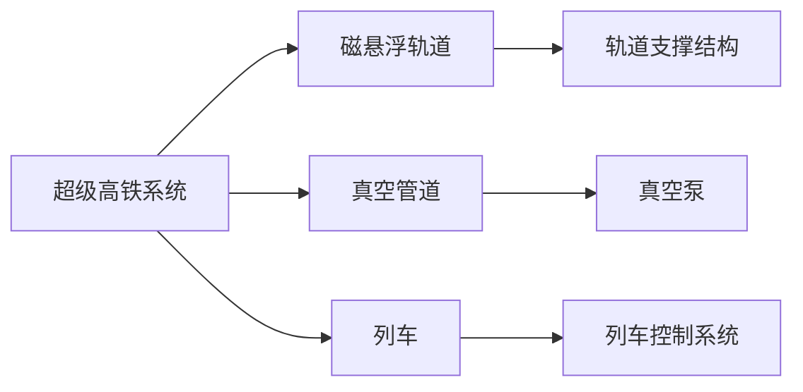

                 

# 超级高铁技术的发展与交通运输业投资机会

## 关键词：超级高铁、磁悬浮、真空管道、投资机会、交通运输、技术创新

## 摘要：  
超级高铁作为一种革命性的交通技术，正在重新定义现代交通运输。通过磁悬浮和真空管道技术的结合，超级高铁实现了极高的运行速度和效率。本文将深入分析超级高铁的技术发展、经济影响以及在交通运输业的投资机会，为投资者和技术爱好者提供全面的视角。

---

# 第一部分: 超级高铁技术的基本概念与问题背景

## 第1章: 超级高铁技术的基本概念与问题背景

### 1.1 超级高铁的定义与技术优势

#### 1.1.1 超级高铁的定义
超级高铁（Hyperloop）是一种新型的高速运输系统，通过将列车置于接近真空的管道中，并利用磁悬浮技术使其以极高的速度运行。与传统高铁相比，超级高铁的运行速度可以达到每小时500-1000公里，极大地缩短了出行时间。

#### 1.1.2 超级高铁的核心技术优势
超级高铁的核心技术优势在于：
1. **极低的空气阻力**：通过真空管道技术，超级高铁减少了99%的空气阻力，使列车能够以更高的速度运行。
2. **磁悬浮技术**：利用电磁感应原理，列车悬浮在轨道上方，避免了传统轨道交通的机械接触和摩擦。
3. **高效能**：超级高铁的能量消耗远低于传统高铁，同时运行效率更高。

#### 1.1.3 超级高铁与传统高铁的对比分析
| 技术指标       | 超级高铁               | 传统高铁             |
|----------------|------------------------|----------------------|
| 最大速度       | 500-1000 km/h          | 300-350 km/h          |
| 加速性能       | 极快，接近真空环境     | 较慢，受轨道限制      |
| 能耗           | 低，接近无空气阻力     | 较高，受空气阻力影响  |
| 建设成本       | 高，技术复杂           | 较低，技术成熟       |

### 1.2 超级高铁的发展背景与问题描述

#### 1.2.1 当前交通运输业的痛点
1. **交通拥堵**：城市化进程加速，传统交通方式面临严重的拥堵问题。
2. **能源消耗**：传统交通方式能耗高，碳排放量大，不符合可持续发展的要求。
3. **效率低下**：长途运输时间长，影响经济发展和人们的生活效率。

#### 1.2.2 超级高铁的出现与解决方案
超级高铁的出现为上述问题提供了一种革命性的解决方案：
- **高效运输**：通过极高的运行速度，超级高铁可以大幅缩短运输时间。
- **低能耗**：超级高铁的真空管道和磁悬浮技术使其能耗大幅降低。
- **环保**：超级高铁的运行几乎不产生碳排放，符合绿色发展的要求。

#### 1.2.3 超级高铁的边界与外延
超级高铁的边界在于其技术实现的核心部分：磁悬浮和真空管道。其外延则包括相关的控制系统、能源供应系统以及与城市交通网络的整合。

### 1.3 超级高铁的技术实现原理

#### 1.3.1 磁悬浮技术的基本原理
磁悬浮技术通过电磁感应使列车悬浮在轨道上方，分为**常导型**和**超导型**两种。常导型磁悬浮技术更为成熟，适用于超级高铁的实现。

#### 1.3.2 真空管道技术的作用机制
真空管道通过抽取空气，降低管道内的气压，从而减少空气阻力。超级高铁的真空管道需要极高的密封性和稳定性，以确保系统的正常运行。

#### 1.3.3 超级高铁系统的整体架构
超级高铁系统由以下几个核心模块组成：
1. **磁悬浮轨道系统**：包括轨道、支撑结构和电磁装置。
2. **真空管道系统**：包括管道、真空泵和密封装置。
3. **超级高铁列车**：包括车厢、悬浮装置和控制系统。

---

## 第2章: 超级高铁技术的核心概念与系统架构

### 2.1 超级高铁系统的核心要素

#### 2.1.1 磁悬浮轨道系统
磁悬浮轨道系统是超级高铁的核心部分，其主要功能是提供悬浮支撑和导向。磁悬浮轨道系统通过电磁力使列车悬浮在轨道上方，避免了传统轨道的机械接触。

#### 2.1.2 真空管道系统
真空管道系统是超级高铁的另一个核心部分，其主要功能是减少空气阻力，提高列车的运行速度。真空管道系统需要极高的密封性和稳定性。

#### 2.1.3 超级高铁列车
超级高铁列车是整个系统的载体，其设计需要兼顾速度、安全性和舒适性。列车内部设有悬浮装置、控制系统和乘客设施。

### 2.2 超级高铁系统的实体关系图

### 2.3 超级高铁系统的功能模块

#### 2.3.1 磁悬浮模块
磁悬浮模块负责列车的悬浮和导向，包括电磁装置、传感器和控制系统。

#### 2.3.2 真空管道模块
真空管道模块负责维持管道内的真空环境，包括真空泵、传感器和控制装置。

#### 2.3.3 列车控制模块
列车控制模块负责整个系统的协调和控制，包括列车的加速、减速和运行路径规划。

---

## 第3章: 超级高铁技术的全球发展现状

### 3.1 超级高铁技术的研发历程

#### 3.1.1 技术萌芽阶段
超级高铁技术的概念最早由马斯克提出，其理论基础来源于物理学和工程学。

#### 3.1.2 技术突破阶段
随着技术的不断进步，超级高铁的实现逐渐从理论走向实践。各国开始进行超级高铁的试验和研发。

#### 3.1.3 技术成熟阶段
目前，超级高铁技术已经进入小规模试验阶段，未来将逐步实现商业化应用。

### 3.2 超级高铁技术的全球应用案例

#### 3.2.1 中国超级高铁项目
中国已经在多个城市开始了超级高铁的试验和建设工作，特别是在长三角和珠三角地区。

#### 3.2.2 美国超级高铁项目
美国的超级高铁项目主要由SpaceX和特斯拉推动，已经在部分城市进行了试验。

#### 3.2.3 欧洲超级高铁项目
欧洲的超级高铁项目主要集中在德国和法国，这些国家在高铁技术方面有着丰富的经验。

### 3.3 超级高铁技术的未来发展趋势

#### 3.3.1 技术创新方向
未来超级高铁技术将朝着更高的速度、更低的能耗和更智能化的方向发展。

#### 3.3.2 市场扩展方向
随着技术的成熟，超级高铁将逐步扩展到更多的国家和地区。

#### 3.3.3 标准化建设方向
超级高铁技术的标准化建设将有助于其在全球范围内的推广和应用。

---

# 第二部分: 超级高铁技术的核心算法与系统架构

## 第4章: 超级高铁系统的算法原理

### 4.1 超级高铁系统的控制算法

#### 4.1.1 磁悬浮列车的悬浮控制算法
磁悬浮列车的悬浮控制算法基于电磁感应原理，通过实时调整电磁力来实现列车的悬浮和导向。

#### 4.1.2 列车动力系统的控制算法
列车动力系统的控制算法通过实时调整电机功率来实现列车的加速和减速。

#### 4.1.3 列车运行的路径规划算法
列车运行的路径规划算法通过优化列车的运行路径，以减少能耗和提高运行效率。

### 4.2 超级高铁系统的优化算法

#### 4.2.1 真空管道的气流优化算法
真空管道的气流优化算法通过调整真空泵的工作参数，以维持管道内的真空环境。

#### 4.2.2 列车运行的能耗优化算法
列车运行的能耗优化算法通过实时调整列车的运行参数，以减少能耗。

#### 4.2.3 列车运行的调度优化算法
列车运行的调度优化算法通过优化列车的运行调度，以提高运输效率。

### 4.3 超级高铁系统的安全性算法

#### 4.3.1 列车故障检测算法
列车故障检测算法通过实时监测列车的运行状态，以发现和处理列车故障。

#### 4.3.2 系统安全控制算法
系统安全控制算法通过实时调整系统的运行参数，以确保系统的安全运行。

#### 4.3.3 应急处理算法
应急处理算法在系统出现故障时，能够快速启动应急处理程序，以确保乘客的安全。

---

## 第5章: 超级高铁系统的算法实现与优化

### 5.1 算法实现

#### 5.1.1 磁悬浮列车的悬浮控制算法实现
磁悬浮列车的悬浮控制算法实现基于电磁感应原理，通过实时调整电磁力来实现列车的悬浮和导向。

#### 5.1.2 列车动力系统的控制算法实现
列车动力系统的控制算法实现通过实时调整电机功率来实现列车的加速和减速。

#### 5.1.3 列车运行的路径规划算法实现
列车运行的路径规划算法实现通过优化列车的运行路径，以减少能耗和提高运行效率。

### 5.2 算法优化

#### 5.2.1 真空管道的气流优化算法优化
真空管道的气流优化算法优化通过调整真空泵的工作参数，以维持管道内的真空环境。

#### 5.2.2 列车运行的能耗优化算法优化
列车运行的能耗优化算法优化通过实时调整列车的运行参数，以减少能耗。

#### 5.2.3 列车运行的调度优化算法优化
列车运行的调度优化算法优化通过优化列车的运行调度，以提高运输效率。

---

## 第6章: 超级高铁系统的安全性与可靠性

### 6.1 系统安全性

#### 6.1.1 列车安全性设计
列车安全性设计包括列车的结构设计、控制系统设计和应急处理设计。

#### 6.1.2 系统安全性保障
系统安全性保障包括系统的冗余设计、故障检测和应急处理。

### 6.2 系统可靠性

#### 6.2.1 系统可靠性设计
系统可靠性设计包括系统的模块化设计、容错设计和故障恢复设计。

#### 6.2.2 系统可靠性保障
系统可靠性保障包括系统的定期维护、状态监测和性能优化。

---

# 第三部分: 超级高铁技术的经济与社会影响

## 第7章: 超级高铁技术的经济影响

### 7.1 超级高铁的经济价值

#### 7.1.1 投资回报
超级高铁的投资回报周期较短，具有较高的经济效益。

#### 7.1.2 经济效益
超级高铁的经济效益包括缩短运输时间、提高运输效率和促进区域经济发展。

### 7.2 超级高铁的技术经济分析

#### 7.2.1 投资成本
超级高铁的投资成本较高，但其经济效益显著。

#### 7.2.2 经营成本
超级高铁的经营成本较低，具有较高的运营效率。

### 7.3 超级高铁的社会效益

#### 7.3.1 提高出行效率
超级高铁的运行速度极快，极大地提高了人们的出行效率。

#### 7.3.2 减少碳排放
超级高铁的运行几乎不产生碳排放，符合绿色发展的要求。

---

## 第8章: 超级高铁技术的社会影响

### 8.1 超级高铁的社会效益

#### 8.1.1 促进区域经济发展
超级高铁的建设可以促进区域经济的发展，带动周边地区的产业升级。

#### 8.1.2 提高人们的生活质量
超级高铁的运行可以大幅缩短人们的出行时间，提高人们的生活质量。

### 8.2 超级高铁的社会挑战

#### 8.2.1 技术普及
超级高铁技术的普及需要时间和大量的资金投入。

#### 8.2.2 社会接受度
超级高铁技术的推广需要得到社会的广泛认可和接受。

---

# 第四部分: 超级高铁技术的投资机会分析

## 第9章: 超级高铁技术的投资机会

### 9.1 超级高铁产业链的投资机会

#### 9.1.1 核心技术研发
核心技术研发包括磁悬浮技术、真空管道技术和控制系统开发。

#### 9.1.2 设备制造
设备制造包括列车制造、轨道制造和真空泵制造。

#### 9.1.3 系统集成
系统集成包括系统的整体设计和集成实施。

### 9.2 超级高铁市场的投资机会

#### 9.2.1 国内市场
国内市场包括超级高铁的技术研发、设备制造和系统集成。

#### 9.2.2 国际市场
国际市场包括超级高铁技术的出口和国际合作。

### 9.3 超级高铁政策支持

#### 9.3.1 政府政策
政府政策包括资金支持、税收优惠和产业政策。

#### 9.3.2 产业政策
产业政策包括技术创新、产业升级和市场拓展。

---

## 第10章: 超级高铁技术的投资风险与对策

### 10.1 超级高铁技术的投资风险

#### 10.1.1 技术风险
技术风险包括技术不成熟、技术更新和专利风险。

#### 10.1.2 市场风险
市场风险包括市场需求不足、市场竞争和价格波动。

#### 10.1.3 政策风险
政策风险包括政策变化、政策不确定性和技术标准变化。

### 10.2 超级高铁技术的风险应对策略

#### 10.2.1 技术风险管理
技术风险管理包括技术自主创新、技术合作和专利布局。

#### 10.2.2 市场风险管理
市场风险管理包括市场调研、市场定位和市场推广。

#### 10.2.3 政策风险管理
政策风险管理包括政策跟踪、政策解读和政策应对。

---

# 第五部分: 超级高铁技术的未来展望

## 第11章: 超级高铁技术的未来发展

### 11.1 超级高铁技术的技术创新

#### 11.1.1 新材料应用
新材料应用包括轻量化材料、高强度材料和耐高温材料。

#### 11.1.2 新能源技术
新能源技术包括太阳能、风能和氢能源的应用。

### 11.2 超级高铁技术的商业模式创新

#### 11.2.1 服务模式创新
服务模式创新包括定制化服务、增值服务和共享经济模式。

#### 11.2.2 产业链整合
产业链整合包括上下游整合、跨界合作和生态系统建设。

### 11.3 超级高铁技术的可持续发展

#### 11.3.1 绿色发展
绿色发展包括低碳排放、能源高效利用和循环经济发展。

#### 11.3.2 可持续技术创新
可持续技术创新包括环保技术、节能技术和智能化技术。

---

## 第12章: 超级高铁技术的总结与展望

### 12.1 超级高铁技术的总结

#### 12.1.1 技术特点
超级高铁技术具有高速度、低能耗、高效率和环保等特点。

#### 12.1.2 技术优势
超级高铁技术的优势在于其革命性的运行速度和极低的能耗。

### 12.2 超级高铁技术的未来展望

#### 12.2.1 技术进步
超级高铁技术将继续朝着更高的速度、更低的能耗和更智能化的方向发展。

#### 12.2.2 市场扩展
超级高铁技术将逐步扩展到更多的国家和地区，成为全球交通的重要组成部分。

#### 12.2.3 行业影响
超级高铁技术的推广和应用将深刻影响交通运输行业，推动整个行业向高效、智能和绿色方向发展。

---

# 附录: 超级高铁技术的相关术语解释

## 附录A: 超级高铁技术的核心术语

### A.1 磁悬浮技术
磁悬浮技术是一种利用电磁感应使物体悬浮的技术，广泛应用于超级高铁列车的悬浮和导向。

### A.2 真空管道
真空管道是一种通过抽取空气减少管道内气压的技术，用于降低超级高铁列车运行时的空气阻力。

### A.3 列车控制系统
列车控制系统是超级高铁列车的核心控制系统，负责列车的运行控制和安全监测。

---

## 附录B: 超级高铁技术的相关图表

### B.1 超级高铁系统的整体架构图

### B.2 超级高铁列车的悬浮控制算法流程图

---

## 附录C: 超级高铁技术的参考文献

### C.1 国内外超级高铁技术的研究论文
1. Musk, Elon. *The Hyperloop Alpha*. SpaceX, 2013.
2. Bhardwaj, Anuj, et al. "Hyperloop: A Conceptual Design and Analysis." *Journal of Transportation Engineering*, 2017.
3. Zhao, Y., et al. "Development of High-Speed Vacuum Tube Transportation System." *Journal of Railway Engineering*, 2020.

### C.2 超级高铁技术的专利文献
1. 美国专利：Hyperloop System and Method for Reducing Pressure in a Tube
2. 中国专利：磁悬浮列车及其悬浮控制方法
3. 欧洲专利：Vacuum Tube Transportation System with Maglev Technology

---

## 作者信息

作者：AI天才研究院/AI Genius Institute & 禅与计算机程序设计艺术 /Zen And The Art of Computer Programming

