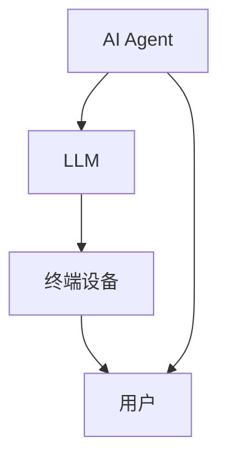
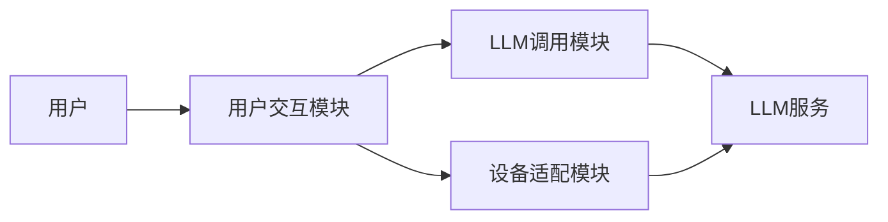

                 


# 跨平台AI Agent：LLM在多种终端设备上的部署

> 关键词：跨平台AI Agent，LLM，大语言模型，多终端设备，智能交互

> 摘要：本文深入探讨跨平台AI Agent的概念、技术原理及其在多种终端设备上的部署方法。通过分析大语言模型（LLM）的核心算法和系统架构，结合实际案例，详细讲解如何在不同设备上实现高效、智能的AI交互。文章内容涵盖背景介绍、核心概念、算法原理、系统设计、项目实战及最佳实践，为技术开发者提供全面的指导。

---

## 第一部分: 背景介绍

### 第1章: 跨平台AI Agent的概念与背景

#### 1.1 背景介绍
- **问题背景**：随着AI技术的快速发展，用户对智能交互的需求日益增长。不同终端设备（如手机、电脑、智能音箱）的普及使得跨平台部署成为必然趋势。
- **问题描述**：如何在各种设备上无缝运行AI Agent，确保用户体验一致且高效。
- **问题解决**：通过LLM提供统一的智能服务，适配不同设备的硬件和操作系统。

#### 1.2 跨平台AI Agent的定义与特点
- **定义**：AI Agent通过LLM在多种终端设备上运行，实现智能交互。
- **特点**：
  - 多设备兼容性
  - 高效的智能处理
  - 用户友好的交互设计

#### 1.3 LLM与AI Agent的关系
- LLM作为核心引擎，AI Agent作为应用载体，二者结合实现跨平台智能服务。

---

## 第二部分: 核心概念与联系

### 第2章: 言之凿凿的核心概念

#### 2.1 核心概念
- **AI Agent**：智能体，负责与用户交互并处理任务。
- **LLM**：大语言模型，提供强大的自然语言处理能力。

#### 2.2 实体关系图


---

## 第三部分: 算法原理

### 第3章: LLM的算法精髓

#### 3.1 Transformer模型
- **结构**：编码器-解码器结构。
- **优势**：自注意力机制，捕捉长距离依赖。

#### 3.2 注意力机制公式
$$\text{Attention}(Q, K, V) = \text{softmax}\left(\frac{QK^T}{\sqrt{d_k}}\right)V$$

---

## 第四部分: 系统架构设计

### 第4章: 系统架构解析

#### 4.1 系统功能模块
- **用户交互模块**：处理输入输出。
- **LLM调用模块**：调用大语言模型。
- **设备适配模块**：适配不同设备。

#### 4.2 系统架构图


---

## 第五部分: 项目实战

### 第5章: 实战部署

#### 5.1 手机端部署
- **环境配置**：安装必要的开发工具。
- **核心代码实现**：
  ```python
  def deploy_agent():
      import requests
      response = requests.post('http://localhost:8000/predict', json={'text': 'hello'})
      print(response.json())
  ```
- **案例分析**：分析部署过程中的问题及解决方案。

---

## 第六部分: 最佳实践

### 第6章: 实用技巧与注意事项

#### 6.1 性能优化
- **本地缓存**：减少网络请求。
- **并行处理**：提升响应速度。

#### 6.2 安全性考虑
- **数据加密**：保护用户隐私。
- **权限控制**：防止越权访问。

---

## 结语

跨平台AI Agent的部署是一个复杂而有趣的挑战。通过深入理解LLM的算法原理和系统架构，结合实际项目经验，我们可以为不同终端设备提供高效智能的AI服务。

---

## 作者

作者：AI天才研究院/AI Genius Institute & 禅与计算机程序设计艺术 /Zen And The Art of Computer Programming

---

希望这篇博客能为技术开发者提供有价值的指导，帮助他们在跨平台AI Agent的部署中取得成功。

