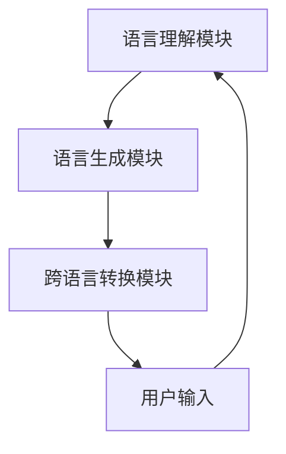
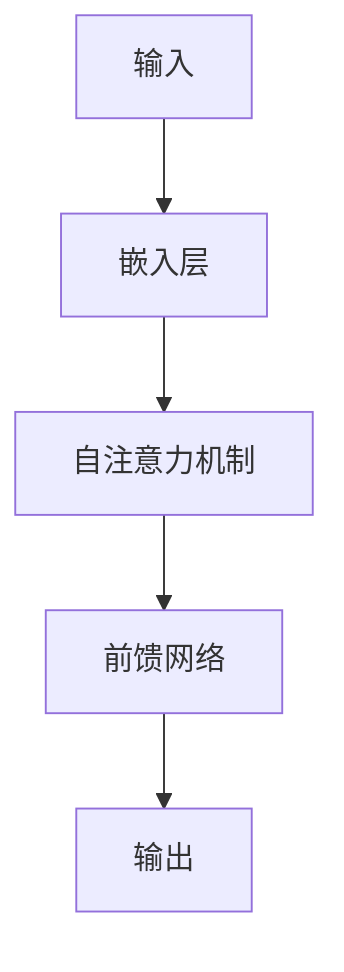
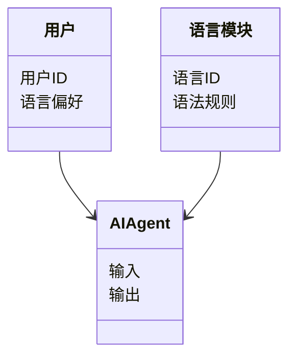
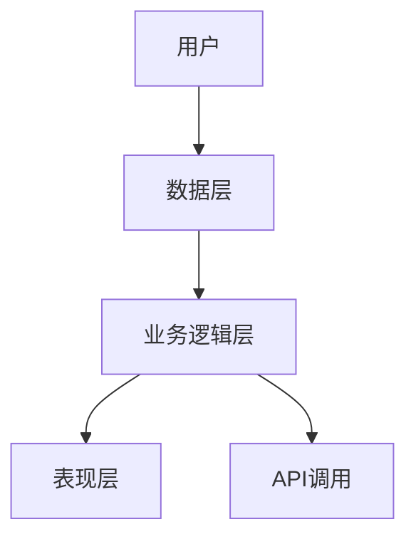
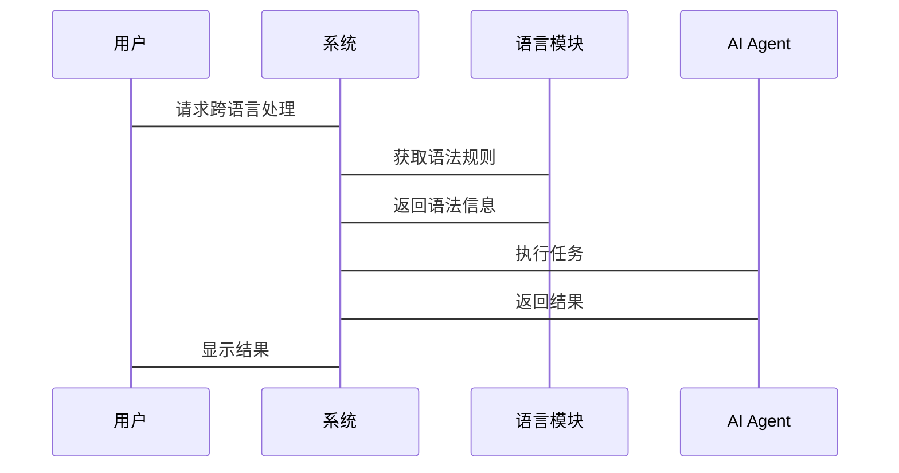

                 


# 跨语言AI Agent开发：挑战与解决方案

> **关键词**：跨语言AI Agent、自然语言处理、多语言支持、系统架构设计、算法原理、项目实战、最佳实践

> **摘要**：本文探讨跨语言AI Agent开发中的挑战与解决方案，涵盖核心概念、算法原理、系统架构设计、项目实战及最佳实践，帮助开发者深入了解跨语言AI Agent的开发与应用。

---

## 第一部分：引言

### 第1章：跨语言AI Agent开发概述

#### 1.1 跨语言AI Agent的背景与重要性

跨语言AI Agent是指能够在多种编程语言之间进行交互、理解和执行任务的智能代理。随着全球化和技术的快速发展，跨语言AI Agent的应用场景日益广泛，例如在多语言编程团队协作、跨平台应用开发、国际化软件测试等领域，其重要性不言而喻。

**1.1.1 AI Agent的基本概念**  
AI Agent是一种智能体，能够感知环境、执行任务并做出决策。它通常具备自主性、反应性、目标导向和社交能力等特点。

**1.1.2 跨语言开发的必要性**  
在现代软件开发中，团队往往使用多种编程语言。跨语言AI Agent能够协调不同语言间的协作，提高开发效率和代码质量。

**1.1.3 当前挑战**  
跨语言开发面临语法差异、数据类型不兼容、API调用复杂等问题，增加了开发的复杂性。

#### 1.2 跨语言AI Agent的核心概念

**1.2.1 跨语言处理的定义**  
跨语言处理是指在不同编程语言之间进行数据转换、语法解析和功能调用的过程。

**1.2.2 跨语言AI Agent的分类**  
根据功能，跨语言AI Agent可分为代码生成型、语法分析型和API调用型。

**1.2.3 跨语言开发的主要特点**  
支持多语言环境、语法自适应、API智能调用等。

#### 1.3 本书的目的与结构

**1.3.1 本书的目标**  
帮助开发者掌握跨语言AI Agent的核心原理和开发技巧，解决实际开发中的挑战。

**1.3.2 本书的章节安排**  
从背景介绍到项目实战，涵盖理论与实践，帮助读者全面理解跨语言AI Agent开发。

---

## 第二部分：核心概念与联系

### 第2章：跨语言AI Agent的核心原理

#### 2.1 跨语言处理的机制

**2.1.1 多语言支持的实现方式**  
通过编译器、解释器或API调用实现跨语言交互。

**2.1.2 跨语言模型的训练方法**  
利用多语言语料库进行模型训练，提升跨语言理解能力。

**2.1.3 語言间关系**  
分析语言间的语法和语义差异，优化跨语言处理效果。

#### 2.2 跨语言AI Agent的核心要素

**2.2.1 语言理解模块**  
负责解析输入的编程语言语法和语义。

**2.2.2 语言生成模块**  
生成目标语言的代码或API调用。

**2.2.3 跨语言转换模块**  
实现不同语言之间的数据转换和语法适配。

#### 2.3 跨语言AI Agent的实体关系图



---

## 第三部分：算法原理

### 第3章：跨语言AI Agent的算法原理

#### 3.1 自然语言处理模型

**3.1.1 Transformer模型**  
一种高效的序列模型，用于跨语言文本处理。



**3.1.2 编码器-解码器结构**  
用于跨语言文本生成，编码器理解输入，解码器生成目标语言文本。

#### 3.2 跨语言处理算法

**3.2.1 语法分析算法**  
使用上下文无关文法（CFG）进行语法分析，生成解析树。

**3.2.2 语义分析算法**  
通过抽象语法树（AST）进行语义分析，理解代码含义。

#### 3.3 数学模型

**3.3.1 概率模型**  
用于预测语言的概率分布。

$$ P(w_i | w_{i-1}, ..., w_{i-n}) $$

**3.3.2 损失函数**  
用于训练模型的优化目标。

$$ \text{损失} = -\sum_{i=1}^{n} \log P(w_i | w_{i-1}, ..., w_{i-n}) $$

---

## 第四部分：系统分析与架构设计

### 第4章：系统分析与架构设计

#### 4.1 问题场景介绍

**4.1.1 开发背景**  
团队使用多种编程语言，需要协调不同语言间的协作。

**4.1.2 项目介绍**  
开发一个支持多语言的AI Agent，实现代码生成和API调用。

#### 4.2 系统功能设计

**4.2.1 领域模型**  
定义系统中的核心实体及其关系。



**4.2.2 系统架构设计**  
分层架构，包括数据层、业务逻辑层和表现层。



**4.2.3 系统接口设计**  
定义API接口，规范跨语言交互。

**4.2.4 系统交互设计**  
使用序列图描述用户与系统的交互流程。



---

## 第五部分：项目实战

### 第5章：项目实战

#### 5.1 环境安装

**5.1.1 安装Python**  
安装最新版Python，并配置环境变量。

**5.1.2 安装依赖库**  
安装所需的库，如TensorFlow、Keras、NLTK。

#### 5.2 系统核心实现

**5.2.1 语言理解模块**  
解析输入语言的语法和语义。

**5.2.2 语言生成模块**  
生成目标语言的代码或API调用。

**5.2.3 跨语言转换模块**  
实现不同语言之间的数据转换。

#### 5.3 代码实现与解读

**5.3.1 代码示例**  
以下是一个简单的跨语言AI Agent代码示例：

```python
def cross_language_agent(input_language, target_language):
    # 解析输入语言语法
    parse_tree = parse(input_language)
    
    # 转换为目标语言
    target_code = generate_code(parse_tree, target_language)
    
    return target_code
```

**5.3.2 代码解读**  
函数`cross_language_agent`接收输入语言和目标语言，解析输入语法，生成目标语言代码。

#### 5.4 实际案例分析

**5.4.1 案例背景**  
一个团队使用Python和Java开发项目，需要跨语言协作。

**5.4.2 案例分析**  
AI Agent解析Python代码，生成Java代码，实现功能调用。

**5.4.3 代码实现**  
详细实现跨语言转换模块，确保语法正确。

---

## 第六部分：最佳实践

### 第6章：最佳实践与未来展望

#### 6.1 小结

跨语言AI Agent开发涉及多个方面，需要掌握核心概念、算法原理和系统架构设计。

#### 6.2 注意事项

- 注意语法差异
- 确保API兼容性
- 优化性能

#### 6.3 拓展阅读

建议阅读相关书籍和论文，深入理解跨语言开发的理论与实践。

#### 6.4 未来展望

跨语言AI Agent技术将更加成熟，应用场景将更加广泛，未来将与更多技术融合，推动软件开发的智能化。

---

## 结语

跨语言AI Agent开发是一项复杂的任务，但通过系统的理论学习和实践，开发者可以克服挑战，开发出高效可靠的AI Agent。希望本文能为读者提供有价值的指导和启示。

---

**作者：AI天才研究院/AI Genius Institute & 禅与计算机程序设计艺术 /Zen And The Art of Computer Programming**

