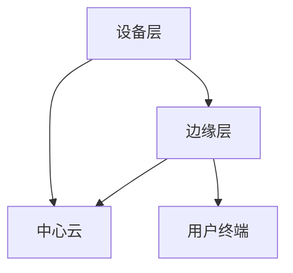

                 


# 边缘计算技术带来的新一轮IT革命与投资机会

## 作者：AI天才研究院 & 禅与计算机程序设计艺术

---

## 第一部分: 边缘计算技术概述

# 第1章: 边缘计算的定义与背景

## 1.1 边缘计算的定义

### 1.1.1 边缘计算的基本概念

边缘计算是一种分布式计算范式，它将计算能力和数据存储从中心服务器移动到网络的边缘，使数据在生成的地点进行处理。边缘计算的核心思想是“数据在哪里产生，计算就在哪里进行”。

### 1.1.2 边缘计算与云计算的区别

边缘计算与云计算的主要区别在于数据处理的位置。云计算将所有数据上传到中心服务器进行处理，而边缘计算则在数据源附近进行处理，减少延迟和带宽消耗。

### 1.1.3 边缘计算的核心特点

- **低延迟**：数据在边缘处理，减少传输到中心服务器的时间。
- **高带宽效率**：通过在边缘处理数据，减少需要传输到中心的数据量。
- **分布式架构**：边缘计算节点分布在网络的各个角落，形成分布式架构。
- **实时性**：能够快速响应实时事件，适用于工业自动化、自动驾驶等领域。

## 1.2 边缘计算的发展背景

### 1.2.1 传统IT架构的局限性

传统IT架构主要依赖中心服务器，数据处理集中在云端。这种方式在数据量大、实时性要求高的场景下，存在延迟高、带宽消耗大、单点故障等问题。

### 1.2.2 边缘计算的兴起原因

随着物联网（IoT）、5G、人工智能（AI）等技术的快速发展，数据生成的设备数量急剧增加，数据量也呈指数级增长。边缘计算能够更高效地处理这些数据，满足实时性和带宽效率的需求。

### 1.2.3 边缘计算对IT革命的推动作用

边缘计算通过将计算能力推向边缘，极大地提升了数据处理的效率和实时性，推动了新一轮的IT革命，特别是在工业互联网、智慧城市、智能交通等领域。

## 1.3 边缘计算的应用场景

### 1.3.1 工业互联网中的边缘计算

在工业互联网中，边缘计算可以用于设备状态监测、预测性维护、优化生产流程等场景。例如，工厂中的传感器数据可以在边缘节点进行实时分析，及时发现设备故障。

### 1.3.2 智能交通中的边缘计算

在智能交通系统中，边缘计算可以用于实时交通监控、自动驾驶决策支持等。例如，路边单元（RSU）可以实时处理来自车辆的数据，优化交通流量。

### 1.3.3 智慧城市中的边缘计算

在智慧城市建设中，边缘计算可以用于环境监测、智能安防、智能交通管理等场景。例如，智能摄像头可以实时分析视频数据，识别异常行为。

## 1.4 边缘计算的边界与外延

### 1.4.1 边缘计算的边界定义

边缘计算的边界通常是指数据处理的起点和终点。数据在边缘节点进行处理后，部分数据可能需要上传到中心服务器进行进一步分析，而另一部分数据则可以直接在边缘节点完成处理并反馈给设备。

### 1.4.2 边缘计算与雾计算的关系

雾计算是边缘计算的一种扩展形式，它在更靠近设备的地方提供计算能力。雾计算通常用于更接近设备的边缘层，而边缘计算则更多地关注设备与边缘节点之间的数据处理。

### 1.4.3 边缘计算与其他技术的融合

边缘计算可以与云计算、大数据、人工智能、区块链等技术融合，形成更强大的数据处理能力。例如，边缘计算可以与人工智能结合，实现边缘端的智能决策。

## 1.5 本章小结

本章主要介绍了边缘计算的基本概念、与云计算的区别、核心特点、应用场景以及与其他技术的关系。边缘计算作为一种分布式计算范式，正在推动新一轮的IT革命，并在多个领域展现出巨大的潜力。

---

## 第2章: 边缘计算的核心概念与原理

## 2.1 边缘计算的核心概念

### 2.1.1 边缘节点的定义与组成

边缘节点是指在网络边缘进行数据处理和存储的设备，通常包括计算单元、存储单元、通信单元等组成部分。边缘节点可以是独立的设备，也可以是一个包含多个设备的边缘计算节点。

### 2.1.2 边缘计算的体系架构

边缘计算的体系架构通常包括设备层、边缘节点层和中心云层。设备层负责数据的采集和初步处理，边缘节点层负责数据的进一步处理和分析，中心云层负责全局数据的整合和分析。

### 2.1.3 边缘计算的执行模型

边缘计算的执行模型包括边缘推理、边缘训练、边缘预测等。边缘推理是指在边缘节点上进行实时推理，边缘训练是指在边缘节点上进行模型训练，边缘预测是指在边缘节点上进行预测。

## 2.2 边缘计算的关键技术

### 2.2.1 边缘数据处理技术

边缘数据处理技术包括数据采集、数据清洗、数据压缩、数据加密等。数据采集是指从设备中获取数据，数据清洗是指对数据进行预处理，去除噪声和冗余数据，数据压缩是指对数据进行压缩，减少数据传输量，数据加密是指对数据进行加密，保证数据安全。

### 2.2.2 边缘计算的通信协议

边缘计算的通信协议包括MQTT、HTTP、CoAP等。MQTT是一种轻量级的物联网协议，适用于低带宽、高延迟的网络环境。HTTP是一种常用的Web协议，适用于点对点通信。CoAP是一种基于HTTP的轻量级协议，适用于资源受限的设备。

### 2.2.3 边缘计算的安全机制

边缘计算的安全机制包括数据加密、访问控制、身份认证、入侵检测等。数据加密可以保证数据在传输过程中的安全性，访问控制可以限制对边缘节点的访问权限，身份认证可以验证用户身份，入侵检测可以发现和防止网络攻击。

## 2.3 边缘计算的数学模型

### 2.3.1 边缘计算的资源分配模型

边缘计算的资源分配模型可以表示为：

$$ R_i = \sum_{j=1}^{n} w_{ij} \cdot x_j $$

其中，$R_i$ 表示节点i的资源分配，$w_{ij}$ 表示节点i对资源j的权重，$x_j$ 表示资源j的分配量。

### 2.3.2 边缘计算的任务调度算法

边缘计算的任务调度算法可以使用遗传算法、粒子群优化算法等。例如，任务调度算法可以表示为：

$$ f(x) = \sum_{i=1}^{m} c_i \cdot x_i $$

其中，$c_i$ 表示任务i的权重，$x_i$ 表示任务i的分配量。

### 2.3.3 边缘计算的负载均衡模型

边缘计算的负载均衡模型可以使用轮转法、随机法、加权轮转法等。例如，负载均衡模型可以表示为：

$$ L_i = \sum_{j=1}^{n} w_{ij} \cdot x_j $$

其中，$L_i$ 表示节点i的负载，$w_{ij}$ 表示节点i对资源j的权重，$x_j$ 表示资源j的分配量。

## 2.4 本章小结

本章主要介绍了边缘计算的核心概念、体系架构、关键技术以及数学模型。边缘计算通过在边缘节点进行数据处理和分析，可以极大地提升数据处理的效率和实时性。

---

## 第3章: 边缘计算的技术体系与架构

## 3.1 边缘计算的体系架构

### 3.1.1 边缘计算的分层架构

边缘计算的分层架构包括设备层、边缘层、中心云层。设备层负责数据的采集和初步处理，边缘层负责数据的进一步处理和分析，中心云层负责全局数据的整合和分析。

### 3.1.2 边缘计算的分布式架构

边缘计算的分布式架构包括多个边缘节点，每个边缘节点负责特定区域的数据处理。例如，工厂中的多个边缘节点可以分别处理不同生产线的数据。

### 3.1.3 边缘计算的混合架构

边缘计算的混合架构结合了分层架构和分布式架构，可以在不同的层次和不同的区域进行数据处理和分析。例如，边缘节点可以在工厂内部进行数据处理，同时将部分数据上传到中心云进行进一步分析。

## 3.2 边缘计算的系统架构设计

### 3.2.1 边缘计算的系统组成

边缘计算的系统通常包括边缘设备、边缘节点、中心云、用户终端等组成部分。边缘设备负责数据的采集和初步处理，边缘节点负责数据的进一步处理和分析，中心云负责全局数据的整合和分析，用户终端负责显示和交互。

### 3.2.2 边缘计算的模块划分

边缘计算的模块通常包括数据采集模块、数据处理模块、通信模块、存储模块、安全模块等。数据采集模块负责从设备中获取数据，数据处理模块负责对数据进行处理和分析，通信模块负责数据的传输，存储模块负责数据的存储，安全模块负责数据的安全。

### 3.2.3 边缘计算的系统交互流程

边缘计算的系统交互流程可以表示为：

1. 数据采集：设备采集数据并发送到边缘节点。
2. 数据处理：边缘节点对数据进行处理和分析。
3. 数据传输：边缘节点将处理后的数据传输到中心云或用户终端。
4. 数据存储：中心云或用户终端存储数据。
5. 数据分析：中心云对全局数据进行分析和决策。

## 3.3 边缘计算的架构图



## 3.4 边缘计算的系统功能设计

### 3.4.1 边缘计算的功能模块

边缘计算的功能模块包括数据采集模块、数据处理模块、通信模块、存储模块、安全模块等。

### 3.4.2 边缘计算的功能流程

边缘计算的功能流程包括数据采集、数据处理、数据传输、数据存储和数据分析。

## 3.5 本章小结

本章主要介绍了边缘计算的体系架构、系统组成、模块划分和系统交互流程。边缘计算通过在边缘节点进行数据处理和分析，可以极大地提升数据处理的效率和实时性。

---

## 第4章: 边缘计算的算法原理与实现

## 4.1 边缘计算的算法原理

### 4.1.1 边缘计算的数据预处理

边缘计算的数据预处理包括数据清洗、数据转换、数据归约等。数据清洗是指去除噪声和冗余数据，数据转换是指将数据转换为适合处理的形式，数据归约是指将数据压缩到更小的形式。

### 4.1.2 边缘计算的模型训练

边缘计算的模型训练包括监督学习、无监督学习、强化学习等。例如，边缘节点可以使用梯度下降算法进行模型训练。

### 4.1.3 边缘计算的推理优化

边缘计算的推理优化包括模型剪枝、模型量化、模型转换等。模型剪枝是指减少模型的参数数量，模型量化是指将模型的参数表示为低精度的数值，模型转换是指将模型转换为适合边缘设备运行的格式。

## 4.2 边缘计算的算法实现

### 4.2.1 边缘计算的算法流程

边缘计算的算法流程包括数据采集、数据预处理、模型训练、模型推理等。

### 4.2.2 边缘计算的算法优化

边缘计算的算法优化包括算法并行化、算法分布式化、算法轻量化等。例如，边缘节点可以使用多线程或多进程来并行处理数据。

### 4.2.3 边缘计算的算法实现示例

以下是一个边缘计算的算法实现示例：

```python
import numpy as np

def edge_compute(data):
    # 数据预处理
    preprocessed_data = data / 255.0
    # 模型训练
    model = np.random.rand(10, 1)
    # 模型推理
    output = np.dot(preprocessed_data, model)
    return output

# 数据采集
data = np.random.randn(100, 10)
# 数据处理
result = edge_compute(data)
print(result)
```

## 4.3 边缘计算的算法性能分析

### 4.3.1 边缘计算的算法复杂度

边缘计算的算法复杂度包括计算复杂度和通信复杂度。计算复杂度是指算法在边缘节点上的计算量，通信复杂度是指算法在边缘节点与中心云之间的通信量。

### 4.3.2 边缘计算的算法效率

边缘计算的算法效率可以通过算法运行时间、算法吞吐量、算法资源利用率等指标来衡量。

### 4.3.3 边缘计算的算法优化策略

边缘计算的算法优化策略包括算法并行化、算法分布式化、算法轻量化等。

## 4.4 本章小结

本章主要介绍了边缘计算的算法原理与实现，包括数据预处理、模型训练、推理优化、算法实现示例等。边缘计算的算法实现需要考虑数据处理的效率和实时性，同时需要优化算法的性能和资源利用率。

---

## 第5章: 边缘计算的项目实战与最佳实践

## 5.1 边缘计算的项目环境安装

### 5.1.1 边缘计算的开发环境

边缘计算的开发环境包括本地开发环境和云端开发环境。本地开发环境可以使用虚拟机或容器进行模拟，云端开发环境可以使用云服务提供商提供的边缘计算服务。

### 5.1.2 边缘计算的工具安装

边缘计算的工具包括边缘计算框架（如Kubernetes）、边缘设备管理工具（如Kaa、Fledge）、边缘计算开发工具（如Python、C++）等。

## 5.2 边缘计算的核心实现

### 5.2.1 边缘计算的数据采集

边缘计算的数据采集可以通过传感器、摄像头、智能设备等进行。例如，可以使用Python的`paho-mqtt`库通过MQTT协议从传感器中获取数据。

### 5.2.2 边缘计算的数据处理

边缘计算的数据处理可以通过Python的`numpy`、`pandas`等库进行。例如，可以对数据进行清洗、转换、归约等处理。

### 5.2.3 边缘计算的数据存储

边缘计算的数据存储可以通过本地数据库（如SQLite、MongoDB）或云数据库（如AWS S3、Azure Blob Storage）进行。例如，可以使用Python的`sqlite3`库进行本地数据存储。

### 5.2.4 边缘计算的数据通信

边缘计算的数据通信可以通过MQTT、HTTP、CoAP等协议进行。例如，可以使用Python的`paho-mqtt`库通过MQTT协议将数据传输到中心云。

## 5.3 边缘计算的系统集成

### 5.3.1 边缘计算的系统集成步骤

边缘计算的系统集成步骤包括设备连接、数据采集、数据处理、数据通信、数据存储等。

### 5.3.2 边缘计算的系统集成代码

以下是一个边缘计算的系统集成代码示例：

```python
import paho.mqtt.client as mqtt

# 数据采集
def on_message(client, userdata, message):
    data = message.payload.decode()
    print(f"Received message: {data}")
    # 数据处理
    processed_data = data.replace(',', '.')
    # 数据通信
    client.publish("processed_topic", processed_data)

client = mqtt.Client()
client.connect("localhost", 1883)
client.on_message = on_message
client.subscribe("raw_topic", 0)
client.loop_forever()
```

## 5.4 边缘计算的最佳实践

### 5.4.1 边缘计算的设备管理

边缘计算的设备管理包括设备配置、设备监控、设备升级等。可以通过边缘计算框架（如Kaa、Fledge）进行设备管理。

### 5.4.2 边缘计算的安全管理

边缘计算的安全管理包括数据加密、访问控制、身份认证等。可以通过安全协议（如TLS、SSL）进行数据加密，通过访问控制列表（ACL）进行访问控制。

### 5.4.3 边缘计算的性能优化

边缘计算的性能优化包括算法优化、资源分配优化、通信优化等。可以通过并行计算、分布式计算、压缩编码等技术进行性能优化。

## 5.5 本章小结

本章主要介绍了边缘计算的项目实战与最佳实践，包括环境安装、核心实现、系统集成、最佳实践等。边缘计算的项目实现需要综合考虑设备管理、数据处理、通信安全、性能优化等多个方面。

---

## 第6章: 边缘计算的投资机会与未来趋势

## 6.1 边缘计算的投资机会

### 6.1.1 边缘计算的市场现状

边缘计算市场正在快速增长，预计未来几年将保持高速增长率。根据市场研究机构的报告，全球边缘计算市场将从2020年的XX亿美元增长到2025年的XX亿美元。

### 6.1.2 边缘计算的投资领域

边缘计算的投资领域包括边缘计算硬件、边缘计算软件、边缘计算服务、边缘计算解决方案等。投资者可以关注边缘计算芯片、边缘计算平台、边缘计算应用等领域。

### 6.1.3 边缘计算的投资策略

边缘计算的投资策略包括技术驱动型投资、行业应用型投资、生态合作型投资等。投资者需要关注技术创新、行业需求、生态建设等因素。

## 6.2 边缘计算的成功案例

### 6.2.1 工业领域的边缘计算应用

在工业领域，边缘计算可以用于设备状态监测、预测性维护、生产优化等。例如，某制造企业通过边缘计算实现了设备预测性维护，减少了停机时间。

### 6.2.2 智能交通领域的边缘计算应用

在智能交通领域，边缘计算可以用于实时交通监控、自动驾驶决策支持等。例如，某城市通过边缘计算实现了智能交通管理，提升了交通效率。

### 6.2.3 智慧城市领域的边缘计算应用

在智慧城市领域，边缘计算可以用于环境监测、智能安防、智能路灯管理等。例如，某城市通过边缘计算实现了智能路灯管理，降低了能源消耗。

## 6.3 边缘计算的未来趋势

### 6.3.1 边缘计算的技术融合

边缘计算将与人工智能、区块链、5G等技术深度融合，形成更强大的数据处理能力。例如，边缘计算可以与人工智能结合，实现边缘端的智能决策。

### 6.3.2 边缘计算的普及与扩展

随着5G网络的普及和物联网设备的增加，边缘计算将得到更广泛的应用，特别是在工业、交通、医疗等领域。

### 6.3.3 边缘计算的可持续发展

边缘计算的可持续发展需要关注能源效率、环境保护、资源利用等因素。例如，边缘计算可以通过低功耗设计、绿色能源等方式实现可持续发展。

## 6.4 本章小结

本章主要介绍了边缘计算的投资机会与未来趋势，包括市场现状、投资领域、投资策略、成功案例等。边缘计算的投资机会广泛，未来发展趋势也充满潜力。

---

## 第7章: 总结与展望

## 7.1 本书内容总结

本书系统地介绍了边缘计算的基本概念、技术原理、应用场景、算法实现、项目实战、投资机会与未来趋势。通过理论与实践相结合，帮助读者全面理解边缘计算的技术与应用。

## 7.2 未来展望

随着5G、人工智能、物联网等技术的快速发展，边缘计算将得到更广泛的应用，并在多个领域展现出巨大的潜力。未来，边缘计算将与更多技术融合，推动新一轮的IT革命。

## 7.3 致谢

感谢读者的支持与关注，感谢所有为本书提供帮助的人。

---

## 参考文献

（此处列出相关参考文献）

---

## 作者简介

AI天才研究院（AI Genius Institute）致力于人工智能与边缘计算的研究与实践，专注于技术研究、人才培养、项目咨询等领域。禅与计算机程序设计艺术（Zen And The Art of Computer Programming）则关注技术与哲学的结合，探索计算机程序设计的本质与艺术。

--- 

**Note**: 由于篇幅限制，以上内容为部分章节的示例，完整文章需要按照上述大纲进行详细撰写，确保每章内容详实，逻辑清晰。

