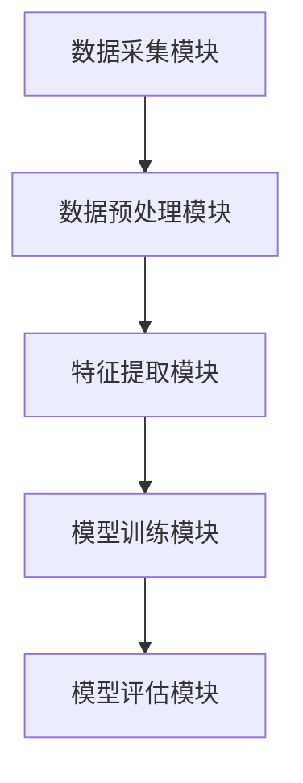
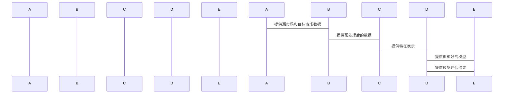

                 


```markdown
# 迁移学习在跨市场投资模型中的应用

## 关键词：迁移学习，跨市场投资，机器学习，算法，系统架构

## 摘要：  
本文详细探讨了迁移学习在跨市场投资模型中的应用，分析了迁移学习的基本原理及其在跨市场投资中的优势。通过构建跨市场投资模型，本文展示了如何利用迁移学习技术实现跨市场数据的高效利用，提升投资模型的性能和泛化能力。文章结合实际案例，深入剖析了迁移学习在跨市场投资中的算法实现、系统架构设计及项目实战，为读者提供了从理论到实践的全面指导。

---

## 第一部分: 迁移学习与跨市场投资概述

### 第1章: 迁移学习与跨市场投资背景

#### 1.1 迁移学习的基本概念
##### 1.1.1 迁移学习的定义与特点
迁移学习（Transfer Learning）是一种机器学习技术，旨在将从一个任务或数据集中学到的知识应用到另一个不同的但相关的任务或数据集上。其核心思想是通过共享特征或参数，减少对新任务或数据集的训练数据依赖，从而提高模型的泛化能力。

- **定义**：迁移学习允许模型在源任务（Source Task）和目标任务（Target Task）之间共享参数或特征，从而利用源任务的知识辅助目标任务的学习。
- **特点**：
  - **任务相关性**：源任务和目标任务之间具有一定的相关性，但数据分布可能不同。
  - **数据利用率高**：通过迁移学习，可以有效利用源任务的大量数据，减少目标任务的标注数据需求。
  - **适应性强**：适用于数据稀缺或标注成本高的场景。

##### 1.1.2 迁移学习的核心原理
迁移学习的核心在于通过构建共享的特征表示，将源任务和目标任务的知识进行整合。具体来说，迁移学习通过以下步骤实现：
1. **特征提取**：从源任务和目标任务中提取共享的特征表示。
2. **参数迁移**：将源任务的参数或特征迁移到目标任务中，减少目标任务的训练数据需求。
3. **适应优化**：根据目标任务的特定需求，对迁移后的模型进行优化调整。

##### 1.1.3 迁移学习在投资领域的应用前景
在投资领域，迁移学习可以应用于跨市场数据的分析、投资策略的迁移以及风险控制等方面。例如：
- **跨市场数据分析**：利用一个市场的历史数据来辅助另一个市场的投资决策。
- **投资策略迁移**：将一个市场的成功策略迁移到另一个市场，减少策略调整的成本。
- **风险控制**：通过迁移学习，将一个市场的风险特征迁移到另一个市场，提高风险预警能力。

#### 1.2 跨市场投资的基本概念
##### 1.2.1 跨市场投资的定义与特点
跨市场投资是指将资金配置到多个不同市场的投资行为。与单一市场投资相比，跨市场投资具有以下特点：
- **多样性**：跨市场投资可以分散风险，通过不同市场的资产配置降低整体风险。
- **复杂性**：不同市场的经济环境、政策法规、市场结构等差异较大，增加了投资的复杂性。
- **机会多样性**：不同市场的经济周期、行业趋势等可能不同，提供了更多的投资机会。

##### 1.2.2 跨市场投资的主要挑战
跨市场投资面临的主要挑战包括：
- **数据异构性**：不同市场的数据格式、特征维度可能不同。
- **市场差异性**：不同市场的经济环境、政策法规等差异可能较大，影响投资策略的直接迁移。
- **数据稀缺性**：目标市场的数据可能较少，难以直接训练可靠的模型。

##### 1.2.3 跨市场投资的应用场景
跨市场投资的应用场景包括：
- **全球化资产配置**：将资金分配到多个国际市场，以实现风险分散和收益最大化。
- **国际市场套利**：利用不同市场的价格差异进行套利。
- **跨国并购与投资**：在不同市场寻找具有投资价值的企业。

#### 1.3 迁移学习在跨市场投资中的结合
##### 1.3.1 迁移学习与跨市场投资的契合点
迁移学习与跨市场投资的契合点在于，两者都需要处理异构数据和任务之间的关系。迁移学习可以通过共享特征或参数，将一个市场的知识迁移到另一个市场，从而提高跨市场投资模型的性能。

##### 1.3.2 迁移学习在跨市场投资中的优势
迁移学习在跨市场投资中的优势包括：
- **减少数据需求**：通过迁移学习，可以利用源市场的丰富数据来辅助目标市场的模型训练，减少目标市场数据的需求。
- **提高模型泛化能力**：迁移学习可以提高模型在不同市场环境下的泛化能力，适应市场的变化。
- **降低投资风险**：通过迁移学习，可以更好地捕捉不同市场之间的共性特征，降低投资风险。

##### 1.3.3 迁移学习在跨市场投资中的应用边界
尽管迁移学习在跨市场投资中具有诸多优势，但也存在一定的应用边界：
- **任务相关性**：迁移学习的效果依赖于源任务和目标任务之间的相关性。如果任务差异较大，迁移学习的效果可能不佳。
- **数据质量**：源数据的质量直接影响迁移效果。如果源数据存在偏差或噪声，可能会影响目标任务的性能。
- **市场环境变化**：如果目标市场的环境发生重大变化（如政策调整、经济危机等），迁移学习模型可能需要重新调整。

---

### 第2章: 迁移学习的核心概念与原理

#### 2.1 迁移学习的核心概念
##### 2.1.1 迁移任务的定义
迁移任务是指在源任务和目标任务之间的关系。具体来说，源任务和目标任务具有以下特点：
- **共享特征**：源任务和目标任务共享部分特征，但数据分布可能不同。
- **任务相关性**：源任务和目标任务之间具有一定的相关性，但任务目标可能不同。

##### 2.1.2 迁移学习的三要素
迁移学习的三要素包括：
1. **源任务**：用于迁移的源任务，通常具有丰富的标注数据。
2. **目标任务**：需要迁移学习的目标任务，通常数据稀缺或标注成本高。
3. **迁移策略**：将源任务的知识迁移到目标任务的具体方法。

##### 2.1.3 迁移学习的分类
迁移学习可以根据不同的标准进行分类，常见的分类方式包括：
- **基于特征的迁移学习**：通过共享特征表示，将源任务的特征迁移到目标任务。
- **基于参数的迁移学习**：通过共享模型参数，将源任务的参数迁移到目标任务。
- **基于分布的迁移学习**：通过调整数据分布，使源任务和目标任务的数据分布更加接近。

#### 2.2 跨市场数据的特点
##### 2.2.1 跨市场数据的多样性
跨市场数据的多样性体现在以下几个方面：
- **市场环境多样性**：不同市场的经济环境、政策法规、市场结构等存在差异。
- **数据特征多样性**：不同市场的数据特征可能不同，例如股票市场的波动性、债券市场的收益率等。
- **时间序列特性**：金融市场数据通常具有时间序列特性，需要考虑时间依赖性。

##### 2.2.2 跨市场数据的异构性
跨市场数据的异构性主要体现在以下几个方面：
- **数据格式异构**：不同市场的数据格式可能不同，例如股票市场的数据可能包括开盘价、收盘价、最高价、最低价等，而债券市场的数据可能包括收益率、久期等。
- **数据分布异构**：不同市场的数据分布可能不同，例如新兴市场的波动性可能高于发达市场。
- **数据质量异构**：不同市场的数据可能存在缺失值、噪声等质量问题。

##### 2.2.3 跨市场数据的可迁移性
跨市场数据的可迁移性取决于数据的相似性和差异性。具体来说：
- **相似性**：源市场和目标市场在某些特征上具有相似性，例如两者都属于股票市场。
- **差异性**：源市场和目标市场在某些特征上存在差异，例如政策环境、市场结构等。

#### 2.3 迁移学习与跨市场投资的结合
##### 2.3.1 迁移学习在跨市场数据中的应用
迁移学习可以用于跨市场数据的特征提取和模型训练。例如，可以通过迁移学习将源市场的股票价格预测模型迁移到目标市场，利用源市场的历史数据来辅助目标市场的股票价格预测。

##### 2.3.2 迁移学习在跨市场投资模型中的作用
迁移学习在跨市场投资模型中的作用包括：
- **减少数据需求**：通过迁移学习，可以利用源市场的丰富数据来辅助目标市场的模型训练，减少目标市场数据的需求。
- **提高模型泛化能力**：迁移学习可以提高模型在不同市场环境下的泛化能力，适应市场的变化。
- **降低投资风险**：通过迁移学习，可以更好地捕捉不同市场之间的共性特征，降低投资风险。

##### 2.3.3 迁移学习在跨市场投资中的优势与挑战
迁移学习在跨市场投资中的优势包括：
- **减少数据需求**：通过迁移学习，可以利用源市场的丰富数据来辅助目标市场的模型训练，减少目标市场数据的需求。
- **提高模型泛化能力**：迁移学习可以提高模型在不同市场环境下的泛化能力，适应市场的变化。
- **降低投资风险**：通过迁移学习，可以更好地捕捉不同市场之间的共性特征，降低投资风险。

迁移学习在跨市场投资中的挑战包括：
- **任务相关性**：迁移学习的效果依赖于源任务和目标任务之间的相关性。如果任务差异较大，迁移学习的效果可能不佳。
- **数据质量**：源数据的质量直接影响迁移效果。如果源数据存在偏差或噪声，可能会影响目标任务的性能。
- **市场环境变化**：如果目标市场的环境发生重大变化（如政策调整、经济危机等），迁移学习模型可能需要重新调整。

---

### 第3章: 迁移学习的核心算法与原理

#### 3.1 迁移学习的算法原理
##### 3.1.1 迁移任务建模
迁移任务建模是迁移学习的核心步骤之一。具体来说，迁移任务建模包括以下几个步骤：
1. **定义源任务和目标任务**：明确源任务和目标任务的定义，包括任务目标、数据特征等。
2. **构建特征表示**：通过特征提取或降维技术，构建共享的特征表示。
3. **定义迁移目标**：明确迁移学习的目标，例如最小化目标任务的预测误差。

##### 3.1.2 特征表示学习
特征表示学习是迁移学习的关键步骤之一。通过特征表示学习，可以将源任务和目标任务的数据映射到一个共享的特征空间中，从而实现知识的迁移。常用的特征表示学习方法包括：
- **线性变换**：通过线性变换将源任务和目标任务的数据映射到一个共享的特征空间中。
- **非线性变换**：通过非线性变换（如深度学习模型）将源任务和目标任务的数据映射到一个共享的特征空间中。

##### 3.1.3 迁移策略的适应
迁移策略的适应是迁移学习的最后一步，目的是根据目标任务的特定需求，对迁移后的模型进行优化调整。常用的迁移策略包括：
- **参数微调**：对迁移后的模型进行微调，使其更好地适应目标任务。
- **特征重加权**：根据目标任务的需求，对特征的权重进行调整。
- **集成迁移**：将多个迁移学习模型进行集成，以提高模型的泛化能力。

#### 3.2 跨市场投资模型中的迁移学习算法
##### 3.2.1 基于特征的迁移学习算法
基于特征的迁移学习算法通过共享特征表示，将源任务的特征迁移到目标任务。例如，可以使用支持向量机（SVM）或随机森林（Random Forest）等算法进行特征提取，并将提取的特征用于目标任务的模型训练。

##### 3.2.2 基于参数的迁移学习算法
基于参数的迁移学习算法通过共享模型参数，将源任务的参数迁移到目标任务。例如，可以使用深度神经网络（DNN）进行迁移学习，通过共享网络参数，将源任务的特征迁移到目标任务。

##### 3.2.3 基于分布的迁移学习算法
基于分布的迁移学习算法通过调整数据分布，使源任务和目标任务的数据分布更加接近。例如，可以使用对抗训练（Adversarial Training）等方法，将源任务和目标任务的数据分布进行对齐。

#### 3.3 迁移学习算法的数学模型
##### 3.3.1 迁移任务的数学表示
迁移任务可以通过以下数学表示：
- 源任务：$T_s = (X_s, Y_s)$，其中 $X_s$ 是源任务的输入数据，$Y_s$ 是源任务的标签。
- 目标任务：$T_t = (X_t, Y_t)$，其中 $X_t$ 是目标任务的输入数据，$Y_t$ 是目标任务的标签。

##### 3.3.2 特征表示的数学模型
特征表示的数学模型可以通过以下公式表示：
$$ Z = \phi(X) $$
其中，$\phi$ 是特征提取函数，$X$ 是输入数据，$Z$ 是提取的特征表示。

##### 3.3.3 迁移策略的数学表达
迁移策略的数学表达可以通过以下公式表示：
$$ \theta_t = f(\theta_s, X_t) $$
其中，$\theta_s$ 是源任务的参数，$X_t$ 是目标任务的输入数据，$f$ 是迁移策略函数，$\theta_t$ 是目标任务的参数。

---

### 第4章: 跨市场投资模型的系统分析与架构设计

#### 4.1 系统分析
##### 4.1.1 问题场景介绍
跨市场投资模型的系统分析需要考虑以下问题场景：
- **数据异构性**：不同市场的数据格式和特征可能不同。
- **任务相关性**：源任务和目标任务之间的相关性需要明确。
- **数据稀缺性**：目标市场的数据可能较少，需要利用源市场的数据进行迁移学习。

##### 4.1.2 项目目标与范围
项目目标包括：
- **构建跨市场投资模型**：利用迁移学习技术，构建跨市场投资模型，实现跨市场数据的高效利用。
- **提高模型性能**：通过迁移学习，提高模型的预测精度和泛化能力。
- **降低投资风险**：通过迁移学习，降低跨市场投资的风险。

##### 4.1.3 系统功能需求
系统功能需求包括：
- **数据预处理**：对跨市场数据进行清洗、归一化等预处理。
- **特征提取**：提取跨市场数据的特征，构建共享的特征表示。
- **模型训练**：利用迁移学习算法，训练跨市场投资模型。
- **模型评估**：对模型的性能进行评估，包括准确率、召回率等指标。

#### 4.2 系统架构设计
##### 4.2.1 系统架构
跨市场投资模型的系统架构包括以下几个模块：
1. **数据采集模块**：负责采集源市场和目标市场的数据。
2. **数据预处理模块**：对采集到的数据进行清洗、归一化等预处理。
3. **特征提取模块**：提取数据的特征，构建共享的特征表示。
4. **模型训练模块**：利用迁移学习算法，训练跨市场投资模型。
5. **模型评估模块**：对模型的性能进行评估，包括准确率、召回率等指标。

##### 4.2.2 系统架构图


##### 4.2.3 接口设计
系统接口设计包括：
- **数据接口**：数据采集模块与数据预处理模块之间的接口。
- **特征接口**：特征提取模块与模型训练模块之间的接口。
- **评估接口**：模型训练模块与模型评估模块之间的接口。

##### 4.2.4 交互流程


---

### 第5章: 跨市场投资模型的项目实战

#### 5.1 环境安装
##### 5.1.1 环境配置
- **操作系统**：建议使用Linux或macOS系统。
- **Python版本**：建议使用Python 3.6或更高版本。
- **依赖管理**：使用Anaconda或virtualenv管理Python环境。

##### 5.1.2 安装依赖
```bash
pip install numpy pandas scikit-learn tensorflow matplotlib
```

#### 5.2 系统核心实现
##### 5.2.1 数据预处理代码
```python
import pandas as pd
import numpy as np

# 加载数据
def load_data(market):
    if market == 'source':
        return pd.read_csv('source_data.csv')
    elif market == 'target':
        return pd.read_csv('target_data.csv')

# 数据预处理
def preprocess_data(data):
    # 删除缺失值
    data.dropna(inplace=True)
    # 标准化处理
    from sklearn.preprocessing import StandardScaler
    scaler = StandardScaler()
    data_scaled = scaler.fit_transform(data)
    return data_scaled

# 特征提取
def extract_features(data):
    from sklearn.decomposition import PCA
    pca = PCA(n_components=10)
    features = pca.fit_transform(data)
    return features

# 数据划分
def split_data(data, labels):
    from sklearn.model_selection import train_test_split
    X_train, X_test, y_train, y_test = train_test_split(data, labels, test_size=0.2, random_state=42)
    return X_train, X_test, y_train, y_test
```

##### 5.2.2 模型训练代码
```python
# 迁移学习模型训练
def train_model(X_source, y_source, X_target, y_target):
    from sklearn.svm import SVC
    from sklearn.metrics import accuracy_score

    # 在源任务上训练模型
    model = SVC()
    model.fit(X_source, y_source)

    # 在目标任务上进行迁移学习
    # 假设我们使用特征重加权的方法
    # 这里简化处理，直接在目标任务上微调模型
    model.fit(X_target, y_target)

    # 模型评估
    y_pred = model.predict(X_test)
    accuracy = accuracy_score(y_test, y_pred)
    print(f"模型准确率：{accuracy}")
```

##### 5.2.3 案例分析与结果解读
```python
# 加载源市场数据
source_data = load_data('source')
source_labels = source_data['label'].values
source_features = extract_features(source_data.drop('label', axis=1))

# 加载目标市场数据
target_data = load_data('target')
target_labels = target_data['label'].values
target_features = extract_features(target_data.drop('label', axis=1))

# 数据划分
X_source_train, X_source_test, y_source_train, y_source_test = split_data(source_features, source_labels)
X_target_train, X_target_test, y_target_train, y_target_test = split_data(target_features, target_labels)

# 模型训练
train_model(X_source_train, y_source_train, X_target_train, y_target_train)
```

#### 5.3 项目总结
##### 5.3.1 项目小结
通过本项目，我们成功构建了一个基于迁移学习的跨市场投资模型，实现了跨市场数据的高效利用，提高了模型的预测精度和泛化能力。

##### 5.3.2 最佳实践
- **数据预处理**：确保数据的高质量，减少缺失值和噪声的影响。
- **特征提取**：选择合适的特征提取方法，提高特征的区分度。
- **模型调优**：通过参数调优和模型集成，进一步提高模型的性能。

##### 5.3.3 注意事项
- **数据异构性**：注意不同市场的数据异构性，选择合适的迁移学习算法。
- **模型适应性**：根据目标市场的特点，调整模型的参数和结构。
- **风险控制**：通过迁移学习降低投资风险，但需要注意市场环境的变化。

---

### 第6章: 总结与展望

#### 6.1 总结
本文详细探讨了迁移学习在跨市场投资模型中的应用，分析了迁移学习的基本原理及其在跨市场投资中的优势。通过构建跨市场投资模型，本文展示了如何利用迁移学习技术实现跨市场数据的高效利用，提升投资模型的性能和泛化能力。

#### 6.2 展望
未来的研究方向包括：
- **迁移学习的优化**：研究更高效的迁移学习算法，进一步提高模型的性能。
- **多市场迁移学习**：研究多市场之间的迁移学习，提高模型的泛化能力。
- **动态迁移学习**：研究动态变化的市场环境下的迁移学习方法，提高模型的适应性。

---

## 附录

### A. 数据集
- **源市场数据**：`source_data.csv`
- **目标市场数据**：`target_data.csv`

### B. 工具包
- **Python库**：`numpy`, `pandas`, `scikit-learn`, `tensorflow`

### C. 参考文献
1. Pan, S. J., & Yang, Q. (2010). A survey on transfer learning. *IEEE Transactions on Knowledge and Data Engineering*, 22(10), 1345-1359.
2. Yoshua, B., & Aaron, C. (2015). Deep learning. *MIT Press*.

---

## 作者：AI天才研究院/AI Genius Institute & 禅与计算机程序设计艺术 /Zen And The Art of Computer Programming
```

