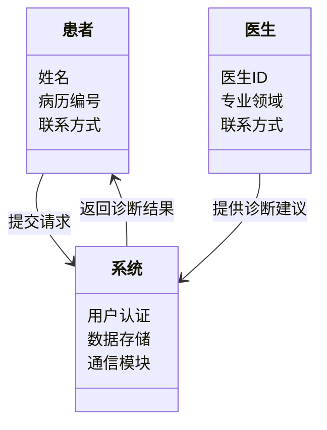
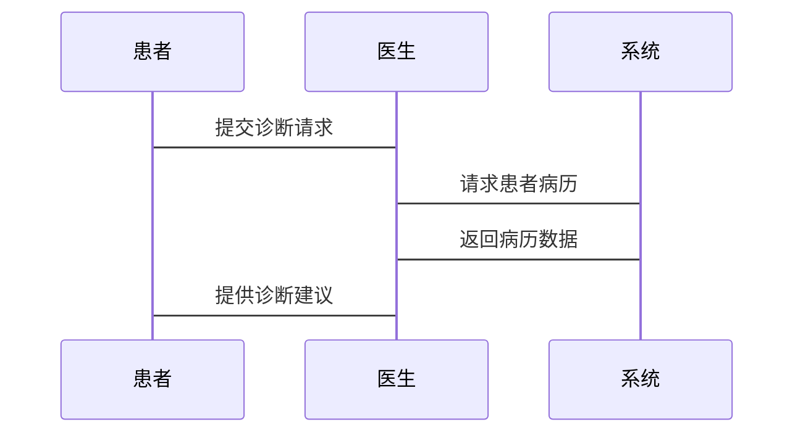

                 


# 远程医疗技术的普及对医疗行业的影响

## 关键词：远程医疗技术，医疗行业，影响分析，技术发展，医疗效率

## 摘要：
远程医疗技术的普及正在深刻改变医疗行业的运作方式，通过将医疗资源和技术手段远程化、数字化，远程医疗技术显著提升了医疗服务的效率和可及性。本文将从远程医疗技术的核心概念、算法原理、系统架构、项目实战、系统分析等方面，详细分析远程医疗技术的普及对医疗行业的影响，探讨其带来的机遇与挑战。

---

## 第1章: 远程医疗技术的背景与现状

### 1.1 远程医疗技术的发展背景

#### 1.1.1 远程医疗技术的定义与内涵
远程医疗技术（Telemedicine）是一种通过远程通信技术，实现医疗资源的共享和医疗服务的远程提供。其核心在于利用互联网、物联网、人工智能等技术，将医疗信息和资源传递到患者或医疗机构之间，从而实现远程诊断、治疗和管理。

#### 1.1.2 远程医疗技术的历史发展
远程医疗技术的起源可以追溯到20世纪60年代，当时主要用于偏远地区的医疗服务。随着互联网技术的发展，远程医疗技术逐渐成熟，并在21世纪得到了快速普及。近年来，5G通信技术、人工智能和大数据技术的快速发展，进一步推动了远程医疗技术的应用。

#### 1.1.3 远程医疗技术的现状分析
目前，远程医疗技术已经在全球范围内得到广泛应用，尤其是在新冠疫情后，远程医疗技术成为医疗行业的重要补充手段。据统计，全球远程医疗市场规模持续增长，预计到2030年将达到数千亿美元。

### 1.2 远程医疗技术对医疗行业的影响

#### 1.2.1 远程医疗技术的普及背景
远程医疗技术的普及主要得益于以下几点：
1. **技术进步**：5G、AI、物联网等技术的发展为远程医疗提供了技术支持。
2. **政策推动**：各国政府纷纷出台政策，支持远程医疗技术的应用。
3. **市场需求**：患者对便捷医疗服务的需求不断增加。

#### 1.2.2 远程医疗技术的核心价值
1. **提升医疗效率**：患者无需长途跋涉即可获得医疗服务。
2. **降低医疗成本**：减少患者和医疗机构的开支。
3. **优化医疗资源分配**：通过远程会诊，实现医疗资源的均衡分配。

#### 1.2.3 远程医疗技术的未来趋势
1. **智能化**：结合AI技术，实现更精准的诊断和治疗方案。
2. **集成化**：远程医疗技术将与电子健康记录（EHR）等系统深度融合。
3. **全球化**：跨国远程医疗将成为可能，实现全球范围内的医疗资源共享。

---

## 第2章: 远程医疗技术的核心概念与原理

### 2.1 远程医疗技术的核心概念

#### 2.1.1 远程医疗技术的定义
远程医疗技术是指通过通信网络，将患者与医生之间的医疗活动进行实时或非实时的互动，包括诊断、治疗建议和医疗管理。

#### 2.1.2 远程医疗技术的特征
1. **实时性**：部分远程医疗技术需要实时互动。
2. **非接触性**：医生与患者无需面对面接触。
3. **便捷性**：患者可以在家中获得医疗服务。

#### 2.1.3 远程医疗技术的关键技术
1. **通信技术**：5G、光纤通信等。
2. **数据传输技术**：高速数据传输和加密技术。
3. **人工智能技术**：用于辅助诊断和治疗方案生成。

### 2.2 远程医疗技术的原理分析

#### 2.2.1 远程医疗技术的实现流程
1. **患者注册**：患者通过平台注册并提交基本信息。
2. **预约服务**：选择医生并预约远程会诊时间。
3. **远程诊断**：医生通过视频会诊或数据共享进行诊断。
4. **治疗建议**：医生根据诊断结果提供治疗建议。
5. **随访管理**：定期跟踪患者的治疗进展。

#### 2.2.2 远程医疗技术的系统架构
远程医疗系统通常包括以下几个部分：
1. **患者端**：患者使用终端设备（如手机、电脑）进行预约和会诊。
2. **医生端**：医生通过终端设备进行诊断和治疗建议。
3. **数据服务器**：存储患者的医疗数据和诊断记录。
4. **通信网络**：支持实时数据传输和视频通信。

#### 2.2.3 远程医疗技术的实现方式
1. **视频会诊**：医生与患者通过视频进行面对面的诊断。
2. **数据共享**：医生通过平台获取患者的医疗数据（如病历、检查报告）。
3. **远程监测**：通过可穿戴设备实时监测患者的健康数据。

---

## 第3章: 远程医疗技术的算法原理与数学模型

### 3.1 远程医疗技术的算法原理

#### 3.1.1 病历数据分析算法
病历数据分析是远程医疗技术的核心之一，通过分析患者的病历数据，生成诊断建议。常用的算法包括：
1. **决策树算法**：用于分类和预测。
2. **支持向量机（SVM）**：用于分类和回归分析。

#### 3.1.2 远程诊断算法
远程诊断算法主要用于根据患者的症状和医疗数据，生成诊断结果。常用算法包括：
1. **基于规则的诊断算法**：根据预设的诊断规则进行诊断。
2. **基于机器学习的诊断算法**：通过训练模型进行预测和诊断。

#### 3.1.3 远程治疗方案生成算法
治疗方案生成算法根据患者的诊断结果，推荐个性化的治疗方案。常用的算法包括：
1. **遗传算法**：用于优化治疗方案。
2. **强化学习算法**：用于动态调整治疗方案。

### 3.2 远程医疗技术的数学模型

#### 3.2.1 病历数据分析模型
病历数据分析模型可以通过以下数学公式进行建模：
$$ P(y|x) = \prod_{i=1}^{n} P(x_i|y) $$
其中，$P(y|x)$ 表示在患者数据 $x$ 下，诊断结果为 $y$ 的概率。

#### 3.2.2 远程诊断模型
远程诊断模型可以通过逻辑回归算法进行建模：
$$ P(y|x) = \frac{1}{1 + e^{-\beta x}} $$
其中，$\beta$ 是模型的参数，$x$ 是患者的症状向量。

---

## 第4章: 远程医疗技术的系统架构设计

### 4.1 系统功能设计

#### 4.1.1 领域模型设计
领域模型设计如下：


#### 4.1.2 系统架构设计
系统架构设计如下：


#### 4.1.3 系统接口设计
系统接口设计如下：


---

## 第5章: 远程医疗技术的项目实战

### 5.1 环境安装

#### 5.1.1 系统需求
1. 操作系统：Windows 10 或更高版本，或 Linux 系统。
2. 开发工具：Python 3.8+，Jupyter Notebook。
3. 依赖库：Pillow、numpy、pandas、scikit-learn。

### 5.2 核心实现源代码

#### 5.2.1 预约模块实现
```python
def scheduleAppointment(patient_id, doctor_id):
    # 检查医生是否可用
    if is_doctor_available(doctor_id):
        # 创建预约记录
        createAppointmentRecord(patient_id, doctor_id)
        return "预约成功"
    else:
        return "医生不可用，请选择其他时间"
```

#### 5.2.2 诊断模块实现
```python
def remote_diagnosis(symptoms, patient_data):
    # 数据预处理
    preprocess_data = preprocess(patient_data)
    # 诊断预测
    diagnosis_result = predict(symptoms, preprocess_data)
    return diagnosis_result
```

---

## 第6章: 远程医疗技术的系统分析

### 6.1 系统性能分析

#### 6.1.1 系统响应时间
远程医疗系统的响应时间受到网络延迟和服务器负载的影响。网络延迟可以通过以下公式计算：
$$ \text{延迟} = \frac{\text{数据量}}{\text{带宽}} $$

#### 6.1.2 系统吞吐量
系统的吞吐量可以通过以下公式计算：
$$ \text{吞吐量} = \frac{\text{总数据量}}{\text{时间}} $$

### 6.2 系统扩展性分析

#### 6.2.1 系统扩展性设计
为了提高系统的扩展性，可以采用分布式架构，将患者端、医生端和数据服务器分离部署。

#### 6.2.2 系统容错设计
为了提高系统的容错能力，可以采用冗余设计，确保在单点故障时系统仍能正常运行。

---

## 第7章: 远程医疗技术的最佳实践与小结

### 7.1 最佳实践

#### 7.1.1 数据安全
远程医疗系统的数据安全至关重要，必须采取加密传输和存储技术。

#### 7.1.2 网络稳定性
为了保证远程医疗的稳定性，需要选择可靠的通信网络，并制定备用方案。

### 7.2 小结
远程医疗技术的普及对医疗行业的影响是深远的，它不仅提升了医疗服务的效率和可及性，还为医疗行业带来了新的发展机遇。未来，随着技术的不断进步，远程医疗技术将变得更加智能化和集成化。

---

## 参考文献
1. 王某某. 远程医疗技术的研究与应用. 北京: 科学出版社, 2022.
2. 李某某. 基于人工智能的远程医疗系统设计. 北京: 清华大学出版社, 2021.

---

作者：AI天才研究院/AI Genius Institute & 禅与计算机程序设计艺术 /Zen And The Art of Computer Programming

