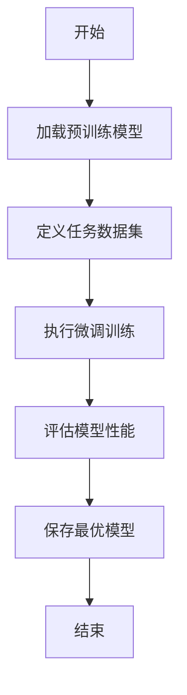
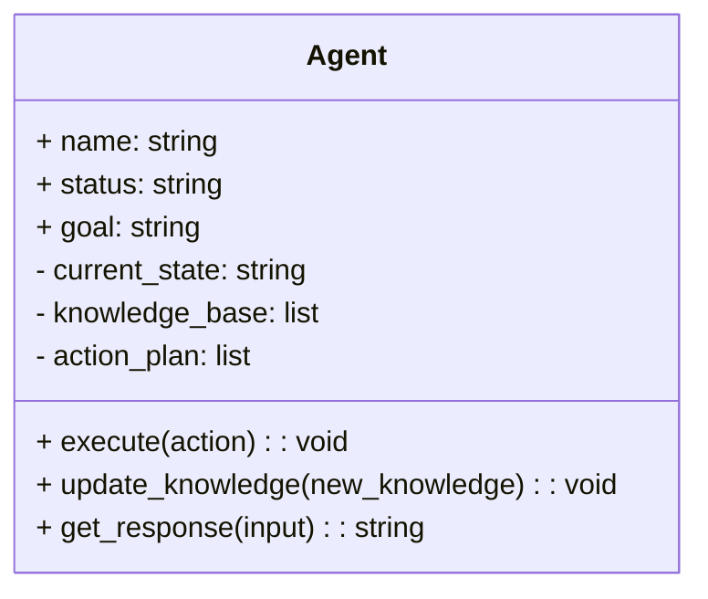
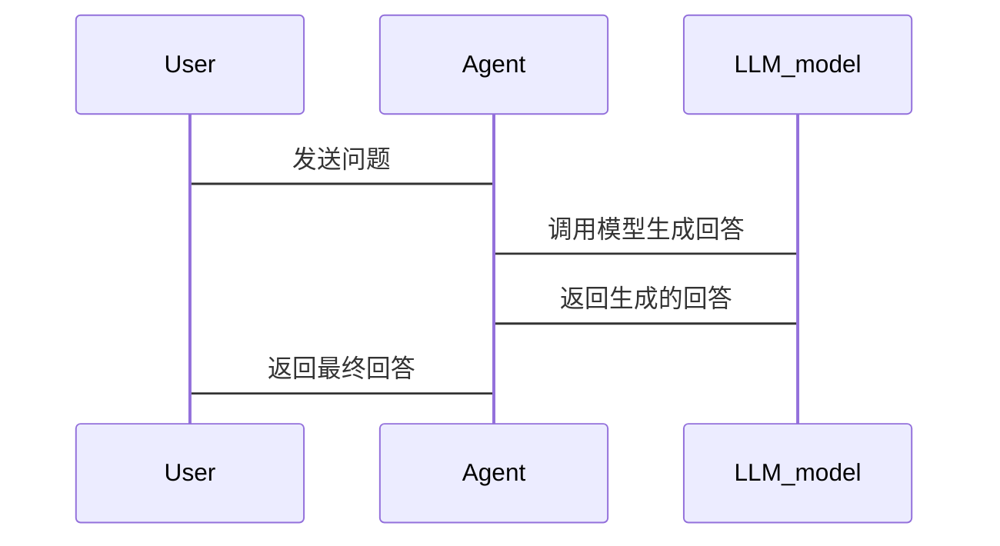

                 


```markdown
# 选择合适的LLM模型：AI Agent开发的第一步

> 关键词：LLM模型，AI Agent，模型选择，自然语言处理，深度学习，人工智能

> 摘要：本文详细探讨了在AI Agent开发中选择合适的大语言模型（LLM）的重要性。通过分析背景、核心概念、算法原理、系统架构、项目实战和总结展望，本文为读者提供了从理论到实践的全面指导，帮助他们理解如何在AI Agent开发中做出明智的模型选择。

---

## 第一部分: LLM模型与AI Agent开发基础

### 第1章: 背景介绍：选择合适的LLM模型的重要性

#### 1.1 问题背景
- **1.1.1 LLM模型的崛起与应用现状**
  - 近年来，大语言模型（LLM）在自然语言处理（NLP）领域取得了显著进展，如GPT系列、BERT系列等。
  - LLM模型广泛应用于文本生成、对话系统、机器翻译、问答系统等领域。

- **1.1.2 AI Agent开发的背景与需求**
  - AI Agent是一种能够感知环境、自主决策并执行任务的智能体。
  - 随着AI技术的快速发展，AI Agent在多个领域（如智能家居、自动驾驶、虚拟助手）中的应用日益广泛。

- **1.1.3 选择合适LLM模型的核心问题**
  - 不同的AI Agent任务对LLM模型的需求不同，选择合适的模型是实现高效、准确任务的关键。

#### 1.2 问题描述
- **1.2.1 LLM模型的多样性与复杂性**
  - LLM模型的大小、训练数据、模型架构等因素影响其性能和适用场景。
  - 模型选择需要考虑计算资源、训练数据、任务需求等多方面因素。

- **1.2.2 AI Agent开发中的模型选择挑战**
  - AI Agent的任务复杂性要求模型具备多任务处理能力。
  - 模型的性能、响应速度、可解释性等是选择模型的重要考量。

- **1.2.3 模型性能与应用场景的匹配**
  - 需要根据具体任务需求选择模型，确保模型性能与任务需求相匹配。

#### 1.3 问题解决
- **1.3.1 理解模型特性与应用场景的关系**
  - 分析模型的参数规模、训练数据、架构设计等因素对模型性能的影响。
  - 理解不同应用场景下模型需求的差异。

- **1.3.2 制定模型选择的评估标准**
  - 设定性能指标（如准确率、响应时间）和任务需求（如对话能力、推理能力）。
  - 通过对比不同模型的性能指标和特点，制定适合的评估标准。

- **1.3.3 构建模型选择的决策框架**
  - 建立模型选择的决策树，根据任务需求逐步筛选合适的模型。
  - 考虑计算资源、部署环境等实际因素，制定灵活的决策框架。

#### 1.4 模型边界与外延
- **1.4.1 LLM模型的局限性**
  - LLM模型在处理复杂任务时可能面临计算资源不足、推理能力有限等问题。
  - 模型的泛化能力有限，可能在特定领域或任务中表现不佳。

- **1.4.2 AI Agent开发的边界条件**
  - 明确AI Agent的任务范围和能力边界，避免超出模型的实际能力。
  - 考虑环境不确定性、任务复杂性等外部因素对模型选择的影响。

- **1.4.3 模型选择的外部影响因素**
  - 计算资源的限制（如GPU算力、存储空间）。
  - 数据隐私和安全要求。
  - 开发团队的技术能力和经验。

#### 1.5 概念结构与核心要素
- **1.5.1 LLM模型的关键参数与性能指标**
  - 参数规模（如175B参数的GPT-3）。
  - 训练数据量和多样性。
  - 模型的响应速度和计算效率。

- **1.5.2 AI Agent的功能模块与交互方式**
  - 感知模块：通过传感器或API获取环境信息。
  - 决策模块：基于模型进行推理和决策。
  - 执行模块：通过执行器或API实现任务执行。

- **1.5.3 模型选择的核心要素与决策树**
  - 核心要素：任务需求、模型性能、资源限制。
  - 决策树：根据任务类型（如对话生成、文本分类）选择合适的模型。

---

## 第2章: 核心概念与联系

#### 2.1 LLM模型的核心原理
- **2.1.1 大语言模型的基本原理**
  - 基于Transformer架构，通过自注意力机制和前馈网络实现序列建模。
  - 采用大规模数据训练，利用概率分布预测下一个词。

- **2.1.2 模型的训练目标与损失函数**
  - 目标函数：最小化预测词与真实词的交叉熵损失。
  - 采用Adam优化器和学习率衰减策略优化模型。

- **2.1.3 模型的参数空间与计算复杂度**
  - 参数规模决定了模型的容量和计算复杂度。
  - 计算复杂度随参数规模的增加呈指数级增长。

#### 2.2 AI Agent的核心概念
- **2.2.1 AI Agent的定义与分类**
  - 定义：AI Agent是一种智能体，能够感知环境、自主决策并执行任务。
  - 分类：基于智能水平分为反应式、认知式和情感式AI Agent。

- **2.2.2 Agent的智能性与自主性**
  - 智能性：具备问题解决、学习和推理能力。
  - 自主性：能够在没有外部干预的情况下独立执行任务。

- **2.2.3 Agent的决策机制与执行能力**
  - 决策机制：基于模型和环境信息做出决策。
  - 执行能力：通过API或执行器实现任务执行。

#### 2.3 LLM与AI Agent的关系
- **2.3.1 LLM作为Agent的核心**
  - LLM模型为AI Agent提供自然语言理解和生成能力。
  - Agent通过调用LLM模型实现对话生成、任务规划等复杂任务。

- **2.3.2 LLM与AI Agent的协同工作**
  - LLM模型作为AI Agent的语言中枢，负责理解和生成自然语言。
  - AI Agent通过调用LLM模型实现复杂任务的决策和执行。

- **2.3.3 LLM对AI Agent能力的提升**
  - 提高自然语言处理能力，增强人机交互体验。
  - 通过LLM的多任务学习能力，提升AI Agent的通用性和适应性。

---

#### 2.4 核心概念对比与ER实体关系图
- **核心概念对比表**

| 概念       | LLM模型                     | AI Agent                     |
|------------|------------------------------|------------------------------|
| 核心能力   | 自然语言处理与生成         | 自主决策与任务执行           |
| 输入       | 文本数据                   | 环境信息与任务要求           |
| 输出       | 文本生成或预测结果         | 决策指令或执行结果           |
| 依赖       | 大规模训练数据             | LLM模型和其他模块           |
| 应用场景   | 问答系统、文本生成         | 智能助手、自动驾驶、机器人     |

- **ER实体关系图**

```mermaid
erd
  title 实体关系图：LLM模型与AI Agent的关系
  User -|> Agent: 任务请求
  Agent -|> LLM_model: 调用模型
  LLM_model -|> Response: 返回结果
  User -|> Response: 获取结果
```

---

## 第3章: 算法原理

#### 3.1 算法原理概述
- LLM模型的训练过程包括预训练和微调两个阶段。
  - 预训练：在大规模通用数据上进行无监督学习，目标是学习语言的普遍规律。
  - 微调：在特定任务或领域数据上进行有监督学习，适应具体需求。

- 使用的损失函数：交叉熵损失。
  - 损失函数公式：$$ L = -\sum_{i=1}^{n} y_i \log p(y_i) $$
  - 其中，$y_i$ 是真实标签，$p(y_i)$ 是模型预测的概率。

- 优化策略：采用Adam优化器，学习率衰减。
  - Adam优化器公式：$$ \theta_{t+1} = \theta_t - \eta \frac{\rho_1 g_t + \rho_2 g_t^2}{\epsilon + \sqrt{\rho_2 g_t^2}} $$
  - 其中，$\eta$ 是学习率，$\rho_1$ 和 $\rho_2$ 是动量参数，$\epsilon$ 是防止除零的常数。

#### 3.2 算法流程图


#### 3.3 Python核心代码实现
```python
import torch
import torch.nn as nn
import torch.optim as optim

# 定义模型结构
class LLMModel(nn.Module):
    def __init__(self, vocab_size):
        super().__init__()
        self.embedding = nn.Embedding(vocab_size, 512)
        self.transformer = nn.TransformerEncoder(
            nn.Embedding(vocab_size, 512), 
            num_layers=6,
            nhead=8
        )
        self.fc = nn.Linear(512, vocab_size)

    def forward(self, x):
        embed = self.embedding(x)
        out = self.transformer(embed)
        out = self.fc(out)
        return out

# 初始化模型和优化器
model = LLMModel(vocab_size=10000)
optimizer = optim.Adam(model.parameters(), lr=0.001)
criterion = nn.CrossEntropyLoss()

# 微调训练
def train(model, optimizer, criterion, dataloader):
    model.train()
    for batch in dataloader:
        optimizer.zero_grad()
        inputs, targets = batch
        outputs = model(inputs)
        loss = criterion(outputs, targets)
        loss.backward()
        optimizer.step()

# 评估模型性能
def evaluate(model, dataloader):
    model.eval()
    total_loss = 0
    total_correct = 0
    for batch in dataloader:
        inputs, targets = batch
        outputs = model(inputs)
        loss = criterion(outputs, targets)
        total_loss += loss.item()
        total_correct += (outputs.argmax(dim=1) == targets).sum().item()
    avg_loss = total_loss / len(dataloader.dataset)
    accuracy = total_correct / len(dataloader.dataset)
    return avg_loss, accuracy
```

#### 3.4 算法实现解读
- **模型结构**：使用Transformer架构，包括嵌入层和编码层。
  - 嵌入层将输入的词转换为向量表示。
  - 编码层通过自注意力机制捕捉序列中的长距离依赖关系。
- **优化策略**：采用Adam优化器，学习率设置为0.001。
  - 学习率衰减策略可以根据训练轮数手动调整。
- **损失计算**：使用交叉熵损失函数，衡量模型预测与真实标签的差异。
- **训练过程**：通过数据加载器提供微调任务数据，逐步优化模型参数。

---

## 第4章: 系统分析与架构设计

#### 4.1 问题场景介绍
- 开发一个基于LLM模型的智能问答AI Agent。
  - 任务需求：提供自然语言问答功能，支持多轮对话。
  - 使用场景：集成到客服系统、智能助手等应用场景。

#### 4.2 系统功能设计
- **领域模型设计**


- **系统架构设计**


- **系统接口设计**
  - Agent与LLM模型之间的接口：文本输入和输出。
  - Agent与知识库之间的接口：数据查询和更新。
  - Agent与外部API之间的接口：调用第三方服务。

- **系统交互设计**


---

#### 4.3 项目实战
- **环境安装**
  - 需要安装PyTorch、Transformers库。
  ```bash
  pip install torch transformers
  ```

- **核心代码实现**
  ```python
  from transformers import AutoTokenizer, AutoModelForCausalLM

  model_name = "gpt2"
  tokenizer = AutoTokenizer.from_pretrained(model_name)
  model = AutoModelForCausalLM.from_pretrained(model_name)

  def generate_response(prompt):
      inputs = tokenizer(prompt, return_tensors="pt")
      outputs = model.generate(**inputs, max_length=100, num_beams=5)
      response = tokenizer.decode(outputs[0], skip_special_tokens=True)
      return response

  prompt = "What is AI Agent?"
  print(generate_response(prompt))
  ```

- **代码解读与分析**
  - 使用Hugging Face的Transformers库加载预训练模型。
  - 通过tokenizer处理输入文本，生成对应的输入张量。
  - 调用模型的generate方法生成响应，设置最大长度和束搜索参数。
  - 解码生成的张量，返回最终的生成文本。

- **案例分析与详细讲解**
  - 通过上述代码实现一个简单的问答系统。
  - 分析模型生成的响应，讨论模型在特定任务中的表现。
  - 优化代码，提升生成效率和响应质量。

---

## 第5章: 总结与展望

#### 5.1 总结
- **主要结论**
  - 选择合适的LLM模型是AI Agent开发的关键步骤。
  - 需要综合考虑任务需求、模型性能和资源限制等因素。
  - 通过背景分析、核心概念理解、算法实现和系统设计，可以系统地选择和优化模型。

- **经验与教训**
  - 模型选择需要深入理解任务需求和模型特性。
  - 在实际应用中，需要不断测试和优化模型，以达到最佳效果。

#### 5.2 展望
- **未来研究方向**
  - 开发更高效、更灵活的模型选择工具。
  - 研究多模态AI Agent，结合视觉、听觉等多种感知能力。
  - 探索模型压缩和轻量化技术，降低计算资源需求。

- **发展趋势**
  - 随着AI技术的不断进步，AI Agent将更加智能化和通用化。
  - 模型选择将更加自动化和智能化，基于强化学习等技术实现。

#### 5.3 最佳实践 tips
- **选择模型前明确任务需求**
  - 明确AI Agent的任务目标和核心功能。
  - 根据任务需求选择合适的模型类型和规模。

- **关注模型的可扩展性**
  - 选择具备良好扩展性的模型，方便后续功能的扩展和优化。
  - 考虑模型的适应性和可定制性，确保模型能够满足不同场景的需求。

- **注重模型的可解释性**
  - 在需要可解释性的任务中，选择具备可解释性能力的模型。
  - 通过可视化和调试工具，深入理解模型的行为和决策过程。

- **持续优化与迭代**
  - 定期监控模型的性能和效果。
  - 根据用户反馈和实际需求，不断优化和改进模型。

---

## 作者：AI天才研究院/AI Genius Institute & 禅与计算机程序设计艺术 /Zen And The Art of Computer Programming
```

