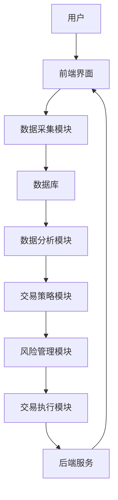
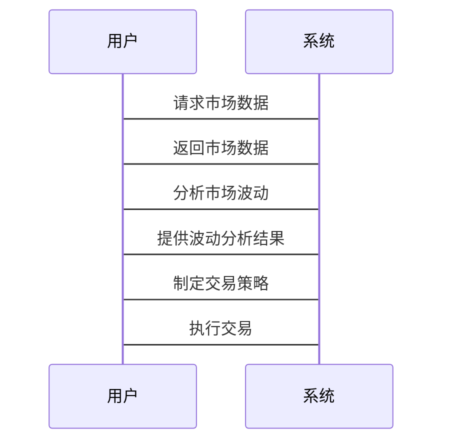

                 


# 选股时机：市场波动如何创造投资机会

## 关键词：市场波动、投资机会、技术分析、风险管理、资产配置

## 摘要：市场波动是投资过程中不可忽视的重要因素，它既带来了风险，也创造了潜在的投资机会。本文通过分析市场波动的核心概念、技术分析方法、系统架构设计以及实际项目案例，深入探讨了市场波动如何转化为投资机会，并为投资者提供了实用的策略和建议。文章从理论到实践，全面解析了市场波动的投资价值，帮助投资者在波动中捕捉机遇，优化投资决策。

---

## 第一部分：市场波动与投资机会概述

### 第1章：市场波动的基本概念

#### 1.1 市场波动的定义与特征

##### 1.1.1 市场波动的定义
市场波动是指资产价格在短时间内围绕其内在价值上下波动的现象。这种波动通常由市场参与者的买卖行为、信息变化和外部经济因素共同作用产生。市场波动的大小可以用收益率的标准差或波动率来衡量。

##### 1.1.2 市场波动的特征分析
- **短期性**：市场波动通常发生在较短的时间内，可能是几小时、几天或几周。
- **不一致性**：波动的幅度和频率在不同市场周期中表现不同。
- **非线性**：市场波动并非完全随机，可能会受到市场参与者的预期和情绪影响，表现出非线性特征。
- **传染性**：市场波动可能从一个市场传导到另一个市场，尤其是在全球化和金融一体化的背景下。

##### 1.1.3 市场波动与投资者心理的关系
投资者的心理预期和情绪对市场波动有重要影响。例如，当市场情绪乐观时，投资者倾向于追涨杀跌，这会加剧市场的波动。反之，当市场情绪悲观时，投资者可能倾向于抛售资产，进一步放大市场波动。

#### 1.2 投资者行为与市场波动

##### 1.2.1 投资者心理对市场波动的影响
投资者的心理预期和行为模式是市场波动的重要驱动因素。例如：
- **羊群效应**：当一部分投资者开始抛售资产时，其他投资者可能会盲目跟风，导致市场进一步下跌。
- **过度自信**：投资者可能高估自己的分析能力，导致错误的买卖决策，加剧市场波动。

##### 1.2.2 羊群效应与市场波动的关系
羊群效应是指投资者在市场波动时倾向于跟随大多数人的行为，这种行为模式会导致市场波动的放大。例如，在股票市场中，当一只股票的价格开始下跌时，投资者可能会加速抛售，导致价格进一步下跌。

##### 1.2.3 投资者情绪指数的构建与应用
投资者情绪指数是衡量市场情绪的重要指标，可以通过分析市场交易量、投资者行为和媒体情绪等信息构建。例如，恐慌指数（VIX指数）是衡量市场波动的重要指标，反映了投资者对市场风险的预期。

#### 1.3 市场波动的分类与度量

##### 1.3.1 市场波动的分类
市场波动可以分为以下几类：
- **短期波动**：发生在几小时或几天内的价格波动，通常由市场参与者的交易行为和突发事件引起。
- **中期波动**：持续几周或几个月的价格波动，可能与市场情绪、经济数据发布等因素有关。
- **长期波动**：持续数月或数年的价格波动，通常与经济周期和政策变化有关。

##### 1.3.2 市场波动的度量方法
常用的市场波动度量方法包括：
- **波动率**：资产收益率的标准差。
- **VIX指数**：反映市场波动的恐慌指数。
- **标准差**：资产价格偏离均值的程度。

##### 1.3.3 常见市场波动指标的对比分析
| 指标名称 | 定义 | 应用场景 |
|----------|------|----------|
| 波动率 | 资产收益率的标准差 | 用于衡量资产的短期风险 |
| VIX指数 | 恐慌指数，反映市场波动预期 | 用于预测市场风险 |
| 标准差 | 资产价格偏离均值的程度 | 用于衡量资产的长期风险 |

---

### 第2章：市场波动与投资机会的关系

#### 2.1 市场波动如何创造投资机会

##### 2.1.1 市场波动与投资机会的内在联系
市场波动为投资者提供了在低点买入、高点卖出的机会。例如，在市场下跌时，投资者可以利用波动性低价买入优质资产，在市场上涨时卖出获利。

##### 2.1.2 不同市场阶段的投资机会分析
- **牛市**：市场波动较小，适合长期持有优质资产。
- **熊市**：市场波动较大，适合短期交易和套利机会。
- **震荡市**：市场波动频繁，适合技术分析和高频交易。

##### 2.1.3 市场波动对长期投资者的影响
长期投资者应关注市场波动的长期趋势，避免被短期波动干扰。例如，在市场下跌时，长期投资者可以利用波动性增加仓位，长期持有优质资产。

#### 2.2 市场波动的周期性与趋势分析

##### 2.2.1 市场波动的周期性特征
市场波动通常呈现周期性，包括上升周期和下降周期。投资者可以通过分析市场周期，制定相应的投资策略。

##### 2.2.2 市场波动与经济周期的关系
经济周期对市场波动有重要影响。例如，在经济衰退期间，市场波动通常较大；在经济复苏期间，市场波动逐渐减弱。

##### 2.2.3 长期趋势与短期波动的结合
投资者应关注长期趋势，同时警惕短期波动的风险。例如，在长期趋势向上的市场中，投资者可以利用短期波动进行波段操作。

#### 2.3 市场波动对投资策略的影响

##### 2.3.1 技术分析与市场波动的关系
技术分析是通过分析市场波动来预测未来价格走势的一种方法。例如，移动平均线（MA）和相对强弱指数（RSI）是常用的技术指标。

##### 2.3.2 基本面分析与市场波动的结合
基本面分析关注企业的财务状况和行业前景，结合市场波动分析，可以帮助投资者更好地把握投资机会。例如，在市场波动较大的情况下，投资者可以关注低波动率的优质资产。

##### 2.3.3 市场波动对资产配置的影响
资产配置是根据市场波动和投资者风险承受能力，将资金分配到不同资产类别中。例如，在市场波动较大时，投资者可以增加防御性资产的比例，降低风险。

---

## 第二部分：市场波动的核心概念与分析方法

### 第3章：市场波动的核心概念

#### 3.1 市场波动的核心要素

##### 3.1.1 市场参与者的行为
市场参与者的行为是市场波动的重要驱动因素。例如，机构投资者的买卖行为、散户的跟风行为等都会影响市场波动。

##### 3.1.2 市场信息的传递与反应
市场信息的传递和反应是市场波动的另一个重要来源。例如，公司发布的财务报告、经济数据的发布都可能引起市场波动。

##### 3.1.3 市场机制的内在逻辑
市场机制的内在逻辑包括供需关系、价格形成机制等。例如，供需失衡会导致价格波动，价格形成机制则决定了波动的幅度和方向。

#### 3.2 市场波动的驱动因素

##### 3.2.1 宏观经济因素对市场波动的影响
宏观经济因素包括GDP增长率、通货膨胀率、利率等。例如，利率上升通常会导致股市下跌，债券价格上涨。

##### 3.2.2 行业因素对市场波动的作用
行业因素包括行业政策、行业竞争状况等。例如，政策利好通常会推高相关行业的股价。

##### 3.2.3 公司特定因素对股价波动的影响
公司特定因素包括公司业绩、管理变动、重大事件等。例如，公司发布优异的财务报告通常会推高股价。

#### 3.3 市场波动的预测与量化

##### 3.3.1 市场波动预测的理论基础
市场波动的预测通常基于统计学和计量经济学的理论。例如，随机游走模型认为市场波动是随机的，无法被预测。

##### 3.3.2 市场波动的量化分析方法
量化分析方法包括时间序列分析、回归分析等。例如，通过分析历史波动率，可以预测未来波动率。

##### 3.3.3 市场波动预测的局限性
市场波动的预测具有一定的局限性，因为市场波动受到多种不可预测因素的影响。因此，投资者应结合其他因素进行综合分析。

---

### 第4章：市场波动的分析框架

#### 4.1 技术分析框架

##### 4.1.1 技术分析的基本假设
技术分析的基本假设包括：
- 市场价格反映所有信息。
- 市场价格具有趋势性。
- 市场波动具有周期性。

##### 4.1.2 常用技术指标的解读
- **移动平均线（MA）**：用于判断市场趋势，例如，短期MA和长期MA的交叉点可以作为买卖信号。
- **相对强弱指数（RSI）**：用于判断市场超买或超卖状态，通常在RSI低于30时考虑买入，高于70时考虑卖出。

##### 4.1.3 技术分析在市场波动中的应用
通过技术分析，投资者可以识别市场的趋势和潜在的买卖信号。例如，在市场出现反转信号时，投资者可以及时调整仓位。

#### 4.2 基本面分析框架

##### 4.2.1 基本面分析的核心要素
基本面分析的核心要素包括：
- 公司财务状况。
- 行业前景。
- 宏观经济环境。

##### 4.2.2 基本面分析与市场波动的关系
基本面分析可以帮助投资者识别市场的长期趋势，同时结合市场波动分析，投资者可以更好地把握短期交易机会。

##### 4.2.3 基本面分析在投资策略中的应用
例如，在市场波动较大的情况下，投资者可以通过基本面分析选择具有强大财务状况和良好前景的公司进行投资。

---

## 第三部分：市场波动的系统分析与投资策略

### 第5章：投资决策支持系统的构建

#### 5.1 系统功能设计

##### 5.1.1 领域模型设计
领域模型是投资决策支持系统的核心部分，通常包括资产、市场、交易策略等模块。例如，可以通过领域模型分析市场的波动率和相关资产的走势。

##### 5.1.2 系统功能模块
- 数据采集模块：收集市场数据，如股票价格、成交量等。
- 数据分析模块：分析市场波动率和相关指标。
- 交易策略模块：根据波动率和分析结果制定交易策略。
- 风险管理模块：监控和管理投资风险。

##### 5.1.3 业务流程设计
业务流程通常包括数据采集、数据分析、策略制定和交易执行四个阶段。例如，在市场波动较大时，系统可以自动触发止损或止盈机制。

#### 5.2 系统架构设计

##### 5.2.1 系统架构图
以下是一个投资决策支持系统的简要架构图：



##### 5.2.2 系统交互设计
以下是一个用户与系统交互的流程图：



#### 5.3 系统实现与优化

##### 5.3.1 系统实现
以下是一个简单的投资决策支持系统的代码示例：

```python
import pandas as pd
import numpy as np

# 数据采集模块
def get_data(ticker):
    # 从数据库获取数据
    data = pd.read_sql(f"SELECT * FROM {ticker}", con='数据库连接')
    return data

# 数据分析模块
def calculate_volatility(data):
    # 计算波动率
    returns = data['收盘价'].pct_change()
    volatility = returns.std() * np.sqrt(252)
    return volatility

# 交易策略模块
def trading_strategy(volatility):
    if volatility > 0.2:
        return '卖出'
    else:
        return '买入'

# 风险管理模块
def risk_management(position):
    # 实现止损和止盈机制
    pass
```

##### 5.3.2 系统优化
系统优化包括提高数据处理速度、优化算法性能等。例如，可以通过并行计算加速数据分析过程，或者使用更高效的算法模型。

---

## 第四部分：项目实战与经验总结

### 第6章：项目实战

#### 6.1 环境配置与数据收集

##### 6.1.1 环境安装
需要安装以下工具和库：
- Python
- pandas
- numpy
- matplotlib
- 金融数据分析库（如Yahoo Finance API）

##### 6.1.2 数据收集
从Yahoo Finance获取股票数据，例如：

```python
import yfinance as yf

# 下载股票数据
data = yf.download('AAPL', start='2020-01-01', end='2023-12-31')
```

#### 6.2 系统核心实现

##### 6.2.1 波动率计算
计算股票的波动率：

```python
returns = data['Adj Close'].pct_change()
volatility = returns.std() * np.sqrt(252)
```

##### 6.2.2 交易策略实现
根据波动率制定交易策略：

```python
def trading_strategy(volatility, threshold=0.2):
    if volatility > threshold:
        return '卖出'
    else:
        return '买入'
```

#### 6.3 实际案例分析与详细讲解

##### 6.3.1 案例分析
以苹果公司（AAPL）为例，计算其波动率并制定交易策略。

##### 6.3.2 代码实现与解读
以下是一个完整的代码示例：

```python
import yfinance as yf
import pandas as pd
import numpy as np
import matplotlib.pyplot as plt

# 下载股票数据
data = yf.download('AAPL', start='2020-01-01', end='2023-12-31')

# 计算收益率
returns = data['Adj Close'].pct_change()

# 计算波动率
volatility = returns.std() * np.sqrt(252)

# 制定交易策略
threshold = 0.2
if volatility > threshold:
    print('卖出')
else:
    print('买入')

# 可视化波动率
plt.hist(returns, bins=50, alpha=0.7)
plt.xlabel('收益率')
plt.ylabel('频率')
plt.title('苹果公司股价波动率分布')
plt.show()
```

##### 6.3.3 项目小结
通过实际案例分析，我们可以看到，市场波动为投资者提供了交易机会。同时，投资者需要结合市场波动和基本面分析，制定科学的投资策略。

---

## 第五部分：最佳实践与投资策略

### 第7章：最佳实践

#### 7.1 投资策略总结

##### 7.1.1 风险管理的重要性
投资者应始终关注风险管理，尤其是在市场波动较大的情况下。例如，可以通过设置止损点来限制亏损。

##### 7.1.2 资产配置的优化
资产配置是降低市场波动风险的重要手段。例如，投资者可以将资金分配到股票、债券、黄金等多种资产类别中。

##### 7.1.3 技术分析与基本面分析的结合
通过结合技术分析和基本面分析，投资者可以更好地把握市场波动带来的投资机会。例如，在市场波动较大时，可以通过技术分析寻找短期交易机会，同时结合基本面分析选择优质资产。

#### 7.2 未来投资趋势

##### 7.2.1 量化投资的崛起
随着技术的进步，量化投资逐渐成为主流。投资者可以通过算法交易和大数据分析，捕捉市场波动带来的机会。

##### 7.2.2 人工智能在投资中的应用
人工智能技术的应用使得市场波动的预测和交易策略的制定更加精准。例如，可以通过机器学习模型分析市场波动，制定自动化交易策略。

##### 7.2.3 可持续投资与ESG因素
可持续投资和ESG（环境、社会、治理）因素逐渐受到投资者的关注。在市场波动较大的情况下，投资者可以关注具有可持续发展优势的公司。

---

## 第六部分：总结与展望

### 第8章：总结与展望

#### 8.1 全文总结

市场波动是投资过程中不可忽视的重要因素，它既带来了风险，也创造了投资机会。通过技术分析和基本面分析，投资者可以更好地把握市场波动带来的机会。同时，投资者应关注风险管理，制定科学的资产配置策略。

#### 8.2 未来展望

随着技术的进步和市场的变化，投资策略也在不断优化。未来，投资者可以利用更多的工具和方法，如量化投资和人工智能，更好地应对市场波动带来的挑战，抓住投资机会。

---

## 作者：AI天才研究院/AI Genius Institute & 禅与计算机程序设计艺术/Zen And The Art of Computer Programming

---

通过本文的详细分析，我们深入探讨了市场波动如何创造投资机会，并为投资者提供了实用的策略和建议。希望读者能够通过本文的理解，在市场波动中捕捉到更多的投资机会，优化投资决策，实现长期稳健的收益。

