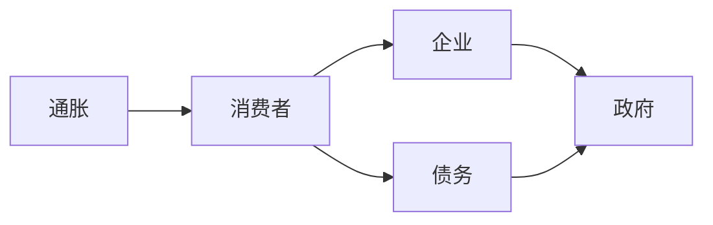
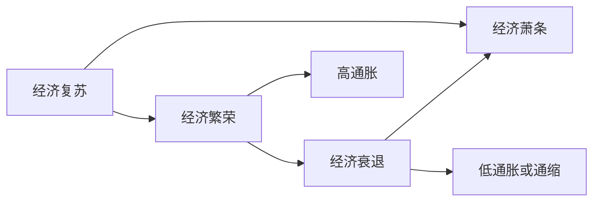

                 


# 通胀周期中的资产配置策略

## 关键词
通胀周期, 资产配置, 经济周期, 资产组合优化, 风险管理

## 摘要
本文深入探讨了通胀周期对资产配置的影响，分析了不同资产类别在通胀周期中的表现，并提出了基于宏观经济分析和数学模型的资产配置策略。文章结合实际案例和系统架构设计，详细阐述了如何在不同通胀阶段优化资产组合，降低风险，实现长期稳健的投资收益。

---

# 第1章：通胀周期的基本概念

## 1.1 通胀的定义与特征

### 1.1.1 通胀的定义
通货膨胀（Inflation）是指物价总水平在一段时间内持续上涨的现象。通常用消费者价格指数（CPI）或生产者价格指数（PPI）来衡量。

**公式：**
$$ \text{通胀率} = \frac{\text{本期物价水平} - \text{基期物价水平}}{\text{基期物价水平}} \times 100\% $$

### 1.1.2 通胀的分类与特征
通胀可以分为温和通胀、成本推动型通胀、需求拉动型通胀和恶性通胀。以下是不同类型通胀的对比表格：

| 类型             | 特征                       | 主要驱动因素         |
|------------------|----------------------------|----------------------|
| 温和通胀         | 年通胀率在2%-5%之间       | 经济增长与供需平衡   |
| 成本推动型通胀   | 由生产成本上升引发         | 工资上涨、原材料价格上涨 |
| 需求拉动型通胀   | 由总需求超过总供给导致     | 消费者支出增加       |
| 恶性通胀         | 年通胀率超过50%，货币购买力大幅下降 | 货币供应急剧增加     |

### 1.1.3 通胀对经济的影响
通胀对经济的影响是多方面的，包括：
1. **对消费者的影响**：实际购买力下降，储蓄贬值。
2. **对企业的影**响：成本上升，利润减少。
3. **对政府的影响**：财政赤字增加，债务负担加重。

**图表：通胀对经济的影响流程图**


---

## 1.2 资产配置的基本原理

### 1.2.1 资产配置的定义
资产配置是指将资金分配到不同资产类别（如股票、债券、商品等）以实现投资目标的过程。

### 1.2.2 资产配置的目标与原则
- **目标**：分散风险、最大化收益。
- **原则**：根据市场环境动态调整资产比例。

### 1.2.3 资产配置的分类与选择
资产配置的分类：
1. **战略性资产配置**：基于长期投资目标的配置。
2. **战术性资产配置**：根据市场短期变化进行的调整。
3. **免疫资产配置**：通过债券组合对冲利率风险。

---

# 第2章：通胀周期的驱动因素

## 2.1 经济周期与通胀的关系

### 2.1.1 经济周期的定义与阶段
经济周期分为复苏、繁荣、衰退和萧条四个阶段。

**图表：经济周期与通胀关系**


### 2.1.2 经济周期对通胀的影响
- 在经济繁荣阶段，需求增加，通胀上升。
- 在经济衰退阶段，需求下降，通胀下降。

---

## 2.2 货币政策与通胀

### 2.2.1 货币政策的定义与工具
货币政策工具包括公开市场操作、调整法定存款准备金率和调整利率。

### 2.2.2 货币政策对通胀的影响
- **宽松货币政策**：增加货币供应，推高通胀。
- **紧缩货币政策**：减少货币供应，抑制通胀。

### 2.2.3 主要央行的通胀目标与政策框架
- **美联储**：通胀目标为2%的CPI涨幅。
- **欧洲央行**：通胀目标为2%的HICP涨幅。

---

## 2.3 供给与需求对通胀的影响

### 2.3.1 供给冲击的定义与类型
供给冲击是指生产成本或供给能力的突然变化，如能源危机、疫情导致的供应链中断。

### 2.3.2 需求拉动的通胀机制
当总需求超过总供给时，价格水平上升。

### 2.3.3 供给与需求的动态平衡
供给和需求的相互作用决定了通胀水平。

---

# 第3章：不同资产类别在通胀周期中的表现

## 3.1 股票资产

### 3.1.1 股票在通胀周期中的表现
- **高通胀阶段**：股票表现较好，尤其是周期性行业。
- **低通胀阶段**：防御性行业（如公用事业）表现较好。

### 3.1.2 不同行业股票在通胀周期中的差异
| 行业             | 高通胀阶段表现 | 低通胀阶段表现 |
|------------------|----------------|----------------|
| 能源             | 好              | 较差           |
| 公用事业         | 较差           | 好              |
| 消费品           | 好              | 好              |

### 3.1.3 股票投资的通胀对冲策略
- **行业轮换策略**：根据通胀阶段调整行业配置。
- **价值投资策略**：选择低市盈率的股票。

---

## 3.2 债券资产

### 3.2.1 债券在通胀周期中的表现
- **通胀上升阶段**：债券价格下跌，收益率上升。
- **通胀下降阶段**：债券价格上涨，收益率下降。

### 3.2.2 利率风险与通胀风险的关系
- 利率风险：债券价格对利率变化的敏感性。
- 通胀风险：通胀上升导致债券的实际回报下降。

### 3.2.3 债券投资的通胀对冲策略
- **短期债券**：减少利率风险。
- **通胀保值债券**：本金随通胀调整。

---

## 3.3 商品资产

### 3.3.1 商品在通胀周期中的表现
- **高通胀阶段**：大宗商品（如原油、黄金）价格上涨。
- **低通胀阶段**：大宗商品价格稳定。

### 3.3.2 不同商品类别在通胀周期中的差异
| 商品             | 高通胀阶段表现 | 低通胀阶段表现 |
|------------------|----------------|----------------|
| 黄金             | 好              | 好              |
| 原油             | 好              | 较差           |
| 农产品           | 好              | 较差           |

### 3.3.3 商品投资的通胀对冲策略
- **期货投资**：通过期货市场对冲价格波动。
- **商品基金**：通过投资商品ETF分散风险。

---

## 3.4 其他资产类别

### 3.4.1 房地产在通胀周期中的表现
- **高通胀阶段**：房地产价格上涨。
- **低通胀阶段**：房地产市场稳定。

### 3.4.2 金融衍生品在通胀周期中的应用
- **期权**：对冲价格波动风险。
- **期货**：锁定价格，规避风险。

### 3.4.3 其他另类资产的通胀对冲作用
- **艺术品**：在通胀上升阶段具有保值功能。
- **私募股权**：通过长期增值对冲通胀。

---

# 第4章：通胀周期下的资产配置策略

## 4.1 资产配置的基本框架

### 4.1.1 资产配置的理论基础
资产组合理论（Modern Portfolio Theory，MPT）由Harry Markowitz提出，强调通过分散投资降低风险。

### 4.1.2 资产配置的步骤与方法
1. **确定投资目标**：收益目标和风险承受能力。
2. **分析经济环境**：判断当前所处的经济周期阶段。
3. **选择资产类别**：根据通胀周期调整资产配置比例。
4. **动态调整**：定期评估并调整配置比例。

### 4.1.3 资产配置的风险管理
- **风险分散**：通过投资不同资产类别降低风险。
- **风险对冲**：使用衍生品对冲特定风险。

---

## 4.2 不同通胀周期下的资产配置策略

### 4.2.1 上升通胀周期的资产配置策略
- **增加股票和大宗商品配置**。
- **减少债券配置**。

### 4.2.2 稳定通胀周期的资产配置策略
- **均衡配置**：股票、债券、商品按比例配置。
- **注重分红收益**：选择高分红股票。

### 4.2.3 下降通胀周期的资产配置策略
- **增加债券和防御性资产配置**。
- **减少股票和大宗商品配置**。

---

## 4.3 资产配置的动态调整

### 4.3.1 调整的时机
- 经济数据发布后。
- 经济周期变化时。

### 4.3.2 调整的依据
- 通胀率的变化。
- 经济政策的调整。

### 4.3.3 调整的具体操作
- 逐步调整，避免频繁交易。
- 结合市场趋势，制定长期策略。

---

# 第5章：通胀周期中的资产配置数学模型

## 5.1 通胀预测模型

### 5.1.1 消费者价格指数（CPI）计算
$$ \text{CPI} = \sum (\text{权重}_i \times \text{价格}_i) $$

### 5.1.2 通胀预测公式
$$ \text{预测通胀率} = \alpha \times \text{当前通胀率} + \beta \times \text{经济增长率} + \gamma \times \text{货币政策指标} $$

### 5.1.3 通胀预测流程图


---

## 5.2 资产组合优化模型

### 5.2.1 马科维茨的现代资产组合理论
目标函数：
$$ \text{最小化} \sigma^2 \text{（方差）} $$
约束条件：
$$ \sum w_i = 1 $$
$$ \sum w_i r_i = \text{目标收益} $$

### 5.2.2 资产组合优化流程图


### 5.2.3 资产组合优化的Python实现
```python
import numpy as np
from scipy.optimize import minimize

# 定义目标函数
def portfolio_var(weights, covariance_matrix):
    return (weights.T @ covariance_matrix @ weights)[0,0]

# 定义约束条件
def weight_constraints(weights):
    return np.sum(weights) - 1

# 优化问题
covariance_matrix = ...  # 协方差矩阵
initial_weights = [0.2, 0.3, 0.5]
bounds = [(0, 1) for _ in range(len(initial_weights))]
result = minimize(portfolio_var, initial_weights, args=covariance_matrix, 
                 method='SLSQP', constraints={'type': 'eq', 'fun': weight_constraints})
```

---

## 5.3 通胀对冲模型

### 5.3.1 通胀对冲策略
- **持有实物资产**：如房地产、大宗商品。
- **投资通胀保值债券**：如TIPS（美国通胀保值债券）。

### 5.3.2 通胀对冲模型的数学表达
$$ \text{对冲收益} = \text{资产收益} - \text{通胀影响} $$

---

# 第6章：通胀周期中的资产配置案例分析

## 6.1 滞胀阶段的资产配置策略

### 6.1.1 滞胀阶段的特征
- 高失业率。
- 高通胀率。

### 6.1.2 资产配置策略
- **增加现金配置**：规避通胀风险。
- **投资短期债券**：锁定固定收益。

### 6.1.3 案例分析
假设当前处于滞胀阶段，通胀率为5%，经济增长率为1%。投资者应：
- 将资产配置调整为40%现金、30%短期债券、20%股票、10%大宗商品。

---

## 6.2 经济过热阶段的资产配置策略

### 6.2.1 经济过热阶段的特征
- 高经济增长率。
- 高通胀率。

### 6.2.2 资产配置策略
- **增加股票和大宗商品配置**。
- **减少债券配置**。

### 6.2.3 案例分析
假设当前处于经济过热阶段，通胀率为4%，经济增长率为5%。投资者应：
- 将资产配置调整为30%股票、30%大宗商品、20%债券、20%现金。

---

# 第7章：通胀周期中的风险管理

## 7.1 风险管理策略

### 7.1.1 风险评估
- **VaR（在险价值）**：衡量资产组合在特定置信水平下的最大损失。
- **CVaR（条件在险价值）**：衡量在VaR超过一定水平时的平均损失。

### 7.1.2 风险控制
- **止损策略**：设定止损点，避免重大损失。
- **动态再平衡**：定期调整资产配置比例。

---

## 7.2 风险管理的系统架构设计

### 7.2.1 风险管理系统的功能模块
1. **数据采集模块**：获取市场数据和经济指标。
2. **风险评估模块**：计算资产组合的风险指标。
3. **风险预警模块**：设置预警阈值，及时提醒风险。
4. **风险控制模块**：执行风险管理策略。

### 7.2.2 风险管理系统的架构图


---

## 7.3 风险管理的注意事项

### 7.3.1 风险管理的关键点
- 定期评估市场环境。
- 动态调整风险管理策略。
- 保持充足的流动性。

### 7.3.2 风险管理的最佳实践
- **分散投资**：避免过度集中于某一资产类别。
- **定期审查**：定期评估资产配置是否符合投资目标。
- **保持灵活性**：根据市场变化及时调整策略。

---

# 第8章：总结与展望

## 8.1 总结
本文系统分析了通胀周期对资产配置的影响，提出了基于宏观经济分析和数学模型的资产配置策略。通过实际案例分析和系统架构设计，帮助投资者在不同通胀阶段优化资产组合，降低风险，实现长期稳健的投资收益。

## 8.2 未来展望
未来的研究可以进一步探索：
- 更复杂的通胀预测模型。
- 多资产类别组合优化算法。
- 区域性通胀差异对资产配置的影响。

---

# 作者：AI天才研究院/AI Genius Institute & 禅与计算机程序设计艺术 /Zen And The Art of Computer Programming

