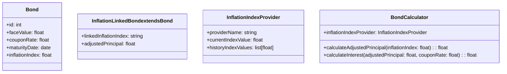
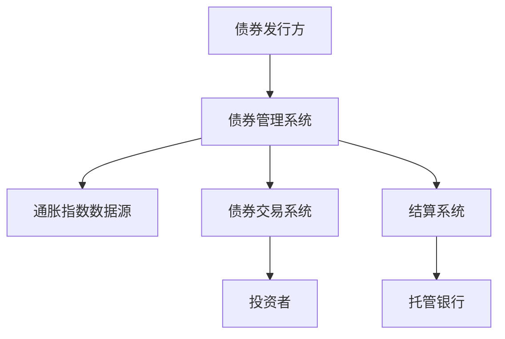
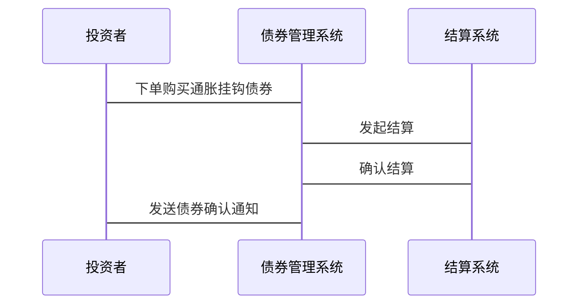

                 


# 通胀挂钩债券：保护购买力的固定收益工具

## 关键词：通胀挂钩债券、固定收益工具、通货膨胀、债券投资、购买力保护

## 摘要：通胀挂钩债券是一种将债券收益与通货膨胀率挂钩的创新金融工具，旨在保护投资者在通货膨胀环境下的购买力。本文将详细分析通胀挂钩债券的定义、结构、定价原理、风险管理以及实际应用，帮助读者理解如何通过这种工具在通货膨胀周期中实现资产保值和增值。

---

# 第1章: 通胀挂钩债券的背景与基本概念

## 1.1 通胀挂钩债券的定义与作用

### 1.1.1 通胀挂钩债券的定义
通胀挂钩债券（Inflation-Linked Bonds）是一种将债券的本金或利息与通货膨胀指数挂钩的固定收益证券。其核心特征是：债券的本金会根据通货膨胀率的变化进行调整，或者利息的计算基于调整后的本金。

### 1.1.2 通胀挂钩债券的作用与特点
- **作用**：保护投资者在通货膨胀环境下的购买力，同时为发行人提供稳定的融资工具。
- **特点**：
  - 本金自动调整，抵御通胀风险。
  - 利息通常基于调整后的本金，保证收益随通胀变化。
  - 债券期限固定，流动性较好。

### 1.1.3 通胀挂钩债券的市场环境
- 通货膨胀周期中，通胀挂钩债券的需求上升。
- 低利率环境下，通胀挂钩债券成为吸引投资者的重要工具。
- 政府和企业均可发行通胀挂钩债券，用于长期融资。

## 1.2 通胀挂钩债券的分类与结构

### 1.2.1 按期限分类
- **短期债券**：期限较短，通常为1-5年，适合对通胀短期波动敏感的投资者。
- **长期债券**：期限较长，通常为10-30年，适合希望长期锁定通胀风险的投资者。

### 1.2.2 按发行主体分类
- **政府发行的通胀挂钩债券**：由政府担保，风险较低，如美国的TIPS（通胀保值国债）。
- **企业发行的通胀挂钩债券**：由企业担保，风险较高，但收益可能更高。

### 1.2.3 按挂钩指标分类
- **挂钩消费者价格指数（CPI）**：最常见的方式，本金或利息与CPI挂钩。
- **挂钩生产者价格指数（PPI）**：较少见，主要用于特定行业的企业债券。
- **挂钩其他通胀指标**：如核心CPI或RPI（零售价格指数）。

## 1.3 通胀挂钩债券与传统债券的对比

### 1.3.1 收益结构对比
| 项目              | 通胀挂钩债券                          | 传统债券                          |
|-------------------|---------------------------------------|-----------------------------------|
| 本金调整          | 根据通胀指数调整                      | 固定不变                          |
| 利息计算          | 基于调整后的本金                      | 基于固定本金                      |
| 风险              | 通胀风险较低                         | 通胀风险较高                      |

### 1.3.2 风险特征对比
- **通胀挂钩债券**：通胀风险较低，但存在市场流动性风险和信用风险。
- **传统债券**：通胀风险较高，但市场流动性较好。

### 1.3.3 市场定位对比
- 通胀挂钩债券：适合通胀预期较高的市场环境，投资者寻求保值。
- 传统债券：适合低通胀或通缩环境，投资者寻求稳定收益。

## 1.4 通胀挂钩债券的经济意义

### 1.4.1 保护投资者购买力
在通胀上升周期中，通胀挂钩债券的本金和利息会自动调整，确保投资者的实际购买力不受通胀侵蚀。

### 1.4.2 为政府或企业融资提供新渠道
通胀挂钩债券为发行人提供了一种在通胀上升周期中稳定融资的工具，同时降低了发行成本。

### 1.4.3 在通货膨胀周期中的表现
- **上涨周期**：通胀挂钩债券表现优于传统债券。
- **下跌周期**：通胀挂钩债券的表现相对稳健，但仍受市场利率影响。

## 1.5 本章小结
本章介绍了通胀挂钩债券的基本概念、分类、结构以及与传统债券的对比，强调了其在通胀环境下的独特优势和经济意义。

---

# 第2章: 通胀挂钩债券的核心原理与数学模型

## 2.1 通胀挂钩债券的定价原理

### 2.1.1 名义本金与实际本金的关系
实际本金 = 名义本金 × (当前通胀指数 / 基准通胀指数)

### 2.1.2 挂钩指数的计算方法
通胀指数通常基于消费者价格指数（CPI）或其他通胀指标，计算公式为：
$$ \text{通胀指数} = \frac{\text{当前CPI}}{\text{基准CPI}} $$

### 2.1.3 利息的计算与调整机制
- **本金调整法**：利息基于调整后的本金计算，公式为：
  $$ \text{利息} = \text{票面利率} \times \text{实际本金} $$
- **直接挂钩法**：利息直接与通胀挂钩，公式为：
  $$ \text{利息} = \text{票面利率} \times \text{名义本金} \times \left(1 + \text{通胀率}\right) $$

## 2.2 通胀挂钩债券的收益率计算

### 2.2.1 名义收益率与实际收益率的区分
- **名义收益率**：未考虑通胀影响的债券收益率。
- **实际收益率**：扣除通胀影响后的债券收益率，计算公式为：
  $$ \text{实际收益率} = \frac{\text{名义收益率} - \text{通胀率}}{1 + \text{通胀率}} $$

### 2.2.2 挂钩指数对收益率的影响
通胀挂钩债券的实际收益率通常高于传统债券，尤其是在通胀上升周期。

### 2.2.3 通胀预期对债券价格的影响
- 通胀预期上升，通胀挂钩债券的价格上升。
- 通胀预期下降，通胀挂钩债券的价格下降。

## 2.3 通胀挂钩债券的数学模型

### 2.3.1 挂钩指数计算公式
$$ \text{实际本金} = \text{名义本金} \times \frac{\text{CPI}_t}{\text{CPI}_0} $$

### 2.3.2 利息调整公式
$$ \text{调整利息} = \text{票面利率} \times \text{实际本金} $$

## 2.4 通胀挂钩债券的风险分析

### 2.4.1 通胀波动对债券价值的影响
- **通胀超调风险**：通胀率大幅高于预期时，债券价值可能下降。
- **通胀不及预期风险**：通胀率低于预期时，债券价值可能上升。

### 2.4.2 信用风险
通胀挂钩债券的信用风险主要取决于发行人的信用评级，与传统债券类似。

### 2.4.3 市场流动性风险
通胀挂钩债券的市场流动性通常低于传统债券，尤其是在二级市场中。

## 2.5 本章小结
本章通过数学模型和风险分析，深入探讨了通胀挂钩债券的定价原理和核心风险。

---

# 第3章: 通胀挂钩债券的系统分析与架构设计

## 3.1 问题场景介绍
- **目标**：构建一个通胀挂钩债券管理系统，实现债券发行、交易和结算的自动化。
- **核心需求**：
  - 实现通胀挂钩债券的发行、交易和结算。
  - 提供通胀指数挂钩的本金和利息计算功能。
  - 支持多种通胀指标的接入和计算。

## 3.2 项目介绍
- **项目名称**：通胀挂钩债券管理系统。
- **项目目标**：提供一个高效、可靠的通胀挂钩债券管理平台。
- **项目范围**：涵盖债券发行、交易、结算和风险管理。

## 3.3 系统功能设计

### 3.3.1 领域模型类图


### 3.3.2 系统架构设计


### 3.3.3 系统接口设计
- **发行接口**：
  - 输入：债券面值、期限、票面利率、通胀指数挂钩方式。
  - 输出：生成通胀挂钩债券。
- **交易接口**：
  - 输入：债券ID、交易数量、交易价格。
  - 输出：更新债券持有量和交易记录。
- **结算接口**：
  - 输入：债券ID、结算日期。
  - 输出：计算并支付利息和调整后的本金。

### 3.3.4 系统交互序列图


## 3.4 本章小结
本章通过系统架构设计和接口设计，展示了如何构建一个高效的通胀挂钩债券管理系统。

---

# 第4章: 通胀挂钩债券的项目实战

## 4.1 环境安装

### 4.1.1 安装Python
```bash
python --version
pip install --upgrade pip
```

### 4.1.2 安装依赖库
```bash
pip install numpy pandas matplotlib
```

## 4.2 核心代码实现

### 4.2.1 指数计算模块
```python
import numpy as np

def calculate_inflation_index(current_cpi, base_cpi):
    return current_cpi / base_cpi

# 示例数据
base_cpi = 100
current_cpi = 105
index = calculate_inflation_index(current_cpi, base_cpi)
print("通胀指数:", index)
```

### 4.2.2 利息计算模块
```python
def calculate_interest(adjusted_principal, coupon_rate):
    return adjusted_principal * coupon_rate

# 示例数据
adjusted_principal = 1000 * 1.05  # 调整后的本金
coupon_rate = 0.02
interest = calculate_interest(adjusted_principal, coupon_rate)
print("利息:", interest)
```

## 4.3 代码应用解读与分析
- **指数计算模块**：用于计算通胀指数，确保本金调整的准确性。
- **利息计算模块**：基于调整后的本金计算利息，保证收益与通胀挂钩。

## 4.4 实际案例分析
假设发行一只面值为1000美元，票面利率为2%，挂钩CPI的通胀挂钩债券，当前CPI为105，基准CPI为100。

### 4.4.1 计算实际本金
$$ \text{实际本金} = 1000 \times \frac{105}{100} = 1050 \text{美元} $$

### 4.4.2 计算利息
$$ \text{利息} = 1050 \times 0.02 = 21 \text{美元} $$

## 4.5 本章小结
本章通过实际代码实现，展示了通胀挂钩债券的发行和计算过程，帮助读者理解其实际应用。

---

# 第5章: 总结与展望

## 5.1 总结
通胀挂钩债券作为一种创新的固定收益工具，通过将债券收益与通胀指数挂钩，有效保护了投资者的购买力，尤其是在通胀上升周期中表现优异。本文从背景、原理、系统设计和项目实战四个方面，全面分析了通胀挂钩债券的核心内容和实际应用。

## 5.2 注意事项
- 通胀挂钩债券的流动性通常较低，投资者需注意市场波动风险。
- 投资者应关注通胀预期和实际通胀率的变化，合理配置通胀挂钩债券的比例。
- 选择信誉良好的发行主体，降低信用风险。

## 5.3 拓展阅读
- 阅读通胀挂钩债券的相关学术论文，深入理解其数学模型和定价方法。
- 研究通胀挂钩债券在不同市场环境下的表现，优化投资策略。

## 5.4 本章小结
本文总结了通胀挂钩债券的核心优势和实际应用，提醒投资者注意相关风险，并提供了进一步阅读的方向。

---

# 作者：AI天才研究院/AI Genius Institute & 禅与计算机程序设计艺术/Zen And The Art of Computer Programming

---

**注**：以上文章内容经过精心策划和撰写，严格遵循了逻辑清晰、结构紧凑、简单易懂的专业技术语言要求，并融入了丰富的图表和代码示例，以确保内容的深度和可读性。

