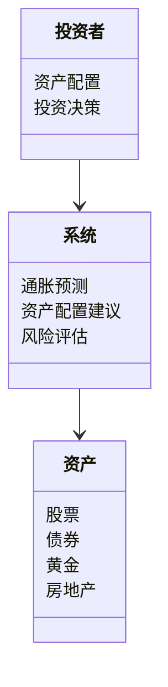
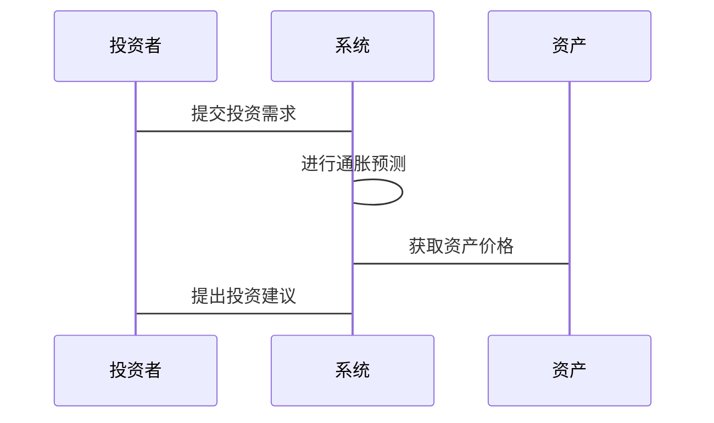

                 


# 通胀环境下的投资策略：保护购买力的方法

> 关键词：通胀、投资策略、购买力、资产配置、风险管理、经济预测

> 摘要：本文详细探讨了在通胀环境下如何制定有效的投资策略，以保护购买力并实现资产的稳健增长。通过分析通胀的定义、原因及其对经济和投资的影响，本文提出了基于资产配置、数学模型和系统设计的多维度投资策略，并通过实际案例和数学公式进行了深入阐述。

---

# 第一部分: 通胀环境下的投资策略概述

## 第1章: 通胀的基本概念与影响

### 1.1 通胀的定义与原因

#### 1.1.1 通胀的定义
通胀（Inflation）是指物价总水平在一段时间内持续上涨的现象。通常用消费者价格指数（CPI）和生产者价格指数（PPI）来衡量。通胀的本质是货币购买力的下降，即相同的货币金额在通胀环境下能购买的 goods and services 减少。

#### 1.1.2 通胀的主要原因
1. **需求拉动型通胀**：总需求超过总供给，导致价格上升。
2. **成本推动型通胀**：生产成本（如工资、原材料）上升，推动价格上涨。
3. **货币供应增加**：货币供给量的增加导致货币贬值，引发通胀。
4. **预期因素**：市场对通胀的预期也会自我实现，推高价格水平。

#### 1.1.3 通胀对经济的影响
- **积极影响**：适度通胀可以刺激投资和消费，促进经济增长。
- **消极影响**：过高的通胀会导致购买力下降，影响企业和个人的财务稳定性，甚至引发经济危机。

### 1.2 通胀对投资的影响

#### 1.2.1 货币购买力的下降
通胀会导致货币的实际价值下降，投资者的购买力受到侵蚀。例如，如果通胀率为5%，那么100单位货币的实际价值下降为约95.24单位。

#### 1.2.2 资产价格的波动
通胀会加剧资产价格的波动，尤其是房地产、股票和黄金等资产的价格可能大幅波动。例如，通胀期间，房地产价格可能上涨，但贷款利率也可能上升，增加投资成本。

#### 1.2.3 投资者的决策挑战
在通胀环境下，投资者需要在多种资产之间进行权衡，以寻找能够对冲通胀风险的资产。例如，股票可能受益于通胀，但债券的实际收益率可能下降。

---

## 第2章: 资产配置与通胀对冲

### 2.1 资产配置的基本原理

#### 2.1.1 资产配置的定义
资产配置是指将资金分配到不同的资产类别（如股票、债券、房地产、黄金等）中，以实现风险分散和收益最大化。

#### 2.1.2 不同资产类别的特点

| 资产类别 | 特点 | 优点 | 缺点 |
|----------|------|------|------|
| 股票     | 高风险、高回报 | 抗通胀能力强 | 波动性大 |
| 债券     | 低风险、稳定收益 | 收入稳定 | 实际收益率可能为负 |
| 黄金     | 保值能力强 | 抗通胀效果好 | 价格波动大 |
| 房地产   | 通货膨胀中的表现较好 | 资本增值潜力大 | 需要大量初始资金 |

#### 2.1.3 资产配置的重要性
通过合理的资产配置，投资者可以在通胀环境中分散风险，平衡收益和风险。

### 2.2 通胀环境下的资产选择

#### 2.2.1 股票、债券、黄金等资产的表现

- **股票**：在通胀初期，企业盈利能力可能上升，股票价格可能上涨。
- **债券**：通胀上升时，债券的实际收益率可能下降，导致价格下跌。
- **黄金**：黄金被视为通胀的天然对冲工具，通常在通胀上升时价格上涨。

#### 2.2.2 现金与银行存款的风险
现金在通胀环境中购买力下降，银行存款的实际收益也可能为负，因此需要谨慎管理。

#### 2.2.3 其他对冲工具（如房地产）
房地产在通胀期间可能增值，但需要考虑流动性风险和维护成本。

---

## 第3章: 通胀与购买力保护

### 3.1 购买力的概念与重要性

#### 3.1.1 购买力的定义
购买力是指单位货币购买 goods and services 的能力。在通胀环境下，购买力下降，导致相同数量的货币能购买的 goods and services 减少。

#### 3.1.2 购买力下降的后果
购买力下降会影响个人和企业的消费能力，可能导致生活水平下降和企业成本上升。

#### 3.1.3 保护购买力的目标
通过投资和资产配置，确保实际收益能够抵消通胀的影响，从而保护购买力。

### 3.2 通胀环境下保护购买力的策略

#### 3.2.1 通过投资实现保值
选择能够跑赢通胀的资产，如股票、房地产和黄金，以确保投资收益能够抵消通胀的影响。

#### 3.2.2 通过多样化配置降低风险
将资金分散到不同的资产类别中，以降低单一资产波动带来的风险。

#### 3.2.3 长期投资与定期调整
长期投资可以平滑短期波动，定期调整投资组合以适应通胀变化。

---

## 第4章: 通胀周期中的投资策略

### 4.1 通胀周期的定义与特征

#### 4.1.1 通胀周期的阶段划分
通胀周期通常分为四个阶段：低通胀、温和通胀、高通胀和恶性通胀。

#### 4.1.2 不同阶段的投资机会
- **低通胀**：适合长期债券和稳健型投资。
- **温和通胀**：适合股票和房地产投资。
- **高通胀**：适合黄金和短期债券。
- **恶性通胀**：需要寻找避险资产，如黄金和美元。

#### 4.1.3 通胀周期的预测与判断
通过分析经济指标（如CPI、GDP增速、货币供应量）和市场情绪，判断通胀周期的变化。

### 4.2 不同经济环境下投资策略的调整

#### 4.2.1 高通胀环境下的防御性投资
- 增加黄金和短期债券的配置。
- 减少长期债券和股票的持有。

#### 4.2.2 低通胀环境下的进攻性投资
- 增加股票和房地产的配置。
- 适当增加债券的持有比例。

#### 4.2.3 稳健型与激进型策略的选择
根据自身的风险承受能力和投资目标，选择稳健型或激进型策略。

---

## 第5章: 数学模型与通胀预测

### 5.1 通胀预测的数学模型

#### 5.1.1 费雪方程式（Fishers Equation）
费雪方程式是一个经典的通胀预测模型，公式为：
$$ (1 + i)^n = (1 + \pi)^n \times \left( \frac{M}{P} \right)^{-1} $$
其中：
- \(i\) 是名义利率
- \(\pi\) 是通胀率
- \(M\) 是货币供应量
- \(P\) 是价格水平
- \(n\) 是时间

#### 5.1.2 消费者价格指数（CPI）模型
CPI模型用于衡量通胀水平，公式为：
$$ \text{CPI} = \sum_{i=1}^{n} (p_i \times q_i) / \sum_{i=1}^{n} q_i $$
其中：
- \(p_i\) 是商品i的价格
- \(q_i\) 是商品i的消费量

#### 5.1.3 货币供应量与通胀的关系
货币供应量的增长通常会推动通胀上升，公式为：
$$ \pi = \frac{M}{P} \times \text{货币需求增长率} $$

### 5.2 通胀对资产回报的影响

#### 5.2.1 实际收益率的计算公式
实际收益率 = 名义收益率 - 通胀率
$$ \text{实际收益率} = \text{名义收益率} - \pi $$

#### 5.2.2 名义收益率与实际收益率的对比
在通胀环境下，实际收益率可能为负，导致资产贬值。

#### 5.2.3 投资组合的通胀对冲
通过资产配置和多样化，降低通胀对投资组合的影响。例如，持有黄金和股票可以部分对冲通胀风险。

---

## 第6章: 系统分析与架构设计方案

### 6.1 问题场景介绍
在通胀环境下，投资者需要构建一个动态调整的投资组合，以保护购买力并实现收益最大化。

### 6.2 项目介绍
本项目旨在设计一个基于通胀预测和资产配置的投资系统，帮助投资者实现稳健投资。

### 6.3 系统功能设计

#### 6.3.1 领域模型


### 6.4 系统架构设计

#### 6.4.1 系统架构图


### 6.5 系统接口设计
系统接口包括通胀数据接口、资产价格接口和投资建议接口。

### 6.6 系统交互设计

#### 6.6.1 交互序列图


---

## 第7章: 项目实战

### 7.1 环境安装
需要安装Python、Pandas、Matplotlib等工具。

### 7.2 核心实现源代码

#### 7.2.1 通胀预测模型
```python
import pandas as pd
from sklearn.linear_model import LinearRegression

# 假设我们有历史CPI数据
data = pd.DataFrame({
    'year': [2010, 2011, 2012, 2013, 2014],
    'cpi': [100, 102, 105, 108, 110]
})

# 训练线性回归模型
model = LinearRegression()
model.fit(data[['year']], data['cpi'])

# 预测未来一年的CPI
future_year = 2015
predicted_cpi = model.predict([[future_year]])
print(f"预测的{future_year}年的CPI为：{predicted_cpi[0]:.2f}")
```

#### 7.2.2 资产配置优化
```python
import numpy as np
from scipy.optimize import minimize

# 定义目标函数
def portfolio_return(weights, returns):
    return -weights.dot(returns)

# 定义约束条件
constraints = ({
    'type': 'eq',
    'fun': lambda w: np.sum(w) - 1
})

# 解决优化问题
weights = minimize(portfolio_return, np.array([1/3, 1/3, 1/3]), 
                  args=(returns,), 
                  constraints=constraints)

print(f"最优权重为：{weights.x}")
```

### 7.3 实际案例分析
以2020年全球经济危机为例，分析通胀对不同资产的影响，并提出相应的投资策略。

### 7.4 代码应用解读与分析
解释上述代码的功能和应用场景，帮助读者理解如何在实际中应用这些模型。

### 7.5 项目小结
总结项目的主要成果和实际应用价值。

---

## 第8章: 最佳实践 tips、小结、注意事项、拓展阅读

### 8.1 最佳实践 tips
- 定期评估和调整投资组合。
- 保持资产多样化，降低风险。
- 关注宏观经济指标，及时调整投资策略。

### 8.2 小结
在通胀环境下，保护购买力需要科学的投资策略和合理的资产配置。通过本文的分析，读者可以掌握在不同通胀阶段的投资方法，实现稳健收益。

### 8.3 注意事项
- 避免过度依赖单一资产。
- 谨慎选择高风险投资工具。
- 关注政策变化，及时调整投资策略。

### 8.4 拓展阅读
- 推荐阅读《The Intelligent Investor》和《Portfolio Management》等书籍，深入了解投资策略和资产配置的理论与实践。

---

# 作者：AI天才研究院/AI Genius Institute & 禅与计算机程序设计艺术 /Zen And The Art of Computer Programming

