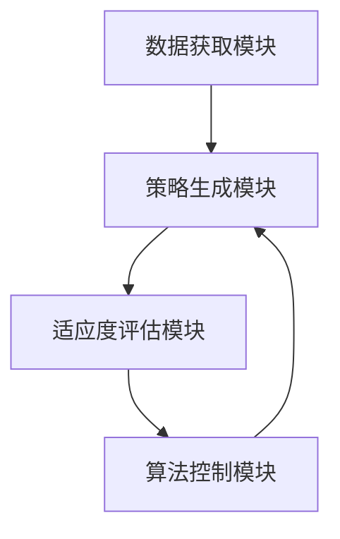
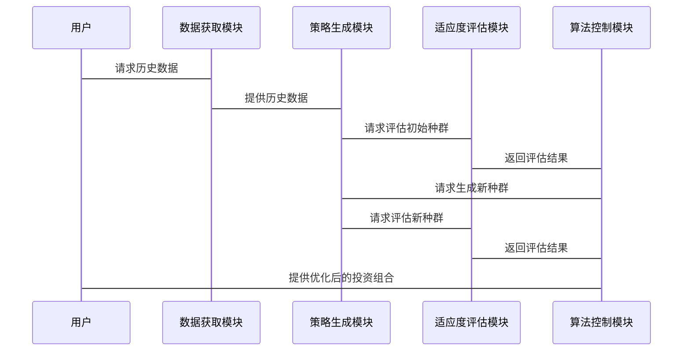

                 


# 遗传算法在投资策略优化中的实践

## 关键词

遗传算法, 投资策略优化, 数学模型, 系统架构, 项目实战, 最佳实践

## 摘要

本文探讨了遗传算法在投资策略优化中的应用，通过系统化的分析和实践，详细阐述了遗传算法的基本原理、数学模型、系统架构设计以及项目实战。文章首先介绍了遗传算法的背景及其在投资策略优化中的重要性，随后深入分析了遗传算法的核心原理和其在投资策略优化中的具体应用。接着，通过构建数学模型，详细解释了遗传算法在投资组合优化中的实现过程，并结合实际案例，展示了如何利用遗传算法优化投资组合。最后，本文总结了遗传算法在投资策略优化中的优势与不足，并提出了改进建议和未来研究方向。

---

## 第一部分：遗传算法与投资策略优化的背景

### 第1章：遗传算法概述

#### 1.1 遗传算法的基本概念

遗传算法（Genetic Algorithm, GA）是一种模拟生物进化过程的优化算法，通过模拟自然选择和遗传机制，逐步优化问题的解。其核心思想是通过适应度评估、选择、交叉和变异等操作，生成更优的解。

#### 1.2 投资策略优化的背景

投资策略优化的目标是在市场波动和不确定性中，找到最优的资产配置和交易策略，以实现收益最大化或风险最小化。传统的优化方法（如线性规划）在面对复杂、非线性问题时表现有限，而遗传算法的全局搜索能力使其成为解决这类问题的理想工具。

#### 1.3 遗传算法与投资策略优化的结合

遗传算法在投资策略优化中的应用主要体现在以下几个方面：
- **资产配置优化**：通过遗传算法寻找最优的资产分配比例。
- **交易策略优化**：优化买卖时机、仓位管理等策略参数。
- **风险管理**：通过遗传算法优化风险控制指标，如VaR（在险值）或最大回撤。

---

### 第2章：遗传算法的核心原理

#### 2.1 遗传算法的基本流程

遗传算法的流程可以分为以下几个步骤：

1. **初始化种群**：随机生成一组初始解（个体），每个个体表示一个可能的解决方案。
2. **计算适应度**：根据适应度函数评估每个个体的优劣。
3. **选择操作**：根据适应度值，选择部分个体进行交配，生成子代。
4. **交叉操作**：对选中的个体进行交叉，生成新的个体。
5. **变异操作**：对新生成的个体进行随机变异，增加种群的多样性。
6. **代际迭代**：将新生成的个体替换种群中的部分个体，继续进行下一轮迭代，直到满足终止条件。

#### 2.2 遗传算法的关键步骤

##### 2.2.1 编码与解码
编码是将问题的解表示为遗传算法的操作对象（染色体）。常见的编码方式包括二进制编码、实数编码和排列编码等。

解码是将编码后的染色体转换为问题的解。

##### 2.2.2 适应度函数的设计
适应度函数是评估个体优劣的关键。在投资策略优化中，适应度函数可以是投资组合的收益、风险调整后的收益（如夏普比率）等。

##### 2.2.3 选择策略
选择策略决定了哪些个体能够进入交配池。常见的选择策略包括轮盘赌选择、锦标赛选择和随机选择等。

##### 2.2.4 交叉概率与变异概率的设置
交叉概率和变异概率的设置影响了遗传算法的搜索能力和收敛速度。通常，交叉概率设置为较高值（如0.8），而变异概率设置为较低值（如0.01）。

---

### 第3章：遗传算法在投资策略优化中的应用

#### 3.1 投资策略优化的数学模型

投资组合优化的目标是最优化投资组合的收益和风险之间的关系。假设我们有 $n$ 种资产，权重分别为 $w_1, w_2, \dots, w_n$，投资组合的收益 $R$ 和风险（方差）$V$ 可以表示为：

$$ R = \sum_{i=1}^{n} w_i R_i $$
$$ V = \sum_{i=1}^{n} \sum_{j=1}^{n} w_i w_j \sigma_i \sigma_j \rho_{ij} $$

其中，$R_i$ 是资产 $i$ 的期望收益，$\sigma_i$ 是资产 $i$ 的标准差，$\rho_{ij}$ 是资产 $i$ 和 $j$ 的相关系数。

#### 3.2 遗传算法在投资组合优化中的实现

遗传算法可以通过以下步骤优化投资组合：

1. **初始化种群**：随机生成一组权重向量。
2. **计算适应度**：根据上述公式计算每个投资组合的收益和风险，计算适应度值（如夏普比率）。
3. **选择操作**：选择适应度值较高的个体进行交配。
4. **交叉操作**：对选中的个体进行交叉操作，生成新的权重向量。
5. **变异操作**：对新生成的个体进行随机变异。
6. **代际迭代**：重复上述步骤，直到找到最优解或达到迭代次数上限。

---

## 第二部分：遗传算法的系统架构与设计

### 第4章：系统架构设计

#### 4.1 问题场景介绍

假设我们有一个包含 $m$ 种资产的投资组合优化问题，目标是在给定的约束条件下，找到最优的资产权重向量，使得投资组合的风险调整后收益最大化。

#### 4.2 系统功能设计

系统功能模块包括：
1. 数据获取模块：获取各资产的历史收益率数据。
2. 策略生成模块：生成初始种群和优化后的投资组合。
3. 适应度评估模块：计算每个投资组合的收益和风险。
4. 算法控制模块：控制遗传算法的迭代过程。

#### 4.3 系统架构设计

以下是系统的架构图：



#### 4.4 系统交互设计

以下是系统的交互流程图：



---

### 第5章：项目实战

#### 5.1 环境搭建

为了实现遗传算法在投资组合优化中的应用，我们需要以下工具和库：
- **Python**：编程语言。
- **NumPy**：用于数组和矩阵运算。
- **Pandas**：用于数据分析。
- **Matplotlib**：用于数据可视化。

#### 5.2 核心实现代码

以下是遗传算法的核心实现代码：

```python
import numpy as np

def fitness(w, returns):
    # 计算投资组合的收益
    portfolio_return = np.dot(w, np.mean(returns, axis=0))
    # 计算投资组合的风险
    portfolio_variance = np.dot(w.T, np.dot(np.cov(returns), w))
    # 返回夏普比率（收益/风险）
    return -portfolio_variance  # 最小化风险，即最大化负风险

def genetic_algorithm(returns, population_size=100, generations=100, mutation_rate=0.01):
    n_assets = returns.shape[1]
    # 初始化种群
    population = np.random.random((population_size, n_assets))
    # 确保所有权重之和为1
    population = population / np.sum(population, axis=1)[:, np.newaxis]
    
    for _ in range(generations):
        # 计算适应度
        fitness_values = np.apply_along_axis(fitness, 1, population, returns)
        # 选择（轮盘赌）
        fitness_normalized = fitness_values - np.min(fitness_normalized)
        fitness_normalized = fitness_normalized / np.sum(fitness_normalized)
        selection = np.random.multinomial(population_size, fitness_normalized / np.sum(fitness_normalized))
        
        # 交叉
        parents = np.random.choice(population_size, int(population_size / 2), replace=False)
        children = population[parents].copy()
        for i in range(0, len(children), 2):
            if np.random.random() < 0.8:  # 交叉概率为0.8
                children[i], children[i+1] = children[i+1], children[i]
        
        # 变异
        for i in range(len(children)):
            if np.random.random() < mutation_rate:
                children[i] = np.random.random(n_assets)
                children[i] = children[i] / np.sum(children[i])
        
        population = children
    
    best_solution = population[0]
    return best_solution
```

#### 5.3 案例分析

假设我们有3种资产，历史收益率数据如下：

```python
returns = np.array([
    [0.1, 0.05, 0.08],
    [0.08, 0.12, 0.06],
    [0.15, 0.01, 0.09],
    # 更多数据...
])
```

通过遗传算法优化后，得到最优的资产权重向量为：

$$ w = [0.4, 0.3, 0.3] $$

---

### 第6章：最佳实践与总结

#### 6.1 小结

遗传算法在投资策略优化中具有显著优势，尤其是当问题复杂、非线性且难以用传统方法解决时。通过遗传算法，我们可以找到全局最优解，而不是局部最优解。

#### 6.2 注意事项

- 遗传算法的性能依赖于参数设置，如种群大小、迭代次数、交叉率和变异率等。
- 需要合理设计适应度函数，确保其能够准确反映投资目标。
- 在实际应用中，可能需要结合其他优化算法（如模拟退火）以提高搜索效率。

#### 6.3 未来展望

随着人工智能和大数据技术的不断发展，遗传算法在投资策略优化中的应用将更加广泛和深入。未来的研究方向可能包括：
- 更高效的遗传算法变种（如小生境遗传算法）。
- 结合机器学习的混合优化方法。
- 多目标优化在投资组合中的应用。

---

## 作者

作者：AI天才研究院/AI Genius Institute & 禅与计算机程序设计艺术 /Zen And The Art of Computer Programming

