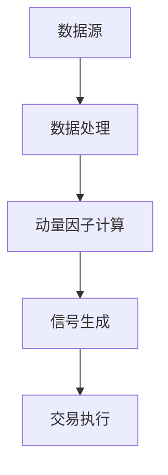

                 

# 量化动量策略：系统化捕捉价格趋势

> 关键词：量化动量策略，动量效应，量化投资，交易系统，系统化交易，价格趋势

> 摘要：本文详细介绍了量化动量策略的理论基础、数学模型、系统架构及实际应用。通过系统化的分析和案例研究，展示了如何利用动量效应捕捉价格趋势，并提供了一套完整的Python实现方案，帮助读者理解和实现量化动量策略。

---

# 第一部分：动量效应与量化投资基础

## 第1章：动量效应的定义与理论基础

### 1.1 动量效应的定义
动量效应是指资产价格的延续性趋势，即过去一段时间内价格趋势较强劲的资产在未来短期内继续保持这种趋势的概率较高。这一效应在金融市场中广泛存在，尤其是在股票、期货和外汇市场中。

### 1.2 动量效应的理论基础
动量效应的理论基础主要来源于行为金融学和统计套利。行为金融学认为，投资者的心理偏差可能导致价格的非理性波动，而动量效应正是利用这种偏差进行交易。

### 1.3 动量效应在金融市场中的表现
动量效应在金融市场中表现为价格趋势的延续性。例如，股票价格在过去一段时间内持续上涨，未来短期内仍有较高的概率继续上涨。这种趋势可以通过统计方法进行建模和预测。

---

## 第2章：量化投资的基本概念

### 2.1 量化投资的定义
量化投资是一种基于数学模型和算法的投资方式。通过分析历史数据和市场规律，利用程序化交易系统进行投资决策。

### 2.2 量化投资的核心要素
量化投资的核心要素包括数据采集、模型构建、交易执行和风险控制。这些要素共同构成了量化投资的完整流程。

### 2.3 量化投资与传统投资的区别
量化投资与传统投资的主要区别在于决策方式和交易执行。量化投资依赖于数学模型和算法，而传统投资更多依赖于主观判断和经验。

---

## 第3章：动量策略的核心思想

### 3.1 动量策略的基本原理
动量策略的核心思想是利用价格的延续性趋势进行交易。通过识别价格趋势的强弱，投资者可以在趋势延续时进行买入或卖出操作。

### 3.2 动量策略的适用场景
动量策略适用于具有明显价格趋势的市场环境。例如，在股票市场中，动量策略可以在市场趋势较为明显时获得较高的收益。

### 3.3 动量策略的优缺点分析
动量策略的优点在于能够捕捉价格趋势，缺点在于在市场反转时可能面临较大的损失。因此，在实际应用中需要结合其他策略进行优化。

---

# 第二部分：动量策略的数学模型与实现

## 第4章：动量效应的数学模型

### 4.1 动量效应的统计学解释
动量效应的统计学解释可以通过回归分析进行建模。例如，使用回归模型来预测未来的价格趋势：

$$ r_t = \alpha + \beta \cdot r_{t-1} + \epsilon_t $$

其中，$r_t$ 表示当前的价格变化率，$r_{t-1}$ 表示前一期的价格变化率，$\epsilon_t$ 是误差项。

### 4.2 动量因子的构建
动量因子可以通过计算价格的动量指标来构建。常见的动量指标包括相对强弱指数（RSI）和平均趋向指数（ADX）。

### 4.3 动量效应的数学公式
动量效应的核心公式可以表示为：

$$ P_t = P_{t-1} + \mu \cdot P_{t-1} $$

其中，$P_t$ 是当前的价格，$\mu$ 是动量因子，用于衡量价格的变化趋势。

---

## 第5章：动量策略的算法实现

### 5.1 动量策略的信号生成
动量策略的信号生成可以通过动量指标的计算来实现。例如，当RSI指标超过70时，生成卖出信号；当RSI指标低于30时，生成买入信号。

### 5.2 动量策略的交易规则
动量策略的交易规则包括以下步骤：
1. 数据采集：获取历史价格数据。
2. 计算动量指标：计算RSI、ADX等动量指标。
3. 生成信号：根据动量指标的数值生成买入或卖出信号。
4. 执行交易：根据信号执行相应的交易操作。

### 5.3 动量策略的回测框架
动量策略的回测框架包括数据回测、策略回测和结果分析三个阶段。通过回测可以验证策略的有效性和稳定性。

---

## 第6章：动量策略的优化与改进

### 6.1 动量因子的优化
动量因子的优化可以通过调整动量指标的计算参数来实现。例如，调整RSI指标的计算周期或权重。

### 6.2 动量策略的多因子扩展
动量策略的多因子扩展可以通过引入其他因子（如价值因子、动量因子）进行多因子模型的构建。

### 6.3 动量策略的动态调整
动量策略的动态调整可以通过实时监控市场变化，动态调整交易参数来实现。

---

# 第三部分：动量策略的系统化实现

## 第7章：动量策略的系统架构

### 7.1 系统化交易的定义
系统化交易是指通过预设的交易系统进行交易决策，避免人为情绪的干扰。

### 7.2 动量策略的系统架构图
动量策略的系统架构包括数据源、数据处理、动量因子计算、信号生成和交易执行五个模块：

---

## 第8章：动量策略的回测框架

### 8.1 回测的基本步骤
回测的基本步骤包括数据获取、策略回测、结果分析和策略优化。

### 8.2 回测指标的计算
常见的回测指标包括夏普比率、最大回撤和收益波动率。

### 8.3 回测结果的分析
回测结果的分析需要结合历史数据和市场环境，验证策略的有效性和稳定性。

---

## 第9章：动量策略的风险控制

### 9.1 风险控制的定义
风险控制是指通过控制交易头寸和设置止损来降低交易风险。

### 9.2 动量策略中的风险来源
动量策略的主要风险来源包括市场反转和交易成本。

### 9.3 风险控制的实现方法
风险控制的实现方法包括头寸控制、止损设置和风险分散。

---

# 第四部分：动量策略的Python实现

## 第10章：环境搭建与数据获取

### 10.1 Python环境的安装
安装Python编程环境，包括Python解释器和常用库。

### 10.2 数据获取工具的安装
安装Pandas、NumPy和Matplotlib等常用数据处理库。

### 10.3 数据源的选择与获取
选择可靠的数据源，例如Yahoo Finance或Quandl，获取所需的历史价格数据。

---

## 第11章：动量策略的核心代码实现

### 11.1 数据处理与清洗
对获取的历史数据进行清洗，处理缺失值和异常值。

### 11.2 动量因子的计算
计算动量指标，例如RSI和ADX。

### 11.3 信号生成与交易执行
根据动量指标生成交易信号，并执行相应的交易操作。

---

## 第12章：项目实战与案例分析

### 12.1 环境搭建与代码实现
安装所需环境，编写动量策略的Python代码。

### 12.2 代码实现与解读
详细解读代码实现，包括数据处理、动量因子计算和交易信号生成。

### 12.3 实际案例分析
通过实际案例分析，验证动量策略的有效性和稳定性。

---

## 第13章：最佳实践与小结

### 13.1 最佳实践
总结动量策略的最佳实践，包括参数优化、风险控制和策略组合。

### 13.2 小结
小结本文的主要内容，强调动量策略的重要性和实际应用价值。

### 13.3 注意事项
提醒读者在实际应用中注意市场变化和策略优化。

### 13.4 拓展阅读
推荐相关领域的书籍和文献，供读者进一步学习。

---

# 作者：AI天才研究院/AI Genius Institute & 禅与计算机程序设计艺术 /Zen And The Art of Computer Programming

