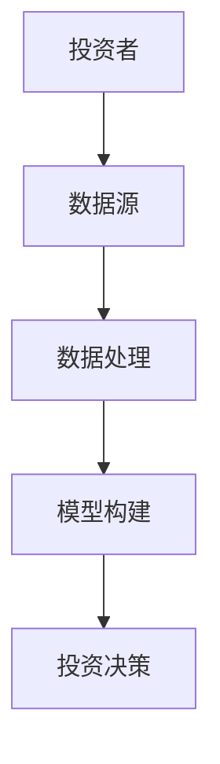
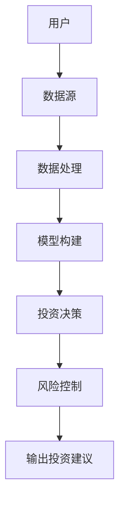
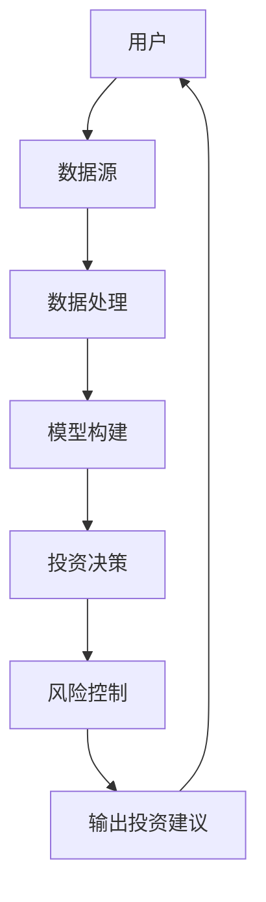

                 


# 《量化投资模型：大数据时代的投资决策工具》

---

## 关键词：
- 量化投资模型
- 大数据
- 机器学习
- 投资决策
- 统计套利
- 金融算法

---

## 摘要：
量化投资模型是利用大数据和算法进行投资决策的工具，结合统计套利、因子分析和机器学习等方法，通过分析海量数据来优化投资策略。本文从量化投资模型的背景、核心概念、算法原理、系统架构、项目实战到总结，全面阐述其在大数据时代的应用，帮助读者理解如何利用技术手段提升投资决策的科学性和效率。

---

## 目录大纲：

### 第一部分: 量化投资模型概述

#### 第1章: 量化投资模型的背景与概念
- 1.1 量化投资的定义与特点
  - 1.1.1 量化投资的定义
  - 1.1.2 量化投资的核心特点
  - 1.1.3 量化投资与传统投资的区别
- 1.2 量化投资模型的分类
  - 1.2.1 基于统计套利的量化模型
  - 1.2.2 基于因子分析的量化模型
  - 1.2.3 基于机器学习的量化模型
- 1.3 量化投资模型的应用场景
  - 1.3.1 股票市场中的应用
  - 1.3.2 债券市场中的应用
  - 1.3.3 衍生品市场中的应用

#### 第2章: 大数据在量化投资中的作用
- 2.1 大数据的概念与特点
  - 2.1.1 大数据的定义
  - 2.1.2 大数据的核心特征
  - 2.1.3 大数据与量化投资的结合
- 2.2 量化投资中的大数据来源
  - 2.2.1 市场数据
  - 2.2.2 公司基本面数据
  - 2.2.3 行为数据
  - 2.2.4 社交数据
- 2.3 大数据在量化投资中的应用
  - 2.3.1 数据清洗与预处理
  - 2.3.2 数据特征提取
  - 2.3.3 数据建模与分析

#### 第3章: 量化投资模型的核心概念与联系
- 3.1 核心概念原理
  - 3.1.1 数据驱动的量化模型
  - 3.1.2 统计套利与因子模型
  - 3.1.3 机器学习在量化投资中的应用
- 3.2 核心概念属性特征对比表
| 概念       | 属性           | 特征描述                                   |
|------------|----------------|------------------------------------------|
| 数据驱动   | 数据量         | 高量数据                                  |
|            | 数据类型       | 结构化与非结构化数据                      |
| 统计套利    | 策略类型       | 基于统计学的套利策略                      |
|            | 风险控制       | 严格的风险管理                            |
| 机器学习    | 算法复杂度     | 高复杂度算法                              |
|            | 可解释性       | 低可解释性                                |
- 3.3 ER实体关系图架构


---

### 第二部分: 量化投资模型的算法原理

#### 第4章: 量化投资模型的算法原理
- 4.1 机器学习在量化投资中的应用
  - 4.1.1 机器学习的基本概念
  - 4.1.2 机器学习在量化投资中的流程
  - 4.1.3 常见的机器学习算法（如回归分析、分类算法、聚类分析等）
- 4.2 基于因子分析的量化模型
  - 4.2.1 因子分析的定义与特点
  - 4.2.2 常见因子模型（如CAPM、APT等）
  - 4.2.3 因子模型在投资组合优化中的应用
- 4.3 统计套利算法
  - 4.3.1 统计套利的基本原理
  - 4.3.2 常见的统计套利策略（如配对交易、动量策略等）
  - 4.3.3 统计套利的风险控制
- 4.4 算法实现与优化
  - 4.4.1 算法实现的基本步骤
  - 4.4.2 算法优化方法（如参数优化、模型选择等）
  - 4.4.3 算法的可扩展性与性能优化

#### 第5章: 量化投资模型的系统架构设计
- 5.1 系统功能设计
  - 5.1.1 数据采集模块
  - 5.1.2 数据处理模块
  - 5.1.3 模型构建模块
  - 5.1.4 投资决策模块
  - 5.1.5 风险控制模块
- 5.2 系统架构图

- 5.3 系统接口设计
  - 5.3.1 数据接口
  - 5.3.2 模型接口
  - 5.3.3 决策接口
- 5.4 系统交互流程图


---

### 第三部分: 量化投资模型的项目实战

#### 第6章: 量化投资模型的实战案例
- 6.1 项目背景
  - 6.1.1 项目目标
  - 6.1.2 项目需求
  - 6.1.3 项目数据来源
- 6.2 项目实现
  - 6.2.1 数据获取与清洗
  - 6.2.2 特征工程
  - 6.2.3 模型训练
  - 6.2.4 模型部署与应用
- 6.3 项目代码实现
  - 6.3.1 数据获取与处理
  ```python
  import pandas as pd
  data = pd.read_csv('stock_data.csv')
  data_cleaned = data.dropna()
  ```
  - 6.3.2 特征工程
  ```python
  from sklearn.preprocessing import StandardScaler
  scaler = StandardScaler()
  features = scaler.fit_transform(data_cleaned[['open', 'close', 'high', 'low']])
  ```
  - 6.3.3 模型训练
  ```python
  from sklearn.linear_model import LinearRegression
  model = LinearRegression()
  model.fit(features, data_cleaned['target'])
  ```
  - 6.3.4 模型预测与评估
  ```python
  predictions = model.predict(new_features)
  print('预测收益:', predictions)
  ```

---

### 第四部分: 总结与展望

#### 第7章: 总结与展望
- 7.1 核心观点总结
  - 量化投资模型通过大数据和算法优化投资决策，提升了投资效率和准确性。
- 7.2 未来展望
  - 人工智能与量化投资的结合将进一步深化，推动投资决策的智能化和自动化。
- 7.3 最佳实践 tips
  - 数据质量是模型性能的关键，需注重数据清洗和特征工程。
  - 风险控制是量化投资的核心，需结合多种策略进行风险管理。
  - 持续学习与优化是保持模型竞争力的关键。

---

## 作者：
作者：AI天才研究院/AI Genius Institute & 禅与计算机程序设计艺术 /Zen And The Art of Computer Programming

