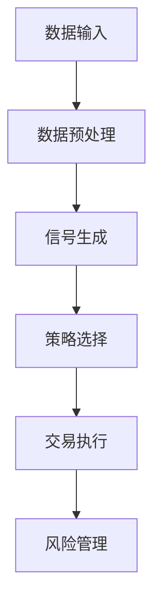
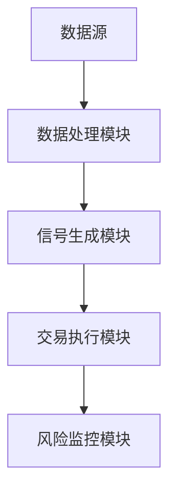

                 


# 《量化投资策略在高波动市场中的表现》

---

## 关键词：
量化投资、算法交易、统计套利、高波动市场、风险管理、数学模型、交易策略

---

## 摘要：
本文深入探讨了量化投资策略在高波动市场中的表现，分析了其核心概念、算法原理、系统架构，并通过实际案例展示了策略的实现与优化过程。文章结合理论与实践，详细阐述了量化投资在高波动环境下的优势与挑战，为投资者提供了实用的策略和建议。

---

# 第一部分: 量化投资策略概述

## 第1章: 量化投资的基本概念

### 1.1 量化投资的定义与特点
量化投资是一种基于数学模型和算法的投资方法，通过分析市场数据和统计规律来指导投资决策。其核心在于利用计算机技术快速捕捉市场机会，优化投资组合，降低人为情绪干扰。

#### 1.1.1 量化投资的定义
量化投资是指通过量化分析和算法交易，利用数学模型预测市场走势并执行交易的策略。其本质是将投资决策转化为可量化的指标和规则。

#### 1.1.2 量化投资的核心特点
- **数据驱动**：依赖大量历史数据进行分析。
- **自动化**：从信号生成到交易执行，均通过计算机自动完成。
- **高频交易**：在短时间内完成大量交易，捕捉短期价格波动。
- **风险管理**：通过数学模型严格控制风险。

#### 1.1.3 量化投资与传统投资的区别
| 特性         | 量化投资                     | 传统投资                     |
|--------------|------------------------------|------------------------------|
| 数据依赖     | 高                          | 低                          |
| 交易频率     | 高                          | 中/低                       |
| 风险控制     | 严格数学模型                 | 主观判断为主                 |
| 交易时机     | 短期波动驱动                 | 长期价值驱动                 |

### 1.2 高波动市场的定义与特征
高波动市场是指市场价格波动剧烈、不确定性较高的市场环境。其主要特征包括：
- **价格波动大**：短时间内价格剧烈波动。
- **交易机会多**：频繁的价格波动带来短期交易机会。
- **风险高**：高波动意味着高风险，容易出现大幅亏损。

---

## 第2章: 量化投资策略的背景与应用

### 2.1 量化投资的背景
量化投资的兴起得益于技术的进步和金融市场的发展：
- **技术进步**：计算机技术的发展使得高频交易和大数据分析成为可能。
- **市场效率提升**：量化投资能够快速捕捉市场中的套利机会。
- **机构投资者的需求**：机构投资者需要高效、稳定的收益来源。

### 2.2 量化投资策略的应用场景
量化投资在多种金融市场上都有广泛应用：
- **股票市场**：通过算法交易捕捉短期价格波动。
- **债券市场**：利用统计套利进行套利交易。
- **衍生品市场**：通过期权、期货等工具进行对冲和套利。

---

## 第3章: 量化投资策略的核心概念与联系

### 3.1 量化投资的核心概念
#### 3.1.1 统计套利
统计套利是一种基于统计学方法的投资策略，通过寻找资产价格的均值回归特性进行套利。例如，利用股票和指数之间的价差进行交易。

#### 3.1.2 算法交易
算法交易是通过计算机算法自动执行交易的策略，包括高频交易、算法套利等。

#### 3.1.3 风险管理
风险管理是量化投资的核心要素，通过数学模型控制仓位、止损和止盈等。

### 3.2 核心概念的对比分析
| 概念       | 统计套利               | 算法交易               |
|------------|------------------------|------------------------|
| 定价基础   | 均值回归               | 市场微观结构分析       |
| 交易时机   | 中长期套利机会         | 短期价格波动           |
| 风险控制   | 严格控制套利风险       | 通过算法优化风险       |

---

# 第二部分: 量化投资策略的算法原理

## 第4章: 算法原理与数学模型

### 4.1 量化投资策略的算法流程
量化投资的算法流程包括以下几个步骤：
1. 数据收集与预处理：收集历史价格、成交量等数据，并进行清洗和标准化。
2. 信号生成：通过统计套利模型生成买入或卖出信号。
3. 交易执行：根据信号自动执行交易。
4. 风险监控：实时监控交易风险，及时调整策略。

### 4.2 数学模型与公式
#### 4.2.1 均值回归模型
$$r_{i} = \alpha + \beta r_{i-1} + \epsilon$$
其中，$r_{i}$ 是当前收益率，$r_{i-1}$ 是前一期收益率，$\epsilon$ 是误差项。

#### 4.2.2 动量策略模型
$$P_{t} = \lambda P_{t-1} + (1-\lambda)R_{t}$$
其中，$P_{t}$ 是当前价格预测值，$P_{t-1}$ 是前一期价格，$R_{t}$ 是当前收益率，$\lambda$ 是平滑因子。

### 4.3 算法流程图



---

## 第5章: 量化投资策略的系统分析与架构设计

### 5.1 系统功能设计
量化交易系统主要包括以下几个模块：
- **数据源模块**：连接市场数据源，获取实时数据。
- **信号生成模块**：基于算法生成交易信号。
- **交易执行模块**：根据信号执行交易。
- **风险监控模块**：实时监控交易风险。

### 5.2 系统架构图



---

## 第6章: 量化投资策略的项目实战

### 6.1 统计套利策略的实现
#### 6.1.1 环境配置
```python
import pandas as pd
import numpy as np
import matplotlib.pyplot as plt
```

#### 6.1.2 数据获取
```python
# 示例数据：获取某股票的历史价格
data = pd.read_csv('stock_data.csv')
price = data['close'].values
```

#### 6.1.3 策略开发
```python
# 计算动量策略信号
n = 20
short_momentum = data['close'].rolling(n).mean()
long_momentum = data['close'].rolling(2*n).mean()
signal = np.where(short_momentum > long_momentum, 1, -1)
```

#### 6.1.4 策略回测
```python
# 计算收益
returns = data['close'].pct_change().dropna()
stratagy_returns = signal.shift(1) * returns
cumulative_returns = (1 + stratagy_returns).cumprod()
```

### 6.2 高波动市场中的实际案例
以2022年某次市场剧烈波动为例，分析量化策略在实际交易中的表现。

---

## 第7章: 最佳实践与总结

### 7.1 小结
量化投资策略在高波动市场中表现优异，但需要结合具体市场环境进行优化。

### 7.2 注意事项
- **模型优化**：定期更新模型，避免过时。
- **风险管理**：严格控制仓位和止损。
- **数据质量**：确保数据的准确性和完整性。

### 7.3 未来趋势
- **人工智能的深度应用**：利用AI技术优化量化策略。
- **多策略结合**：将统计套利与算法交易相结合，提升收益。

### 7.4 拓展阅读
- 建议阅读《量化交易入门》和《算法交易实战》等书籍。

---

## 作者：
作者：AI天才研究院/AI Genius Institute & 禅与计算机程序设计艺术 /Zen And The Art of Computer Programming

---

通过本文的详细分析，读者可以全面了解量化投资策略在高波动市场中的表现，并掌握实际应用中的关键点。

