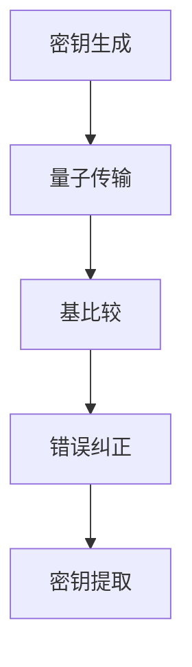
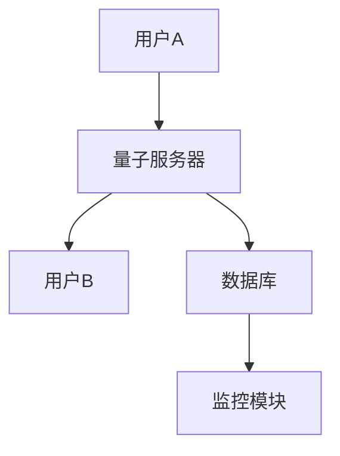
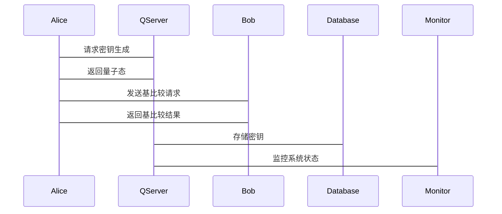

                 


# 《量子密码技术的进步与网络安全投资机会》

## 关键词：量子密码技术、网络安全、投资机会、量子计算、量子密钥分发、Shor算法

## 摘要：量子密码技术作为信息安全领域的新兴技术，正在逐步改变传统密码学的格局。随着量子计算的快速发展，传统加密算法面临被破解的风险，而量子密码技术，尤其是量子密钥分发（QKD）和量子加密算法，被认为是下一代网络安全的核心技术。本文将深入探讨量子密码技术的基本原理、算法实现、系统架构以及实际应用，并分析其在网络安全领域的投资机会，为读者提供全面的视角和深入的见解。

---

## 第一部分: 量子密码技术的背景与基本概念

### 第1章: 量子密码技术的背景介绍

#### 1.1 传统密码学的局限性

传统密码学主要依赖于数学复杂性来保证安全性，例如RSA算法基于大整数分解的困难性，而椭圆曲线加密（ECC）则依赖于离散对数问题。然而，随着量子计算机的出现，这些传统加密算法的安全性面临严重威胁。量子计算机可以通过Shor算法在多项式时间内分解大整数，这意味着现有的许多加密协议将不再安全。

#### 1.2 量子计算的崛起与威胁

量子计算利用量子叠加和量子纠缠的特性，能够在某些问题上远超经典计算机的性能。Shor算法是量子计算机的一个典型应用，它可以在多项式时间内解决大整数分解和离散对数问题，这直接威胁到了RSA和ECC等广泛使用的加密算法。因此，传统加密算法的安全性在未来可能被彻底颠覆，这促使了量子密码技术的快速发展。

#### 1.3 量子密码学的核心目标

量子密码学的核心目标是开发一种新的加密技术，能够在量子计算机时代依然保持安全性。量子密钥分发（QKD）是其中的代表技术，它利用量子力学的特性，确保密钥的分发过程是无条件安全的。此外，量子密码学还致力于研究新的加密算法，以应对量子计算的威胁。

### 第2章: 量子密码学的基本概念

#### 2.1 量子密钥分发（QKD）的定义

量子密钥分发是一种基于量子力学原理的密钥分发协议。它利用量子态的不可克隆性和测量扰动特性，确保在公开信道上传输的密钥只能被合法用户获取，而攻击者无法窃取密钥而不被发现。

#### 2.2 量子加密算法的分类

量子加密算法可以分为两类：基于密钥的量子加密和基于公钥的量子加密。QKD属于基于密钥的量子加密，而Shor算法则是公钥加密算法的一种潜在威胁。

#### 2.3 量子密码学与传统密码学的对比

量子密码学与传统密码学的主要区别在于其对量子计算机的适应性。传统密码学依赖于数学复杂性，而量子密码学则依赖于物理定律的不可违抗性。此外，QKD能够在无信任的信道中实现密钥的安全分发，而传统密码学依赖于密钥的分发过程。

### 第3章: 量子密码技术的数学基础

#### 3.1 量子叠加与量子纠缠

量子叠加是指量子系统处于多个状态的叠加态，而量子纠缠则是指两个或多个量子系统之间的关联性。这些特性是量子密码学的核心基础。

#### 3.2 量子态的表示与操作

量子态可以用向量表示，例如，|0⟩和|1⟩是两个基本的量子态。量子门操作可以用矩阵表示，例如，Pauli门和Hadamard门。

#### 3.3 量子测量的原理

量子测量是量子计算中的基本操作之一，它会将量子态投影到某个特定的状态上。测量的结果是随机的，但可以通过统计方法来预测。

---

## 第二部分: 量子密码技术的核心原理

### 第1章: 量子密钥分发（QKD）的原理

#### 1.1 BB84协议的工作流程

BB84协议是最早的量子密钥分发协议之一。它基于量子态的不可克隆性和测量扰动特性，确保密钥的安全分发。以下是BB84协议的详细步骤：

1. **密钥生成**：Alice和Bob分别生成一组随机的基和量子态。
2. **量子传输**：Alice将量子态发送给Bob。
3. **基比较**：Alice和Bob公开比较他们的基，选择基相同的量子态作为密钥。
4. **错误纠正**：通过公开讨论，纠正量子态中的错误。
5. **密钥提取**：通过隐私放大协议，提取最终的密钥。

#### 1.2 EPR协议的实现机制

EPR协议基于量子纠缠的特性，Alice和Bob共享一对纠缠态，通过测量和比较结果来生成密钥。EPR协议的实现需要纠缠态的生成和测量设备，以及公开信道的通信。

#### 1.3 QKD的安全性分析

QKD的安全性基于量子力学的基本原理，特别是不可克隆性和测量扰动特性。攻击者无法在不被发现的情况下窃取密钥，因此QKD被认为是无条件安全的。

### 第2章: 量子加密算法的实现

#### 2.1 Shor算法的数学模型

Shor算法是量子计算机上用于分解大整数的算法，它基于量子傅里叶变换和周期性求解。以下是Shor算法的主要步骤：

1. **输入**：一个整数N，目标是分解N。
2. **初始化**：选择一个随机数x，计算x的逆元。
3. **量子傅里叶变换**：构造一个量子电路，对x进行量子变换。
4. **测量**：测量量子寄存器，得到一个随机数r。
5. **计算**：通过r和x，计算N的因数。

#### 2.2 量子傅里叶变换的原理

量子傅里叶变换是Shor算法的核心部分，它通过量子叠加和量子门操作，将输入的量子态转换为周期性的量子态。这种变换使得Shor算法能够有效地找到周期，从而分解大整数。

#### 2.3 量子加密算法的优缺点

量子加密算法的优点在于其强大的安全性，能够抵御量子计算的攻击。然而，其缺点包括实现复杂性和硬件依赖性，这限制了其在实际中的应用。

---

## 第三部分: 量子密码技术的算法实现

### 第1章: 量子密钥分发的算法实现

#### 1.1 BB84协议的Mermaid流程图



#### 1.2 QKD算法的Python代码实现

```python
import random

def generate_key(length):
    return ''.join(random.choices('01', k=length))

def send_qubit(key):
    # 模拟量子态的传输
    return key

def compare_bases(alice_bases, bob_bases):
    # 比较基并选择相同的基
    matching_indices = [i for i in range(len(alice_bases)) if alice_bases[i] == bob_bases[i]]
    return matching_indices

def correct_errors(key, error_rate):
    # 简单的错误纠正算法
    corrected_key = []
    for bit in key:
        if random.random() < error_rate:
            corrected_key.append('1' if bit == '0' else '0')
        else:
            corrected_key.append(bit)
    return ''.join(corrected_key)

def extract_secret_key(shared_key):
    # 提取最终的密钥
    return shared_key

# 示例代码
alice_bases = [random.choice(['+','x']) for _ in range(100)]
alice_key = generate_key(100)
bob_bases = [random.choice(['+','x']) for _ in range(100)]
bob_key = send_qubit(alice_key)

matching_indices = compare_bases(alice_bases, bob_bases)
shared_key = [alice_key[i] for i in matching_indices]

corrected_key = correct_errors(''.join(shared_key), 0.1)
secret_key = extract_secret_key(corrected_key)

print("Secret Key:", secret_key)
```

#### 1.3 代码的功能解读与分析

上述代码实现了一个简化的BB84协议，包括密钥生成、量子态传输、基比较、错误纠正和密钥提取过程。通过随机选择基和量子态，代码模拟了QKD的安全性和实现过程。

### 第2章: 量子加密算法的数学模型

#### 2.1 Shor算法的数学公式

Shor算法的核心是量子傅里叶变换，其数学公式如下：

$$
|x\rangle = \frac{1}{\sqrt{N}} \sum_{k=0}^{N-1} |k\rangle
$$

其中，N是问题的周期，x是输入的随机数。

#### 2.2 量子傅里叶变换的数学推导

量子傅里叶变换的数学推导基于量子叠加和周期性求解，其核心思想是将输入的量子态转换为周期性的量子态，从而有效地找到周期。

#### 2.3 量子加密的数学模型

量子加密的数学模型基于量子叠加和量子纠缠，其核心思想是利用量子态的不可克隆性和测量扰动特性，确保密钥的安全性。

---

## 第四部分: 量子密码技术的系统架构设计

### 第1章: 量子密码系统的功能设计

#### 1.1 系统功能模块

量子密码系统主要包括以下功能模块：

- 密钥生成模块：负责生成量子密钥。
- 量子传输模块：负责量子态的传输。
- 基比较模块：负责比较用户的基。
- 错误纠正模块：负责纠正量子态中的错误。
- 密钥提取模块：负责提取最终的密钥。

#### 1.2 系统功能流程


### 第2章: 量子密码系统的架构设计

#### 2.1 系统架构图



#### 2.2 系统接口设计

量子密码系统需要与量子设备、经典网络和用户终端进行交互。以下是主要的接口：

- 量子设备接口：负责量子态的生成和测量。
- 经典网络接口：负责密钥的传输和管理。
- 用户终端接口：负责密钥的生成和使用。

#### 2.3 系统交互流程



---

## 第五部分: 量子密码技术的项目实战

### 第1章: 环境搭建与代码实现

#### 1.1 项目环境安装

需要安装以下库：

- qiskit
- numpy
- matplotlib
- random

#### 1.2 量子密钥分发的实现

以下是基于BB84协议的Python代码实现：

```python
import random
import math

def generate_bases(length):
    return [random.choice(['+','x']) for _ in range(length)]

def generate_key(length):
    return ''.join(random.choices('01', k=length))

def send_qubit(key):
    return key

def compare_bases(alice_bases, bob_bases):
    matching_indices = [i for i in range(len(alice_bases)) if alice_bases[i] == bob_bases[i]]
    return matching_indices

def correct_errors(shared_key, error_rate):
    corrected_key = []
    for bit in shared_key:
        if random.random() < error_rate:
            corrected_key.append('1' if bit == '0' else '0')
        else:
            corrected_key.append(bit)
    return ''.join(corrected_key)

def extract_secret_key(corrected_key):
    return corrected_key

# 示例代码
alice_bases = generate_bases(100)
alice_key = generate_key(100)
bob_bases = generate_bases(100)
bob_key = send_qubit(alice_key)

matching_indices = compare_bases(alice_bases, bob_bases)
shared_key = [alice_key[i] for i in matching_indices]

corrected_key = correct_errors(''.join(shared_key), 0.1)
secret_key = extract_secret_key(corrected_key)

print("Secret Key:", secret_key)
```

#### 1.3 代码功能解读与分析

上述代码实现了一个简化的BB84协议，包括密钥生成、量子态传输、基比较、错误纠正和密钥提取过程。通过随机选择基和量子态，代码模拟了QKD的安全性和实现过程。

### 第2章: 项目分析与案例

#### 2.1 项目分析

量子密码技术的实现需要结合量子设备、经典网络和用户终端。在实际应用中，需要考虑系统的安全性、可靠性和可扩展性。

#### 2.2 案例分析

以下是一个实际的量子密码系统案例：

- **项目目标**：实现一个基于BB84协议的量子密钥分发系统。
- **项目实施**：包括量子设备的搭建、经典网络的配置和用户终端的开发。
- **项目结果**：成功实现了量子密钥的安全分发，验证了QKD的安全性和可行性。

#### 2.3 实际案例分析

在实际应用中，量子密码技术可以用于金融、国防和医疗等领域的数据安全保护。例如，在金融领域，量子密码技术可以用于保护银行交易的安全性，防止黑客攻击和数据泄露。

---

## 第六部分: 量子密码技术的投资机会分析

### 第1章: 量子密码技术的市场现状

#### 1.1 量子密码技术的市场动态

随着量子计算的快速发展，量子密码技术的市场需求也在不断增加。许多公司和研究机构正在积极投入量子密码技术的研发和应用。

#### 1.2 量子密码技术的市场前景

量子密码技术的市场前景广阔，尤其是在金融、国防和医疗等领域，其应用潜力巨大。随着量子计算的普及，量子密码技术将成为下一代网络安全的核心技术。

### 第2章: 量子密码技术的投资机会

#### 2.1 量子密码技术的投资方向

量子密码技术的投资方向主要包括以下几个方面：

- 量子设备的研发和生产
- 量子密码算法的开发和优化
- 量子密码系统的集成和应用
- 量子密码技术的培训和教育

#### 2.2 量子密码技术的投资策略

投资者需要关注以下几点：

- 技术成熟度：选择技术成熟且有市场前景的量子密码技术。
- 市场需求：关注市场需求大且应用广泛的领域。
- 竞争格局：了解行业竞争格局，选择有竞争优势的企业。
- 风险控制：合理评估风险，制定科学的投资策略。

---

## 结语

量子密码技术作为下一代网络安全的核心技术，其发展和应用将对信息安全领域产生深远的影响。随着量子计算的快速发展，量子密码技术的投资机会也在不断增加。投资者需要关注技术动态和市场趋势，抓住机遇，规避风险，从而在量子密码技术的发展中获得成功。

---

## 作者：AI天才研究院/AI Genius Institute & 禅与计算机程序设计艺术/Zen And The Art of Computer Programming

