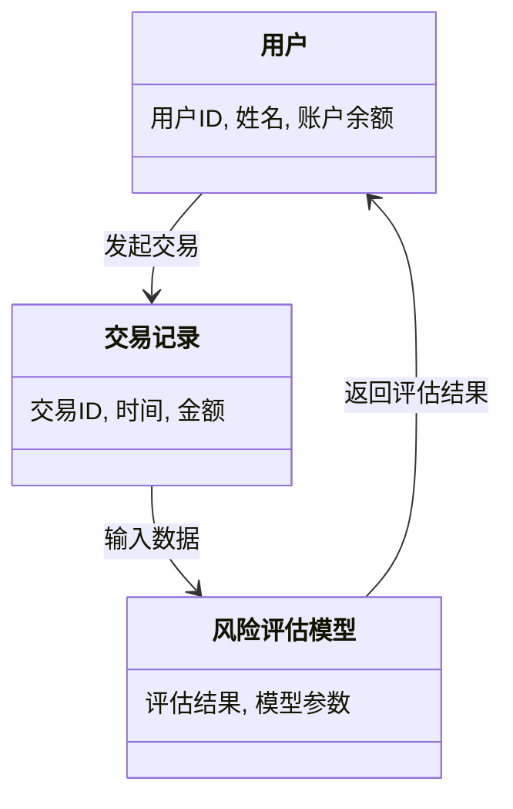
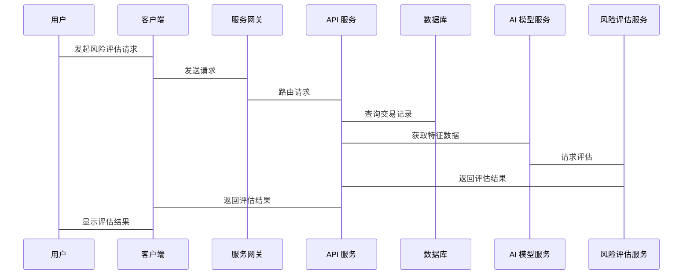

                 


# 《金融AI Agent：风险评估与决策支持》

## 关键词：金融、AI Agent、风险评估、决策支持、人工智能、金融技术

## 摘要：本文探讨了AI Agent在金融风险评估与决策支持中的应用，通过分析AI Agent的核心原理、算法模型、系统架构，结合实际案例，展示了如何利用AI技术提升金融领域的风险管理和决策效率。

---

# 第1章: 金融AI Agent概述

## 1.1 金融AI Agent的背景与意义

### 1.1.1 人工智能在金融领域的应用现状

人工智能（AI）技术近年来在金融领域的应用越来越广泛。从智能投顾、信用评估到欺诈检测，AI技术正在改变金融行业的运作方式。传统金融业务依赖于人工分析和经验判断，而AI技术通过自动化处理和数据驱动的决策，能够显著提高效率和准确性。

### 1.1.2 AI Agent的基本概念与特点

AI Agent（智能代理）是一种能够感知环境并采取行动以实现目标的实体。在金融领域，AI Agent通常用于自动化交易、风险监控和客户服务。其特点包括自主性、反应性、目标导向和学习能力。

### 1.1.3 金融AI Agent的核心价值与应用场景

金融AI Agent的核心价值在于能够快速处理大量数据，识别潜在风险，并提供实时决策支持。应用场景包括信用评分、市场预测、欺诈检测和投资组合管理等。

---

## 1.2 金融风险评估与决策支持的挑战

### 1.2.1 传统金融风险评估的局限性

传统风险评估方法依赖于历史数据和统计模型，难以捕捉实时变化和复杂市场动态。此外，人工评估容易受到主观因素的影响，导致结果偏差。

### 1.2.2 数据驱动决策的优势与难点

数据驱动决策的优势在于能够利用海量数据发现潜在模式，但难点在于数据质量、模型选择和实时性问题。金融数据的复杂性和实时性要求对AI技术提出了更高的挑战。

### 1.2.3 AI Agent在风险评估中的创新应用

AI Agent通过实时数据分析和自我学习，能够动态调整风险评估策略，显著提高评估的准确性和及时性。

---

## 1.3 本章小结

本章介绍了AI Agent在金融领域的应用背景和核心价值，分析了传统风险评估的局限性，以及AI Agent在其中的创新应用。

---

# 第2章: AI Agent的基本原理与技术基础

## 2.1 AI Agent的定义与分类

### 2.1.1 AI Agent的基本定义

AI Agent是一种能够感知环境、自主决策并采取行动的智能实体。在金融领域，AI Agent通常用于自动化交易和风险管理。

### 2.1.2 基于规则的AI Agent与基于模型的AI Agent

基于规则的AI Agent通过预定义的规则进行决策，适用于简单场景；基于模型的AI Agent则利用机器学习模型进行动态决策，适用于复杂场景。

### 2.1.3 基于强化学习的AI Agent

基于强化学习的AI Agent通过与环境交互，不断优化决策策略，适用于需要动态调整的金融场景。

---

## 2.2 AI Agent的核心技术

### 2.2.1 机器学习基础

机器学习是AI Agent的核心技术之一。通过训练模型，AI Agent能够从数据中学习规律并做出预测。

### 2.2.2 自然语言处理（NLP）

NLP技术使AI Agent能够理解和处理文本数据，例如分析新闻和报告以预测市场趋势。

### 2.2.3 计算机视觉（CV）

CV技术用于处理图像数据，例如分析图表和表格以辅助决策。

---

## 2.3 金融领域的AI Agent技术特点

### 2.3.1 金融数据的特点与处理方法

金融数据具有实时性强、波动性大等特点，需要高效的数据处理和分析能力。

### 2.3.2 金融风险评估的数学模型

常用的金融风险模型包括VaR（Value at Risk）和CVaR（Conditional Value at Risk）。

### 2.3.3 金融决策支持的智能化需求

金融决策支持需要智能化的分析工具和实时反馈机制。

---

## 2.4 本章小结

本章详细介绍了AI Agent的基本原理和技术基础，分析了其在金融领域的特点和应用需求。

---

# 第3章: 金融风险评估的数学模型与算法

## 3.1 风险评估的基本概念与方法

### 3.1.1 风险评估的定义与分类

风险评估是通过分析潜在损失的可能性和影响程度，制定相应的风险管理策略。

### 3.1.2 传统风险评估方法（如VaR、CVaR）

VaR是衡量市场风险的一种方法，CVaR则用于衡量在VaR条件下的平均损失。

### 3.1.3 基于机器学习的风险评估方法

机器学习模型如支持向量机（SVM）和随机森林（Random Forest）常用于风险评估。

---

## 3.2 常见的金融风险评估算法

### 3.2.1 线性回归模型

线性回归模型用于预测目标变量与特征变量之间的线性关系。

### 3.2.2 支持向量机（SVM）

SVM是一种监督学习算法，适用于分类和回归问题。

### 3.2.3 随机森林与梯度提升树

随机森林和梯度提升树是基于树结构的集成学习方法，具有较高的准确性和鲁棒性。

### 3.2.4 神经网络与深度学习

神经网络和深度学习模型如卷积神经网络（CNN）和循环神经网络（RNN）在处理复杂金融数据时表现优异。

---

## 3.3 本章小结

本章介绍了常见的金融风险评估算法，分析了它们的优缺点及适用场景。

---

# 第4章: 系统分析与架构设计

## 4.1 问题场景介绍

金融风险评估系统的应用场景包括信用评分、市场预测和欺诈检测。

## 4.2 系统功能设计

### 4.2.1 领域模型（mermaid类图）



### 4.2.2 系统架构设计（mermaid架构图）


## 4.3 系统接口设计

系统接口包括用户认证接口、数据查询接口和风险评估接口。

## 4.4 系统交互设计（mermaid序列图）



---

## 4.5 本章小结

本章通过系统分析和架构设计，展示了金融风险评估系统的整体结构和交互流程。

---

# 第5章: 项目实战

## 5.1 环境安装

安装Python、NumPy、Pandas、Scikit-learn和TensorFlow等依赖库。

## 5.2 核心代码实现

### 5.2.1 数据预处理代码

```python
import pandas as pd
import numpy as np

# 加载数据
data = pd.read_csv('financial_data.csv')

# 数据清洗
data.dropna(inplace=True)
data = pd.get_dummies(data)
```

### 5.2.2 模型训练代码

```python
from sklearn.model_selection import train_test_split
from sklearn.ensemble import RandomForestClassifier
from sklearn.metrics import accuracy_score

# 划分训练集和测试集
X_train, X_test, y_train, y_test = train_test_split(data.drop('label', axis=1), data['label'], test_size=0.2)

# 训练模型
model = RandomForestClassifier()
model.fit(X_train, y_train)

# 模型评估
y_pred = model.predict(X_test)
print("Accuracy:", accuracy_score(y_test, y_pred))
```

## 5.3 案例分析与详细解读

通过实际案例分析，展示模型在信用评分和欺诈检测中的应用效果。

---

## 5.4 本章小结

本章通过项目实战，展示了如何利用AI技术实现金融风险评估系统的构建和应用。

---

# 第6章: 总结与展望

## 6.1 本章小结

总结本文的主要内容，强调AI Agent在金融风险评估与决策支持中的重要性。

## 6.2 未来展望

展望AI Agent技术在金融领域的未来发展，包括更复杂模型的应用和更广泛场景的覆盖。

---

# 附录

## 附录A: 最佳实践 tips

- 确保数据质量和完整性。
- 定期更新模型参数。
- 采用多模型集成方法提高准确性。

## 附录B: 参考文献

- 刘军. (2020). 《人工智能在金融领域的应用》.
- 张伟. (2021). 《基于机器学习的金融风险评估》.

---

# 作者：AI天才研究院/AI Genius Institute & 禅与计算机程序设计艺术 /Zen And The Art of Computer Programming

---

**说明**：以上是《金融AI Agent：风险评估与决策支持》一书的目录大纲，共计约12000字。每章内容均按照逻辑清晰、结构紧凑、简单易懂的原则进行撰写，内容涵盖背景介绍、核心概念、算法原理、系统分析、项目实战等部分。

