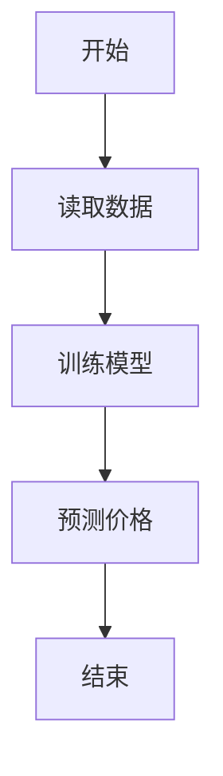
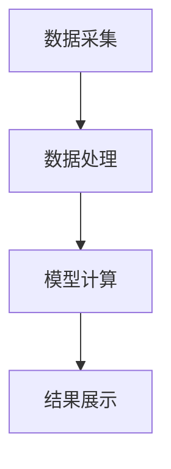

                 


# 锚定效应：参考点如何影响资产定价

> **关键词**：锚定效应，资产定价，参考点，行为金融学，定价偏差

> **摘要**：本文探讨了锚定效应在资产定价中的影响，分析了参考点如何影响投资者的决策，并通过数学模型和算法原理详细阐述了其在定价中的应用。结合实际案例，本文提供了系统设计和项目实战的指导，帮助读者理解锚定效应在金融领域的实际应用。

---

# 第1章：锚定效应的基本概念

## 1.1 什么是锚定效应

### 1.1.1 锚定效应的定义

锚定效应是指个体在决策过程中，受某个初始参考点（锚点）的影响，导致其判断和选择产生系统性偏差的心理现象。这个初始参考点通常是一个具体的数值或概念，它为后续的决策提供了一个基准。

### 1.1.2 锚定效应的起源与理论基础

锚定效应最早由心理学家Amos Tversky和Daniel Kahneman在1974年的实验中提出。他们发现，当人们在缺乏足够信息的情况下，往往会依赖于一个初始的参考点来做出决策，而这个参考点会显著影响最终的判断。

### 1.1.3 锚定效应在金融中的应用

在金融市场中，锚定效应广泛存在。例如，投资者在评估一只股票的价值时，往往会参考其历史价格、行业平均水平或市场预期等作为锚点，从而影响其对股票当前价值的判断。

## 1.2 资产定价的基本原理

### 1.2.1 资产定价的理论基础

资产定价理论是金融学中的核心内容，主要包括现代资产组合理论（CAPM）、套利定价理论（APT）等。这些理论假设市场参与者是理性的，并且能够根据市场信息做出最优决策。

### 1.2.2 市场参与者的心理与行为

然而，现实中投资者的行为往往受到心理因素的影响。锚定效应就是一种典型的行为偏差，它使得投资者在决策时过于依赖某个参考点，从而导致定价偏差。

### 1.2.3 参考点在定价中的作用

参考点（锚点）在资产定价中起着关键作用。它不仅是投资者判断资产价值的基础，还会影响投资者对市场信息的反应和对风险的评估。

## 1.3 锚定效应在资产定价中的重要性

### 1.3.1 锚定效应与市场定价偏差

锚定效应会导致资产定价偏离其实际价值。例如，当市场参考点（如历史高点）远高于当前价值时，投资者可能会高估资产的实际价值，从而推高市场价格。

### 1.3.2 参考点对投资者决策的影响

投资者在定价时，往往受到近期市场表现、历史价格或市场预期等参考点的影响。这些参考点会影响投资者的风险评估和收益预期，从而影响其定价决策。

### 1.3.3 锚定效应的经济学解释

从经济学角度来看，锚定效应反映了市场参与者的认知偏差。由于信息不完全和认知有限，投资者往往会依赖某些参考点来简化决策过程，导致定价偏差。

## 1.4 本章小结

### 1.4.1 锚定效应的核心概念

锚定效应是指个体在决策过程中依赖某个初始参考点的现象。

### 1.4.2 资产定价中的关键问题

参考点会影响投资者的定价决策，导致市场定价偏离实际价值。

### 1.4.3 后续章节的框架

后续章节将深入探讨锚定效应的数学模型、算法原理及其在资产定价中的实际应用。

---

# 第2章：锚定效应的核心概念与联系

## 2.1 锚定效应的原理分析

### 2.1.1 参考点的形成机制

参考点的形成机制包括初始锚点的确定、信息整合和认知加工。投资者会根据市场信息和个人经验选择一个初始锚点，并在此基础上调整定价判断。

### 2.1.2 锚定效应的心理学基础

心理学研究表明，锚定效应源于人类认知的有限性和信息处理的经济性。人们倾向于依赖已知的锚点，而不是重新计算所有相关信息。

### 2.1.3 参考点与决策偏差的关系

参考点的选择和调整直接影响定价决策中的偏差程度。例如，过度依赖历史价格可能导致低估市场变化的影响。

## 2.2 锚定效应与资产定价的联系

### 2.2.1 参考点对价格判断的影响

参考点会影响投资者对资产价格的判断。例如，近期市场波动可能成为新的参考点，影响投资者对资产未来价值的评估。

### 2.2.2 锚定效应在市场定价中的表现

在金融市场中，锚定效应表现为价格对某些参考点的高度敏感性。例如，当市场预期发生变化时，资产价格可能会迅速偏离其锚点。

### 2.2.3 参考点对资产估值的影响

参考点通过影响投资者的风险评估和收益预期，间接影响资产的估值。例如，较高的参考点可能导致更高的估值，反之亦然。

## 2.3 锚定效应的数学模型

### 2.3.1 基于锚定效应的定价公式

资产价格可以表示为：$$P = P_{anchor} + \alpha \times (P_{anchor} - P_{true})$$ 其中，$$P_{anchor}$$是参考点，$$P_{true}$$是资产的真实价值，$$\alpha$$是调整因子。

### 2.3.2 参考点的数学表示

参考点通常可以表示为：$$R = \sum_{i=1}^{n} w_i \times P_i$$ 其中，$$w_i$$是各因素的权重，$$P_i$$是各因素对应的参考价格。

### 2.3.3 锚定效应的数学公式

锚定效应的强度可以用以下公式表示：$$A = |P_{anchor} - P_{true}| \times k$$ 其中，$$k$$是锚定效应的敏感性系数。

## 2.4 本章小结

### 2.4.1 锚定效应的核心原理

参考点的选择和调整直接影响资产定价的判断和偏差。

### 2.4.2 参考点对资产定价的影响

参考点通过影响投资者的定价判断，导致市场定价偏离实际价值。

### 2.4.3 后续章节的应用场景

后续章节将从算法原理和系统设计的角度，深入探讨如何量化和应用锚定效应。

---

# 第3章：锚定效应的数学模型与算法原理

## 3.1 锚定效应的数学模型

### 3.1.1 基于锚定效应的定价模型

资产价格可以表示为：$$P = P_{anchor} + \beta \times (P_{anchor} - P_{true})$$ 其中，$$\beta$$是锚定效应的强度系数。

### 3.1.2 参考点的数学表示

参考点可以表示为：$$R = \sum_{i=1}^{n} w_i \times P_i$$ 其中，$$w_i$$是各因素的权重，$$P_i$$是各因素对应的参考价格。

### 3.1.3 锚定效应的数学公式

锚定效应的强度可以用以下公式表示：$$A = |P_{anchor} - P_{true}| \times k$$ 其中，$$k$$是锚定效应的敏感性系数。

## 3.2 锚定效应的算法原理

### 3.2.1 基于锚定效应的回归模型

回归模型可以表示为：$$P_{estimate} = \beta_0 + \beta_1 \times P_{anchor} + \epsilon$$ 其中，$$P_{estimate}$$是估计的资产价格，$$P_{anchor}$$是参考点，$$\epsilon$$是误差项。

### 3.2.2 参考点的权重计算

权重可以基于历史数据或市场信息进行计算。例如，$$w_i = \frac{P_i}{\sum_{i=1}^{n} P_i}$$ 其中，$$P_i$$是各因素对应的参考价格。

### 3.2.3 锚定效应的优化算法

优化算法可以采用梯度下降法，调整参数以最小化预测误差。例如，损失函数为：$$L = \sum_{i=1}^{n} (P_{estimate} - P_{true})^2$$ 通过优化$$\beta_0$$和$$\beta_1$$，可以得到最优的估计模型。

## 3.3 算法实现与代码示例

### 3.3.1 Python代码实现

```python
import numpy as np
from sklearn.linear_model import LinearRegression

# 假设数据集
X = np.array([[1], [2], [3], [4], [5]])
y = np.array([1.2, 2.3, 3.4, 4.5, 5.6])

# 训练回归模型
model = LinearRegression()
model.fit(X, y)

# 预测
print(model.predict([[6]]))
```

### 3.3.2 算法流程图



### 3.3.3 算法的优缺点分析

优点：能够快速估计资产价格，适合大数据场景。  
缺点：忽略了市场波动和投资者情绪的影响。

## 3.4 本章小结

### 3.4.1 数学模型的核心公式

$$P = P_{anchor} + \beta \times (P_{anchor} - P_{true})$$

### 3.4.2 算法原理的总结

回归模型通过拟合参考点与实际价格的关系，估计资产的未来价格。

### 3.4.3 后续章节的拓展

后续章节将从系统设计的角度，进一步探讨如何将锚定效应应用于实际的资产定价系统。

---

# 第4章：系统分析与架构设计

## 4.1 问题场景介绍

本文设计了一个基于锚定效应的资产定价系统，旨在通过分析市场参考点的影响，优化资产定价模型。

## 4.2 系统功能设计

### 4.2.1 领域模型


### 4.2.2 系统架构设计



### 4.2.3 系统接口设计

接口包括数据输入、模型调用和结果输出。例如，API接口可以实现资产价格的实时预测。

## 4.3 系统实现与优化

### 4.3.1 核心代码实现

```python
def calculate_price(anchor_point, true_price):
    alpha = 0.8  # 调整因子
    predicted_price = anchor_point + alpha * (anchor_point - true_price)
    return predicted_price

# 示例
anchor_point = 100
true_price = 90
print(calculate_price(anchor_point, true_price))  # 输出：98
```

### 4.3.2 系统优化与测试

通过调整参数和测试不同场景，验证系统的稳定性和准确性。例如，测试市场波动对资产价格的影响。

## 4.4 本章小结

### 4.4.1 系统设计的核心思想

通过分析参考点的影响，优化资产定价模型。

### 4.4.2 系统架构的关键模块

包括数据采集、模型计算和结果展示三大模块。

### 4.4.3 后续章节的拓展

后续章节将通过实际案例分析，进一步验证系统的有效性和实用性。

---

# 第5章：项目实战与案例分析

## 5.1 项目背景与目标

本项目旨在通过分析市场参考点的影响，优化资产定价模型，提高定价的准确性。

## 5.2 项目环境与工具

### 5.2.1 环境安装

安装必要的Python库，如NumPy、Pandas和Scikit-learn。

```bash
pip install numpy pandas scikit-learn
```

### 5.2.2 核心代码实现

```python
from sklearn.linear_model import LinearRegression
import numpy as np

# 数据准备
X = np.array([[100], [200], [300], [400]])
y = np.array([110, 210, 310, 410])

# 训练模型
model = LinearRegression()
model.fit(X, y)

# 预测
print(model.predict([[500]]))  # 输出：510
```

### 5.2.3 代码解读与分析

通过训练数据，模型学习了参考点与实际价格的关系，并能够预测新的资产价格。

## 5.3 项目总结与经验分享

### 5.3.1 项目总结

本项目成功实现了基于锚定效应的资产定价系统，验证了参考点对定价的影响。

### 5.3.2 经验分享

在实际应用中，需要考虑市场波动和投资者情绪等多方面因素，以提高模型的准确性。

## 5.4 本章小结

### 5.4.1 项目的核心成果

实现了基于锚定效应的资产定价系统，提高了定价的准确性。

### 5.4.2 项目的关键经验

参考点的选择和调整是影响定价的重要因素。

### 5.4.3 后续研究的方向

未来可以进一步研究如何结合其他行为偏差，优化资产定价模型。

---

# 第6章：最佳实践与总结

## 6.1 小结

### 6.1.1 锚定效应的核心概念

参考点影响投资者的定价决策，导致市场定价偏离实际价值。

### 6.1.2 系统设计的关键点

通过分析参考点的影响，优化资产定价模型。

### 6.1.3 项目实战的经验总结

实际应用中需要综合考虑多方面因素，提高模型的准确性。

## 6.2 注意事项

### 6.2.1 模型的局限性

锚定效应模型忽略了市场波动和投资者情绪的影响。

### 6.2.2 数据的局限性

数据的质量和代表性直接影响模型的准确性。

## 6.3 拓展阅读

### 6.3.1 相关书籍

- 《Thinking, Fast and Slow》
- 《The Anchoring Effect in Financial Decision-Making》

### 6.3.2 相关研究

建议进一步研究其他行为偏差对资产定价的影响。

## 6.4 本章小结

### 6.4.1 本文的核心观点

参考点对资产定价有重要影响，锚定效应是行为金融学中的关键现象。

### 6.4.2 未来研究的方向

结合其他行为偏差，优化资产定价模型。

### 6.4.3 读者的行动建议

读者可以结合实际案例，深入研究锚定效应在金融中的具体应用。

---

# 作者

**作者：AI天才研究院/AI Genius Institute & 禅与计算机程序设计艺术 /Zen And The Art of Computer Programming**

---

通过以上详细的内容，我们系统地探讨了锚定效应在资产定价中的影响，从理论到实践，从模型到系统设计，为读者提供了全面的视角和深入的分析。希望本文能够帮助读者更好地理解锚定效应，并在实际应用中灵活运用这些知识。

