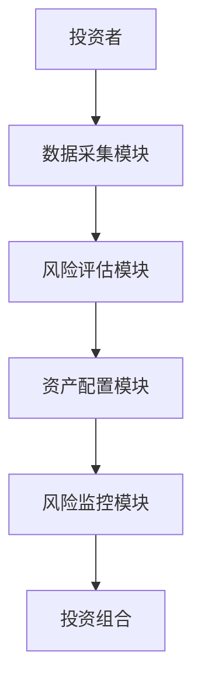

                 


# 防御性投资：在市场动荡中保护资本的策略

## 关键词：防御性投资，风险管理，资本保护，市场动荡，投资策略

## 摘要：防御性投资是一种在市场波动中保护资本的策略，通过科学的风险管理、资产配置和投资组合优化，帮助投资者在不确定的市场环境中实现长期稳健的收益。本文从防御性投资的核心概念、数学模型、系统架构、项目实战等多个角度进行深入分析，结合实际案例，提供切实可行的投资策略和最佳实践。

---

# 第1章：防御性投资概述

## 1.1 防御性投资的定义与背景

### 1.1.1 投资的基本概念

投资是通过将资金投入特定资产或项目，以期在未来获得收益或资本增值的经济活动。投资的核心目标是实现资产的保值与增值，但市场波动性和不确定性使得投资过程充满了风险。

### 1.1.2 市场动荡与投资风险

市场动荡是投资过程中不可避免的现象，例如股市的波动、经济周期的波动、政策变化等都会对投资收益产生重大影响。投资者在市场动荡中面临的主要风险包括市场风险、流动性风险、信用风险和操作风险。

### 1.1.3 防御性投资的核心目标

防御性投资的核心目标是在市场波动中保护资本，避免或最小化资本损失，同时追求稳健的长期收益。与进攻性投资相比，防御性投资更注重风险控制和资产保护，而非追求高风险高回报。

---

## 1.2 防御性投资与进攻性投资的区别

### 1.2.1 进攻性投资的特点

进攻性投资以追求高收益为目标，通常涉及高风险资产，如股票、加密货币等。其特点是高波动性、高风险和高潜在回报。

### 1.2.2 防御性投资的特点

防御性投资以稳健性和低风险为目标，通常投资于波动性较小的资产，如债券、黄金、货币市场基金等。其特点是低波动性、低风险和稳健回报。

### 1.2.3 两种投资策略的对比分析

| 特性 | 进攻性投资 | 防御性投资 |
|------|------------|------------|
| 风险 | 高          | 低          |
| 回报 | 高          | 稳健        |
| 适合场景 | 牛市、高增长阶段 | 经济衰退、市场波动阶段 |

---

## 1.3 防御性投资的重要性

### 1.3.1 市场波动中的保护机制

防御性投资通过分散投资、资产配置和风险管理，能够在市场波动中有效降低资本损失的风险。

### 1.3.2 长期投资目标的实现

防御性投资策略注重长期稳健的回报，能够帮助投资者在市场波动中逐步实现财富积累。

### 1.3.3 风险厌恶型投资者的需求

对于风险厌恶型投资者来说，防御性投资是一种理想的选择，能够在保证本金安全的前提下获得稳健的收益。

---

# 第2章：防御性投资的核心概念

## 2.1 投资组合的风险管理

### 2.1.1 风险的定义与分类

风险是指投资的实际收益与预期收益之间的差异。主要分类包括市场风险、流动性风险、信用风险等。

### 2.1.2 风险的量化方法

风险可以通过波动率、VaR（Value at Risk）等指标进行量化。例如，波动率衡量资产价格的波动程度，VaR衡量在一定置信水平下的潜在损失。

### 2.1.3 投资组合的风险调整收益

通过夏普比率（Sharpe Ratio）等指标，可以衡量投资组合的风险调整后收益。

---

## 2.2 资产保护机制

### 2.2.1 资产配置的基本原理

资产配置是将资金分配到不同的资产类别中，以分散风险并优化收益。例如，将部分资金投资于债券，部分投资于黄金，以平衡风险。

### 2.2.2 防御性资产的选择标准

选择防御性资产时，应考虑其波动性低、流动性好、收益稳定等特点。例如，国债、黄金、蓝筹股等。

### 2.2.3 资产保护的动态调整

根据市场环境的变化，定期调整资产配置比例，以适应新的市场条件。

---

## 2.3 防御性投资的数学模型

### 2.3.1 风险-收益平衡模型

通过均值-方差优化模型，可以找到风险最低、收益最高的投资组合。

$$ \text{目标函数：} \min \sigma^2 \quad \text{subject to} \quad \mathbb{E}[R] = \mu $$

其中，$\sigma^2$ 是收益的方差，$\mathbb{E}[R]$ 是收益的期望值。

### 2.3.2 投资组合优化的数学公式

Markowitz的有效前沿理论是投资组合优化的基础。通过求解以下优化问题，可以找到最优的资产配置：

$$ \min \sigma^2 \quad \text{subject to} \quad \mathbb{E}[R] = \mu \quad \text{和} \quad \sum w_i = 1 $$

其中，$w_i$ 是资产 $i$ 的权重，$\mu$ 是目标收益。

---

# 第3章：防御性投资的策略分析

## 3.1 市场中性策略

### 3.1.1 市场中性策略的定义

市场中性策略是指通过做多和做空相结合，使得投资组合的收益与市场整体波动无关。

### 3.1.2 市场中性策略的实现方法

通过配对交易、统计套利等方法实现市场中性。

### 3.1.3 市场中性策略的风险管理

定期调整头寸，控制杠杆比例。

---

## 3.2 投资组合保险策略

### 3.2.1 投资组合保险的定义

投资组合保险是一种通过动态调整资产配置，确保投资组合在市场下跌时能够保住一定价值的策略。

### 3.2.2 投资组合保险的实现方法

通过设定止损线，当投资组合的价值下跌到一定水平时，减少风险资产的持有比例。

### 3.2.3 投资组合保险的风险管理

监控市场波动，及时调整保险比例。

---

## 3.3 避险策略

### 3.3.1 避险策略的定义

避险策略是指通过衍生品（如期货、期权）对冲投资组合的市场风险。

### 3.3.2 避险策略的实现方法

利用期货对冲利率风险，利用期权保护价格波动风险。

### 3.3.3 避险策略的风险管理

监控衍生品的流动性风险和信用风险。

---

# 第4章：防御性投资的系统架构

## 4.1 投资者风险承受能力评估系统

### 4.1.1 风险承受能力的评估指标

包括财务状况、投资目标、心理承受能力等。

### 4.1.2 风险承受能力的评估流程

通过问卷调查、面谈等方式收集信息，评估投资者的风险承受能力。

### 4.1.3 风险承受能力的评估工具

使用专业的投资评估软件或在线评估工具。

---

## 4.2 投资组合风险管理系统

### 4.2.1 投资组合风险的监控指标

包括波动率、VaR、夏普比率等。

### 4.2.2 投资组合风险的预警机制

设定风险预警线，当风险指标超过阈值时触发预警。

### 4.2.3 投资组合风险的调整策略

根据风险预警结果，动态调整资产配置比例。

---

## 4.3 防御性投资的系统架构设计

### 4.3.1 系统功能设计

包括数据采集、风险评估、资产配置、风险监控等功能模块。

### 4.3.2 系统架构图



---

# 第5章：防御性投资的项目实战

## 5.1 环境配置

安装必要的Python库，如Pandas、NumPy、Matplotlib等。

## 5.2 核心实现

### 5.2.1 数据处理

读取历史数据，计算波动率、VaR等指标。

### 5.2.2 策略实现

实现防御性投资策略，如资产配置优化、风险对冲等。

### 5.2.3 系统实现

构建投资组合管理系统，实现数据采集、策略执行、风险监控等功能。

---

## 5.3 案例分析

### 5.3.1 投资组合构建

假设我们有三种资产：股票、债券、黄金。通过均值-方差优化模型，找到最优的资产配置比例。

### 5.3.2 策略实现

使用Python代码实现投资组合优化：

```python
import numpy as np
import pandas as pd

# 假设我们有三种资产的收益率数据
returns = pd.DataFrame({
    '股票': [0.1, 0.05, -0.02, 0.08],
    '债券': [0.03, 0.02, 0.01, 0.04],
    '黄金': [0.05, 0.03, 0.02, 0.01]
})

# 计算协方差矩阵
cov_matrix = returns.cov()

# 通过均值-方差优化模型找到最优资产配置
def portfolio_optimization(returns, cov_matrix):
    n = len(returns.columns)
    # 假设目标收益为5%
    target_return = 0.05
    # 求解优化问题
    # ...（省略具体优化过程）
    pass

portfolio_optimization(returns, cov_matrix)
```

---

## 5.4 实战总结

通过实际案例分析，验证防御性投资策略的有效性，并总结经验教训。

---

# 第6章：防御性投资的最佳实践

## 6.1 最佳实践

### 6.1.1 投资组合的风险管理

定期审视和调整投资组合，确保风险可控。

### 6.1.2 资产配置的动态调整

根据市场环境的变化，灵活调整资产配置比例。

### 6.1.3 长期投资目标的实现

保持耐心和纪律，避免短期波动的干扰。

---

## 6.2 小结

防御性投资是一种科学的投资策略，通过合理配置资产、严格控制风险，能够在市场动荡中保护资本，实现稳健的长期收益。

---

## 6.3 注意事项

### 6.3.1 风险控制的重要性

任何时候都不能忽视风险控制。

### 6.3.2 长期投资的纪律性

坚持长期投资，避免短期操作。

### 6.3.3 专业化的投资管理

如果个人能力有限，可以考虑借助专业投资机构的帮助。

---

## 6.4 拓展阅读

推荐一些关于防御性投资的经典书籍和文献，供读者深入学习。

---

# 作者：AI天才研究院/AI Genius Institute & 禅与计算机程序设计艺术 /Zen And The Art of Computer Programming

