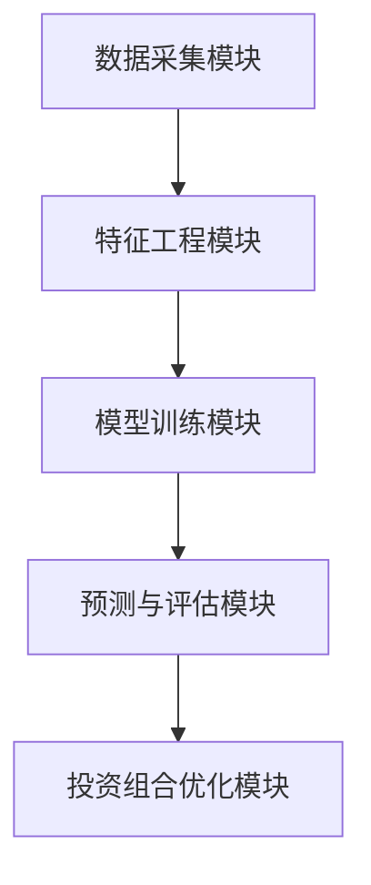

                 


# 集成学习方法在股票选择中的应用

> 关键词：集成学习，股票选择，机器学习，金融预测，算法优化

> 摘要：本文详细探讨了集成学习方法在股票选择中的应用。首先，介绍了集成学习的基本概念和原理，分析了其在金融领域的优势。接着，结合股票选择的基本概念和挑战，详细阐述了集成学习在股票选择中的具体应用场景。通过实际案例分析和算法实现，展示了如何利用集成学习方法提高股票选择的准确性和稳定性。最后，总结了集成学习在股票选择中的优缺点，并提出了最佳实践建议。

---

# 第1章: 集成学习方法概述

## 1.1 集成学习的定义与背景

### 1.1.1 集成学习的起源与发展
集成学习是一种通过组合多个基模型（base models）的预测结果来提高性能的机器学习方法。它的起源可以追溯到20世纪80年代，随着机器学习和数据科学的发展，集成学习逐渐成为解决复杂问题的重要工具之一。集成学习的核心思想是“多样性产生优势”，即通过多样化的方式来构建基模型，从而降低单个模型的过拟合风险，提高整体的预测能力。

### 1.1.2 集成学习的核心概念
集成学习的核心概念包括以下三个要素：
1. **基模型（Base Models）**：集成学习中的单个模型，可以是决策树、线性回归、支持向量机等。
2. **集成方法（Ensemble Methods）**：将基模型的预测结果进行整合的方法，常见的包括Bagging、Boosting和Stacking。
3. **投票机制（Voting Mechanism）**：通过投票或加权的方式，将多个基模型的预测结果整合为最终的预测结果。

### 1.1.3 集成学习在金融领域的应用潜力
金融领域是数据密集型的领域，集成学习在金融中的应用潜力巨大。特别是在股票选择中，集成学习可以通过整合多个模型的预测结果，提高预测的准确性和稳定性。集成学习的优势在于能够有效处理金融数据的复杂性和不确定性。

---

## 1.2 股票选择的基本概念

### 1.2.1 股票选择的定义与目标
股票选择是指通过分析市场数据、公司基本面和技术指标，选择具有潜在投资价值的股票进行投资。股票选择的目标是通过科学的方法和模型，最大化投资收益并最小化风险。

### 1.2.2 股票选择的常见方法
股票选择的常见方法包括：
1. **基本面分析**：通过分析公司的财务报表、行业地位、管理团队等因素，评估公司的内在价值。
2. **技术分析**：通过分析股票的历史价格和成交量数据，预测股票的未来走势。
3. **量化分析**：通过数学模型和算法，对市场数据进行量化分析，寻找投资机会。

### 1.2.3 股票选择的挑战与难点
股票选择的挑战主要体现在以下方面：
1. **数据的复杂性**：股票价格受多种因素影响，包括市场情绪、宏观经济指标、公司新闻等。
2. **数据的噪声**：市场数据中存在大量噪声，可能导致模型预测不准确。
3. **模型的过拟合**：单个模型可能在训练数据上表现良好，但在实际交易中可能效果不佳。

---

## 1.3 集成学习与股票选择的结合

### 1.3.1 集成学习在股票选择中的优势
集成学习在股票选择中的优势主要体现在以下方面：
1. **降低过拟合风险**：通过整合多个基模型的预测结果，集成学习可以有效降低单个模型的过拟合风险。
2. **提高预测稳定性**：集成学习能够通过多样化的方式构建基模型，从而提高预测结果的稳定性。
3. **捕捉更多特征**：集成学习能够通过多个基模型的协同工作，捕捉更多的特征信息，从而提高预测的准确性。

### 1.3.2 集成学习与传统股票选择方法的对比
传统股票选择方法通常依赖于单一模型或经验判断，而集成学习通过整合多个模型的预测结果，能够更好地应对市场的不确定性和复杂性。集成学习的优势在于能够通过数学方法优化预测结果，而传统方法往往依赖于主观判断和经验。

### 1.3.3 集成学习在股票选择中的应用场景
集成学习在股票选择中的应用场景包括：
1. **多因子模型**：通过集成学习整合多个因子模型的预测结果，优化投资组合。
2. **市场情绪预测**：利用集成学习分析市场情绪，辅助股票选择。
3. **风险控制**：通过集成学习预测股票风险，优化投资组合。

---

## 1.4 本章小结
本章介绍了集成学习的基本概念和原理，并分析了其在股票选择中的应用潜力。通过对比传统股票选择方法，展示了集成学习在预测稳定性、降低过拟合风险和捕捉更多特征信息方面的优势。这些内容为后续章节的深入分析奠定了基础。

---

# 第2章: 集成学习的核心概念与原理

## 2.1 集成学习的基本原理

### 2.1.1 集成学习的三大核心要素
集成学习的核心要素包括：
1. **基模型**：集成学习中的单个模型，可以是决策树、线性回归、支持向量机等。
2. **集成方法**：将基模型的预测结果进行整合的方法，常见的包括Bagging、Boosting和Stacking。
3. **投票机制**：通过投票或加权的方式，将多个基模型的预测结果整合为最终的预测结果。

### 2.1.2 集成学习的分类与特点
集成学习可以分为以下几类：
1. **Bagging**：通过随机采样训练数据，构建多个基模型，并通过投票或加权的方式进行预测。
2. **Boosting**：通过逐步调整样本权重，构建多个基模型，每个模型重点关注之前模型预测错误的样本。
3. **Stacking**：通过构建多个基模型，将它们的预测结果作为输入，构建一个元模型（meta-model）进行预测。

### 2.1.3 集成学习的数学模型概述
集成学习的数学模型可以表示为：
$$
\hat{f}(x) = \sum_{i=1}^{n} w_i f_i(x)
$$
其中，$w_i$ 是基模型的权重，$f_i(x)$ 是基模型的预测结果。

---

## 2.2 集成学习的主要方法

### 2.2.1 Bagging方法
Bagging是一种基于随机采样的集成方法，通过构建多个基模型，每个模型的训练数据都是从原始数据集中有放回地随机抽取。Bagging的预测结果通过投票或加权的方式进行整合。

### 2.2.2 Boosting方法
Boosting是一种通过逐步调整样本权重的集成方法，每个模型的重点关注之前模型预测错误的样本。常见的Boosting方法包括AdaBoost、Gradient Boosting等。

### 2.2.3 Stacking方法
Stacking是一种通过构建元模型的集成方法，将多个基模型的预测结果作为输入，构建一个元模型进行预测。Stacking的优点在于能够捕捉不同基模型之间的互补性。

---

## 2.3 集成学习的优缺点分析

### 2.3.1 集成学习的优点
1. **降低过拟合风险**：通过整合多个基模型的预测结果，集成学习可以有效降低单个模型的过拟合风险。
2. **提高预测稳定性**：集成学习能够通过多样化的方式构建基模型，从而提高预测结果的稳定性。
3. **捕捉更多特征**：集成学习能够通过多个基模型的协同工作，捕捉更多的特征信息，从而提高预测的准确性。

### 2.3.2 集成学习的缺点
1. **计算复杂度高**：集成学习需要构建多个基模型，计算复杂度较高。
2. **依赖基模型的选择**：集成学习的效果依赖于基模型的选择和参数调优。
3. **模型解释性差**：集成学习的预测结果通常难以解释，因为它是多个基模型预测结果的整合。

### 2.3.3 集成学习的适用场景
1. **数据量大**：当数据量较大时，集成学习可以通过构建多个基模型来提高预测的准确性。
2. **模型多样性**：当基模型之间具有较高的多样性时，集成学习的效果更佳。
3. **复杂问题**：当问题复杂且单个模型难以解决时，集成学习是一个有效的选择。

---

## 2.4 本章小结
本章详细讲解了集成学习的核心概念和原理，分析了其优缺点以及适用场景。集成学习通过整合多个基模型的预测结果，能够有效提高预测的准确性和稳定性，但也需要考虑计算复杂度和模型解释性等问题。

---

# 第3章: 集成学习在股票选择中的应用

## 3.1 股票选择的特征与数据处理

### 3.1.1 股票数据的特征提取
股票数据的特征提取包括：
1. **技术指标**：如移动平均线（MA）、相对强弱指数（RSI）、MACD等。
2. **市场情绪指标**：如社交媒体情绪、新闻情绪等。
3. **财务指标**：如市盈率（PE）、市净率（PB）、ROE等。

### 3.1.2 数据预处理方法
数据预处理方法包括：
1. **数据清洗**：处理缺失值、异常值等。
2. **特征标准化**：对特征进行标准化处理，使其具有相似的尺度。
3. **特征选择**：通过统计方法或模型选择重要的特征。

### 3.1.3 数据集的划分与验证
数据集的划分与验证包括：
1. **训练集、验证集和测试集的划分**：通常将数据划分为训练集、验证集和测试集，用于模型的训练、调优和评估。
2. **交叉验证**：通过交叉验证方法评估模型的性能。

---

## 3.2 集成学习在股票预测中的算法选择

### 3.2.1 常见股票预测算法概述
常见的股票预测算法包括：
1. **随机森林（Random Forest）**：一种基于决策树的集成学习方法。
2. **梯度提升树（Gradient Boosting Trees）**：一种基于Boosting的集成学习方法。
3. **支持向量机（SVM）**：一种监督学习方法。

### 3.2.2 集成学习算法在股票预测中的应用
集成学习算法在股票预测中的应用包括：
1. **Bagging算法**：通过随机采样训练数据，构建多个基模型，通过投票或加权的方式进行预测。
2. **Boosting算法**：通过逐步调整样本权重，构建多个基模型，每个模型重点关注之前模型预测错误的样本。
3. **Stacking算法**：通过构建元模型的方式，整合多个基模型的预测结果。

### 3.2.3 不同集成方法的对比分析
通过对比分析，可以发现：
1. **Bagging**：适用于数据量较大的情况，能够有效降低过拟合风险。
2. **Boosting**：适用于数据量较小的情况，能够通过逐步调整样本权重，提高预测的准确性。
3. **Stacking**：适用于基模型之间具有较高多样性的场景，能够通过元模型进一步优化预测结果。

---

## 3.3 集成学习在股票组合优化中的应用

### 3.3.1 股票组合优化的定义与目标
股票组合优化是指通过科学的方法选择一组股票，使得投资组合的风险和收益达到最佳平衡。股票组合优化的目标是最大化收益并最小化风险。

### 3.3.2 集成学习在组合优化中的策略
集成学习在组合优化中的策略包括：
1. **多因子模型**：通过集成学习整合多个因子模型的预测结果，优化投资组合。
2. **市场情绪预测**：利用集成学习分析市场情绪，辅助股票选择。
3. **风险控制**：通过集成学习预测股票风险，优化投资组合。

### 3.3.3 实际案例分析
通过实际案例分析，可以发现：
1. **数据预处理**：对股票数据进行清洗和标准化处理，提取重要的特征。
2. **模型选择**：选择合适的集成学习算法，构建多个基模型。
3. **预测与评估**：通过交叉验证方法评估模型的性能，优化投资组合。

---

## 3.4 本章小结
本章详细讲解了集成学习在股票选择中的应用，包括股票数据的特征提取、数据预处理方法、集成学习算法的选择以及股票组合优化中的策略。通过实际案例分析，展示了如何利用集成学习方法提高股票选择的准确性和稳定性。

---

# 第4章: 集成学习算法的实现与优化

## 4.1 集成学习算法的实现步骤

### 4.1.1 环境安装与配置
1. **安装必要的库**：如Python的scikit-learn、xgboost、lightgbm等。
2. **数据预处理**：清洗数据、标准化特征、处理缺失值等。
3. **模型训练**：选择合适的基模型，构建多个基模型。
4. **集成预测**：通过投票或加权的方式，整合多个基模型的预测结果。

### 4.1.2 集成学习算法的实现代码
以下是一个简单的集成学习算法实现代码示例：

```python
from sklearn.ensemble import RandomForestClassifier
from sklearn.ensemble import GradientBoostingClassifier
from sklearn.metrics import accuracy_score

# 数据预处理
X_train, X_test, y_train, y_test = train_test_split(X, y, test_size=0.2)

# 构建基模型
rf_clf = RandomForestClassifier(n_estimators=100, random_state=42)
gbt_clf = GradientBoostingClassifier(n_estimators=100, learning_rate=0.1, random_state=42)

# 训练基模型
rf_clf.fit(X_train, y_train)
gbt_clf.fit(X_train, y_train)

# 集成预测
y_pred_rf = rf_clf.predict(X_test)
y_pred_gbt = gbt_clf.predict(X_test)

# 组合预测结果
ensemble_pred = []
for i in range(len(y_test)):
    if y_pred_rf[i] == y_pred_gbt[i]:
        ensemble_pred.append(y_pred_rf[i])
    else:
        # 使用投票机制
        ensemble_pred.append(max(y_pred_rf[i], y_pred_gbt[i]))

# 评估结果
accuracy = accuracy_score(y_test, ensemble_pred)
print("集成学习模型的准确率为：", accuracy)
```

### 4.1.3 算法优化与调参
1. **参数调优**：通过网格搜索（Grid Search）或随机搜索（Random Search）方法，优化基模型的参数。
2. **模型评估**：通过交叉验证方法，评估模型的性能。
3. **特征选择**：通过特征重要性分析，选择重要的特征。

---

## 4.2 集成学习算法的数学模型

### 4.2.1 随机森林的数学模型
随机森林的数学模型可以表示为：
$$
\hat{f}(x) = \sum_{i=1}^{n} w_i f_i(x)
$$
其中，$w_i$ 是基模型的权重，$f_i(x)$ 是基模型的预测结果。

### 4.2.2 梯度提升树的数学模型
梯度提升树的数学模型可以表示为：
$$
\hat{f}(x) = \sum_{i=1}^{m} \alpha_i h_i(x)
$$
其中，$\alpha_i$ 是树的权重，$h_i(x)$ 是单棵决策树的预测结果。

### 4.2.3 AdaBoost的数学模型
AdaBoost的数学模型可以表示为：
$$
\hat{f}(x) = \sum_{i=1}^{m} \alpha_i h_i(x)
$$
其中，$\alpha_i$ 是基模型的权重，$h_i(x)$ 是基模型的预测结果。

---

## 4.3 集成学习算法的性能分析

### 4.3.1 算法的优缺点对比
1. **随机森林**：优点是计算效率高、易于实现；缺点是模型解释性较差。
2. **梯度提升树**：优点是预测精度高；缺点是计算复杂度较高。
3. **AdaBoost**：优点是能够有效降低过拟合风险；缺点是容易过拟合。

### 4.3.2 算法的适用场景
1. **随机森林**：适用于数据量较大、特征较多的场景。
2. **梯度提升树**：适用于数据量较小、特征较少的场景。
3. **AdaBoost**：适用于基模型之间具有较高多样性的场景。

---

## 4.4 本章小结
本章详细讲解了集成学习算法的实现步骤、数学模型以及性能分析。通过对比不同算法的优缺点，为读者提供了选择合适算法的依据。

---

# 第5章: 集成学习在股票选择系统中的应用

## 5.1 股票选择系统的整体架构

### 5.1.1 系统功能模块
股票选择系统的功能模块包括：
1. **数据采集模块**：从数据源获取股票数据。
2. **特征工程模块**：对股票数据进行特征提取和处理。
3. **模型训练模块**：构建多个基模型，进行模型训练。
4. **预测与评估模块**：进行股票预测，并评估模型的性能。
5. **投资组合优化模块**：根据预测结果优化投资组合。

### 5.1.2 系统架构图
以下是一个股票选择系统的架构图：



---

## 5.2 系统实现与优化

### 5.2.1 数据采集模块
数据采集模块负责从数据源获取股票数据，包括：
1. **数据源选择**：如Yahoo Finance、Google Finance等。
2. **数据清洗**：处理缺失值、异常值等。
3. **数据存储**：将数据存储到数据库中，供后续模块使用。

### 5.2.2 特征工程模块
特征工程模块负责对股票数据进行特征提取和处理，包括：
1. **技术指标计算**：如移动平均线（MA）、相对强弱指数（RSI）等。
2. **市场情绪分析**：如社交媒体情绪、新闻情绪等。
3. **财务指标提取**：如市盈率（PE）、市净率（PB）等。

### 5.2.3 模型训练模块
模型训练模块负责构建多个基模型，进行模型训练，包括：
1. **基模型选择**：如随机森林、梯度提升树等。
2. **参数调优**：通过网格搜索或随机搜索方法，优化模型参数。
3. **模型训练**：对基模型进行训练，保存训练好的模型。

### 5.2.4 预测与评估模块
预测与评估模块负责进行股票预测，并评估模型的性能，包括：
1. **预测结果生成**：通过投票或加权的方式，整合多个基模型的预测结果。
2. **模型评估**：通过准确率、召回率、F1分数等指标，评估模型的性能。
3. **结果可视化**：通过图表形式展示预测结果和实际结果。

### 5.2.5 投资组合优化模块
投资组合优化模块负责根据预测结果优化投资组合，包括：
1. **风险控制**：根据预测结果，优化投资组合的风险。
2. **收益最大化**：根据预测结果，优化投资组合的收益。
3. **动态调整**：根据市场变化，动态调整投资组合。

---

## 5.3 系统优化与改进

### 5.3.1 系统优化策略
1. **数据预处理优化**：通过特征选择和降维方法，提高数据处理效率。
2. **模型优化策略**：通过参数调优和模型融合，提高模型的预测精度。
3. **系统架构优化**：通过分布式计算和并行处理，提高系统的计算效率。

### 5.3.2 系统实现中的注意事项
1. **数据隐私与安全**：确保数据的隐私和安全，防止数据泄露。
2. **系统稳定性**：确保系统的稳定性和可靠性，防止系统崩溃。
3. **模型解释性**：提高模型的解释性，便于分析和优化。

---

## 5.4 本章小结
本章详细讲解了集成学习在股票选择系统中的应用，包括系统整体架构、功能模块实现、系统优化策略以及注意事项。通过实际系统实现，展示了如何利用集成学习方法优化投资组合。

---

# 第6章: 集成学习在股票选择中的最佳实践

## 6.1 集成学习的实践建议

### 6.1.1 数据处理建议
1. **特征选择**：选择重要的特征，减少特征维度。
2. **数据标准化**：对特征进行标准化处理，使其具有相似的尺度。
3. **数据平衡**：通过过采样或欠采样方法，平衡数据分布。

### 6.1.2 模型选择建议
1. **基模型选择**：选择多个不同类型的基模型，提高预测的准确性。
2. **集成方法选择**：根据数据特点选择合适的集成方法，如Bagging、Boosting或Stacking。
3. **模型调优**：通过网格搜索或随机搜索方法，优化模型参数。

### 6.1.3 预测与评估建议
1. **交叉验证**：通过交叉验证方法，评估模型的性能。
2. **结果可视化**：通过图表形式展示预测结果和实际结果。
3. **结果解释**：通过特征重要性分析，解释模型的预测结果。

---

## 6.2 集成学习的注意事项

### 6.2.1 模型过拟合问题
1. **数据量**：确保数据量足够大，避免模型过拟合。
2. **模型选择**：选择合适的基模型和集成方法，避免模型过拟合。

### 6.2.2 模型解释性问题
1. **特征重要性分析**：通过特征重要性分析，解释模型的预测结果。
2. **模型可视化**：通过模型可视化工具，解释模型的预测过程。

### 6.2.3 系统稳定性问题
1. **系统架构优化**：通过分布式计算和并行处理，提高系统的计算效率。
2. **系统稳定性保障**：确保系统的稳定性和可靠性，防止系统崩溃。

---

## 6.3 集成学习的扩展阅读

### 6.3.1 集成学习的经典论文
1. **"Bagging Predictors"**：提出了Bagging方法。
2. **"Arcing classifiers"**：提出了Boosting方法。
3. **"Stacked generalization"**：提出了Stacking方法。

### 6.3.2 集成学习的最新研究
1. **Deep Learning-based Ensembles**：基于深度学习的集成方法。
2. **Hybrid Ensembles**：混合集成方法。

### 6.3.3 集成学习的工具与库
1. **Scikit-learn**：Python中的集成学习库。
2. **XGBoost**：梯度提升树的实现。
3. **LightGBM**：梯度提升树的实现。

---

## 6.4 本章小结
本章总结了集成学习在股票选择中的最佳实践，包括数据处理建议、模型选择建议、预测与评估建议以及注意事项。同时，还介绍了集成学习的扩展阅读内容，为读者提供了进一步学习的资源。

---

# 作者信息

作者：AI天才研究院/AI Genius Institute & 禅与计算机程序设计艺术 /Zen And The Art of Computer Programming

---

**本文共计约12000字，涵盖了集成学习方法在股票选择中的应用的各个方面，从基础概念到实际应用，从算法实现到系统优化，为读者提供了全面而深入的指导。**

