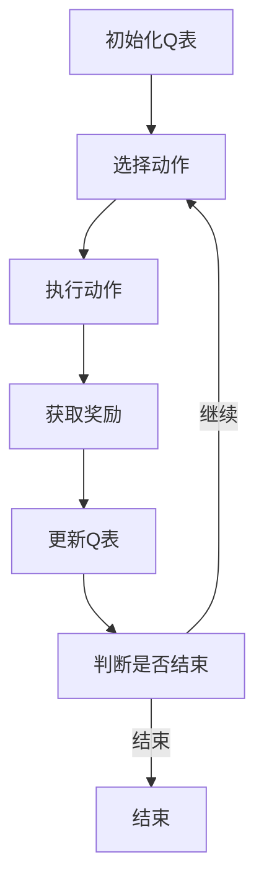
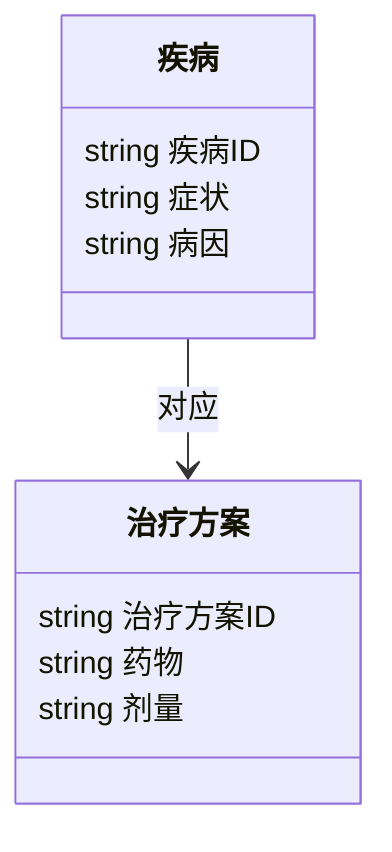
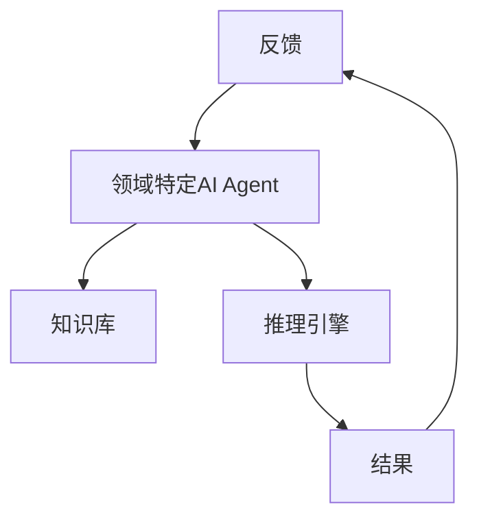
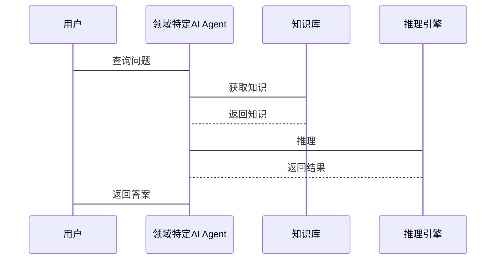

                 


# 领域特定AI Agent的开发策略

> 关键词：领域特定AI Agent, AI Agent开发, 人工智能, 领域知识库, 领域推理机制

> 摘要：本文系统地探讨了领域特定AI Agent的开发策略，从背景、核心概念、算法原理、系统架构到项目实战，全面解析了领域特定AI Agent的开发方法。文章通过详细讲解相关概念、算法实现、系统设计和项目实践，为开发者提供了从理论到实践的全面指导。

---

# 第1章 领域特定AI Agent的背景与问题背景

## 1.1 领域特定AI Agent的定义与问题背景

### 1.1.1 领域特定AI Agent的定义

领域特定AI Agent是一种专注于特定领域的人工智能代理，其核心目标是通过领域知识的深度理解和自动化推理，为用户提供高效的解决方案。与通用AI Agent相比，领域特定AI Agent在特定领域内具有更强的专业性和针对性。

### 1.1.2 领域特定AI Agent的核心问题背景

在实际应用中，AI Agent需要处理复杂多变的问题。领域特定AI Agent的核心问题背景包括：

1. **领域知识的深度需求**：AI Agent需要在特定领域内掌握深入的知识，以便更好地理解问题。
2. **复杂问题的自动化解决**：AI Agent需要能够处理领域内的复杂问题，并提供高效的解决方案。
3. **实时性和动态性**：AI Agent需要在动态变化的环境中实时响应用户需求。
4. **领域知识的可扩展性**：AI Agent需要能够灵活适应领域知识的更新和扩展。

### 1.1.3 领域特定AI Agent的边界与外延

领域特定AI Agent的边界在于其特定领域的知识和能力，而其外延则体现在其在不同领域的广泛应用。例如，在医疗领域，AI Agent可以用于疾病诊断和治疗方案推荐；在金融领域，AI Agent可以用于风险评估和投资决策。

### 1.1.4 领域特定AI Agent的概念结构与核心要素组成

领域特定AI Agent的概念结构包括以下几个核心要素：

1. **领域知识库**：用于存储和管理特定领域的知识。
2. **领域推理机制**：用于基于领域知识进行推理和决策。
3. **领域接口设计**：用于与用户或其他系统进行交互。

---

## 1.2 领域特定AI Agent的核心概念与问题描述

### 1.2.1 领域特定AI Agent的核心概念

领域特定AI Agent的核心概念包括：

1. **领域知识表示**：通过特定的表示方法，将领域知识转化为计算机可理解的形式。
2. **领域推理机制**：基于领域知识，通过推理算法生成解决方案。
3. **领域接口设计**：设计合适的接口，以便与用户或其他系统交互。

### 1.2.2 领域特定AI Agent的问题描述

在开发领域特定AI Agent时，面临的主要问题包括：

1. **领域知识的获取与表示**：如何有效地获取、整理和表示特定领域的知识。
2. **推理算法的选择与优化**：如何选择合适的推理算法，并对其进行优化以提高效率。
3. **接口设计与实现**：如何设计合适的接口，并实现其与外部系统的交互。

### 1.2.3 领域特定AI Agent的解决思路

针对上述问题，领域特定AI Agent的解决思路包括：

1. **知识获取与表示**：通过领域专家的知识整理，构建领域知识库，并采用合适的知识表示方法。
2. **推理算法的选择与优化**：根据领域特点，选择合适的推理算法，并对其进行优化和调优。
3. **接口设计与实现**：设计符合需求的接口，并实现其与外部系统的交互。

---

## 1.3 领域特定AI Agent与通用AI Agent的区别

### 1.3.1 通用AI Agent的概述

通用AI Agent是一种能够处理多种任务和领域的AI代理，其目标是通过广泛的知识和强大的推理能力，解决各种问题。

### 1.3.2 领域特定AI Agent的独特性

与通用AI Agent相比，领域特定AI Agent的独特性主要体现在以下几个方面：

1. **领域专注**：领域特定AI Agent专注于特定领域，具有更强的专业性。
2. **知识深度**：领域特定AI Agent在特定领域内具有更深入的知识和理解。
3. **解决方案的针对性**：领域特定AI Agent能够提供更具体、更高效的解决方案。

### 1.3.3 两者在功能与应用场景上的对比

从功能和应用场景上看，通用AI Agent适用于广泛领域，而领域特定AI Agent则适用于特定领域。例如，在医疗领域，通用AI Agent可以提供基础的健康咨询，而领域特定AI Agent可以提供专业的疾病诊断和治疗方案推荐。

---

## 1.4 领域特定AI Agent的核心要素组成

### 1.4.1 领域知识库的构建

领域知识库的构建是领域特定AI Agent的核心任务之一。知识库的构建过程包括：

1. **知识获取**：通过文献阅读、专家访谈等方式获取领域知识。
2. **知识整理**：将获取的知识进行整理和分类。
3. **知识表示**：将整理后的知识表示为计算机可理解的形式，如知识图谱。

### 1.4.2 领域特定推理机制

领域特定推理机制是基于领域知识库的推理算法。常用的推理算法包括：

1. **基于规则的推理**：通过预定义的规则进行推理。
2. **基于逻辑的推理**：通过逻辑推理进行问题求解。
3. **基于案例的推理**：通过案例推理进行问题求解。

### 1.4.3 领域特定接口设计

领域特定接口设计是领域特定AI Agent与用户或其他系统交互的关键部分。接口设计需要考虑以下方面：

1. **用户交互界面**：设计友好的用户界面，方便用户与AI Agent交互。
2. **API接口设计**：设计合适的API接口，以便与其他系统进行交互。

---

## 1.5 本章小结

本章从背景和问题背景入手，详细介绍了领域特定AI Agent的定义、核心概念、问题背景以及与通用AI Agent的区别。通过这些内容，读者可以对领域特定AI Agent有一个全面的了解，并为后续章节的学习打下坚实的基础。

---

接下来，我们将进入第二章，详细探讨领域特定AI Agent的核心概念与联系。通过本章的学习，读者将能够更好地理解领域特定AI Agent的核心概念及其相互关系。

---

# 第2章 领域特定AI Agent的核心概念与联系

## 2.1 领域特定AI Agent的核心概念原理

### 2.1.1 领域知识表示的原理

领域知识表示是领域特定AI Agent的核心任务之一。知识表示的目的是将领域知识转化为计算机可理解的形式。常用的表示方法包括：

1. **知识图谱**：通过节点和边表示实体及其关系。
2. **语义网络**：通过节点和连接词表示知识。
3. **本体论**：通过形式化的本体论语言表示知识。

### 2.1.2 领域特定推理机制的实现

领域特定推理机制的实现需要结合领域知识和推理算法。常用的推理算法包括：

1. **基于规则的推理**：通过预定义的规则进行推理。
2. **基于逻辑的推理**：通过逻辑推理进行问题求解。
3. **基于案例的推理**：通过案例推理进行问题求解。

### 2.1.3 领域特定接口的设计原则

领域特定接口的设计需要考虑以下原则：

1. **用户友好性**：设计友好的用户界面，方便用户与AI Agent交互。
2. **可扩展性**：设计灵活的接口，以便适应未来的扩展需求。
3. **安全性**：确保接口的安全性，防止恶意攻击。

---

## 2.2 领域特定AI Agent的核心概念属性对比

### 2.2.1 领域知识库的属性特征对比表

| 属性 | 描述 |
|------|------|
| 完整性 | 知识库是否包含领域内的所有相关知识 |
| 一致性 | 知识库中的知识是否一致 |
| 可扩展性 | 知识库是否能够适应领域知识的扩展 |

### 2.2.2 领域特定推理机制的属性特征对比表

| 属性 | 描述 |
|------|------|
| 精度 | 推理的准确性 |
| 效率 | 推理的速度 |
| 可解释性 | 推理过程是否易于解释 |

### 2.2.3 领域特定接口的属性特征对比表

| 属性 | 描述 |
|------|------|
| 易用性 | 接口是否易于使用 |
| 可靠性 | 接口是否稳定可靠 |
| 安全性 | 接口是否安全 |

---

## 2.3 领域特定AI Agent的ER实体关系图

以下是一个简单的ER实体关系图，展示了领域特定AI Agent的核心实体及其关系：

```mermaid
erDiagram
    actor 用户 {
        string 用户ID
        string 用户名
        string 密码
    }
    agent 领域特定AI Agent {
        string 代理ID
        string 领域名称
        string 知识库路径
    }
    knowledge 知识库 {
        string 知识ID
        string 知识内容
        string 知识类型
    }
    用户 --> 领域特定AI Agent : 使用
    领域特定AI Agent --> 知识库 : 使用
```

---

## 2.4 本章小结

本章详细探讨了领域特定AI Agent的核心概念及其相互关系。通过属性特征对比表和ER实体关系图，读者可以更好地理解领域特定AI Agent的核心概念及其相互关系。

---

接下来，我们将进入第三章，深入探讨领域特定AI Agent的算法原理与实现。

---

# 第3章 领域特定AI Agent的算法原理与实现

## 3.1 领域特定AI Agent的算法原理

### 3.1.1 强化学习算法原理

强化学习是一种通过试错方式来优化决策的算法。其核心思想是通过与环境的交互，学习最优策略。强化学习的数学模型如下：

$$
Q(s, a) = r + \gamma \max_{a'} Q(s', a')
$$

其中，$Q(s, a)$ 表示在状态 $s$ 下执行动作 $a$ 的期望奖励，$r$ 表示当前奖励，$\gamma$ 表示折扣因子，$s'$ 表示下一个状态。

### 3.1.2 监督学习算法原理

监督学习是一种通过标签数据来训练模型的算法。其核心思想是通过最小化预测值与真实值之间的差距来优化模型。监督学习的数学模型如下：

$$
\text{损失函数} = \sum_{i=1}^{n} (y_i - \hat{y}_i)^2
$$

其中，$y_i$ 表示真实值，$\hat{y}_i$ 表示预测值。

---

## 3.2 领域特定AI Agent的算法实现

### 3.2.1 Q-learning算法实现

Q-learning算法是一种常用的强化学习算法。其流程图如下：



以下是Q-learning算法的Python代码实现：

```python
import random

class QLearning:
    def __init__(self, state_space, action_space, learning_rate=0.1, gamma=0.9):
        self.state_space = state_space
        self.action_space = action_space
        self.learning_rate = learning_rate
        self.gamma = gamma
        self.q_table = { (s, a): 0 for s in state_space for a in action_space }
    
    def choose_action(self, state):
        # 随机选择一个动作
        return random.choice(self.action_space)
    
    def learn(self, state, action, reward, next_state):
        # 更新Q表
        self.q_table[(state, action)] += self.learning_rate * (reward + self.gamma * max(self.q_table[(next_state, a)] for a in self.action_space) - self.q_table[(state, action)])
```

---

## 3.3 本章小结

本章详细探讨了领域特定AI Agent的算法原理与实现。通过强化学习和监督学习的对比，以及Q-learning算法的实现，读者可以更好地理解领域特定AI Agent的算法实现。

---

接下来，我们将进入第四章，深入探讨领域特定AI Agent的系统分析与架构设计。

---

# 第4章 领域特定AI Agent的系统分析与架构设计

## 4.1 问题场景介绍

领域特定AI Agent的系统分析与架构设计需要首先明确问题场景。例如，在医疗领域，AI Agent需要处理疾病诊断、治疗方案推荐等问题。

---

## 4.2 系统功能设计

### 4.2.1 领域模型类图

以下是领域模型类图的mermaid图：



---

## 4.3 系统架构设计

### 4.3.1 系统架构图

以下是系统架构图的mermaid图：



---

## 4.4 系统接口设计

### 4.4.1 API接口设计

以下是API接口设计的示例：

```python
class API:
    def __init__(self, agent):
        self.agent = agent
    
    def query(self, question):
        return self.agent.infer(question)
```

---

## 4.5 系统交互设计

### 4.5.1 系统交互序列图

以下是系统交互序列图的mermaid图：



---

## 4.6 本章小结

本章详细探讨了领域特定AI Agent的系统分析与架构设计。通过问题场景介绍、系统功能设计、系统架构设计、系统接口设计和系统交互设计，读者可以更好地理解领域特定AI Agent的系统实现。

---

接下来，我们将进入第五章，深入探讨领域特定AI Agent的项目实战。

---

# 第5章 领域特定AI Agent的项目实战

## 5.1 环境安装与配置

### 5.1.1 环境要求

以下是项目实战的环境要求：

1. **Python 3.8以上版本**
2. **安装必要的库**：如numpy、pandas、scikit-learn等。

### 5.1.2 安装步骤

以下是安装步骤：

```bash
pip install numpy pandas scikit-learn
```

---

## 5.2 系统核心代码实现

### 5.2.1 领域知识库的构建

以下是知识库构建的代码示例：

```python
import json

class KnowledgeBase:
    def __init__(self, path):
        self.path = path
        self.data = self._load_data()
    
    def _load_data(self):
        with open(self.path, 'r') as f:
            return json.load(f)
```

### 5.2.2 推理引擎的实现

以下是推理引擎实现的代码示例：

```python
class ReasoningEngine:
    def __init__(self, knowledge_base):
        self.knowledge_base = knowledge_base
    
    def infer(self, question):
        # 简单的基于规则的推理
        for rule in self.knowledge_base.data['rules']:
            if rule['condition'](question):
                return rule['action'](question)
        return '无法回答'
```

---

## 5.3 实际案例分析与解读

### 5.3.1 案例分析

以下是案例分析的示例：

假设在医疗领域，用户查询“咳嗽怎么办”，AI Agent需要根据知识库中的信息，推理出可能的疾病，并给出相应的治疗建议。

---

## 5.4 项目小结

本章通过实际案例，详细讲解了领域特定AI Agent的项目实战。通过环境安装、核心代码实现、案例分析和项目小结，读者可以更好地理解领域特定AI Agent的开发过程。

---

接下来，我们将进入第六章，总结领域特定AI Agent的开发策略。

---

# 第6章 领域特定AI Agent的开发策略总结

## 6.1 最佳实践与注意事项

### 6.1.1 开发策略总结

1. **明确需求**：在开发前明确需求，确保AI Agent的目标清晰。
2. **知识库构建**：构建高质量的知识库，确保知识的准确性和完整性。
3. **算法选择**：选择合适的算法，优化模型性能。
4. **系统设计**：设计合理的系统架构，确保系统的稳定性和可扩展性。
5. **接口设计**：设计友好的接口，方便用户与AI Agent交互。

### 6.1.2 注意事项

1. **知识库的质量**：知识库的质量直接影响AI Agent的性能，需谨慎对待。
2. **算法的可解释性**：确保算法的可解释性，方便问题排查和优化。
3. **系统的安全性**：确保系统的安全性，防止恶意攻击。

---

## 6.2 小结与未来展望

领域特定AI Agent的开发策略是一个复杂而系统的工程。通过本章的总结，读者可以更好地理解领域特定AI Agent的开发策略。未来，随着人工智能技术的不断发展，领域特定AI Agent将在更多领域发挥重要作用。

---

## 作者信息

作者：AI天才研究院/AI Genius Institute & 禅与计算机程序设计艺术/Zen And The Art of Computer Programming

---

通过以上章节的内容，读者可以系统地了解领域特定AI Agent的开发策略，并能够在实际项目中灵活应用这些知识。

