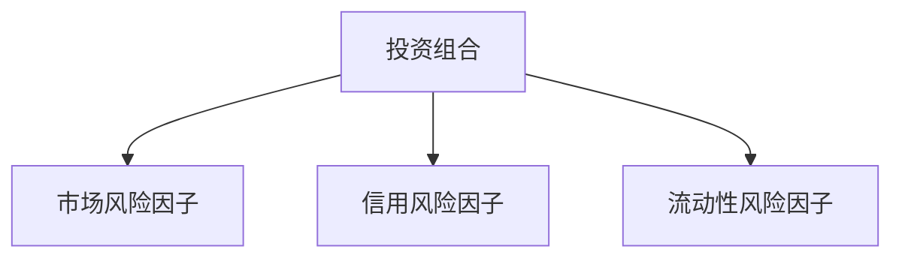
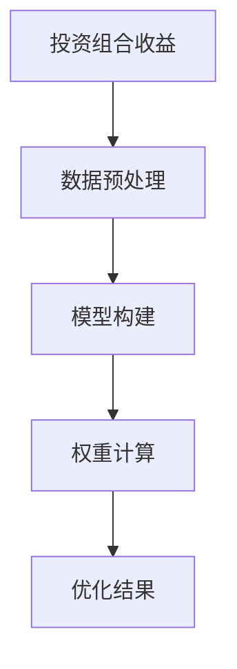
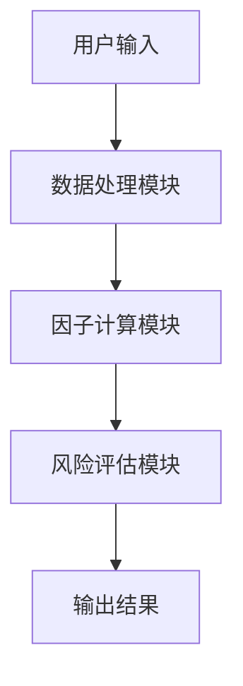
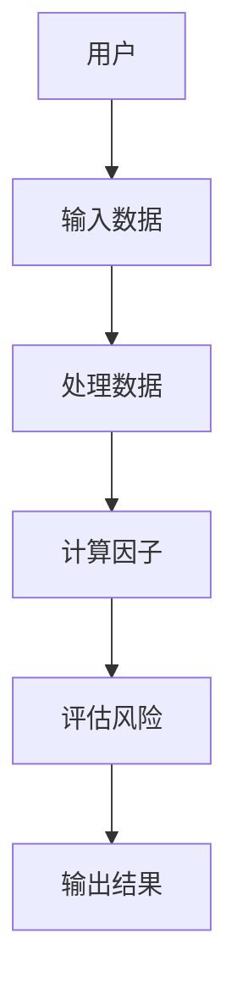

                 


# 风险因子分解：深入理解投资组合风险来源

> 关键词：风险因子分解，投资组合风险，风险来源，风险分析，风险管理系统

> 摘要：本文深入探讨了投资组合风险的分解方法，从理论基础到实际应用，详细分析了风险因子的分类、数学模型、系统架构及项目实战。通过系统性的分析，帮助读者全面理解投资组合风险的来源，并掌握如何通过风险因子分解方法优化投资组合的风险管理。

---

## 第一章：风险因子分解概述

### 1.1 投资组合风险的定义与重要性

#### 1.1.1 投资组合风险的定义
投资组合风险是指在一定时间内，投资组合的收益相对于预期收益的波动程度。它反映了投资组合在不同市场条件下的不确定性，是投资者在决策过程中需要重点关注的指标。

#### 1.1.2 风险在投资决策中的作用
风险是投资决策的核心考量因素之一。投资者通过评估投资组合的风险，可以更好地理解其潜在收益和损失，从而做出更合理的投资决策。

#### 1.1.3 风险因子分解的核心概念
风险因子分解是一种将投资组合的总风险分解为多个风险因子的组合的技术。这些风险因子通常代表市场中的系统性风险，如市场波动、利率变化、信用风险等。

### 1.2 风险因子分解的背景与应用

#### 1.2.1 风险因子分解的历史发展
风险因子分解的方法起源于20世纪中期，随着金融理论的发展而不断完善。现代风险因子分解方法结合了统计学和金融学的最新研究成果。

#### 1.2.2 风险因子分解在金融领域中的应用
风险因子分解广泛应用于金融风险管理、投资组合优化、资产定价等领域。它帮助投资者更好地理解投资组合的风险来源，并采取有效的风险管理策略。

#### 1.2.3 风险因子分解的边界与外延
风险因子分解的核心在于将复杂的风险来源分解为可管理的因子，同时需要明确其边界条件和适用范围。

### 1.3 风险因子分解的核心要素

#### 1.3.1 风险因子的分类与特征
风险因子可以分为市场风险、信用风险、流动性风险等。每种风险因子都有其独特的属性和特征，需要通过系统的分类和分析来识别和量化。

#### 1.3.2 风险因子分解的数学模型
风险因子分解的数学模型是将投资组合的收益与各个风险因子之间的关系用数学公式表达出来，从而实现风险的分解和量化。

#### 1.3.3 风险因子分解的步骤与流程
风险因子分解的流程包括数据收集、因子选择、模型构建、因子权重计算等步骤。每一步都需要细致的操作和分析，确保分解结果的准确性和可靠性。

---

## 第二章：风险因子的分类与特征

### 2.1 风险因子的分类

#### 2.1.1 市场风险因子
市场风险因子反映了整个市场波动对投资组合的影响，是系统性风险的重要组成部分。

#### 2.1.2 信用风险因子
信用风险因子反映了债券发行人信用状况对投资组合的影响，是信用风险的重要组成部分。

#### 2.1.3 流动性风险因子
流动性风险因子反映了资产流动性不足对投资组合的影响，是流动性风险的重要组成部分。

### 2.2 风险因子的特征对比

#### 2.2.1 风险因子的属性特征对比表格
以下是一个风险因子属性特征对比表格：

| 风险因子 | 市场风险 | 信用风险 | 流动性风险 |
|----------|----------|----------|----------|
| 性质     | 系统性    | 非系统性 | 非系统性 |
| 主要影响 | 整体市场波动 | 债务违约风险 | 资产变现能力 |
| 应对策略 | 多样化投资 | 选择优质债券 | 保持充足流动性 |

#### 2.2.2 风险因子的ER实体关系图


---

## 第三章：风险因子分解的数学模型与算法

### 3.1 风险因子分解的数学模型

#### 3.1.1 风险因子分解的公式推导
风险因子分解的数学模型可以通过以下公式表示：
$$
R_p = \sum_{i=1}^{n} w_i \cdot R_i
$$
其中，$R_p$ 是投资组合的收益，$w_i$ 是第 $i$ 个风险因子的权重，$R_i$ 是第 $i$ 个风险因子的收益。

#### 3.1.2 风险因子分解的矩阵表示
风险因子分解可以通过矩阵运算表示为：
$$
R_p = w^T \cdot R
$$
其中，$w$ 是权重向量，$R$ 是风险因子收益矩阵。

#### 3.1.3 风险因子分解的优化方法
为了实现最优的风险因子分解，可以采用最小二乘法：
$$
\hat{w} = \arg \min_w ||R_p - w^T \cdot R||^2
$$

### 3.2 风险因子分解的算法原理

#### 3.2.1 风险因子分解的算法流程


#### 3.2.2 风险因子分解的算法实现
以下是一个Python实现的示例代码：
```python
import numpy as np

# 示例数据
R = np.array([[0.1, 0.05, 0.02],
              [0.08, 0.03, 0.01],
              [0.12, 0.06, 0.03]])

# 最小二乘法求解权重
w = np.linalg.lstsq(R.T, R.mean(axis=0), rcond=None)[0]

print("权重为：", w)
```

#### 3.2.3 风险因子分解的算法优化
为了提高算法的效率，可以采用正则化方法：
$$
\hat{w} = \arg \min_w ||R_p - w^T \cdot R||^2 + \lambda ||w||^2
$$

---

## 第四章：系统性的风险分析与管理

### 4.1 系统性风险分析方法

#### 4.1.1 系统性风险的定义与特征
系统性风险是指影响整个市场的风险，具有广泛性和不可分散性。

#### 4.1.2 系统性风险的度量方法
常用的系统性风险度量方法包括VaR（Value at Risk）和CVaR（Conditional Value at Risk）。

#### 4.1.3 系统性风险的管理策略
系统性风险可以通过分散投资、对冲交易等方法进行管理。

### 4.2 现代投资组合理论在风险因子分解中的应用

#### 4.2.1 现代投资组合理论的核心思想
现代投资组合理论强调通过分散投资来降低非系统性风险，优化投资组合的收益-风险比。

#### 4.2.2 现代投资组合理论在风险因子分解中的应用
通过将投资组合的收益分解为多个风险因子，可以更好地理解投资组合的系统性风险和非系统性风险。

#### 4.2.3 现代投资组合理论的优缺点
优点在于其理论基础的严谨性，缺点在于其实证效果可能受到市场条件的影响。

---

## 第五章：风险因子分解的系统架构与实现

### 5.1 风险因子分解系统的架构设计

#### 5.1.1 系统架构的总体设计


#### 5.1.2 系统架构的模块划分
系统架构主要包括数据处理模块、因子计算模块、风险评估模块和结果输出模块。

#### 5.1.3 系统架构的实现细节
每个模块的具体实现需要结合具体的算法和数据处理需求。

### 5.2 风险因子分解系统的接口设计

#### 5.2.1 系统接口的定义
系统接口主要包括数据输入接口和结果输出接口。

#### 5.2.2 系统接口的实现
通过定义清晰的接口规范，可以实现系统的模块化设计和可扩展性。

### 5.3 风险因子分解系统的交互设计

#### 5.3.1 系统交互的流程图


---

## 第六章：风险因子分解的项目实战

### 6.1 风险因子分解项目的环境配置

#### 6.1.1 系统环境
需要安装Python、NumPy、Pandas等库。

#### 6.1.2 数据准备
需要收集相关风险因子数据，如市场指数、债券评级等。

### 6.2 风险因子分解项目的实现

#### 6.2.1 核心代码实现
```python
import numpy as np
import pandas as pd

# 数据加载
data = pd.read_csv('risk_factors.csv')

# 风险因子分解
R = data.values
w = np.linalg.lstsq(R.T, R.mean(axis=0), rcond=None)[0]

print("因子权重：", w)
```

#### 6.2.2 代码应用解读
通过代码实现风险因子分解，可以量化各个风险因子对投资组合的影响。

### 6.3 项目小结

#### 6.3.1 项目总结
通过实际案例分析，验证了风险因子分解方法的有效性。

#### 6.3.2 项目优化
可以进一步优化算法，提高计算效率和准确性。

---

## 第七章：风险因子分解的总结与展望

### 7.1 总结

#### 7.1.1 核心内容回顾
本文详细介绍了风险因子分解的方法和应用，帮助读者全面理解投资组合的风险来源。

#### 7.1.2 成果与不足
通过系统性的分析和实践，本文提出了一种有效的风险因子分解方法，但仍需进一步优化和验证。

### 7.2 展望

#### 7.2.1 未来研究方向
未来可以研究更多类型的风险因子，如操作风险、法律风险等。

#### 7.2.2 技术发展趋势
随着人工智能和大数据技术的发展，风险因子分解方法将更加智能化和高效化。

---

## 参考文献

1. [风险管理基础] 现代投资组合理论与风险因子分解
2. [Python编程] 使用NumPy和Pandas进行风险因子分析
3. [系统架构] 风险因子分解系统的架构设计与实现

---

**作者：AI天才研究院/AI Genius Institute & 禅与计算机程序设计艺术 /Zen And The Art of Computer Programming**

