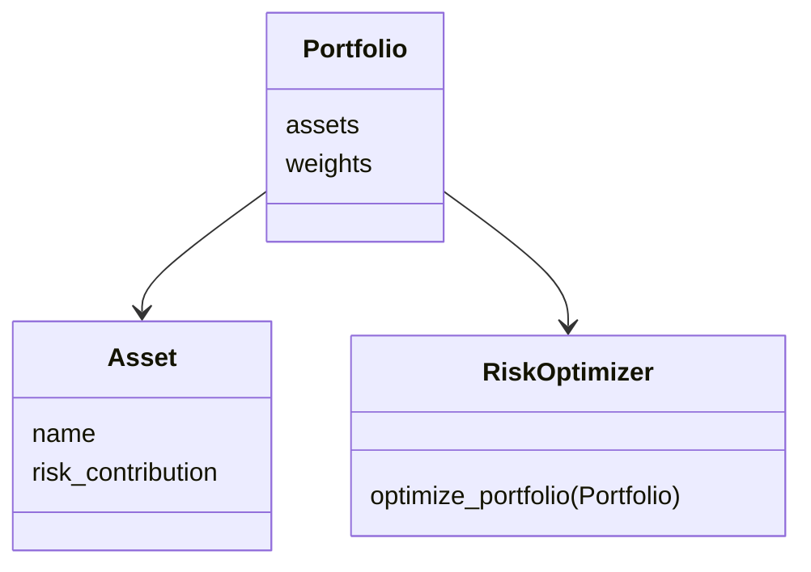

                 


# 风险平价策略：平衡不同资产类别风险的方法

> 关键词：风险平价策略、资产配置、投资组合优化、风险平衡、现代投资组合理论

> 摘要：本文深入探讨了风险平价策略，从其背景、核心概念、算法原理到系统设计和实战案例，全面解析如何在不同资产类别间平衡风险，优化投资组合。文章通过详细分析和图表，结合数学公式与Python代码示例，帮助读者理解并应用这一策略。

---

## 第一部分: 风险平价策略的背景与核心概念

### 第1章: 风险平价策略的背景介绍

#### 1.1 风险平价的定义与背景
##### 1.1.1 风险平价的定义
风险平价是一种资产配置方法，旨在通过调整各资产类别的权重，使得每类资产对整体投资组合风险的贡献相等。这种策略通过平衡风险来优化投资组合的表现，而非单纯追求收益最大化。

##### 1.1.2 风险平价的背景与问题背景
传统投资策略往往侧重于收益最大化，但忽视了风险的分布。风险平价策略的出现，旨在解决资产配置中风险不均衡的问题，使每类资产的风险贡献相等，从而降低整体投资组合的波动性。

##### 1.1.3 风险平价的目标与意义
- **目标**：通过平衡各资产类别的风险贡献，优化投资组合的风险-收益比。
- **意义**：降低尾部风险，提高组合的稳定性，尤其在市场波动加剧时表现更优。

#### 1.2 风险平价与传统投资策略的对比
##### 1.2.1 传统投资策略的局限性
- 侧重收益，忽视风险分布。
- 无法有效应对市场波动。

##### 1.2.2 风险平价的核心优势
- 平衡风险，降低整体波动。
- 适应不同市场环境，提升稳定性。

##### 1.2.3 风险平价与现代投资组合理论的关系
- 风险平价是现代投资组合理论的一种应用，但更注重风险平衡。

---

## 第二部分: 风险平价策略的核心概念与理论基础

### 第2章: 风险平价的核心概念与理论基础

#### 2.1 风险平价的理论基础
##### 2.1.1 马科维茨的有效投资组合理论
- 马科维茨提出，通过优化资产权重，可以实现收益与风险的最优平衡。
- 风险平价策略在此基础上，进一步优化风险贡献。

##### 2.1.2 风险平价与现代投资组合理论的关系
- 风险平价是现代投资组合理论的一种应用，更注重风险的平衡。

##### 2.1.3 风险平价的数学模型
$$ \text{目标函数：} \min \sum_{i=1}^{n} w_i^2 \cdot \sigma_i^2 $$
$$ \text{约束条件：} \sum_{i=1}^{n} w_i = 1 $$

#### 2.2 资产类别与风险的度量
##### 2.2.1 资产类别的定义与分类
- 股票、债券、商品、房地产等。

##### 2.2.2 风险的度量方法
- 标准差、波动率、VaR等。

##### 2.2.3 不同资产类别风险的比较与表格化展示
| 资产类别 | 风险程度 | 风险来源 |
|----------|----------|----------|
| 股票     | 高       | 市场波动 |
| 债券     | 中       | 利率变化 |
| 商品     | 低       | 供需变化 |

#### 2.3 风险平价的实现原理
##### 2.3.1 风险平价的优化目标
- 使每类资产的风险贡献相等。

##### 2.3.2 资产权重的计算方法
- 使用优化算法，调整权重以平衡风险贡献。

##### 2.3.3 风险平价的约束条件
- 权重之和为1，权重非负。

---

## 第三部分: 风险平价模型的算法原理

### 第3章: 风险平价模型的算法原理

#### 3.1 风险平价算法的步骤
##### 3.1.1 确定资产类别与权重
- 确定投资组合中的资产类别及其初始权重。

##### 3.1.2 计算各资产的风险贡献
- 计算每类资产的风险贡献，如标准差乘以权重。

##### 3.1.3 优化权重以平衡风险
- 使用优化算法调整权重，使各资产的风险贡献相等。

#### 3.2 风险平价的数学模型与公式
##### 3.2.1 数学模型的构建
$$ \text{目标函数：} \min \sum_{i=1}^{n} w_i^2 \cdot \sigma_i^2 $$
$$ \text{约束条件：} \sum_{i=1}^{n} w_i = 1 $$

#### 3.3 算法实现的Python代码示例
```python
import numpy as np

def risk_parity_portfolio(returns, cov_matrix):
    n = len(returns)
    # 初始化权重
    w = np.ones(n) / n
    # 迭代优化权重
    for _ in range(100):
        # 计算风险贡献
        risk_contributions = w * np.sqrt(np.dot(cov_matrix, w))
        # 计算目标风险向量
        target = np.sqrt(np.mean(risk_contributions ** 2))
        # 优化权重以平衡风险
        w = w / np.mean(w * risk_contributions / target)
    return w
```

#### 3.4 算法实现的详细步骤与解释
- 初始化权重，通常为等权。
- 计算每类资产的风险贡献。
- 迭代优化权重，使其风险贡献趋同。

---

## 第四部分: 系统分析与架构设计方案

### 第4章: 系统分析与架构设计方案

#### 4.1 问题场景介绍
- 投资者希望优化其资产配置，降低整体风险。

#### 4.2 系统功能设计
##### 4.2.1 领域模型mermaid类图


##### 4.2.2 系统架构设计mermaid架构图
```mermaid
rectangle Database {
    AssetData
    RiskData
}
class PortfolioManager {
    manage_portfolio()
}
class RiskOptimizer {
    optimize_portfolio()
}
Database --> PortfolioManager
PortfolioManager --> RiskOptimizer
```

---

## 第五部分: 项目实战与案例分析

### 第5章: 项目实战与案例分析

#### 5.1 环境安装
- 安装必要的Python库，如`numpy`, `pandas`, `scipy`。

#### 5.2 系统核心实现源代码
```python
import numpy as np

def risk_parity_portfolio(returns, cov_matrix):
    n = len(returns)
    w = np.ones(n) / n
    for _ in range(100):
        risk_contributions = w * np.sqrt(np.dot(cov_matrix, w))
        target = np.sqrt(np.mean(risk_contributions ** 2))
        w = w / np.mean(w * risk_contributions / target)
    return w
```

#### 5.3 代码应用解读与分析
- 使用优化算法调整权重，使风险贡献相等。

#### 5.4 实际案例分析
- 使用股票、债券、商品等资产，应用风险平价策略优化权重。

#### 5.5 项目小结
- 成功实现风险平价策略，优化了投资组合的风险分布。

---

## 第六部分: 最佳实践与总结

### 第6章: 最佳实践与总结

#### 6.1 关键点总结
- 风险平价策略通过平衡风险贡献，优化投资组合。

#### 6.2 小结
- 风险平价策略在实际投资中具有重要应用价值。

#### 6.3 注意事项
- 需要考虑市场波动、资产流动性等因素。

#### 6.4 未来的发展方向
- 结合人工智能技术，进一步优化风险平价策略。

#### 6.5 拓展阅读
- 推荐阅读相关书籍和论文，深入了解风险平价策略的应用。

---

## 作者信息

作者：AI天才研究院/AI Genius Institute & 禅与计算机程序设计艺术 /Zen And The Art of Computer Programming

---

通过以上详细的思考过程，我们可以系统地设计出一本关于风险平价策略的目录大纲，确保每一部分都详细且逻辑清晰，帮助读者全面理解风险平价策略，并能够在实际投资中应用这一策略。

