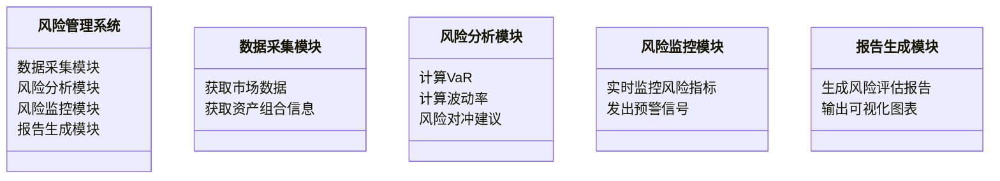
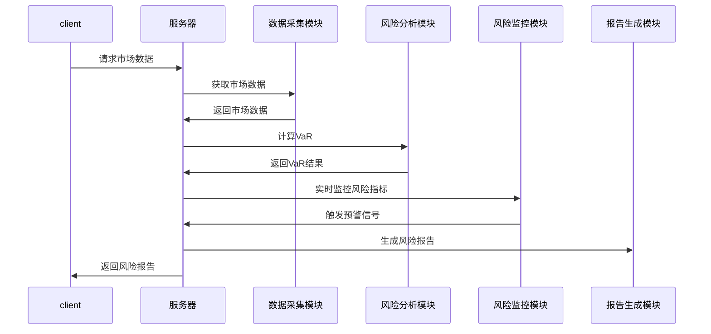

                 


# 风险管理技术：保护投资组合的工具和策略

## 关键词：风险管理、投资组合、VaR、风险对冲、资产配置

## 摘要：  
在投资领域，风险管理是确保投资组合安全与稳健的关键。本文将深入探讨风险管理的核心概念、工具和策略，结合数学模型和实际案例，提供全面的分析与解决方案。通过系统架构设计和项目实战，帮助读者掌握保护投资组合的实用方法。

---

# 第1章: 风险管理的基本概念与背景

## 1.1 风险管理的定义与重要性

### 1.1.1 风险的定义与特征  
风险是指在投资过程中，由于不确定因素导致投资收益偏离预期的可能性。其特征包括不确定性、普遍性、可测性和可控制性。  

### 1.1.2 风险管理的重要性与作用  
风险管理能够帮助投资者降低损失、提高收益的稳定性，并在市场波动中保持投资组合的稳健性。它是实现长期投资目标的关键。  

### 1.1.3 投资组合风险管理的核心目标  
通过识别、评估和控制风险，优化资产配置，最大化收益与风险的平衡。  

---

## 1.2 风险的来源

### 1.2.1 市场风险  
市场整体波动带来的投资损失，如股市下跌或利率变化。  

### 1.2.2 信用风险  
债券或贷款等信用工具的发行人违约风险。  

### 1.2.3 流动性风险  
资产难以迅速变现而不影响其价值的风险。  

### 1.2.4 操作风险  
由于操作失误或系统故障导致的损失风险。  

---

## 1.3 风险与收益的平衡

### 1.3.1 风险与收益的关系  
高风险通常意味着高收益，但风险管理确保收益的稳定性。  

### 1.3.2 投资组合风险对收益的影响  
资产配置和分散投资可以降低特定风险，提高整体收益。  

### 1.3.3 风险厌恶与风险偏好  
投资者的风险偏好影响其投资策略和资产选择。  

---

## 1.4 本章小结  

---

# 第2章: 风险管理的核心概念与工具

## 2.1 风险的衡量指标

### 2.1.1 波动率  
资产价格波动的程度，常用标准差衡量。  

$$ \text{波动率} = \sigma = \sqrt{\frac{1}{n-1} \sum_{i=1}^{n} (x_i - \bar{x})^2} $$  

### 2.1.2 最大回撤（Max Drawdown）  
从峰值到谷底的最大损失，反映资产的最大潜在损失。  

### 2.1.3 风险价值（VaR）  
在特定置信水平下，可能的最大损失。  

$$ \text{VaR} = \text{损失的分位数} $$  

### 2.1.4 穿透风险（CVaR）  
VaR的延伸，考虑超过VaR的潜在损失。  

---

## 2.2 资产配置与分散投资

### 2.2.1 现代投资组合理论（MPT）  
通过分散投资降低非系统性风险，优化收益与风险的比值。  

### 2.2.2 资产分散化的基本原理  
将资金分配到不同资产类别或行业，降低特定风险。  

### 2.2.3 资产配置的数学模型  
基于均值-方差优化的资产配置模型。  

$$ \text{目标函数} = \text{Minimize} \left( \sigma^2 \right) \quad \text{Subject to} \quad \sum_{i=1}^{n} w_i = 1 $$  

---

## 2.3 风险对冲策略

### 2.3.1 期权与期货的基本原理  
利用衍生品对冲特定风险，如使用期货对冲利率风险。  

### 2.3.2 利用衍生品对冲风险  
通过期权或期货合约锁定价格波动带来的损失。  

### 2.3.3 风险对冲的优缺点  
优点：降低特定风险；缺点：可能增加操作复杂性和成本。  

---

## 2.4 本章小结  

---

# 第3章: 风险管理的数学模型与算法

## 3.1 风险价值（VaR）的计算

### 3.1.1 VaR的定义与公式  
$$ \text{VaR} = \text{损失的分位数} $$  

### 3.1.2 历史模拟法计算VaR  
基于历史价格数据计算资产组合的VaR。  

### 3.1.3 方差-协方差法计算VaR  
假设资产收益服从正态分布，计算VaR。  

### 3.1.4 蒙特卡洛模拟法计算VaR  
通过模拟大量随机样本，估算VaR。  

---

## 3.2 风险调整后的收益评估

### 3.2.1 夏普比率  
衡量单位风险超额收益。  

$$ \text{夏普比率} = \frac{E(r_p) - r_f}{\sigma_p} $$  

### 3.2.2 特雷诺比率  
基于CAPM模型的风险调整收益。  

### 3.2.3 净风险收益比  
衡量收益与风险的比值。  

---

## 3.3 风险管理的优化算法

### 3.3.1 均值-方差优化  
优化投资组合的风险和收益。  

$$ \text{Minimize} \left( \sigma^2 \right) \quad \text{Subject to} \quad \sum_{i=1}^{n} w_i = 1 $$  

### 3.3.2 贝叶斯优化  
基于概率模型优化风险投资组合。  

---

## 3.4 算法实现与案例分析

### 3.4.1 股票组合的VaR计算  
假设我们有两只股票A和B，收益率分别为10%和15%，波动率分别为20%和30%，相关系数为0.5。计算组合的VaR（95%置信水平）。  

使用蒙特卡洛模拟法：生成大量资产组合的收益率数据，计算第5百分位数的损失。  

### 3.4.2 风险对冲策略的实现  
利用期货合约对冲利率风险，计算对冲后的VaR。  

---

## 3.5 本章小结  

---

# 第4章: 风险管理系统的系统分析与架构设计

## 4.1 问题场景介绍

### 4.1.1 风险管理系统的目标  
实时监控投资组合风险，提供预警和对冲建议。  

### 4.1.2 需求分析  
- 数据采集：获取市场数据和资产组合信息。  
- 风险分析：计算VaR、波动率等指标。  
- 风险监控：实时监控并预警风险。  
- 报告生成：生成风险评估报告。  

---

## 4.2 系统功能设计

### 4.2.1 领域模型（Mermaid 类图）  



---

## 4.3 系统架构设计

### 4.3.1 系统架构图（Mermaid 架构图）  

```mermaid
client
    --> HTTP
    --> 服务器
    --> 数据库

服务器
    --> 数据采集模块
    --> 风险分析模块
    --> 风险监控模块
    --> 报告生成模块

数据库
    --> 市场数据表
    --> 资产组合表
    --> 风险指标表
```

---

## 4.4 系统接口设计

### 4.4.1 API 接口  
- 数据接口：获取市场数据和资产组合信息。  
- 分析接口：计算VaR、波动率等指标。  
- 监控接口：实时监控风险指标并触发预警。  

---

## 4.5 系统交互流程（Mermaid 序列图）  



---

## 4.6 本章小结  

---

# 第5章: 项目实战——构建风险管理系统的具体实现

## 5.1 环境安装与配置

### 5.1.1 安装 Python 环境  
使用 Anaconda 或虚拟环境安装 Python 3.8+。  

### 5.1.2 安装相关库  
安装 pandas、numpy、scipy、matplotlib、arch 等库。  

## 5.2 核心功能实现

### 5.2.1 数据采集模块  
从 Yahoo Finance 获取股票数据。  

```python
import pandas as pd
import yfinance as yf

def get_data(tickers, start, end):
    data = yf.download(tickers, start=start, end=end)
    return data.Close
```

### 5.2.2 风险分析模块  
计算 VaR 和波动率。  

```python
import numpy as np
import pandas as pd
from arch import arch_model

def calculate_VaR(data, confidence_level=0.95):
    returns = np.log(data / data.shift(1)).dropna()
    model = arch_model(returns, p=1, q=1)
    results = model.fit()
    VaR = results.resid Recursive residuals的分布
    VaR_value = np.percentile(sorted_residuals, (1 - confidence_level) * 100)
    return VaR_value
```

### 5.2.3 风险监控模块  
实时监控并预警风险。  

```python
import time
import warnings
warnings.filterwarnings("ignore")

def monitor_risk(data, threshold):
    while True:
        current_risk = calculate_VaR(data)
        if current_risk > threshold:
            print("Risk Warning: VaR exceeds threshold")
        time.sleep(3600)  # 每小时检查一次
```

### 5.2.4 报告生成模块  
生成风险评估报告。  

```python
import matplotlib.pyplot as plt

def generate_report(data):
    plt.figure(figsize=(10, 6))
    data.plot()
    plt.title("Risk Analysis Report")
    plt.xlabel("Time")
    plt.ylabel("Value")
    plt.savefig("risk_report.png")
```

---

## 5.3 项目实战案例

### 5.3.1 数据获取与预处理  
从 Yahoo Finance 获取股票数据并清洗。  

### 5.3.2 VaR 计算与分析  
计算资产组合的 VaR，并与市场基准进行比较。  

### 5.3.3 风险对冲与优化  
使用期货合约对冲部分风险，优化投资组合。  

### 5.3.4 系统集成与测试  
将各个模块集成到系统中，测试功能和性能。  

---

## 5.4 本章小结  

---

# 第6章: 案例分析与最佳实践

## 6.1 案例分析

### 6.1.1 2008 年金融危机的案例分析  
分析危机中风险管理的失效与改进措施。  

### 6.1.2 量化投资组合的风险管理实践  
分享如何通过VaR和波动率优化投资组合。  

---

## 6.2 最佳实践 tips

### 6.2.1 定期调整投资组合  
根据市场变化和风险评估结果，动态调整资产配置。  

### 6.2.2 使用多元模型  
结合历史模拟、方差-协方差和蒙特卡洛模拟等多种方法进行风险评估。  

### 6.2.3 建立预警机制  
实时监控风险指标，及时采取应对措施。  

---

## 6.3 小结与展望  

---

## 总结与致谢  

---

## 作者信息  

作者：AI天才研究院/AI Genius Institute & 禅与计算机程序设计艺术 /Zen And The Art of Computer Programming

