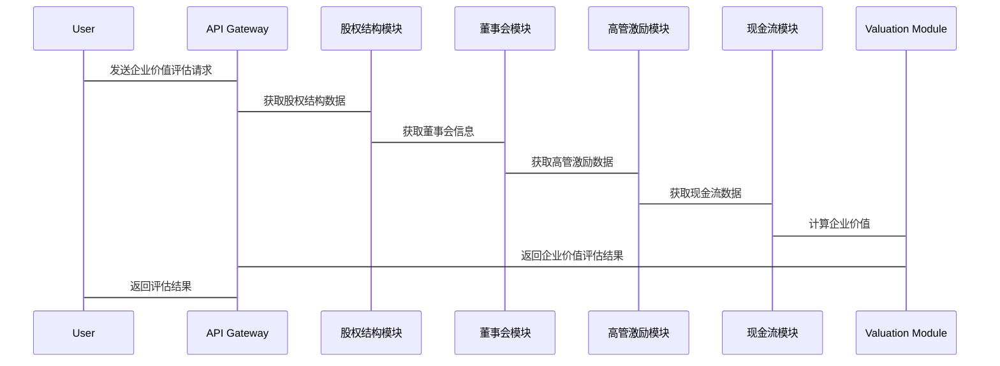

                 


# 第一部分: 公司治理与价值投资的背景与基础

# 第1章: 公司治理与价值投资概述

## 1.1 公司治理的基本概念
### 1.1.1 公司治理的定义与原则
公司治理是指通过公司章程、协议和规则来管理公司，确保董事会和管理层的有效运作，实现股东价值最大化。其核心原则包括透明度、问责制和公平性。

### 1.1.2 公司治理的核心要素
- 股权结构
- 董事会结构
- 高管激励机制
- 信息披露

### 1.1.3 公司治理的演变与发展趋势
从股东至上到利益相关者资本主义，再到ESG投资的兴起，公司治理不断演变，强调可持续发展和社会责任。

## 1.2 价值投资的基本概念
### 1.2.1 价值投资的定义与特点
价值投资是通过分析企业基本面，寻找市场价格低于内在价值的投资标的。其特点包括长期投资、注重安全边际和逆向投资。

### 1.2.2 价值投资的核心理念
- 安全边际：买入价格低于内在价值。
- 股票的价值：企业未来现金流的现值。
- 长期视角：关注企业的长期盈利能力。

### 1.2.3 价值投资与公司治理的关系
公司治理影响企业的长期价值，良好的治理是价值投资的重要考量因素。

## 1.3 公司治理与价值投资的相互作用
### 1.3.1 公司治理对价值投资的影响
- 股权结构影响控制权和利益分配。
- 董事会治理影响战略制定和执行。
- 高管激励影响管理层积极性。

### 1.3.2 价值投资对公司的治理优化
- 投资者关注治理结构，推动公司改进治理。
- 良好的治理提升企业价值，吸引更多投资者。

### 1.3.3 两者结合的必要性与重要性
- 提高企业治理水平，增强投资者信心。
- 优化企业价值，实现长期共赢。

## 1.4 本章小结
本章介绍了公司治理和价值投资的基本概念及其相互关系，为后续分析奠定了基础。

---

# 第二部分: 公司治理与价值投资的核心概念与联系

# 第2章: 公司治理与价值投资的核心要素

## 2.1 公司治理的核心要素分析
### 2.1.1 股权结构与股东权利
- 控制权分配：大股东 vs. 小股东。
- 股东权利：投票权、知情权、收益权。

### 2.1.2 董事会的构成与职责
- 独立董事的作用：监督和建议。
- 董事会职责：制定战略、监控执行、风险管理。

### 2.1.3 高管团队的激励机制
- 激励措施：股权激励、奖金、期权。
- 激励效果：与企业绩效挂钩，提升积极性。

## 2.2 价值投资的核心要素分析
### 2.2.1 企业价值的评估方法
- 股权自由现金流模型：DCF方法。
- 市盈率（P/E）：市价与收益比率。
- 市净率（P/B）：市价与净资产比率。

### 2.2.2 企业的财务健康状况
- 盈利能力：ROE、净利率。
- 偿债能力：负债率、流动比率。
- 现金流：自由现金流是否健康。

### 2.2.3 企业的竞争优势与市场地位
- 核心竞争力：技术、品牌、成本优势。
- 市场地位：行业龙头 vs. 二线企业。

## 2.3 公司治理与价值投资的核心联系
### 2.3.1 公司治理对企业价值的影响路径
- 股权结构影响控制权和利益分配。
- 董事会治理影响战略制定和执行。
- 高管激励影响管理层积极性。

### 2.3.2 价值投资视角下的公司治理优化
- 投资者关注治理结构，推动公司改进治理。
- 良好的治理提升企业价值，吸引更多投资者。

### 2.3.3 公司治理与价值投资的协同效应
- 提高企业治理水平，增强投资者信心。
- 优化企业价值，实现长期共赢。

## 2.4 本章小结
本章深入分析了公司治理和价值投资的核心要素及其相互关系，揭示了两者协同的重要性。

---

# 第三部分: 公司治理与价值投资的数学模型与算法原理

# 第3章: 企业价值评估的数学模型

## 3.1 企业价值评估的基本方法
### 3.1.1 股权自由现金流模型
- 定义：DCF模型，基于未来现金流的现值。
- 公式：企业价值 = ∑(FCF / (1 + WACC)^t)

### 3.1.2 加权平均资本成本（WACC）模型
- 定义：企业整体资本成本的加权平均。
- 公式：WACC = (E/V) * Re + (D/V) * Rd * (1 - Tc)

### 3.1.3 市盈率与市净率模型
- P/E = 市价 / 每股收益
- P/B = 市价 / 每股净资产

## 3.2 公司治理对价值评估的影响
### 3.2.1 股权结构对价值的影响
- 控制权集中：可能影响企业价值，需考虑代理成本。
- 股权分散：可能影响企业稳定性，需考虑治理效率。

### 3.2.2 董事会效率对价值的影响
- 高效董事会：制定良好战略，提升企业价值。
- 低效董事会：可能导致战略失误，影响企业价值。

### 3.2.3 高管激励对价值的影响
- 激励机制合理：提升管理层积极性，推动企业增长。
- 激励机制不合理：可能导致短期行为，损害企业价值。

## 3.3 企业价值评估的算法实现
### 3.3.1 WACC模型的数学公式
$$ WACC = \frac{E}{V} \times r_e + \frac{D}{V} \times r_d \times (1 - T_c) $$

### 3.3.2 DCF模型的应用步骤
1. 预测未来现金流。
2. 确定合适的贴现率（WACC）。
3. 计算未来现金流的现值。
4. 加上残值，得出企业价值。

### 3.3.3 代码实现
```python
def calculate_wacc(equity, debt, cost_equity, cost_debt, tax_rate, total_value):
    wacc = (equity / total_value) * cost_equity + (debt / total_value) * cost_debt * (1 - tax_rate)
    return wacc

def calculateenterprise_value(fcf, wacc, years):
    enterprise_value = 0
    for year in range(years):
        enterprise_value += fcf / (1 + wacc) ** (year + 1)
    return enterprise_value
```

## 3.4 本章小结
本章通过数学模型和算法，分析了公司治理对价值评估的影响，并通过代码实现展示了如何计算企业价值。

---

# 第四部分: 公司治理与价值投资的系统架构与设计

# 第4章: 系统架构与设计

## 4.1 系统功能设计
### 4.1.1 领域模型设计
- 实体：公司、股东、董事会、高管、现金流。
- 关系：股东拥有公司，董事会管理公司，高管执行战略，现金流反映企业健康状况。

```mermaid
classDiagram
    class 公司 {
        股权结构
        董事会结构
        高管团队
        现金流
    }
    class 股东 {
        股权比例
        股东权利
    }
    class 董事会 {
        独立董事
        委员会
    }
    class 高管团队 {
        激励机制
        绩效考核
    }
    company -> 股东: 拥有
    company -> 董事会: 管理
    company -> 高管团队: 执行
```

### 4.1.2 系统架构设计
- 分层架构：数据层、业务逻辑层、用户界面层。
- 模块划分：股权结构模块、董事会模块、高管激励模块、现金流模块。


## 4.2 系统接口设计
### 4.2.1 API接口设计
- GET /company/{id}：获取公司信息。
- POST /valuation：提交企业价值评估请求。

### 4.2.2 接口交互设计


## 4.3 本章小结
本章通过系统架构和设计，展示了如何将公司治理与价值投资的理念转化为实际的系统实现。

---

# 第五部分: 项目实战与案例分析

# 第5章: 项目实战与案例分析

## 5.1 项目环境配置
### 5.1.1 系统需求
- 操作系统：Linux/Windows/MacOS
- 开发工具：Python 3.8+
- 依赖库：pandas, numpy, matplotlib

### 5.1.2 环境安装
```bash
pip install pandas numpy matplotlib
```

## 5.2 系统核心实现
### 5.2.1 核心代码实现
```python
import pandas as pd
import numpy as np

def calculate_enterprise_value(fcf, wacc, years):
    ev = 0
    for year in range(years):
        ev += fcf / (1 + wacc) ** (year + 1)
    return ev

# 示例数据
fcf = [100, 120, 150, 200, 250]
wacc = 0.1
years = 5

enterprise_value = calculate_enterprise_value(fcf, wacc, years)
print(f"企业价值：{enterprise_value}")
```

### 5.2.2 代码应用解读与分析
- 计算企业价值：通过现金流和WACC计算现值。
- 模型假设：现金流预测和WACC的准确性直接影响结果。

## 5.3 实际案例分析
### 5.3.1 案例背景
假设某公司未来5年的自由现金流分别为100, 120, 150, 200, 250万元，WACC为10%。

### 5.3.2 案例分析
- 计算企业价值：
  $$ EV = \sum_{t=1}^{5} \frac{100}{(1.1)^t} $$
- 结果：企业价值约为370.46万元。

## 5.4 本章小结
本章通过实际案例分析，展示了如何将公司治理与价值投资的理念应用于实际项目中。

---

# 第六部分: 总结与展望

# 第6章: 总结与展望

## 6.1 本章总结
- 公司治理与价值投资的相互作用。
- 数学模型和系统架构的应用。
- 项目实战中的应用与分析。

## 6.2 未来展望
- 更多的公司治理因素纳入价值评估。
- 结合人工智能和大数据技术，优化企业价值评估。
- 探讨ESG投资对公司治理和价值的影响。

## 6.3 最佳实践 tips
- 投资者应关注企业的治理结构。
- 企业应优化治理以提升价值。
- 结合定量分析与定性分析，全面评估企业价值。

## 6.4 本章小结
总结了本书的核心内容，并展望了未来的研究方向和实践应用。

---

# 作者信息

作者：AI天才研究院/AI Genius Institute & 禅与计算机程序设计艺术 /Zen And The Art of Computer Programming

---

**摘要：** 本文系统阐述了马丁·惠特曼的公司治理价值投资理念，通过背景介绍、核心概念、数学模型、系统架构、项目实战和总结等部分，深入分析了公司治理与价值投资的相互作用，展示了如何通过优化公司治理结构来提升企业价值。文章内容丰富，逻辑严密，为投资者和企业管理者提供了实践指导。

**关键词：** 公司治理，价值投资，企业价值，数学模型，系统架构

