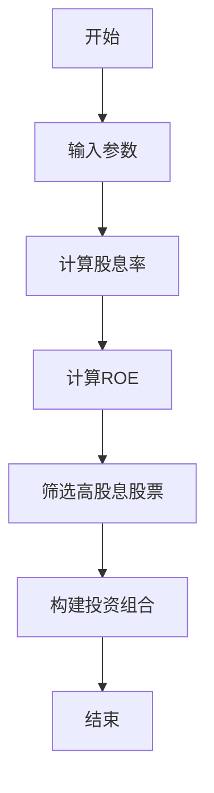

                 


# 高股息策略：构建稳定现金流的投资组合

## 关键词：高股息策略，投资组合，股息率，股东权益回报率，风险管理

## 摘要：  
高股息策略是一种通过投资高股息收益率的股票来构建稳定现金流的投资方法。本文将从高股息策略的核心概念、数学模型、系统化构建、风险管理到实际案例分析进行全面探讨，帮助读者掌握如何在复杂的投资环境中利用高股息策略实现稳健收益。

---

## 第一章: 高股息策略的背景与定义

### 1.1 高股息投资的背景与现状
#### 1.1.1 全球投资环境的变化
- 近年来，全球经济波动加剧，低利率环境持续，投资者面临资产收益下降的挑战。
- 高股息股票因其稳定的现金流和较高的分红率，成为投资者关注的焦点。

#### 1.1.2 高股息策略的兴起
- 投资者对稳定收益的需求增加，推动了高股息策略的普及。
- 高股息股票在不同市场周期中的表现优于指数，吸引了更多机构投资者的关注。

#### 1.1.3 高股息策略的适用场景
- 适合追求稳定现金流的投资者，尤其是退休人士和保守型投资者。
- 在低增长周期中，高股息股票的表现更具防御性。

### 1.2 高股息策略的核心概念
#### 1.2.1 高股息策略的定义
- 高股息策略是指通过投资股息收益率较高且具有稳定分红能力的股票，构建投资组合以获取稳定现金流的投资方法。

#### 1.2.2 高股息策略的特点
| 特性 | 描述 |
|------|------|
| 稳定性 | 高股息股票通常来自盈利稳定的公司，分红能力强。 |
| 收益性 | 高股息率提供较高的当前收益，同时股价波动较小。 |
| 防御性 | 在市场下行时，高股息股票表现相对抗跌。 |

#### 1.2.3 高股息策略与其它投资策略的对比
- **与成长型投资对比**：高股息策略更注重当前收益，而成长型投资关注未来增长潜力。
- **与价值投资对比**：高股息策略结合了价值与收益，注重股息回报。

### 1.3 高股息策略的优势与局限性
#### 1.3.1 高股息策略的优势
- 稳定的现金流来源，降低投资组合的波动性。
- 在市场低迷时，高股息股票具有较强的防御性。

#### 1.3.2 高股息策略的局限性
- 股息率过高的股票可能面临分红能力不足的风险。
- 高股息股票在市场上涨时可能跑输指数。

#### 1.3.3 高股息策略的适用人群
- 适合追求稳定收益的投资者，尤其是需要定期现金流的个人或机构。

---

## 第二章: 高股息策略的核心要素

### 2.1 高股息策略的三大核心要素
#### 2.1.1 股息率
- 股息率定义：股息率 = 年度股息 / 当前股价。
- 示例：某股票股息率为5%，即每年每股分红5元，股价为100元。

#### 2.1.2 股息增长能力
- 股息增长能力是公司持续分红能力的体现。
- 示例：公司过去5年股息增长率分别为5%、6%、4%、7%、5%。

#### 2.1.3 股东权益回报率(ROE)
- ROE定义：ROE = 净利润 / 股东权益。
- 高ROE意味着公司使用股东资金的效率高，盈利能力强。

### 2.2 高股息策略的筛选标准
#### 2.2.1 股息率的计算与分析
- 股息率计算公式：$$股息率 = \frac{股息}{股价}$$
- 示例：某股票股息率为5%，即每年每股分红5元，股价为100元。

#### 2.2.2 股息增长的稳定性
- 稳定的股息增长是高股息策略的关键。
- 示例：某公司过去5年股息增长分别为5%、6%、4%、7%、5%。

#### 2.2.3 股东权益回报率的评估
- 高ROE意味着公司盈利能力强，分红能力高。
- 示例：某公司ROE为15%，表明其股东资金使用效率较高。

### 2.3 高股息策略的风险管理
#### 2.3.1 高股息策略的主要风险
- **流动性风险**：高股息股票可能流动性较差。
- **分红能力不足**：股息率过高的公司可能无法持续分红。

#### 2.3.2 风险的量化与评估
- 通过股息率和ROE评估公司的分红能力和盈利能力。
- 示例：某公司股息率为10%，但ROE仅为5%，可能存在分红能力不足的风险。

#### 2.3.3 风险控制的策略
- **分散投资**：避免过度集中于单一行业或公司。
- **动态调整**：定期评估投资组合，及时调整持仓。

---

## 第三章: 高股息策略的系统化构建

### 3.1 高股息策略的系统化构建思路
#### 3.1.1 系统化投资的定义
- 系统化投资是指基于量化指标和逻辑规则进行投资决策。

#### 3.1.2 高股息策略的系统化框架
- **第一步**：筛选高股息股票。
- **第二步**：评估公司基本面。
- **第三步**：构建投资组合。

#### 3.1.3 系统化构建的优势
- 系统化构建能够减少人为情绪干扰，提高投资的纪律性。

### 3.2 高股息策略的指标体系
#### 3.2.1 股息率的计算与筛选
- 使用股息率公式筛选符合条件的股票。
- 示例：筛选股息率大于5%的股票。

#### 3.2.2 股息增长能力的评估
- 通过股息增长率指标评估公司的分红能力。
- 示例：选择过去5年股息增长率大于4%的公司。

#### 3.2.3 股东权益回报率的分析
- 高ROE的公司具有更强的盈利能力，分红能力更强。
- 示例：筛选ROE大于10%的公司。

### 3.3 高股息策略的组合构建
#### 3.3.1 组合构建的原则
- **分散化**：避免集中投资，降低风险。
- **稳定性**：选择股息率高且增长稳定的公司。

#### 3.3.2 组合构建的步骤
1. **筛选高股息股票**：使用股息率和ROE指标筛选。
2. **评估公司基本面**：分析公司的财务状况和行业前景。
3. **构建投资组合**：根据风险偏好和收益目标构建组合。

#### 3.3.3 组合优化的策略
- **动态调整**：定期评估组合表现，及时调整持仓。
- **分散投资**：避免过度集中于单一行业或公司。

---

## 第四章: 高股息策略的数学模型与算法

### 4.1 高股息策略的数学模型
#### 4.1.1 股息率计算公式
$$股息率 = \frac{股息}{股价}$$

#### 4.1.2 股息增长模型
$$股息增长 = 股息率 \times (1 + 增长率)$$

#### 4.1.3 股东权益回报率计算
$$ROE = \frac{净利润}{股东权益}$$

### 4.2 高股息策略的算法实现
#### 4.2.1 算法流程图


#### 4.2.2 算法代码实现
```python
def high_dividend_strategy(stocks):
    selected = []
    for stock in stocks:
        dividend_yield = stock.dividend / stock.price
        roe = stock.net_profit / stock.shareholder_equity
        if dividend_yield > 0.05 and roe > 0.1:
            selected.append(stock)
    return selected
```

---

## 第五章: 高股息策略的风险管理与优化

### 5.1 高股息策略的风险管理
#### 5.1.1 风险来源
- **市场风险**：整体市场波动对高股息股票的影响。
- **流动性风险**：高股息股票可能流动性较差。
- **分红能力不足**：股息率过高的公司可能无法持续分红。

#### 5.1.2 风险控制策略
- **分散投资**：避免集中投资，降低风险。
- **动态调整**：定期评估投资组合，及时调整持仓。

### 5.2 高股息策略的优化
#### 5.2.1 优化目标
- 提高投资组合的收益与风险比。

#### 5.2.2 优化方法
- **引入多因子模型**：考虑更多因子如市盈率、市净率等。
- **动态再平衡**：定期调整组合，保持目标配置。

---

## 第六章: 高股息策略的未来展望与投资建议

### 6.1 高股息策略的未来展望
- 随着全球经济的不确定性增加，高股息策略的需求将持续增长。
- 技术进步将推动高股息策略的系统化和智能化。

### 6.2 高股息策略的投资建议
- **长期投资者**：适合追求稳定收益的长期投资者。
- **短期投资者**：需关注市场波动，及时调整策略。

---

## 作者：AI天才研究院/AI Genius Institute & 禅与计算机程序设计艺术 /Zen And The Art of Computer Programming

---

通过以上结构，我们可以系统地了解高股息策略的核心概念、数学模型、系统化构建方法以及风险管理策略。希望这篇文章能为投资者提供有价值的参考，帮助他们在复杂的投资环境中构建稳定的现金流来源。

