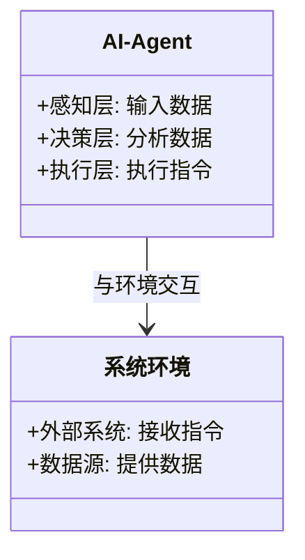
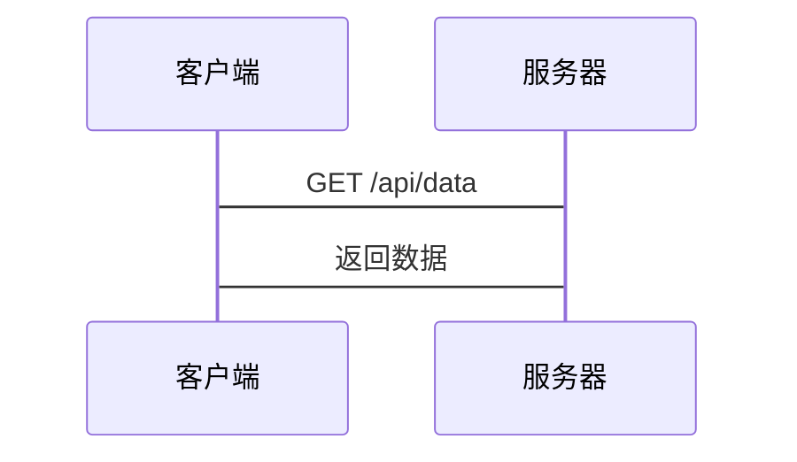
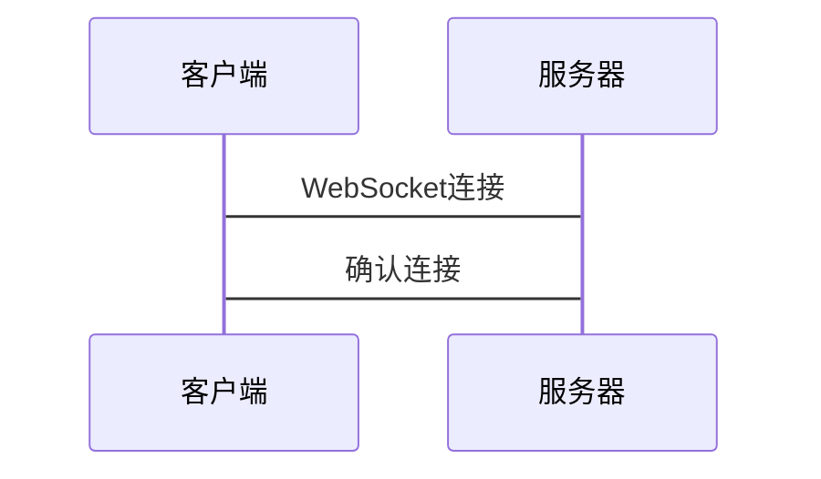
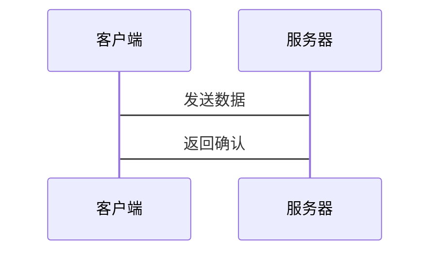
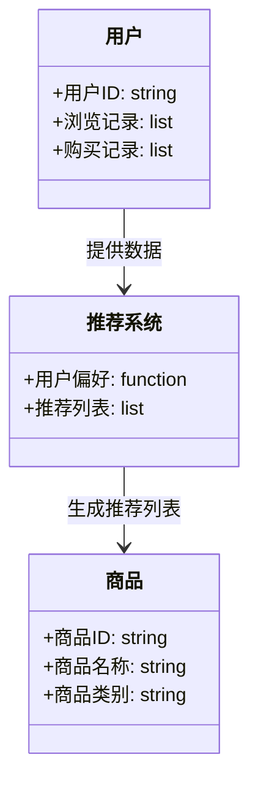
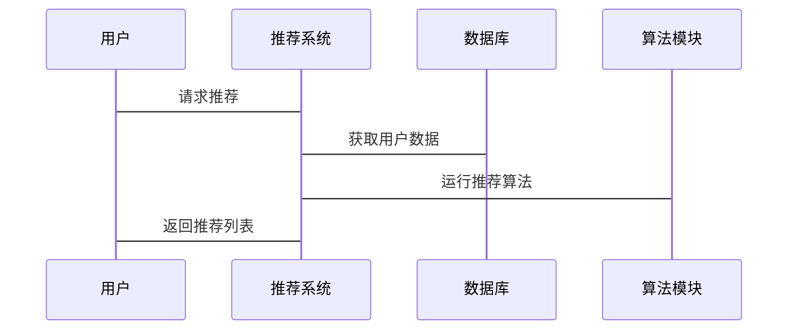

                 


# AI Agent与企业现有系统的无缝集成方案

> 关键词：AI Agent，企业系统集成，无缝集成，系统架构，通信协议

> 摘要：随着人工智能技术的迅速发展，AI Agent（智能代理）在企业中的应用越来越广泛。本文探讨了AI Agent与企业现有系统的无缝集成方案，从技术原理、系统架构到实际应用，详细分析了如何通过通信协议、系统设计和项目实战实现AI Agent与企业系统的高效集成。文章还提供了数学模型、算法流程图和系统架构图等详细内容，帮助读者全面理解AI Agent与企业系统集成的核心技术。

---

## 第一部分: AI Agent与企业系统集成的背景与基础

### 第1章: AI Agent概述

#### 1.1 AI Agent的基本概念

##### 1.1.1 什么是AI Agent
AI Agent（人工智能代理）是一种能够感知环境、自主决策并采取行动的智能实体。它通过接收输入信息，分析问题，生成解决方案，并执行操作来实现目标。AI Agent可以是软件程序、机器人或其他智能设备。

##### 1.1.2 AI Agent的核心特征
- **自主性**：能够在没有人工干预的情况下自主运行。
- **反应性**：能够实时感知环境并做出反应。
- **目标导向**：所有行为都围绕实现特定目标展开。
- **学习能力**：通过数据和经验不断优化自身性能。

##### 1.1.3 AI Agent与传统程序的区别
传统的程序通常是基于规则的，按照预设的逻辑执行任务，而AI Agent具有自主性和学习能力，能够根据环境动态调整行为。

| 特性         | 传统程序       | AI Agent       |
|--------------|----------------|----------------|
| 自主性       | 无             | 高             |
| 学习能力     | 无             | 高             |
| 环境感知     | 无             | 高             |
| 决策能力     | 低             | 高             |

#### 1.2 AI Agent的类型

##### 1.2.1 知识型AI Agent
知识型AI Agent依赖于领域知识，通过推理和演绎解决问题。例如医疗诊断系统。

##### 1.2.2 数据驱动型AI Agent
数据驱动型AI Agent通过分析大量数据，利用机器学习算法进行预测和决策。例如推荐系统。

##### 1.2.3 混合型AI Agent
混合型AI Agent结合知识型和数据驱动型的优势，适用于复杂场景。例如智能客服系统。

#### 1.3 AI Agent在企业中的应用价值

##### 1.3.1 提高企业效率
AI Agent可以自动处理重复性任务，提高工作效率。

##### 1.3.2 优化决策过程
通过分析大量数据，AI Agent能够提供更精准的决策支持。

##### 1.3.3 支持业务创新
AI Agent可以帮助企业发现新的业务模式和创新机会。

### 第2章: 企业现有系统的概述

#### 2.1 企业系统的分类

##### 2.1.1 信息管理系统
信息管理系统用于企业内部信息的管理，例如ERP系统。

##### 2.1.2 业务流程系统
业务流程系统用于企业业务流程的自动化，例如订单处理系统。

##### 2.1.3 数据分析系统
数据分析系统用于企业数据的收集、处理和分析，例如数据仓库系统。

#### 2.2 企业系统集成的挑战

##### 2.2.1 系统异构性
不同系统使用不同的技术和标准，导致集成困难。

##### 2.2.2 数据一致性
数据在不同系统中可能有不同的表示方式，导致数据不一致。

##### 2.2.3 安全性问题
系统集成可能引入安全漏洞，导致数据泄露或系统被攻击。

#### 2.3 企业系统集成的目标

##### 2.3.1 实现无缝通信
确保不同系统之间能够高效通信，信息实时传递。

##### 2.3.2 保证数据一致性
确保数据在不同系统中保持一致，避免数据冗余和冲突。

##### 2.3.3 提供统一的用户界面
为用户提供一致的操作界面，简化操作流程。

---

## 第二部分: AI Agent与企业系统集成的技术实现

### 第3章: AI Agent的架构设计

#### 3.1 AI Agent的基本架构

##### 3.1.1 感知层
感知层负责接收外部输入，包括传感器数据、用户输入等。

##### 3.1.2 决策层
决策层负责分析数据，生成决策策略。

##### 3.1.3 执行层
执行层负责执行决策层生成的指令，与外部系统进行交互。



#### 3.2 基于模型的AI Agent设计

##### 3.2.1 领域模型构建
领域模型是AI Agent的核心，用于描述问题领域的概念和关系。

##### 3.2.2 状态表示方法
状态表示方法用于描述AI Agent的当前状态，例如使用状态向量。

##### 3.2.3 行为规划算法
行为规划算法用于生成AI Agent的行为序列，例如使用A*算法。

#### 3.3 基于数据驱动的AI Agent设计

##### 3.3.1 数据采集与预处理
数据采集与预处理是AI Agent的基础，确保数据的准确性和完整性。

##### 3.3.2 模型训练与优化
模型训练与优化是数据驱动型AI Agent的核心，使用机器学习算法进行训练。

##### 3.3.3 模型部署与监控
模型部署与监控是确保AI Agent正常运行的重要步骤。

### 第4章: AI Agent与企业系统的通信协议

#### 4.1 通信协议的选择

##### 4.1.1 HTTP协议
HTTP协议是基于请求-响应模型的协议，适合简单的数据传输。

##### 4.1.2 WebSocket协议
WebSocket协议是基于双向通信的协议，适合实时数据传输。

##### 4.1.3 RPC协议
RPC协议是远程过程调用协议，适合复杂的系统集成。

#### 4.2 基于HTTP协议的通信

##### 4.2.1 请求-响应模型


##### 4.2.2 请求格式
```json
{
    "method": "GET",
    "url": "/api/data",
    "headers": {
        "Content-Type": "application/json"
    }
}
```

#### 4.3 基于WebSocket协议的通信

##### 4.3.1 WebSocket连接建立


##### 4.3.2 数据传输


---

## 第三部分: 系统架构设计与实现

### 第5章: 系统架构设计

#### 5.1 问题场景介绍
假设我们有一个电商系统，需要集成一个推荐AI Agent，根据用户行为推荐商品。

#### 5.2 系统功能设计

##### 5.2.1 领域模型设计


#### 5.3 系统架构设计

##### 5.3.1 分层架构


##### 5.3.2 组件交互


---

## 第四部分: 项目实战

### 第6章: 项目实战

#### 6.1 环境安装
安装Python、TensorFlow、Flask等工具。

#### 6.2 系统核心实现

##### 6.2.1 推荐算法实现
```python
import numpy as np
from sklearn.metrics.pairwise import cosine_similarity

# 示例数据
user_data = {
    "用户1": [5, 3, 0, 0, 4],
    "用户2": [4, 0, 2, 1, 3],
    "用户3": [0, 1, 4, 2, 2]
}

# 计算相似度
def compute_similarity(data):
    matrix = np.array(list(data.values()))
    similarity = cosine_similarity(matrix)
    return similarity

similarity_matrix = compute_similarity(user_data)
print(similarity_matrix)
```

##### 6.2.2 系统接口设计
```python
from flask import Flask, jsonify

app = Flask(__name__)

@app.route('/api/recommend', methods=['POST'])
def recommend():
    data = request.json
    user_id = data['user_id']
    # 实现推荐算法
    return jsonify({'推荐列表': ['商品1', '商品2']})
```

#### 6.3 代码应用解读

##### 6.3.1 推荐算法解读
推荐算法使用余弦相似度计算用户相似度，根据用户行为数据生成推荐列表。

##### 6.3.2 系统接口解读
系统接口使用Flask框架，接收用户ID，调用推荐算法生成推荐列表，并返回结果。

#### 6.4 案例分析与详细讲解
通过具体案例，详细讲解AI Agent如何与企业系统集成，包括数据采集、模型训练、接口设计和结果展示。

---

## 第五部分: 高级主题与未来趋势

### 第7章: 高级主题

#### 7.1 多AI Agent协作

##### 7.1.1 分布式AI Agent
分布式AI Agent通过协调机制实现协作，例如使用分布式计算框架。

##### 7.1.2 协作协议
协作协议定义AI Agent之间的通信规则，例如使用共识算法。

#### 7.2 复杂场景下的AI Agent应用

##### 7.2.1 异常处理
在复杂场景下，AI Agent需要具备异常检测和自适应能力。

##### 7.2.2 高可用性
通过冗余设计和故障恢复机制，确保AI Agent系统的高可用性。

### 第8章: 未来趋势

#### 8.1 边缘计算与AI Agent
边缘计算能够降低延迟，提升AI Agent的实时性。

#### 8.2 5G技术与AI Agent
5G技术能够提供更高的带宽和更低的延迟，进一步推动AI Agent的应用。

---

## 第六部分: 最佳实践与总结

### 第9章: 最佳实践

#### 9.1 项目实施注意事项

##### 9.1.1 数据质量
确保数据的准确性和完整性，避免数据偏差。

##### 9.1.2 系统安全性
采取严格的权限控制和加密措施，确保系统安全。

##### 9.1.3 系统可扩展性
设计灵活的架构，确保系统能够适应未来的变化。

### 第10章: 总结

#### 10.1 小结
本文详细探讨了AI Agent与企业系统集成的核心技术，包括架构设计、通信协议、系统架构和项目实战。

#### 10.2 注意事项
在实际应用中，需要充分考虑系统异构性、数据一致性和安全性问题。

#### 10.3 拓展阅读
推荐相关书籍和论文，供读者深入学习。

---

## 作者信息

作者：AI天才研究院/AI Genius Institute & 禅与计算机程序设计艺术/Zen And The Art of Computer Programming

