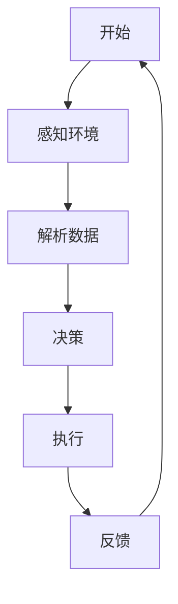
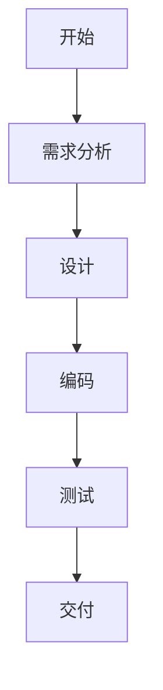

                 


---

# AI Agent与传统软件开发的区别

> 关键词：AI Agent, 传统软件开发, 对比分析, 算法原理, 系统架构

> 摘要：本文系统地分析了AI Agent与传统软件开发的区别，从核心概念、算法原理、系统架构到项目实战，全面探讨了两者的差异与联系，为读者提供了深入的理解和实践指导。

---

## 第一部分: AI Agent与传统软件开发的背景与核心概念

### 第1章: AI Agent与传统软件开发的背景介绍

#### 1.1 AI Agent的定义与特点
AI Agent（智能体）是指能够感知环境并采取行动以实现目标的实体。它具有以下特点：
- **自主性**：能够自主决策。
- **反应性**：能实时感知并响应环境变化。
- **目标导向**：所有行动基于明确的目标。
- **学习能力**：通过数据和经验不断优化行为。

#### 1.2 传统软件开发的定义与特点
传统软件开发是一种基于明确需求和模块化设计的开发方式，特点包括：
- **确定性**：基于明确的逻辑和需求。
- **模块化**：系统分为独立模块，便于维护和扩展。
- **预定义流程**：遵循固定的开发流程，如需求分析、设计、编码、测试。

#### 1.3 AI Agent与传统软件开发的区别
- **问题背景**：AI Agent解决复杂、动态的问题，而传统软件开发解决结构化、静态的问题。
- **问题解决方式**：AI Agent依赖数据驱动和机器学习，传统软件开发依赖模块化设计和预定义逻辑。
- **边界与外延**：AI Agent的应用范围更广，传统软件开发更专注于特定场景。
- **核心要素**：AI Agent涉及数据、模型、算法，传统软件开发涉及模块、流程、代码。

---

### 第2章: AI Agent与传统软件开发的核心概念对比

#### 2.1 核心概念原理
- **AI Agent的核心概念**：基于感知和行动的智能体，通过学习优化决策。
- **传统软件开发的核心概念**：基于模块化设计和预定义逻辑的系统构建。
- **对比与联系**：AI Agent依赖数据和算法，而传统软件开发依赖模块化和流程，两者在问题解决方式上有明显差异，但在实际应用中可以结合使用。

#### 2.2 属性特征对比
| 属性 | AI Agent | 传统软件开发 |
|------|-----------|---------------|
| 开发目标 | 动态、复杂问题 | 静态、结构化问题 |
| 开发周期 | 短周期迭代 | 长周期、模块化 |
| 维护方式 | 数据驱动优化 | 模块化维护 |

```mermaid
erDiagram
    class AI-Agent {
        +目标: string
        +感知: string
        +行动: string
    }
    class Traditional-Software {
        +模块: string
        +流程: string
        +代码: string
    }
    AI-Agent --> Traditional-Software : 通过数据优化模块
```

---

## 第二部分: AI Agent与传统软件开发的算法原理

### 第3章: AI Agent的算法原理

#### 3.1 AI Agent的算法流程


#### 3.2 传统软件开发的算法流程


#### 3.3 数学模型与公式
- AI Agent的数学模型：
  - $$P(a|b) = \frac{P(b|a)P(a)}{P(b)}$$
  - 示例：基于马尔可夫决策过程的AI Agent算法实现。

- 传统软件开发的数学模型：
  - $$f(x) = 2x + 3$$
  - 示例：简单的函数实现。

---

## 第三部分: AI Agent与传统软件开发的系统分析与架构设计

### 第4章: 系统分析与架构设计方案

#### 4.1 问题场景介绍
以智能客服系统为例，分析AI Agent与传统软件开发的系统架构。

#### 4.2 系统功能设计
- 领域模型：
  ```mermaid
  classDiagram
      class AI-Agent {
          +感知环境
          +决策
          +执行
      }
      class Traditional-Software {
          +模块化设计
          +预定义流程
      }
      AI-Agent -- Traditional-Software: 优化模块
  ```

- 系统架构设计：
  ```mermaid
  architectureDiagram
      AI-Agent --> Traditional-Software : 数据驱动优化
      Traditional-Software --> AI-Agent : 模块调用
  ```

- 系统接口设计：
  - AI Agent接口：API调用。
  - 传统软件接口：模块调用。

- 系统交互流程：
  ```mermaid
  sequenceDiagram
      AI-Agent -> Traditional-Software: 提供数据
      Traditional-Software -> AI-Agent: 返回优化结果
  ```

---

## 第四部分: AI Agent与传统软件开发的项目实战

### 第5章: 项目实战

#### 5.1 环境安装与配置
- 安装Python、机器学习库（如TensorFlow、Scikit-learn）。

#### 5.2 核心代码实现
- AI Agent代码示例：
  ```python
  import numpy as np
  from sklearn import tree

  # 数据集
  X = np.array([[0, 0], [1, 1], [2, 2], [3, 3]])
  y = np.array([0, 1, 2, 3])

  # 训练模型
  clf = tree.DecisionTreeClassifier()
  clf.fit(X, y)

  # 预测
  print(clf.predict([[4, 4]]))  # 输出：[4]
  ```

- 传统软件开发代码示例：
  ```python
  def traditional_software():
      module1 = Module1()
      module2 = Module2()
      result = module1.process(module2.input())
      return result

  class Module1:
      def process(self, input):
          # 处理逻辑
          return output

  class Module2:
      def input(self):
          # 提供输入
          return input_value
  ```

#### 5.3 功能解读与分析
- AI Agent实现：基于数据的智能决策。
- 传统软件实现：基于模块化设计的预定义流程。

#### 5.4 实际案例分析
通过智能客服系统的实际应用，分析AI Agent与传统软件开发在系统性能、维护成本、用户体验等方面的差异。

---

## 第五部分: AI Agent与传统软件开发的最佳实践

### 第6章: 最佳实践 tips

#### 6.1 小结
- AI Agent适用于复杂、动态的问题，传统软件开发适用于结构化、静态的问题。
- 两者可以结合使用，互补优势。

#### 6.2 注意事项
- AI Agent需要大量数据和计算资源，传统软件开发更注重模块化和流程。

#### 6.3 拓展阅读
- 推荐阅读《机器学习实战》、《软件工程：实践者的故事》。

---

## 作者

作者：AI天才研究院/AI Genius Institute & 禅与计算机程序设计艺术 /Zen And The Art of Computer Programming

--- 

这篇文章系统地探讨了AI Agent与传统软件开发的区别，从理论到实践，层层递进，帮助读者全面理解两者的差异与联系。

