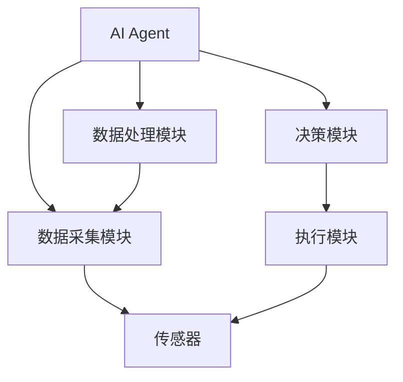

                 


# AI Agent与物联网的结合应用

---

## 关键词

- AI Agent, 物联网, 数据采集, 决策算法, 系统架构, 数学模型

---

## 摘要

随着人工智能和物联网技术的快速发展，AI Agent与物联网的结合正在成为智能化应用的重要趋势。本文系统地介绍了AI Agent与物联网的核心概念、算法原理、系统架构，并通过实际案例展示了它们的结合应用。文章深入分析了数据采集、决策算法、系统设计等关键环节，同时探讨了未来的发展方向。

---

## 第一部分：背景与核心概念

### 第1章：AI Agent与物联网的背景介绍

#### 1.1 AI Agent的基本概念

AI Agent（智能体）是指在计算机系统中能够感知环境并采取行动以实现目标的实体。AI Agent可以分为简单反射Agent和基于模型的反射Agent两类，广泛应用于推荐系统、自动驾驶、智能助手等领域。

- **简单反射Agent**：基于当前感知直接采取行动，适用于规则明确的场景，如自动门禁系统。
- **基于模型的反射Agent**：通过内部模型进行状态推理，适用于复杂场景，如智能音箱的语音交互。

#### 1.2 物联网的基本概念

物联网（IoT）是指通过各种信息传感设备，如传感器、RFID技术、全球定位系统、红外感应器等，按照约定的协议，把任何物品与互联网连接起来，实现信息交换和通信，以实现智能化识别、定位、跟踪、监控和管理。

物联网的关键技术包括数据采集、网络通信、数据处理和应用层开发。其应用场景涵盖智慧城市、智能家居、工业物联网等领域。

#### 1.3 AI Agent与物联网的结合背景

AI Agent与物联网的结合是技术发展的必然趋势。物联网提供了丰富的数据源，而AI Agent能够通过分析这些数据做出决策，从而提升系统的智能化水平。这种结合不仅提高了系统的响应速度，还增强了决策的准确性。

#### 1.4 本章小结

本章介绍了AI Agent和物联网的基本概念，分析了它们的结合背景，为后续内容奠定了基础。

---

### 第2章：AI Agent与物联网的核心概念与联系

#### 2.1 AI Agent的核心原理

AI Agent的核心原理包括知识表示与推理、行为规划与决策。

- **知识表示**：使用逻辑符号或概率模型表示知识，如一阶逻辑或Bayesian网络。
- **推理机制**：通过逻辑推理或概率推理得出结论，如Modus Ponens或贝叶斯推理。
- **规划与决策**：基于当前状态和目标，生成行动计划并执行，如A*算法或蒙特卡洛树搜索。

#### 2.2 物联网的核心原理

物联网的核心原理包括数据采集与传输、数据处理与分析。

- **数据采集**：通过传感器采集环境数据，如温度、湿度等。
- **数据传输**：通过通信协议（如HTTP、MQTT）将数据传输到云端。
- **数据处理**：使用大数据技术（如Hadoop、Spark）进行清洗、存储和分析。

#### 2.3 AI Agent与物联网的联系

AI Agent与物联网的联系主要体现在数据流的交互和功能的协同上。

- **数据流的交互**：物联网设备向AI Agent提供实时数据，AI Agent根据数据做出决策并反馈给物联网设备。
- **功能的协同**：AI Agent负责数据的分析和决策，物联网设备负责数据的采集和执行。

#### 2.4 核心概念对比与ER实体关系图

以下是AI Agent和物联网的核心属性对比：

| 属性 | AI Agent | 物联网 |
|------|----------|--------|
| 核心功能 | 数据分析与决策 | 数据采集与传输 |
| 依赖 | 计算资源、数据 | 传感器、网络 |
| 应用场景 | 智能助手、推荐系统 | 智慧城市、智能家居 |

以下是AI Agent与物联网的实体关系图：

```mermaid
er
    %% AI Agent与物联网的实体关系图
    entity(AI Agent) {
        id
        knowledge_base
        decision_maker
    }
    entity(IoT Device) {
        device_id
        sensor_data
        communication_protocol
    }
    AI Agent --> IoT Device: 接收数据
    AI Agent --> IoT Device: 发出指令
    IoT Device --> AI Agent: 提供实时数据
```

---

## 第二部分：算法原理与数学模型

### 第3章：AI Agent与物联网结合的算法原理

#### 3.1 数据采集与处理算法

数据采集与处理算法是物联网系统的核心部分，主要分为数据采集和数据预处理两个步骤。

- **数据采集**：使用传感器采集数据，如温度传感器采集环境温度。
- **数据预处理**：对采集的数据进行清洗，去除噪声，如使用中位数滤波法。

#### 3.2 AI Agent的决策算法

AI Agent的决策算法基于机器学习模型，如随机森林或支持向量机（SVM）。

- **随机森林**：一种基于决策树的集成学习方法，适用于分类和回归任务。
- **支持向量机（SVM）**：一种监督学习方法，适用于分类和回归任务。

#### 3.3 算法实现与优化

以下是数据预处理和决策算法的Python代码示例：

```python
import pandas as pd
from sklearn.ensemble import RandomForestClassifier
from sklearn.metrics import accuracy_score

# 数据预处理
data = pd.read_csv('iot_data.csv')
data.dropna(inplace=True)
data['target'] = data['target'].astype(int)

# 训练随机森林模型
model = RandomForestClassifier()
model.fit(data.drop('target', axis=1), data['target'])

# 预测和评估
predictions = model.predict(data.drop('target', axis=1))
print("Accuracy:", accuracy_score(data['target'], predictions))
```

---

### 第4章：数学模型与公式

#### 4.1 数据流模型

数据流模型可以用数学公式表示为：

$$
\text{数据流} = \text{传感器数据} \times \text{通信协议}
$$

#### 4.2 决策模型

决策模型可以基于概率论表示为：

$$
P(\text{决策} | \text{数据}) = \frac{P(\text{数据} | \text{决策}) \times P(\text{决策})}{P(\text{数据})}
$$

---

## 第三部分：系统分析与架构设计

### 第5章：系统分析与功能设计

#### 5.1 应用场景与需求分析

应用场景包括智能家居、智慧城市、工业物联网等。需求分析需要考虑数据采集的实时性、系统的可扩展性等。

#### 5.2 系统功能设计

系统功能设计包括数据采集模块、数据处理模块、决策模块和执行模块。

- **数据采集模块**：负责采集传感器数据。
- **数据处理模块**：对数据进行清洗和存储。
- **决策模块**：基于机器学习模型进行决策。
- **执行模块**：将决策结果反馈给物联网设备。

#### 5.3 系统架构设计

以下是系统架构设计的Mermaid图：



---

## 第四部分：项目实战

### 第6章：项目实战

#### 6.1 环境安装

需要安装Python、传感器驱动和机器学习库（如scikit-learn）。

#### 6.2 系统核心实现源代码

以下是AI Agent与物联网结合的Python代码示例：

```python
import serial
import time
from sklearn.linear_model import LinearRegression

# 连接Arduino
ser = serial.Serial('COM3', 9600)
time.sleep(2)

# 读取数据
data = []
for _ in range(10):
    line = ser.readline().decode().strip()
    data.append(float(line))

# 训练线性回归模型
model = LinearRegression()
model.fit([[i for i in range(10)]], data)

# 预测下一个数据点
next_data = model.predict([[9]])
print("预测值:", next_data[0])
```

---

## 第五部分：总结与展望

### 第7章：总结与展望

#### 7.1 项目总结

本文详细介绍了AI Agent与物联网的结合应用，涵盖了核心概念、算法原理、系统架构和项目实战。

#### 7.2 未来展望

未来，随着AI和物联网技术的进一步发展，AI Agent与物联网的结合将更加智能化和高效化。可能的发展方向包括边缘计算、5G通信和区块链技术的应用。

---

## 作者

作者：AI天才研究院/AI Genius Institute & 禅与计算机程序设计艺术 /Zen And The Art of Computer Programming

---

以上是《AI Agent与物联网的结合应用》的完整目录和部分章节内容，希望对您有所帮助！

