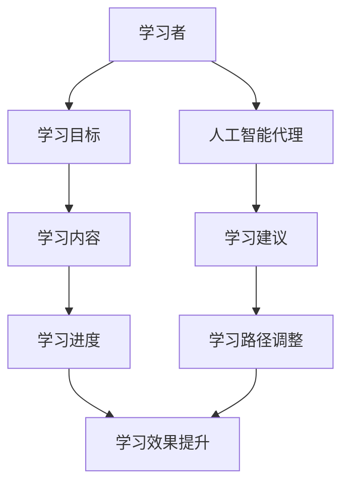
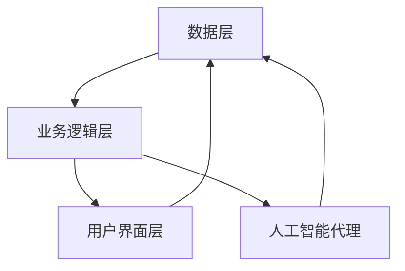

                 


# AI Agent在个性化学习系统中的角色

## 关键词：AI Agent、个性化学习、自适应学习、智能教育、学习路径优化、学习效果评估

## 摘要：本文深入探讨AI Agent在个性化学习系统中的角色，从背景概念、核心原理到系统设计和实际应用，全面分析AI Agent如何通过感知、推理和决策优化学习过程，提升学习效果和效率。文章结合强化学习和遗传算法，提供详细代码实现和系统架构设计，展现AI Agent在教育领域的潜力与价值。

---

## 正文

### 第1章：AI Agent与个性化学习概述

#### 1.1 AI Agent的基本概念
- **1.1.1 AI Agent的定义**
  AI Agent（人工智能代理）是能够感知环境、自主决策并执行任务的智能体。它通过传感器获取信息，利用推理机制分析数据，做出决策并采取行动。

- **1.1.2 AI Agent的核心特征**
  - **自主性**：无需外部干预，自主决策。
  - **反应性**：实时感知环境变化，动态调整行为。
  - **目标导向性**：基于目标驱动行动，优化决策。
  - **学习能力**：通过经验改进性能，适应新环境。

- **1.1.3 AI Agent与传统算法的区别**
  AI Agent具备自主性和目标导向性，能够主动适应环境，而传统算法通常需要明确的规则和输入，不具备自主性和学习能力。

#### 1.2 个性化学习的定义与特点
- **1.2.1 个性化学习的定义**
  个性化学习是根据学习者的个性特征、学习需求和目标，提供定制化学习方案的过程。

- **1.2.2 个性化学习的核心要素**
  - **学习者特征**：包括知识水平、学习风格、兴趣偏好等。
  - **学习目标**：明确的学习目标和期望成果。
  - **学习内容**：根据目标选择合适的内容和资源。
  - **学习路径**：个性化的学习顺序和策略。

- **1.2.3 个性化学习的实现方式**
  - **数据驱动**：利用学习者的数据进行分析和推荐。
  - **自适应算法**：动态调整学习内容和路径。
  - **互动反馈**：实时反馈学习效果，调整学习策略。

#### 1.3 AI Agent在个性化学习中的角色
- **1.3.1 AI Agent在个性化学习中的功能**
  - **数据采集与分析**：收集学习者数据，分析学习需求。
  - **推荐学习内容**：根据分析结果推荐合适的学习资源。
  - **优化学习路径**：动态调整学习顺序，提升学习效果。
  - **提供反馈与指导**：实时反馈学习进展，指导学习者改进。

- **1.3.2 AI Agent如何提升学习效果**
  AI Agent通过实时分析学习者数据，提供个性化建议，优化学习路径，减少无效学习，提高学习效率和效果。

- **1.3.3 AI Agent在个性化学习中的优势**
  - **精准性**：基于数据和算法，提供精准的学习建议。
  - **实时性**：实时反馈和调整，适应学习者的动态需求。
  - **高效性**：通过优化学习路径，节省时间和精力。

### 第2章：AI Agent的核心概念与原理

#### 2.1 AI Agent的核心概念与联系
- **2.1.1 AI Agent的感知与推理**
  AI Agent通过传感器或数据接口获取环境信息，利用推理算法（如逻辑推理、概率推理）分析信息，理解环境状态。

- **2.1.2 AI Agent的决策与行动**
  基于推理结果，AI Agent选择最优行动方案，执行决策并影响环境。

- **2.1.3 AI Agent的自我优化能力**
  AI Agent通过机器学习算法（如强化学习、深度学习）不断优化自身模型和决策策略。

#### 2.2 AI Agent的属性特征对比
- **2.2.1 不同AI Agent的属性对比**
| 特性 | 基于规则的AI Agent | 基于机器学习的AI Agent | 基于强化学习的AI Agent |
|------|---------------------|-------------------------|--------------------------|
| 决策方式 | 预定义规则         | 数据驱动模型           | 奖励驱动优化             |
| 学习能力 | 无                 | 有                     | 强，通过奖励优化策略       |
| 适应性 | 低                 | 中                     | 高                       |

- **2.2.2 AI Agent与传统算法的对比**
  AI Agent具备自主性和目标导向性，能够主动适应环境，而传统算法通常需要明确的规则和输入，不具备自主性和学习能力。

- **2.2.3 AI Agent与规则引擎的对比**
  AI Agent具备学习和优化能力，能够适应变化，而规则引擎依赖于预定义规则，适应性较低。

#### 2.3 AI Agent的ER实体关系图


### 第3章：个性化学习中的AI Agent算法实现

#### 3.1 强化学习算法
- **3.1.1 强化学习的基本原理**
  强化学习通过智能体与环境的交互，通过试错学习，找到最优策略。智能体通过选择动作，获得奖励或惩罚，调整策略以最大化累计奖励。

- **3.1.2 基于强化学习的个性化学习推荐系统**
  ```mermaid
  graph TD
      AA[人工智能代理] --> RL[强化学习算法]
      RL --> S[学习建议]
      S --> L[学习者]
      L --> E[学习效果]
  ```

- **3.1.3 强化学习的数学模型**
  状态空间 \( S \)，动作空间 \( A \)，奖励函数 \( R: S \times A \rightarrow \mathbb{R} \)，目标是找到最优策略 \( \pi \) 以最大化累计奖励。

#### 3.2 遗传算法
- **3.2.1 遗传算法的基本原理**
  遗传算法模拟生物进化过程，通过选择、交叉和变异操作，生成新的解，逐步优化解的质量。

- **3.2.2 基于遗传算法的学习路径优化**
  ```mermaid
  graph TD
      AA[人工智能代理] --> GA[遗传算法]
      GA --> LP[学习路径]
      LP --> LE[学习效果]
  ```

- **3.2.3 遗传算法的数学模型**
  适应度函数 \( f: C \rightarrow \mathbb{R} \)，选择概率 \( p_i = \frac{f(x_i)}{\sum f(x_j)} \)，交叉概率 \( pc \)，变异概率 \( pm \)。

### 第4章：系统设计与架构实现

#### 4.1 系统需求分析
- **学习者特征分析**
  - 学习者基本信息（年龄、学习目标、学习风格等）。
- **学习目标设定**
  - 短期目标（章节掌握）与长期目标（课程完成）。
- **学习效果评估**
  - 知识掌握程度、学习进度、学习效率等。

#### 4.2 系统功能模块设计
- **学习者建模模块**
  - 数据采集：收集学习者特征数据。
  - 特征提取：提取关键特征用于个性化推荐。
- **学习目标设定模块**
  - 目标分析：分析学习目标的优先级和难度。
- **学习内容推荐模块**
  - 内容筛选：基于学习者特征推荐学习内容。
- **学习效果评估模块**
  - 评估指标：定义评估指标，如完成时间、正确率等。
  - 评估反馈：提供反馈信息，指导学习者改进。

#### 4.3 系统架构设计


### 第5章：项目实战

#### 5.1 基于强化学习的自适应学习系统
- **环境安装**
  ```bash
  pip install gym numpy matplotlib
  ```
- **核心代码实现**
  ```python
  import gym
  import numpy as np

  env = gym.make('CustomLearningEnv-v0')
  model = ...  # 强化学习模型
  for episode in range(1000):
      state = env.reset()
      total_reward = 0
      while True:
          action = model.predict(state)
          next_state, reward, done, info = env.step(action)
          total_reward += reward
          if done:
              break
  ```

#### 5.2 系统优化与分析
- **优化步骤**
  - 参数调整：如学习率、奖励权重。
  - 模型迭代：训练更多数据，优化模型性能。
- **系统分析**
  - 训练效果：学习曲线、奖励分布。
  - 系统性能：运行效率、资源消耗。

### 第6章：总结与展望

#### 6.1 总结
AI Agent通过智能化的感知、推理和决策，显著提升了个性化学习的效果和效率。本文从理论到实践，详细探讨了AI Agent在个性化学习中的应用，展示了其在教育领域的巨大潜力。

#### 6.2 展望
未来，AI Agent在个性化学习中的应用将更加广泛和深入。结合多模态数据、强化学习和人机协作，AI Agent将帮助学习者实现更高效、更个性化的学习体验，推动教育公平和教育质量的提升。

---

## 作者：AI天才研究院 & 禅与计算机程序设计艺术

---

**注**：由于篇幅限制，上述内容为文章的框架和部分内容，完整文章将根据此框架进行详细扩展，确保每部分内容详实，逻辑清晰，技术细节到位。

