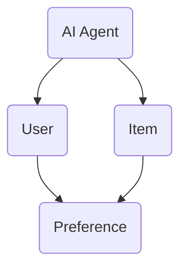
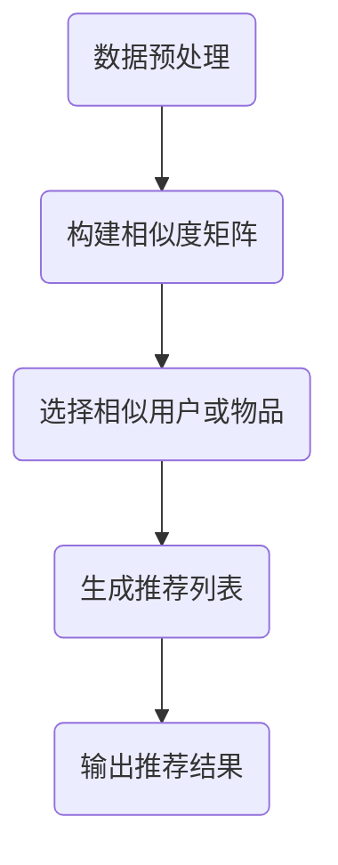
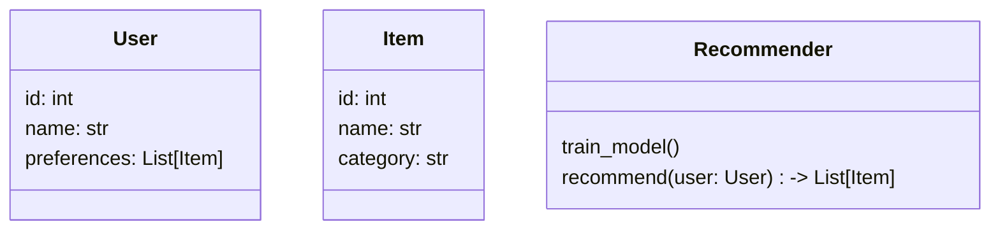
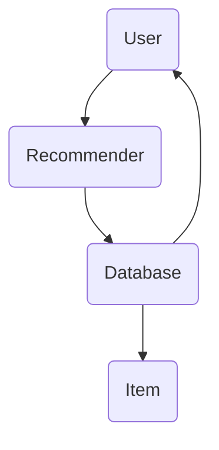
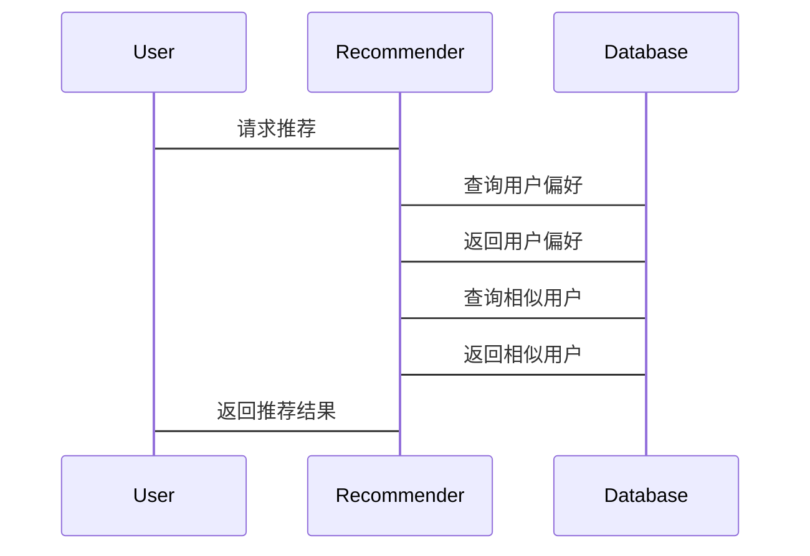

                 


# AI Agent在个性化推荐系统中的应用

## 关键词：
AI Agent, 个性化推荐, 协同过滤, 机器学习, 深度学习, 推荐算法

## 摘要：
本文深入探讨了AI Agent在个性化推荐系统中的应用，分析了AI Agent的基本原理及其与个性化推荐系统的结合方式。文章从背景介绍、核心概念、算法原理、系统架构、项目实战等多个维度展开，详细阐述了如何利用AI Agent提升推荐系统的智能化水平和动态适应性。通过具体案例分析和代码实现，展示了AI Agent在个性化推荐中的实际应用价值，并对未来的发展趋势进行了展望。

---

# 第一部分: 引言

## 第1章: AI Agent与个性化推荐系统概述

### 1.1 AI Agent的基本概念
#### 1.1.1 AI Agent的定义
AI Agent（人工智能代理）是指能够感知环境、执行任务并做出决策的智能实体。它可以是一个软件程序，也可以是硬件设备，其核心目标是通过智能化的方式帮助用户完成特定任务。

#### 1.1.2 AI Agent的核心特征
- **自主性**：能够独立决策和行动。
- **反应性**：能够实时感知环境变化并做出响应。
- **目标导向**：具有明确的目标和优先级。
- **学习能力**：能够通过数据和经验不断优化自身行为。

#### 1.1.3 AI Agent与传统推荐系统的区别
传统推荐系统通常基于规则或统计方法，而AI Agent能够通过学习和推理实现更复杂的推荐逻辑。AI Agent还可以根据实时反馈动态调整推荐策略，这使得推荐结果更加个性化和动态化。

### 1.2 个性化推荐系统的背景与意义
#### 1.2.1 个性化推荐的定义
个性化推荐是指根据用户的偏好、行为和需求，提供定制化的内容或产品推荐。

#### 1.2.2 个性化推荐的典型场景
- **电商推荐**：根据用户的购买历史和浏览行为推荐商品。
- **音乐/视频推荐**：根据用户的听歌或观影记录推荐相关内容。
- **社交网络推荐**：根据用户的社交行为推荐好友或内容。

#### 1.2.3 个性化推荐的重要性
个性化推荐能够显著提升用户体验，增加用户粘性和转化率。通过个性化推荐，企业可以更精准地满足用户需求，从而提高市场竞争力。

### 1.3 AI Agent在推荐系统中的应用价值
#### 1.3.1 提高推荐系统的智能化水平
AI Agent能够通过学习和推理实现更复杂的推荐逻辑，例如结合用户的情感倾向和场景信息进行推荐。

#### 1.3.2 实现动态个性化推荐
AI Agent能够实时感知用户行为和环境变化，动态调整推荐策略，从而提供更加精准的推荐结果。

#### 1.3.3 提升用户体验与商业价值
通过AI Agent的辅助，推荐系统可以更高效地满足用户需求，同时为企业创造更大的商业价值。

### 1.4 本章小结
本章介绍了AI Agent的基本概念及其在个性化推荐系统中的应用价值。AI Agent通过智能化和动态化的推荐方式，显著提升了推荐系统的性能和用户体验。

---

# 第二部分: AI Agent与个性化推荐系统的核心概念

## 第2章: AI Agent的核心原理

### 2.1 AI Agent的基本原理
#### 2.1.1 感知层：数据采集与特征提取
AI Agent需要通过传感器、API或其他数据源获取环境信息，并对这些信息进行特征提取和处理。

#### 2.1.2 计划层：目标设定与策略制定
AI Agent需要根据用户需求和环境信息制定推荐目标和策略。

#### 2.1.3 执行层：行动决策与反馈优化
AI Agent根据制定的策略做出推荐决策，并根据用户反馈不断优化推荐模型。

### 2.2 个性化推荐系统的实现机制
#### 2.2.1 数据驱动的推荐
基于用户行为数据（如点击、收藏、购买等）进行推荐。

#### 2.2.2 模型驱动的推荐
基于机器学习模型（如协同过滤、深度学习模型）进行推荐。

#### 2.2.3 结合AI Agent的混合推荐
将AI Agent与传统推荐方法结合，实现更智能化的推荐。

### 2.3 AI Agent与个性化推荐的结合点
#### 2.3.1 动态适应性
AI Agent能够实时感知用户需求变化，并动态调整推荐策略。

#### 2.3.2 多目标优化
AI Agent可以在多个目标之间进行权衡，例如在用户体验和商业利益之间找到平衡点。

#### 2.3.3 上下文感知性
AI Agent能够结合用户所在的上下文（如时间、地点、设备等）进行推荐。

### 2.4 核心概念对比表
以下表格对比了AI Agent与传统推荐系统的区别：

| 对比维度 | AI Agent推荐 | 传统推荐系统 |
|----------|--------------|--------------|
| 智能化水平 | 高            | 中            |
| 动态性     | 高            | 低            |
| 个性化程度 | 高            | 中            |
| 决策能力   | 强            | 弱            |

### 2.5 ER实体关系图
以下是推荐系统的核心实体关系图：



### 2.6 本章小结
本章详细介绍了AI Agent的核心原理及其在个性化推荐系统中的应用。AI Agent通过感知、决策和优化，显著提升了推荐系统的智能化水平。

---

# 第三部分: AI Agent在个性化推荐中的算法原理

## 第3章: 基于协同过滤的推荐算法

### 3.1 协同过滤的基本原理
#### 3.1.1 基于用户的协同过滤
基于用户的相似性进行推荐，例如找到与当前用户行为相似的其他用户，并推荐这些用户喜欢的内容。

#### 3.1.2 基于物品的协同过滤
基于物品的相似性进行推荐，例如找到与当前用户感兴趣的内容相似的其他内容。

#### 3.1.3 混合协同过滤
结合基于用户和基于物品的协同过滤，以提高推荐的准确性和多样性。

### 3.2 协同过滤的数学模型
#### 3.2.1 用户-物品评分矩阵
用户-物品评分矩阵是协同过滤的核心数据结构，如下所示：

$$
R = \begin{pmatrix}
r_{11} & r_{12} & \cdots & r_{1m} \\
r_{21} & r_{22} & \cdots & r_{2m} \\
\vdots  & \vdots  & \ddots & \vdots  \\
r_{n1} & r_{n2} & \cdots & r_{nm}
\end{pmatrix}
$$

其中，$R$是用户-物品评分矩阵，$r_{ij}$表示用户$i$对物品$j$的评分。

#### 3.2.2 相似度计算公式
常用的相似度计算公式包括余弦相似度和皮尔逊相关系数：

$$
sim(i,j) = \frac{\sum_{k} (r_{ik} - \bar{r}_i)(r_{jk} - \bar{r}_j)}{\sqrt{\sum_{k} (r_{ik} - \bar{r}_i)^2} \sqrt{\sum_{k} (r_{jk} - \bar{r}_j)^2}}
$$

其中，$\bar{r}_i$表示用户$i$的平均评分。

### 3.3 协同过滤的优化算法
#### 3.3.1 基于矩阵分解的协同过滤
矩阵分解是一种常用的优化方法，例如交替最小二乘法（Alternating Least Squares, ALS）。

#### 3.3.2 基于随机梯度下降的优化
随机梯度下降是一种高效的优化算法，适用于大规模数据场景。

### 3.4 协同过滤的实现流程图
以下是协同过滤的实现流程图：



### 3.5 本章小结
本章详细介绍了协同过滤的基本原理及其在个性化推荐中的应用。通过矩阵分解和优化算法，协同过滤能够高效地实现个性化推荐。

---

# 第四部分: 系统架构与实现

## 第4章: 系统架构设计

### 4.1 项目介绍
本项目旨在开发一个基于AI Agent的个性化推荐系统，利用协同过滤算法实现智能化推荐。

### 4.2 系统功能设计
#### 4.2.1 领域模型
以下是领域模型类图：



#### 4.2.2 系统架构
以下是系统架构图：



#### 4.2.3 系统接口设计
- **输入接口**：用户输入偏好或行为数据。
- **输出接口**：推荐结果输出。

#### 4.2.4 系统交互设计
以下是系统交互序列图：



### 4.3 本章小结
本章详细介绍了个性化推荐系统的架构设计，包括领域模型、系统架构和交互设计。

---

# 第五部分: 项目实战

## 第5章: 项目核心实现

### 5.1 环境安装
需要安装以下依赖：
- Python 3.8+
- scikit-learn
- numpy

### 5.2 核心代码实现
以下是协同过滤算法的实现代码：

```python
from sklearn.metrics.pairwise import cosine_similarity
from sklearn.preprocessing import StandardScaler

class CollaborativeFiltering:
    def __init__(self):
        self.scaler = StandardScaler()
        self.similarity_matrix = None

    def train(self, user_item_matrix):
        # 标准化数据
        self.scaler.fit(user_item_matrix)
        normalized_data = self.scaler.transform(user_item_matrix)
        
        # 计算余弦相似度
        self.similarity_matrix = cosine_similarity(normalized_data)

    def recommend(self, user_id, top_n=5):
        # 获取用户相似度
        similarities = self.similarity_matrix[user_id]
        
        # 找到相似度最高的top_n用户
        indices = similarities.argsort()[::-1][:top_n]
        recommended_items = [i for i in indices if i != user_id]
        
        return recommended_items
```

### 5.3 代码应用解读与分析
上述代码实现了基于协同过滤的推荐算法，包括数据标准化和余弦相似度计算。通过调用`train`方法训练模型，并通过`recommend`方法生成推荐结果。

### 5.4 实际案例分析
以音乐推荐为例，假设用户A喜欢摇滚音乐，系统会基于用户相似性推荐其他摇滚音乐爱好者喜欢的音乐。

### 5.5 本章小结
本章通过具体代码实现，展示了如何利用协同过滤算法实现个性化推荐。

---

# 第六部分: 总结与展望

## 第6章: 总结与展望

### 6.1 核心内容回顾
本文详细探讨了AI Agent在个性化推荐系统中的应用，包括核心原理、算法实现和系统架构设计。

### 6.2 未来展望
- **算法优化**：探索更高效的推荐算法，例如基于深度学习的推荐模型。
- **多模态推荐**：结合文本、图像等多种数据源进行推荐。
- **实时推荐**：实现低延迟、高实时性的推荐系统。

### 6.3 最佳实践 tips
- **数据质量**：确保数据的完整性和准确性。
- **模型优化**：定期更新模型，避免过时。
- **用户体验**：注重推荐结果的可解释性和透明性。

### 6.4 本章小结
本文总结了AI Agent在个性化推荐系统中的应用，并展望了未来的发展方向。

---

# 作者：AI天才研究院/AI Genius Institute & 禅与计算机程序设计艺术 /Zen And The Art of Computer Programming

---

以上是《AI Agent在个性化推荐系统中的应用》的技术博客文章的完整目录大纲和部分内容展示。根据需求，您可以选择具体章节进行详细编写。

