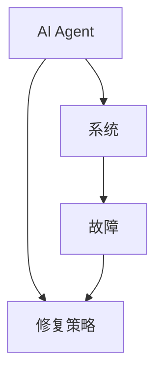
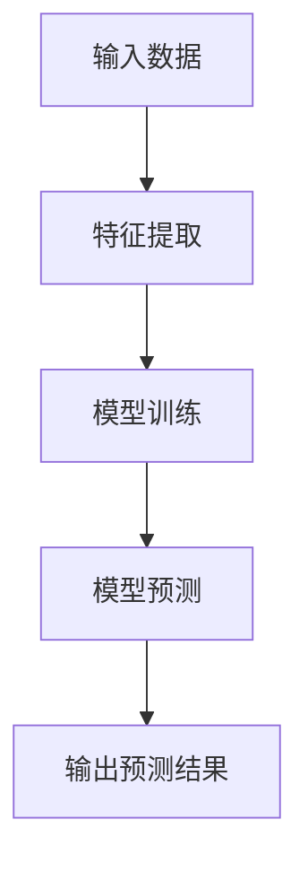
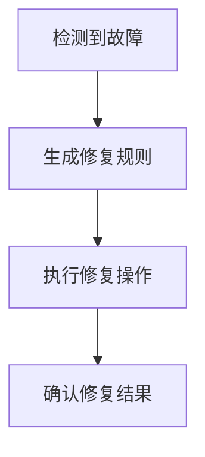
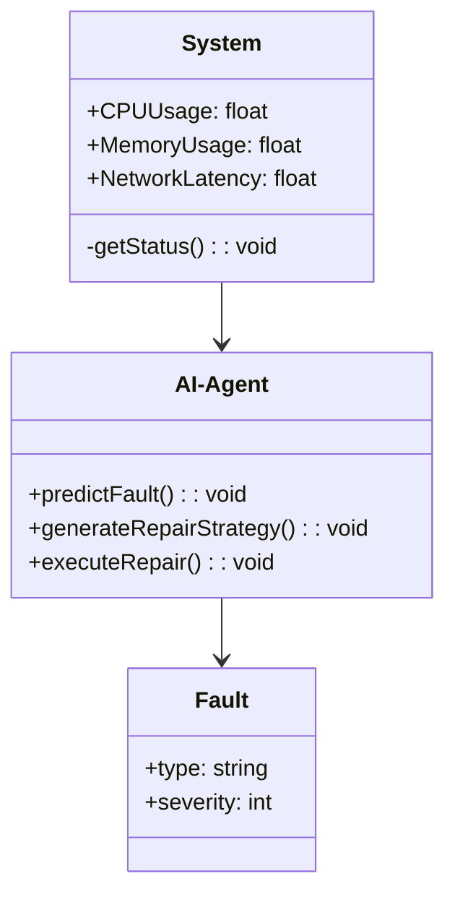
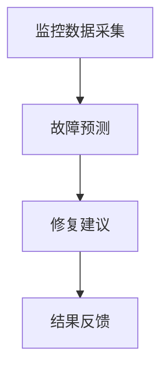
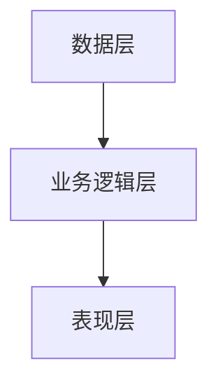
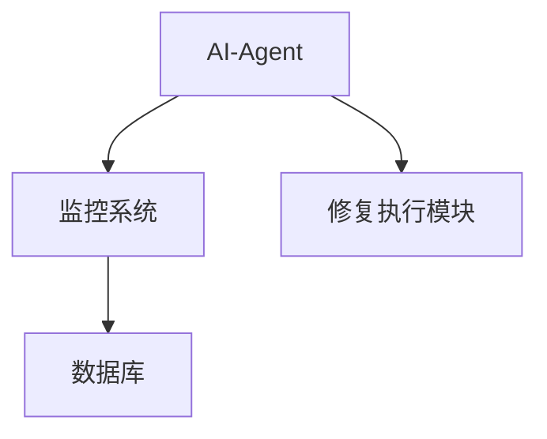

                 


# AI Agent在企业IT运维中的应用：故障预测与修复

## 关键词：AI Agent, 企业IT运维, 故障预测, 自动化修复, 机器学习, 深度学习, 系统架构

## 摘要

本文探讨了AI Agent在企业IT运维中的应用，重点分析了故障预测与修复的技术原理和实现方法。通过详细讲解AI Agent的工作原理、算法模型、系统架构以及实际案例，本文展示了AI Agent在提高企业IT系统稳定性和运维效率方面的优势。文章还总结了最佳实践、注意事项和未来研究方向，为读者提供全面的技术指导。

---

# 第1章：AI Agent与企业IT运维概述

## 1.1 AI Agent的基本概念

### 1.1.1 什么是AI Agent

AI Agent（人工智能代理）是一种能够感知环境、做出决策并执行操作的智能体。它具备以下核心特点：
- **自主性**：无需人工干预，能够自主完成任务。
- **反应性**：能够实时感知环境变化并做出响应。
- **目标导向**：通过设定目标来驱动行为。
- **学习能力**：能够通过数据和经验不断优化自身行为。

在企业IT运维中，AI Agent主要用于监控系统状态、预测潜在故障并执行修复操作，从而提高运维效率和系统可靠性。

### 1.1.2 AI Agent的核心特点

- **自主性**：AI Agent能够独立执行任务，减少人工干预。
- **反应性**：实时响应环境变化，快速处理问题。
- **目标导向**：通过设定目标来优化系统性能。
- **学习能力**：通过机器学习不断优化预测和修复策略。

### 1.1.3 企业IT运维中的AI Agent作用

AI Agent在企业IT运维中的作用包括：
- **故障预测**：通过分析历史数据和实时信息，预测系统故障。
- **自动化修复**：在检测到故障后，自动执行修复操作，减少停机时间。
- **优化性能**：通过动态调整系统配置，提高资源利用率。

## 1.2 故障预测与修复的背景

### 1.2.1 企业IT运维中的常见问题

企业IT运维中常见的问题包括：
- **系统崩溃**：由于硬件故障或软件错误导致系统无法正常运行。
- **服务中断**：网络故障或数据库问题导致服务中断。
- **性能瓶颈**：系统资源使用率过高导致响应速度变慢。

### 1.2.2 故障预测与修复的重要性

故障预测与修复的重要性体现在：
- **减少停机时间**：通过提前预测故障，可以在问题发生前采取措施，避免服务中断。
- **降低运维成本**：自动化修复减少了人工干预的需求，降低了运维成本。
- **提高系统稳定性**：通过持续优化系统配置，提高系统的稳定性和可靠性。

### 1.2.3 AI Agent在故障预测与修复中的优势

AI Agent的优势包括：
- **自动化**：能够自动完成从故障检测到修复的整个流程。
- **高准确性**：通过机器学习算法，能够提高故障预测的准确性。
- **快速响应**：能够在短时间内做出响应，减少故障影响。

---

# 第2章：AI Agent的核心概念与原理

## 2.1 AI Agent的原理

### 2.1.1 感知层

感知层负责收集系统运行的各种数据，包括：
- **系统日志**：记录系统运行状态和错误信息。
- **性能指标**：如CPU使用率、内存占用、网络流量等。
- **用户反馈**：用户对系统性能的评价和反馈。

通过这些数据，AI Agent能够了解系统的当前状态，并识别潜在的故障风险。

### 2.1.2 决策层

决策层基于感知层提供的数据，利用机器学习算法生成修复策略。常见的算法包括：
- **时间序列分析**：如ARIMA和LSTM模型，用于预测未来的系统状态。
- **规则引擎**：基于预定义的规则，生成修复策略。

### 2.1.3 执行层

执行层负责根据决策层生成的修复策略，执行具体的修复操作。这些操作可以包括：
- **重启服务**：当某个服务出现故障时，自动重启服务。
- **调整配置**：动态调整系统配置，优化资源利用率。
- **通知相关人员**：当检测到严重故障时，通知运维人员。

## 2.2 AI Agent与传统故障处理方法的对比

### 2.2.1 对比分析表

| 对比维度         | AI Agent                              | 传统方法                            |
|------------------|--------------------------------------|------------------------------------|
| 自动化程度       | 高                                    | 低                                  |
| 响应速度         | 快，能够在故障发生前采取措施          | 慢，通常在故障发生后由人工处理      |
| 准确性           | 高，基于机器学习模型                   | 低，依赖人工经验                     |
| 维护成本         | 低，自动化处理减少人工干预            | 高，需要大量人工监控和处理          |

### 2.2.2 实体关系图



---

# 第3章：AI Agent的算法原理

## 3.1 时间序列预测模型

### 3.1.1 ARIMA模型

ARIMA（自回归积分滑动平均）模型适用于平稳时间序列数据的预测。其数学公式为：

$$ ARIMA(p, d, q) $$

其中：
- $p$ 是自回归阶数
- $d$ 是差分阶数
- $q$ 是移动平均阶数

### 3.1.2 LSTM网络

LSTM（长短期记忆网络）适用于捕捉长期依赖关系，适合处理复杂的系统故障预测问题。LSTM的结构包括输入门、遗忘门和输出门。

### 3.1.3 模型流程图



## 3.2 基于规则的修复策略

### 3.2.1 规则生成方法

规则生成方法包括：
- **阈值检测**：当某个指标超过预设阈值时触发修复操作。
- **模式识别**：识别特定的故障模式，并生成相应的修复规则。

### 3.2.2 策略执行流程



### 3.2.3 修复效果评估

修复效果评估指标包括：
- **修复成功率**：修复后故障不再发生的概率。
- **修复时间**：从检测到修复完成所需的时间。

---

# 第4章：系统分析与架构设计

## 4.1 问题场景介绍

企业IT运维中常见的故障场景包括服务器过载、网络延迟、数据库故障等。AI Agent通过实时监控系统状态，能够提前预测这些故障，并自动执行修复操作。

## 4.2 系统功能设计

### 4.2.1 领域模型类图



### 4.2.2 功能模块划分

系统功能模块包括：
- **监控数据采集**：收集系统运行数据。
- **故障预测**：基于机器学习模型预测故障。
- **修复建议**：生成修复策略并执行修复操作。
- **结果反馈**：记录修复结果并优化模型。

### 4.2.3 模块交互流程



## 4.3 系统架构设计

### 4.3.1 分层架构图



### 4.3.2 组件交互图



---

# 第5章：项目实战与案例分析

## 5.1 环境安装

安装所需的工具和库：
- **Python**：3.6+
- **TensorFlow**：2.0+
- **Scikit-learn**：0.20+
- **Flask**：1.0+

## 5.2 核心代码实现

### 5.2.1 故障预测模型

```python
import numpy as np
from sklearn.preprocessing import MinMaxScaler
from keras.models import Sequential
from keras.layers import LSTM, Dense

# 数据预处理
data = ...  # 历史故障数据
scaler = MinMaxScaler()
scaled_data = scaler.fit_transform(data)

# 模型训练
model = Sequential()
model.add(LSTM(128, input_shape=(timesteps, features)))
model.add(Dense(1))
model.compile(loss='mean_squared_error', optimizer='adam')

model.fit(scaled_data, epochs=100, batch_size=32)
```

### 5.2.2 修复策略执行

```python
def execute_repair(repair_type):
    if repair_type == 'restart_service':
        # 重启服务
        subprocess.run('sudo systemctl restart service_name', shell=True)
    elif repair_type == 'scale_up':
        # 扩展资源
        subprocess.run('aws ec2 start-instances --instance-ids instance_id', shell=True)
```

## 5.3 案例分析

以电商平台的故障预测与修复系统为例，AI Agent能够通过分析历史销售数据和系统日志，预测即将到来的流量高峰，并提前扩展服务器资源，避免服务中断。

---

# 第6章：最佳实践与注意事项

## 6.1 最佳实践

- **数据质量**：确保输入数据的准确性和完整性。
- **模型优化**：定期更新模型，提高预测准确性。
- **故障隔离**：在修复操作中，确保故障隔离，避免对其他系统造成影响。

## 6.2 小结

本文详细探讨了AI Agent在企业IT运维中的应用，从故障预测到修复策略的实现，展示了其在提高系统稳定性和运维效率方面的优势。

## 6.3 注意事项

- **数据隐私**：在处理敏感数据时，需注意数据隐私和安全问题。
- **模型泛化**：模型的泛化能力可能受到数据质量和数量的限制。

## 6.4 拓展阅读

- **推荐书籍**：《机器学习实战》、《深度学习》
- **技术博客**：推荐关注相关技术博客和论坛，获取最新技术动态。

---

# 作者

**作者：AI天才研究院/AI Genius Institute & 禅与计算机程序设计艺术 /Zen And The Art of Computer Programming**

---

本文通过详细分析AI Agent在企业IT运维中的应用，结合实际案例和系统设计，为读者提供了全面的技术指导。希望本文能够帮助读者更好地理解和应用AI Agent，提升企业IT运维的效率和稳定性。

