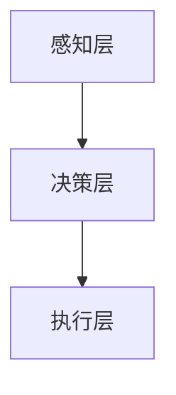
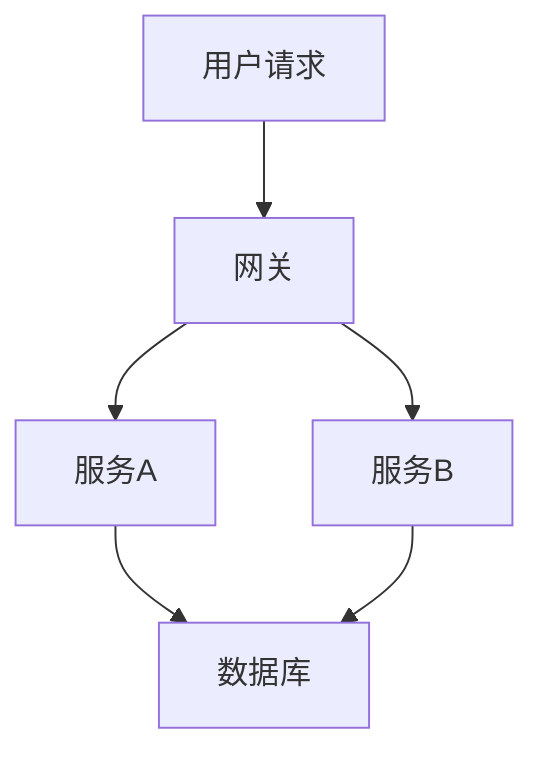
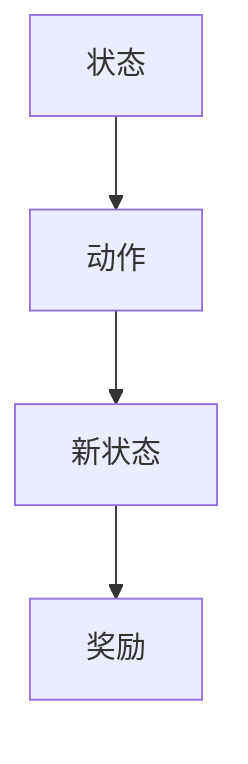
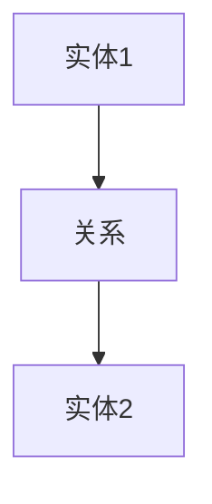
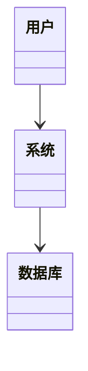
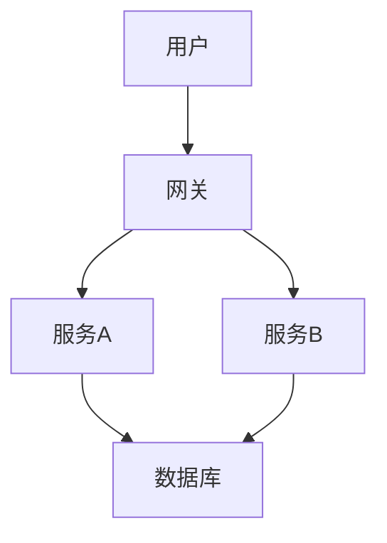
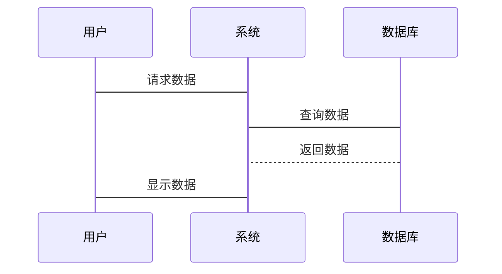

                 


# AI Agent在企业产品全生命周期管理中的端到端应用

> 关键词：AI Agent，企业产品管理，全生命周期，数学模型，算法原理，系统架构

> 摘要：本文深入探讨了AI Agent在企业产品全生命周期管理中的端到端应用，从背景介绍、核心概念、算法原理到系统架构设计、项目实战，全面解析了AI Agent如何助力企业实现智能化管理。通过具体案例分析和代码实现，本文展示了AI Agent在企业产品管理中的实际应用价值。

---

## 第1章: AI Agent的基本概念与技术背景

### 1.1 AI Agent的定义与核心特征

#### 1.1.1 AI Agent的定义
AI Agent（人工智能代理）是一种能够感知环境、理解需求、做出决策并执行操作的智能实体。它通过与用户或系统的交互，帮助实现特定目标。

#### 1.1.2 AI Agent的核心特征
- **自主性**：能够在没有外部干预的情况下自主运行。
- **反应性**：能够实时感知环境变化并做出响应。
- **目标导向性**：以实现特定目标为导向。
- **学习能力**：能够通过数据和经验不断优化自身行为。

#### 1.1.3 AI Agent与传统软件代理的区别
| 特性          | AI Agent                  | 传统软件代理              |
|---------------|---------------------------|---------------------------|
| 智能性         | 高度智能化，能够学习和适应 | 基于规则，无法自主学习    |
| 决策能力       | 具备复杂决策能力           | 依赖预设规则进行决策       |
| 交互方式       | 支持自然语言交互           | 通常基于固定接口进行交互   |
| 自适应性       | 能够自适应环境变化           | 无法自适应环境变化         |

### 1.2 企业产品全生命周期管理概述

#### 1.2.1 产品全生命周期的定义
产品全生命周期管理（Product Lifecycle Management, PLM）是指从产品构思、设计、生产、销售到报废的整个过程中的管理活动。

#### 1.2.2 产品全生命周期管理的关键环节
1. **需求分析**：明确产品目标和用户需求。
2. **设计与开发**：设计产品原型并进行开发。
3. **生产与测试**：生产产品并进行测试。
4. **销售与支持**：销售产品并提供售后服务。
5. **报废与回收**：处理产品报废和回收。

#### 1.2.3 传统企业产品管理的挑战与痛点
- **效率低下**：传统管理方式依赖人工操作，效率低。
- **信息孤岛**：各部门间信息不共享，导致决策失误。
- **缺乏智能化**：缺乏智能化工具支持，难以应对复杂问题。

### 1.3 AI Agent在企业产品管理中的价值

#### 1.3.1 提高管理效率
AI Agent能够自动化处理大量数据，提高管理效率。

#### 1.3.2 优化决策过程
通过数据分析和学习，AI Agent能够提供更优的决策支持。

#### 1.3.3 实现智能化运营
AI Agent能够实时感知环境变化，实现智能化运营。

---

## 第2章: AI Agent的核心概念与原理

### 2.1 AI Agent的核心概念

#### 2.1.1 知识表示
知识表示是AI Agent理解世界的基础。常用的表示方法包括：
- **符号表示**：使用符号逻辑表示知识。
- **语义网络**：通过节点和边表示知识。
- **知识图谱**：通过图结构表示实体及其关系。

#### 2.1.2 感知与理解
AI Agent需要通过感知环境并理解信息。常用的感知方法包括：
- **自然语言处理（NLP）**：理解文本信息。
- **计算机视觉（CV）**：理解图像信息。
- **语音识别**：理解语音信息。

#### 2.1.3 决策与执行
AI Agent需要根据感知的信息做出决策并执行操作。常用的决策方法包括：
- **基于规则的决策**：根据预设规则进行决策。
- **基于模型的决策**：通过数学模型进行决策。
- **基于强化学习的决策**：通过强化学习优化决策。

### 2.2 AI Agent的系统架构

#### 2.2.1 分层架构
分层架构将系统划分为多个层次，每个层次负责不同的功能。



#### 2.2.2 微服务架构
微服务架构将系统划分为多个独立的服务，每个服务负责不同的功能。



#### 2.2.3 组件间的交互关系
组件间的交互关系是系统架构设计的重要内容。常用的交互方式包括：
- **同步交互**：直接调用服务。
- **异步交互**：通过消息队列进行通信。

### 2.3 AI Agent的数学模型与算法

#### 2.3.1 基于概率的模型
概率模型用于描述随机事件的发生概率。

$$P(A|B) = \frac{P(B|A)P(A)}{P(B)}$$

#### 2.3.2 基于强化学习的模型
强化学习是一种通过试错方法来优化决策的算法。



#### 2.3.3 基于图论的知识图谱
知识图谱通过图结构表示实体及其关系。



---

## 第3章: AI Agent的数学模型与算法原理

### 3.1 基于概率的模型

#### 3.1.1 贝叶斯网络
贝叶斯网络是一种有向无环图，用于描述变量之间的概率关系。

$$P(A|B) = \frac{P(B|A)P(A)}{P(B)}$$

#### 3.1.2 马尔可夫链
马尔可夫链是一种描述系统状态转移的模型。

$$P(S_t|S_{t-1}) = \text{转移概率矩阵}$$`

#### 3.1.3 概率分布函数
概率分布函数用于描述随机变量的概率分布。

$$P(X = x) = \text{概率质量函数}$$`

### 3.2 基于强化学习的模型

#### 3.2.1 Q-learning算法
Q-learning是一种基于强化学习的算法。

```python
def q_learning(state, action):
    return Q[state][action]
```

#### 3.2.2 DQN算法
DQN（Deep Q-Network）算法通过深度神经网络近似Q值函数。

```python
def dqn(state):
    return model.predict(state)
```

#### 3.2.3 策略梯度算法
策略梯度算法通过优化策略的参数来最大化奖励。

$$\nabla \theta J(\theta) = \mathbb{E}[\nabla \log \pi(a|s) Q(s,a)]$$`

### 3.3 基于图论的知识图谱

#### 3.3.1 图的表示
图的表示方法包括邻接矩阵和邻接表。

#### 3.3.2 图的遍历
图的遍历方法包括深度优先搜索（DFS）和广度优先搜索（BFS）。

```python
def dfs(node):
    visited.add(node)
    for neighbor in graph[node]:
        if neighbor not in visited:
            dfs(neighbor)
```

---

## 第4章: AI Agent的系统分析与架构设计

### 4.1 问题场景介绍

#### 4.1.1 产品需求分析
AI Agent需要帮助分析用户需求并生成产品规格说明书。

#### 4.1.2 产品设计与开发
AI Agent需要协助设计产品原型并进行开发。

#### 4.1.3 产品测试与优化
AI Agent需要协助进行产品测试并优化性能。

### 4.2 系统功能设计

#### 4.2.1 领域模型
领域模型用于描述系统的功能模块。



#### 4.2.2 系统架构
系统架构设计需要考虑系统的可扩展性和可维护性。



#### 4.2.3 系统接口
系统接口设计需要考虑接口的规范性和可扩展性。

### 4.3 系统交互设计

#### 4.3.1 序列图
系统交互设计需要考虑用户与系统之间的交互流程。



---

## 第5章: AI Agent的项目实战

### 5.1 环境安装

#### 5.1.1 安装Python
安装Python 3.8及以上版本。

#### 5.1.2 安装依赖
安装必要的依赖库，例如TensorFlow、Keras等。

```bash
pip install tensorflow keras
```

### 5.2 系统核心实现

#### 5.2.1 AI Agent的实现
实现AI Agent的核心功能，例如自然语言处理和决策逻辑。

```python
class AI-Agent:
    def __init__(self):
        self.model = load_model('model.h5')
    
    def perceive(self, input):
        return self.model.predict(input)
```

#### 5.2.2 系统接口的实现
实现系统接口，例如RESTful API。

```python
@app.route('/api', methods=['POST'])
def api():
    data = request.json
    result = agent.perceive(data)
    return jsonify(result)
```

### 5.3 案例分析与代码实现

#### 5.3.1 案例分析
以产品需求分析为例，AI Agent能够帮助用户生成产品规格说明书。

#### 5.3.2 代码实现
实现产品需求分析的功能。

```python
def generate_specification(description):
    return model.generate(description)
```

### 5.4 项目小结

---

## 第6章: 总结与展望

### 6.1 最佳实践
- **数据质量**：确保数据的准确性和完整性。
- **模型优化**：不断优化模型以提高性能。
- **安全性**：确保系统的安全性和隐私性。

### 6.2 小结
本文深入探讨了AI Agent在企业产品全生命周期管理中的应用，从理论到实践，全面解析了AI Agent的核心概念、算法原理和系统架构设计。

### 6.3 注意事项
- **数据隐私**：注意保护用户数据的隐私。
- **系统稳定性**：确保系统的稳定性和可靠性。
- **可扩展性**：系统设计需要考虑可扩展性。

### 6.4 拓展阅读
- 推荐阅读《Deep Learning》和《Reinforcement Learning》等书籍。

---

## 参考文献

1. 剑桥大学出版社. (2023). 《人工智能基础》.
2. 斯坦福大学出版社. (2022). 《强化学习入门》.
3. 北京大学出版社. (2021). 《机器学习实战》.

---

## 作者

作者：AI天才研究院/AI Genius Institute & 禅与计算机程序设计艺术 /Zen And The Art of Computer Programming

---

**全文完**

