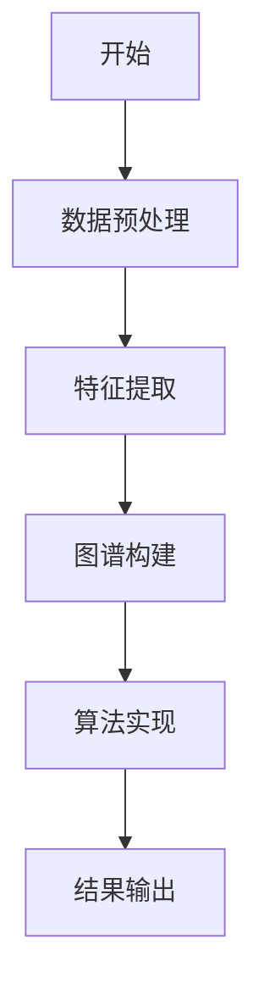
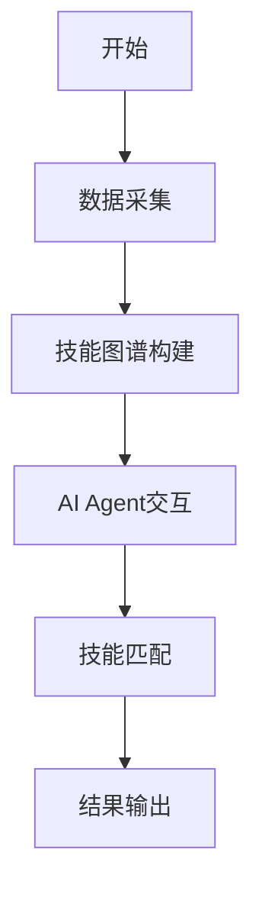

                 


# AI Agent在企业人才发展与技能图谱构建中的应用

> 关键词：AI Agent, 技能图谱, 企业人才发展, 知识图谱, 机器学习

> 摘要：本文探讨了AI Agent在企业人才发展与技能图谱构建中的应用，通过分析技能图谱的构建原理、AI Agent的工作原理及其在人才发展中的应用，展示了如何利用AI技术优化企业人才管理和技能提升流程。文章从背景介绍、核心概念、算法原理、系统架构设计、项目实战到最佳实践，全面而深入地剖析了AI Agent在企业人才发展中的应用。

---

## 第1章: AI Agent与技能图谱的背景介绍

### 1.1 问题背景

#### 1.1.1 企业人才发展的挑战与痛点

企业在快速发展过程中，面临着人才管理的多重挑战：  
1. **人才需求多样化**：企业对技能的需求不断变化，员工需要快速适应新技术和新趋势。  
2. **技能更新迭代快**：技术的快速发展要求员工持续学习，但传统的人才培养方式效率低下。  
3. **个性化学习需求**：员工的技能水平和职业发展方向各不相同，个性化学习需求难以满足。  

#### 1.1.2 技能图谱的概念与重要性

**技能图谱**是一种将企业所需技能以图谱形式展示的方法，能够清晰地描绘出员工当前技能水平与目标技能之间的差距。技能图谱为企业制定个性化学习路径、评估员工能力提供了有力支持。  

#### 1.1.3 AI Agent在人才发展中的作用

AI Agent（人工智能代理）是一种能够执行特定任务的智能体，能够通过学习和推理优化决策过程。在企业人才发展中，AI Agent可以通过分析员工技能数据，推荐个性化学习资源，优化学习路径，从而提升员工能力。

### 1.2 问题描述

#### 1.2.1 传统人才发展方法的局限性

传统的人才培养方法存在以下问题：  
1. **缺乏个性化**：统一的培训计划难以满足员工的个性化需求。  
2. **效率低下**：手动评估员工技能和制定学习计划耗时耗力。  
3. **数据孤岛**：各部门之间的技能数据分散，难以形成统一的技能图谱。  

#### 1.2.2 技能图谱构建的复杂性

技能图谱的构建需要整合企业内外部数据，涉及大量复杂的技术和方法，包括数据清洗、特征提取、图谱构建等。  

#### 1.2.3 AI Agent在技能图谱中的应用需求

为了应对上述挑战，企业需要一种智能化的方法来构建和应用技能图谱，而AI Agent正是实现这一目标的关键技术。

### 1.3 问题解决

#### 1.3.1 AI Agent如何优化人才发展流程

AI Agent可以通过以下方式优化人才发展流程：  
1. **自动化技能评估**：利用自然语言处理和机器学习技术，自动评估员工技能水平。  
2. **个性化学习推荐**：基于技能图谱，为员工推荐个性化学习资源。  
3. **动态调整学习路径**：根据员工的学习进度和反馈，动态调整学习计划。  

#### 1.3.2 技能图谱如何支持个性化学习

技能图谱通过可视化的方式展示员工技能水平与目标技能之间的差距，帮助员工制定清晰的学习路径。  

#### 1.3.3 AI Agent在技能匹配中的应用

AI Agent可以通过分析技能图谱，快速匹配员工技能与岗位需求，优化人才分配。

### 1.4 边界与外延

#### 1.4.1 技能图谱的边界定义

技能图谱仅关注员工技能，不涉及员工的其他属性（如绩效、态度等）。  

#### 1.4.2 AI Agent在技能图谱中的应用范围

AI Agent的应用范围限于技能图谱的构建与应用，不涉及其他业务领域（如薪酬管理、绩效评估等）。  

#### 1.4.3 相关概念的区分与联系

| 概念 | 定义 | 区别 |
|------|------|------|
| 技能图谱 | 展示技能关系的图谱 | 专注于技能关系的可视化 |
| AI Agent | 具备智能的代理 | 专注于任务执行与优化 |

---

## 第2章: AI Agent与技能图谱的核心概念与联系

### 2.1 核心概念原理

#### 2.1.1 技能图谱的构建原理

技能图谱的构建包括以下几个步骤：  
1. **数据收集**：收集企业内外部的技能数据。  
2. **数据清洗**：去除冗余和不一致的数据。  
3. **特征提取**：提取技能的关键特征。  
4. **图谱构建**：基于特征构建技能关系图谱。  

#### 2.1.2 AI Agent的工作原理

AI Agent通过以下步骤实现技能匹配：  
1. **技能需求分析**：分析岗位需求，确定所需技能。  
2. **技能图谱匹配**：基于技能图谱，匹配具备所需技能的员工。  
3. **反馈优化**：根据匹配结果优化技能图谱。  

#### 2.1.3 两者结合的协同机制

技能图谱为AI Agent提供技能数据，AI Agent基于技能图谱实现技能匹配与优化。

### 2.2 概念属性特征对比

| 属性 | 技能图谱 | AI Agent |
|------|----------|----------|
| 核心功能 | 技能关系可视化 | 技能匹配与优化 |
| 输入 | 技能数据 | 技能需求 |
| 输出 | 技能关系图谱 | 技能匹配结果 |
| 依赖 | 数据准确性 | 算法准确性 |

### 2.3 ER实体关系图

```mermaid
er
    entity 技能图谱 {
        <技能ID, 技能名称, 技能层次>
    }
    entity AI Agent {
        <AgentID, Agent类型, Agent功能>
    }
    relation 关联关系 {
        技能图谱 -> AI Agent
        关联方式: 基于技能需求匹配
    }
```

---

## 第3章: 技能图谱构建的算法原理

### 3.1 技能图谱构建算法

#### 3.1.1 基于知识图谱的构建方法

知识图谱构建方法包括数据抽取、实体识别、关系抽取等步骤。  

#### 3.1.2 基于机器学习的特征提取

利用机器学习模型提取技能数据中的关键特征。  

#### 3.1.3 基于图嵌入的表示学习

通过图嵌入算法将技能图谱中的节点表示为低维向量。  

### 3.2 AI Agent算法

#### 3.2.1 基于强化学习的决策过程

AI Agent通过强化学习优化决策过程。  

#### 3.2.2 基于自然语言处理的交互方式

利用自然语言处理技术实现人机交互。  

#### 3.2.3 基于推荐系统的技能匹配

通过推荐算法实现技能与员工的匹配。  

### 3.3 算法实现

#### 3.3.1 技能图谱构建的Python代码实现

```python
import networkx as nx

# 创建技能图谱
G = nx.Graph()
G.add_nodes_from(["数据分析", "数据处理", "编程技能"])
G.add_edges_from([("数据分析", "数据处理"), ("数据分析", "编程技能")])
```

#### 3.3.2 AI Agent算法的Python代码实现

```python
class AI-Agent:
    def __init__(self):
        self.skills = {}

    def analyze_skill(self, skill):
        # 分析技能并更新技能图谱
        pass

    def recommend_skill(self, target_skill):
        # 推荐相关技能
        return []
```

#### 3.3.3 算法流程图



---

## 第4章: 系统分析与架构设计方案

### 4.1 问题场景介绍

构建一个基于AI Agent的技能图谱系统，用于企业人才发展。

### 4.2 系统功能设计

#### 4.2.1 系统功能模块

1. **数据采集模块**：采集企业内外部技能数据。  
2. **技能图谱构建模块**：构建技能图谱。  
3. **AI Agent交互模块**：实现人机交互。  
4. **技能匹配模块**：匹配员工与技能。  

#### 4.2.2 系统功能流程



### 4.3 系统架构设计

#### 4.3.1 系统架构图


### 4.4 系统接口设计

1. **数据采集接口**：用于采集技能数据。  
2. **技能图谱接口**：用于构建和查询技能图谱。  
3. **AI Agent接口**：用于实现人机交互。  

### 4.5 系统交互流程

```mermaid
sequence
    用户 -> 数据采集模块: 提供技能数据
    数据采集模块 -> 技能图谱构建模块: 构建技能图谱
    技能图谱构建模块 -> AI Agent交互模块: 实现人机交互
    AI Agent交互模块 -> 技能匹配模块: 匹配员工与技能
    技能匹配模块 -> 用户: 输出结果
```

---

## 第5章: 项目实战

### 5.1 环境安装

安装Python和相关库（如networkx、numpy等）。  

### 5.2 核心代码实现

#### 5.2.1 技能图谱构建代码

```python
import networkx as nx

# 创建技能图谱
G = nx.Graph()
G.add_nodes_from(["数据分析", "数据处理", "编程技能"])
G.add_edges_from([("数据分析", "数据处理"), ("数据分析", "编程技能")])
```

#### 5.2.2 AI Agent代码

```python
class AI-Agent:
    def __init__(self):
        self.skills = {}

    def analyze_skill(self, skill):
        # 分析技能并更新技能图谱
        pass

    def recommend_skill(self, target_skill):
        # 推荐相关技能
        return []
```

### 5.3 案例分析

以数据分析岗位为例，构建技能图谱并匹配员工技能。  

### 5.4 项目小结

通过项目实战，验证了AI Agent在技能图谱构建中的应用效果。

---

## 第6章: 最佳实践

### 6.1 小结

本文详细探讨了AI Agent在企业人才发展与技能图谱构建中的应用，展示了如何利用AI技术优化企业人才管理流程。

### 6.2 注意事项

1. **数据质量**：确保技能数据的准确性和完整性。  
2. **算法优化**：不断优化AI Agent的算法，提高匹配精度。  
3. **用户体验**：注重用户体验，提升系统的易用性。  

### 6.3 拓展阅读

建议读者进一步阅读相关文献，深入了解AI Agent和技能图谱的最新研究进展。

---

## 作者

作者：AI天才研究院/AI Genius Institute & 禅与计算机程序设计艺术 /Zen And The Art of Computer Programming

---

这篇文章通过详细分析AI Agent在企业人才发展与技能图谱构建中的应用，展示了如何利用AI技术优化企业人才管理流程。文章从背景介绍、核心概念、算法原理、系统架构设计、项目实战到最佳实践，全面而深入地剖析了AI Agent在企业人才发展中的应用。

