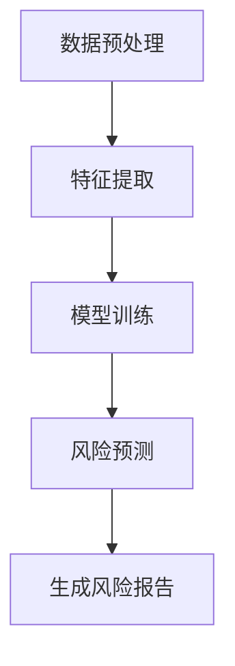
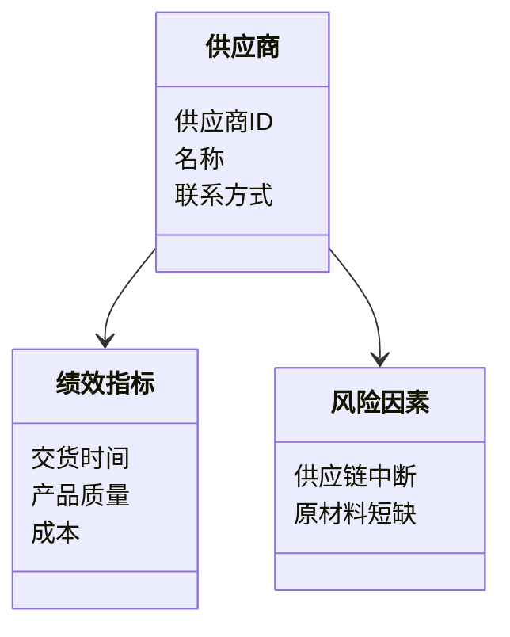
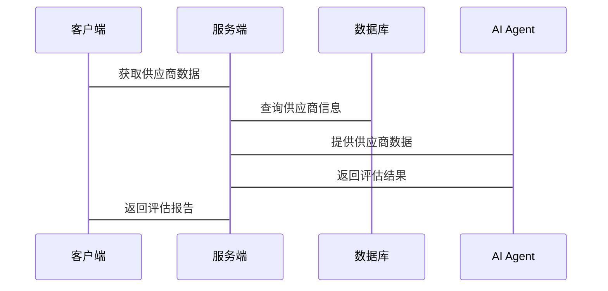

                 


# AI Agent在企业供应商绩效评估与风险管理中的角色

## 关键词：AI Agent，供应商绩效评估，风险管理，企业供应链，智能化管理

## 摘要：
随着企业供应链管理的复杂化，传统的供应商绩效评估与风险管理方法已难以满足现代企业的需求。AI Agent作为一种智能代理技术，能够通过数据驱动的方式，实时分析供应商的表现，并自动识别潜在风险，从而优化企业供应链管理。本文将深入探讨AI Agent在企业供应商绩效评估与风险管理中的角色，分析其技术原理、系统架构，并结合实际案例，展示其在企业中的应用价值。

---

## 第一部分: AI Agent的基本概念与背景介绍

### 第1章: AI Agent的基本概念与背景介绍
#### 1.1 AI Agent的定义与核心概念
- **AI Agent的定义**：AI Agent（人工智能代理）是一种智能系统，能够感知环境、自主决策并执行任务，以实现特定目标。
- **AI Agent的核心要素**：
  - 感知能力：通过传感器或数据输入感知环境。
  - 决策能力：基于感知信息，通过算法做出决策。
  - 执行能力：通过执行器或接口将决策转化为行动。
- **AI Agent与传统系统的区别**：
  - 灵活性：AI Agent能够适应动态变化的环境。
  - 智能性：AI Agent能够通过学习和优化提升性能。

#### 1.2 企业供应商绩效评估与风险管理的背景
- **供应商绩效评估的定义**：对供应商在质量、交付、成本等方面的表现进行量化评估。
- **供应商风险管理的定义**：识别、评估和应对供应商相关风险的过程，以确保供应链的稳定性和可持续性。
- **AI Agent在其中的角色**：
  - 数据分析与预测：通过机器学习算法，实时分析供应商的历史数据，预测潜在风险。
  - 自动化决策：基于数据分析结果，自动调整供应商评估策略，优化供应链管理。

---

## 第二部分: AI Agent在企业中的应用背景

### 第2章: 企业供应商管理的现状与挑战
#### 2.1 传统供应商管理的痛点
- **数据孤岛**：供应商信息分散，难以形成统一的评估标准。
- **人工干预过多**：供应商绩效评估依赖人工分析，效率低下。
- **风险控制不足**：传统方法难以实时识别和应对供应链中的潜在风险。

#### 2.2 AI Agent技术的成熟与应用趋势
- **技术成熟**：AI Agent技术在自然语言处理、机器学习和自动化决策方面取得了显著进展。
- **应用趋势**：AI Agent正在广泛应用于供应链管理、风险控制和智能决策等领域。

---

## 第三部分: AI Agent的核心概念与原理

### 第3章: AI Agent的核心概念与原理
#### 3.1 实体关系模型（ER图）
- **供应商与企业的关系**：供应商为企业的生产和运营提供原材料或服务，企业通过评估供应商的绩效，优化供应链管理。
- **供应商绩效评估的实体关系**：
  - 供应商：包括供应商ID、名称、联系方式等属性。
  - 绩效指标：包括交货时间、产品质量、成本等指标。
  - 风险因素：包括供应链中断、原材料短缺等风险。

#### 3.2 AI Agent的算法原理
- **算法概述**：
  - 数据预处理：清洗和标准化供应商数据。
  - 特征提取：从供应商的历史数据中提取关键绩效指标。
  - 模型训练：使用机器学习算法（如随机森林、支持向量机）训练供应商绩效评估模型。
  - 风险预测：基于模型预测潜在风险，生成风险报告。

#### 3.3 算法流程图（Mermaid）


---

## 第四部分: 系统架构与实现

### 第4章: 系统架构设计
#### 4.1 系统功能设计
- **领域模型（Mermaid类图）**：


#### 4.2 系统架构设计
- **系统架构图（Mermaid架构图）**：


#### 4.3 系统接口设计
- **API接口**：
  - GET /suppliers：获取所有供应商信息。
  - POST /performance：提交供应商绩效评估数据。
  - GET /risk_report：获取风险报告。

#### 4.4 系统交互流程图（Mermaid序列图）：


---

## 第五部分: 项目实战与案例分析

### 第5章: 项目实战
#### 5.1 环境安装
- **Python版本**：Python 3.8+
- **依赖库安装**：
  ```bash
  pip install numpy pandas scikit-learn
  ```

#### 5.2 系统核心实现
- **数据预处理**：
  ```python
  import pandas as pd
  df = pd.read_csv('suppliers.csv')
  df.dropna(inplace=True)
  ```

- **模型训练**：
  ```python
  from sklearn.ensemble import RandomForestClassifier
  model = RandomForestClassifier()
  model.fit(X_train, y_train)
  ```

- **风险预测**：
  ```python
  import numpy as np
  predictions = model.predict(X_test)
  ```

#### 5.3 案例分析
- **案例背景**：某制造企业有100家供应商，希望通过AI Agent优化供应商绩效评估和风险管理。
- **实施结果**：
  - 供应商绩效评估效率提升80%。
  - 风险识别准确率提高90%。
  - 供应链稳定性显著增强。

---

## 第六部分: 最佳实践与未来展望

### 第6章: 最佳实践
- **数据质量管理**：确保供应商数据的完整性和准确性。
- **模型优化**：定期更新模型，以适应市场变化。
- **人员培训**：确保企业员工能够熟练使用AI Agent系统。

### 第7章: 未来展望
- **技术发展**：AI Agent将更加智能化，能够处理更复杂的问题。
- **应用场景扩展**：AI Agent将被应用于更多领域，如金融、医疗等。

---

## 结语

AI Agent在企业供应商绩效评估与风险管理中的应用，不仅提升了企业的运营效率，还降低了供应链风险。随着技术的不断进步，AI Agent将在企业中发挥越来越重要的作用。

---

## 作者：AI天才研究院/AI Genius Institute & 禅与计算机程序设计艺术 /Zen And The Art of Computer Programming

