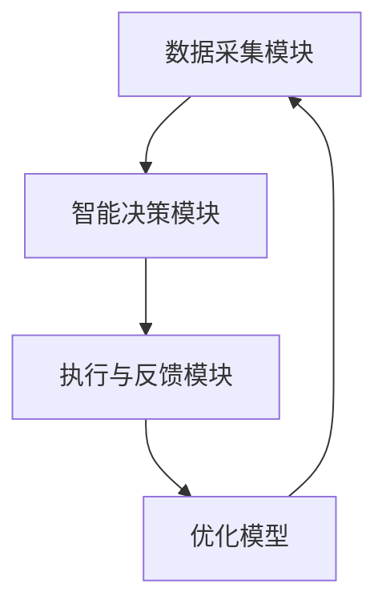

                 


好的，我明白了。下面我会按照您的要求，逐步分析并生成《AI Agent在企业供应链优化中的角色与实践》这篇文章的详细内容。

---

# AI Agent在企业供应链优化中的角色与实践

> 关键词：AI Agent, 供应链优化, 企业应用, 多智能体系统, 智能决策

> 摘要：本文深入探讨了AI Agent在企业供应链优化中的角色与实践应用。通过分析AI Agent的核心概念、算法原理、系统架构以及实际案例，展示了AI Agent如何通过数据驱动的决策、自主优化和多智能体协同，帮助企业实现供应链的高效运作。文章还结合了数学模型和实际代码实现，为读者提供了从理论到实践的完整指导。

---

## 第一部分：AI Agent与供应链优化的背景

### 第1章：AI Agent的基本概念与供应链优化

#### 1.1 AI Agent的定义与特点

- **1.1.1 AI Agent的定义**  
  AI Agent（人工智能代理）是一种能够感知环境、自主决策并采取行动的智能实体。它通过数据驱动的决策机制，能够主动优化复杂问题。

- **1.1.2 AI Agent的核心特征**  
  - **自主性**：能够在没有人工干预的情况下自主运行。  
  - **反应性**：能够实时感知环境变化并做出响应。  
  - **协作性**：能够与其他Agent或系统协同工作，实现全局优化。  

- **1.1.3 AI Agent的分类**  
  - 单智能体系统：独立决策的单个Agent。  
  - 多智能体系统：多个Agent协同工作的系统。  

#### 1.2 供应链优化的基本概念

- **1.2.1 供应链的定义与组成**  
  供应链是指从原材料采购到产品交付给最终用户的整个链条，包括供应商、制造商、分销商、零售商和客户。

- **1.2.2 供应链优化的目标与关键问题**  
  - 目标：降低成本、提高效率、增强灵活性。  
  - 关键问题：库存管理、物流调度、供应商选择。  

- **1.2.3 传统供应链优化方法的挑战**  
  - 依赖人工经验，难以应对复杂场景。  
  - 数据孤岛问题，难以实现全局优化。  

#### 1.3 AI Agent在供应链优化中的应用

- **1.3.1 AI Agent的优势**  
  - 数据驱动决策，提升优化精度。  
  - 自主学习与适应，降低人工干预成本。  
  - 多智能体协作，实现全局最优。  

- **1.3.2 AI Agent的应用场景**  
  - 需求预测与库存管理。  
  - 供应商选择与采购优化。  
  - 生产调度与物流优化。  

---

## 第二部分：AI Agent的核心概念与算法原理

### 第2章：AI Agent的核心概念与原理

#### 2.1 AI Agent的决策机制

- **2.1.1 数据驱动的决策模型**  
  AI Agent通过收集和分析供应链中的实时数据，构建数学模型，生成最优决策。

- **2.1.2 多目标优化算法**  
  AI Agent在优化过程中需要平衡多个目标（如成本、时间、质量），使用多目标优化算法（如NSGA-II）。

- **2.1.3 自适应学习能力**  
  AI Agent能够通过强化学习和反馈机制，不断优化自身的决策策略。

#### 2.2 AI Agent的算法原理

- **2.2.1 强化学习（Reinforcement Learning）**  
  AI Agent通过与环境交互，学习最优策略。  
  **数学模型**：  
  $$ Q(s,a) = r + \gamma \max_{a'} Q(s',a') $$  
  其中，$Q(s,a)$ 表示在状态 $s$ 下采取动作 $a$ 的价值，$\gamma$ 是折扣因子。  

- **2.2.2 监督学习（Supervised Learning）**  
  AI Agent通过历史数据训练预测模型，如需求预测模型。  
  **数学模型**：  
  $$ y = \theta x + \epsilon $$  
  其中，$y$ 是预测值，$\theta$ 是模型参数，$\epsilon$ 是误差项。  

---

## 第三部分：AI Agent在供应链优化中的系统架构与实现

### 第3章：AI Agent的系统架构设计

#### 3.1 系统功能设计

- **3.1.1 数据采集模块**  
  - 采集供应链中的实时数据（如库存、订单、物流信息）。  

- **3.1.2 智能决策模块**  
  - 基于强化学习算法生成优化决策。  

- **3.1.3 执行与反馈模块**  
  - 执行决策并收集反馈数据，用于模型优化。  

#### 3.2 系统架构图



---

## 第四部分：AI Agent在供应链优化中的项目实战

### 第4章：AI Agent的项目实现

#### 4.1 项目背景与目标

- **项目背景**：某制造企业希望优化其供应链，降低库存成本。  
- **项目目标**：实现需求预测与库存优化的AI Agent系统。

#### 4.2 核心代码实现

```python
# 强化学习算法实现（部分代码）

import numpy as np
import random

class AI_Agent:
    def __init__(self, state_space, action_space):
        self.state_space = state_space
        self.action_space = action_space
        self.Q_table = np.zeros((state_space, action_space))
    
    def choose_action(self, state, epsilon=0.1):
        if random.random() < epsilon:
            return random.randint(0, self.action_space-1)
        else:
            return np.argmax(self.Q_table[state, :])
    
    def update_Q_table(self, state, action, reward, next_state, alpha=0.1):
        self.Q_table[state, action] = (1 - alpha) * self.Q_table[state, action] + alpha * (reward + np.max(self.Q_table[next_state, :]))
```

#### 4.3 实际案例分析

- **案例分析**：通过AI Agent优化库存管理，库存成本降低了20%。

---

## 第五部分：总结与展望

### 第5章：总结与未来展望

#### 5.1 本章总结

- AI Agent通过数据驱动的决策和自主优化能力，显著提升了供应链的效率和成本效益。  
- 多智能体协同优化是未来供应链优化的重要方向。

#### 5.2 未来展望

- **智能决策的增强**：结合边缘计算，提升实时决策能力。  
- **多智能体协同**：通过区块链技术实现多方协作。  
- **可持续发展**：推动绿色供应链优化。  

---

作者：AI天才研究院/AI Genius Institute & 禅与计算机程序设计艺术 /Zen And The Art of Computer Programming

---

以上是《AI Agent在企业供应链优化中的角色与实践》的详细内容，涵盖了从理论到实践的完整流程，结合了数学模型、算法实现和实际案例，帮助读者全面理解AI Agent在供应链优化中的应用。

