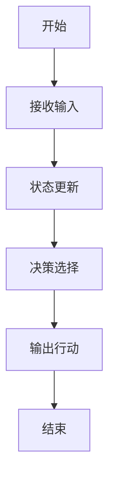
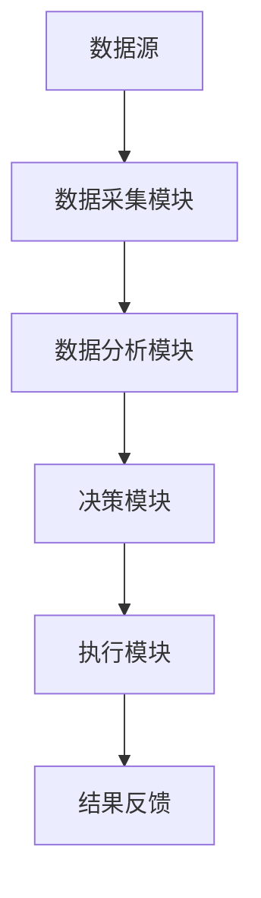

                 

# AI Agent在企业供应链韧性提升中的角色

> 关键词：AI Agent，供应链韧性，强化学习，算法流程图，数学模型，供应链风险管理

> 摘要：本文深入探讨了AI Agent在企业供应链韧性提升中的角色，分析了AI Agent的基本概念、算法原理及其在供应链风险管理中的应用，结合实际案例展示了AI Agent如何通过强化学习和监督学习等算法优化供应链的灵活性、抗风险能力和效率，最后总结了AI Agent在供应链系统设计中的挑战与解决方案，提出了未来的研究方向。

---

# 第一部分: AI Agent与企业供应链韧性概述

# 第1章: AI Agent与供应链韧性概述

## 1.1 AI Agent的基本概念

### 1.1.1 AI Agent的定义

AI Agent（人工智能代理）是指能够感知环境、自主决策并执行任务的智能体。它通过传感器接收输入信息，利用算法进行处理，并通过执行器输出行动结果。AI Agent的核心在于其智能性，能够根据环境变化动态调整行为。

### 1.1.2 AI Agent的核心特征

| 特征 | 描述 |
|------|------|
| 智能性 | 能够感知环境并自主决策 |
| 反应性 | 对环境变化做出实时响应 |
| 学习性 | 通过经验优化行为 |

### 1.1.3 AI Agent与传统供应链管理的区别

| 方面 | AI Agent | 传统供应链管理 |
|------|----------|-----------------|
| 决策方式 | 自主学习优化 | 依赖人工或固定规则 |
| 响应速度 | 实时动态调整 | 较慢，依赖人工干预 |
| 灵活性 | 高 | 低 |

## 1.2 供应链韧性的定义与重要性

### 1.2.1 供应链韧性的定义

供应链韧性是指供应链在面对内外部干扰时，能够保持稳定运行、快速恢复并持续优化的能力。它强调供应链的抗风险能力和恢复力。

### 1.2.2 供应链韧性的重要性

供应链韧性直接关系到企业的生存能力和竞争力。在现代全球化背景下，供应链中断可能导致巨大的经济损失，因此提升供应链韧性已成为企业战略的重要组成部分。

### 1.2.3 供应链韧性与企业竞争力的关系

| 方面 | 高韧性供应链 | 低韧性供应链 |
|------|--------------|----------------|
| 成本 | 较低 | 较高 |
| 灵活性 | 高 | 低 |
| 抗风险能力 | 强 | 弱 |

## 1.3 AI Agent在供应链韧性中的作用

### 1.3.1 AI Agent如何提升供应链的灵活性

AI Agent能够实时感知供应链中的异常情况，并迅速调整采购、生产和配送计划，从而提高供应链的灵活性。

### 1.3.2 AI Agent如何增强供应链的抗风险能力

通过预测潜在风险（如自然灾害、供应商违约等），AI Agent能够提前制定应对策略，降低供应链中断的风险。

### 1.3.3 AI Agent如何优化供应链的效率

AI Agent可以通过优化库存管理、路径规划和资源分配，显著提高供应链的整体效率。

## 1.4 本章小结

本章介绍了AI Agent的基本概念和核心特征，分析了供应链韧性的定义与重要性，并探讨了AI Agent在提升供应链韧性中的关键作用，包括增强灵活性、抗风险能力和优化效率。

---

# 第二部分: AI Agent的算法原理与数学模型

# 第2章: AI Agent的算法原理

## 2.1 AI Agent的核心算法

### 2.1.1 基于强化学习的AI Agent算法

强化学习是一种通过试错机制优化决策的算法。AI Agent通过与环境交互，获得奖励或惩罚信号，逐步优化自身的行为策略。

### 2.1.2 基于监督学习的AI Agent算法

监督学习是一种通过标签数据训练模型的算法。AI Agent通过大量标注数据学习输入与输出之间的映射关系，从而做出预测或分类。

### 2.1.3 基于无监督学习的AI Agent算法

无监督学习是一种通过发现数据内在结构的算法。AI Agent能够识别数据中的异常值或群集，从而发现潜在的供应链风险。

## 2.2 AI Agent的算法流程图

### 使用 Mermaid 绘制的算法流程图：

## 2.3 AI Agent的数学模型

### 2.3.1 强化学习模型

强化学习的目标是通过最大化累计奖励来优化行为策略。数学模型如下：

$$ R(s, a) = \text{奖励函数} $$

$$ Q(s, a) = r + \gamma \max Q(s', a') $$

其中：
- $R(s, a)$ 表示状态 $s$ 下采取行动 $a$ 的奖励。
- $Q(s, a)$ 表示状态-动作对的价值。
- $\gamma$ 表示折扣因子。

### 2.3.2 监督学习模型

监督学习的目标是通过训练数据学习输入与输出之间的关系。数学模型如下：

$$ y = f(x; \theta) $$

$$ L = \frac{1}{n}\sum_{i=1}^{n}(y_i - \hat{y}_i)^2 $$

其中：
- $y$ 表示预测输出。
- $x$ 表示输入数据。
- $\theta$ 表示模型参数。
- $L$ 表示损失函数。

## 2.4 算法对比与优化

### 2.4.1 不同AI Agent算法的对比分析

| 算法类型 | 优点 | 缺点 |
|----------|------|------|
| 强化学习 | 高效性 | 需要大量训练数据 |
| 监督学习 | 稳定性 | 适应性差 |
| 无监督学习 | 自发现 | 结果难以解释 |

### 2.4.2 算法优化策略

通过结合多种算法的优势，可以优化AI Agent的整体性能。例如，可以先使用无监督学习发现异常，再利用强化学习进行实时调整。

---

# 第三部分: AI Agent在供应链韧性中的应用

# 第3章: AI Agent在供应链风险管理中的应用

## 3.1 供应链风险管理的背景与挑战

供应链风险管理是企业确保供应链稳定运行的重要环节。传统供应链管理依赖人工判断，存在效率低、响应慢等问题。

## 3.2 AI Agent在供应链风险管理中的应用

### 3.2.1 风险预测与评估

AI Agent可以通过分析历史数据和实时信息，预测潜在风险并评估其影响。

### 3.2.2 应急响应与恢复

AI Agent能够在风险发生后，快速制定应急响应策略，缩短恢复时间。

### 3.2.3 优化决策

AI Agent通过优化库存管理、供应商选择和物流路径，降低供应链整体风险。

## 3.3 AI Agent在供应链风险管理中的优势

### 3.3.1 实时监控

AI Agent能够实时监控供应链各环节的状态，及时发现异常。

### 3.3.2 数据驱动决策

AI Agent通过分析海量数据，提供更精准的决策支持。

### 3.3.3 智能优化

AI Agent能够根据环境变化，动态调整供应链策略，实现持续优化。

---

# 第四部分: 供应链系统设计与优化

# 第4章: 供应链系统设计与优化

## 4.1 供应链系统设计的背景与目标

供应链系统设计是实现供应链高效运作的关键环节。通过系统化设计，可以提高供应链的整体性能。

## 4.2 基于AI Agent的供应链系统架构设计

### 4.2.1 系统功能设计

- 数据采集模块：收集供应链各环节的数据。
- 数据分析模块：利用AI Agent进行数据分析和预测。
- 决策模块：制定优化策略并输出行动指令。
- 执行模块：执行决策并反馈结果。

### 4.2.2 系统架构设计

## 4.3 系统优化与实现

### 4.3.1 系统优化策略

通过优化数据采集、分析和决策模块，可以提高供应链系统的整体性能。

### 4.3.2 系统实现

通过编写Python代码实现AI Agent的核心功能，包括数据处理、模型训练和决策优化。

---

# 第五部分: 项目实战与案例分析

# 第5章: 项目实战与案例分析

## 5.1 项目背景与目标

本项目旨在通过AI Agent优化某企业的供应链管理，提升其韧性。

## 5.2 项目实施步骤

### 5.2.1 环境安装

安装Python、TensorFlow和Scikit-learn等必要的工具和库。

### 5.2.2 数据收集与预处理

收集供应链相关数据，进行清洗和特征工程。

### 5.2.3 模型训练与优化

使用强化学习算法训练AI Agent，并进行参数调优。

### 5.2.4 系统部署与测试

将模型部署到供应链系统中，并进行测试和优化。

## 5.3 项目案例分析

### 5.3.1 案例背景

某企业因供应商延迟导致库存积压，希望通过AI Agent优化供应链管理。

### 5.3.2 案例分析

通过AI Agent的预测和优化，企业成功降低了库存成本，并提高了供应链的响应速度。

## 5.4 项目小结

本项目展示了AI Agent在供应链管理中的实际应用，证明了其在提升供应链韧性方面的有效性。

---

# 第六部分: 挑战与解决方案

# 第6章: 挑战与解决方案

## 6.1 当前的挑战

### 6.1.1 数据质量问题

供应链数据的不完整性和不准确性可能影响AI Agent的性能。

### 6.1.2 算法复杂性

复杂的算法可能导致计算成本过高，影响实时性。

### 6.1.3 系统集成难度

AI Agent需要与现有供应链系统无缝集成，存在一定的技术挑战。

## 6.2 解决方案

### 6.2.1 数据质量管理

通过数据清洗和特征工程，提高数据质量。

### 6.2.2 算法优化

通过简化算法或采用分布式计算，降低计算成本。

### 6.2.3 系统集成

通过API接口和模块化设计，实现AI Agent与现有系统的无缝集成。

---

# 第七部分: 最佳实践与未来展望

# 第7章: 最佳实践与未来展望

## 7.1 最佳实践

### 7.1.1 数据驱动决策

企业应充分利用数据，通过AI Agent进行优化决策。

### 7.1.2 持续优化

定期更新AI Agent模型，以适应供应链环境的变化。

### 7.1.3 团队协作

AI Agent的应用需要供应链团队与技术团队的紧密合作。

## 7.2 未来展望

随着AI技术的不断发展，AI Agent在供应链管理中的应用将更加广泛和深入。未来的研究方向包括更高效的算法、更强大的数据处理能力以及更智能化的决策系统。

---

# 结语

AI Agent作为企业供应链韧性提升的重要工具，正在发挥越来越重要的作用。通过本文的分析，我们可以看到AI Agent在供应链风险管理、系统优化和项目实战中的巨大潜力。未来，随着技术的进步，AI Agent将在供应链管理中扮演更加关键的角色。

---

# 作者：AI天才研究院/AI Genius Institute & 禅与计算机程序设计艺术 /Zen And The Art of Computer Programming

