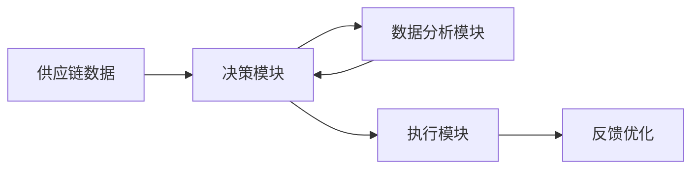

                 


# AI Agent在企业供应链韧性评估与提升中的应用

> 关键词：AI Agent, 供应链韧性, 企业供应链, 供应链风险管理, 供应链优化

> 摘要：随着全球化的深入和市场竞争的加剧，供应链的韧性和稳定性对企业生存和发展至关重要。AI Agent作为一种智能代理技术，能够通过自动化决策、实时监控和智能优化，显著提升供应链的应对风险能力和运营效率。本文将详细探讨AI Agent在企业供应链韧性评估与提升中的应用，从基本概念到核心原理，再到实际应用，层层解析，为企业在数字化转型中提供有力的技术支持。

---

# 第1章: AI Agent与供应链韧性概述

## 1.1 AI Agent的基本概念

### 1.1.1 AI Agent的定义与特点
AI Agent（人工智能代理）是指能够感知环境、自主决策并执行任务的智能系统。它具备以下特点：
- **自主性**：能够在没有外部干预的情况下独立运作。
- **反应性**：能够实时感知环境变化并做出响应。
- **目标导向性**：通过设定目标来驱动行为。
- **学习能力**：能够通过数据和经验不断优化自身性能。

### 1.1.2 AI Agent的核心功能与类型
AI Agent的核心功能包括数据采集、分析、决策和执行。根据应用场景的不同，可以将AI Agent分为以下几类：
- **反应式AI Agent**：基于当前感知做出即时反应，适用于实时监控和应急处理。
- **规划式AI Agent**：通过规划和优化实现长期目标，适用于供应链的全局优化。
- **学习型AI Agent**：通过机器学习不断优化自身性能，适用于复杂场景下的智能决策。

### 1.1.3 AI Agent在企业中的应用价值
AI Agent在企业中的应用价值主要体现在以下几个方面：
- **提高效率**：通过自动化决策减少人工干预，提高供应链运营效率。
- **增强灵活性**：能够快速适应市场变化和供应链波动。
- **降低风险**：通过实时监控和智能预警，有效降低供应链风险。

## 1.2 供应链韧性的定义与重要性

### 1.2.1 供应链韧性的定义
供应链韧性是指供应链在面对外部干扰（如自然灾害、疫情、供应商问题等）时，能够快速恢复并维持正常运营的能力。一个具有韧性的供应链不仅能够承受压力，还能在危机中保持稳定并迅速恢复。

### 1.2.2 供应链韧性的影响因素
供应链韧性的影响因素主要包括：
- **供应商多样性**：供应商的数量和地理位置分布。
- **库存策略**：库存水平和存储位置。
- **运输能力**：物流网络的多样性和冗余性。
- **信息透明度**：供应链各环节的信息共享和实时监控能力。

### 1.2.3 供应链韧性对企业的重要性
供应链韧性对企业的重要性体现在以下几个方面：
- **保障业务连续性**：在供应链出现问题时，能够快速恢复，避免业务中断。
- **降低成本**：通过优化库存和物流，降低运营成本。
- **增强竞争力**：在供应链中断时能够快速响应，提升客户满意度和市场竞争力。

## 1.3 AI Agent在供应链韧性中的作用

### 1.3.1 AI Agent如何提升供应链韧性
AI Agent通过以下方式提升供应链韧性：
- **实时监控**：通过实时数据采集和分析，快速识别潜在风险。
- **智能预警**：基于历史数据和预测模型，提前预警可能的供应链中断。
- **优化决策**：通过智能算法优化供应链布局和资源分配，提高整体抗风险能力。

### 1.3.2 AI Agent在供应链风险管理中的应用
AI Agent在供应链风险管理中的应用主要体现在以下几个方面：
- **风险识别**：通过分析供应链各环节的数据，识别潜在风险点。
- **风险评估**：基于风险的严重性和概率，对风险进行优先级排序。
- **风险应对**：根据风险评估结果，制定相应的应对策略，如调整供应商或增加库存。

### 1.3.3 AI Agent与供应链优化的结合
AI Agent与供应链优化的结合主要体现在以下几个方面：
- **动态优化**：通过实时数据和智能算法，动态调整供应链策略。
- **成本优化**：通过优化库存和运输路线，降低供应链成本。
- **效率提升**：通过自动化决策和协同优化，提高供应链整体效率。

## 1.4 本章小结
本章主要介绍了AI Agent的基本概念、核心功能以及在企业中的应用价值。同时，详细阐述了供应链韧性的定义、影响因素和重要性，并探讨了AI Agent在供应链韧性中的具体作用，包括提升供应链韧性、优化供应链管理和降低供应链风险等方面。

---

# 第2章: AI Agent的核心原理

## 2.1 AI Agent的决策机制

### 2.1.1 基于知识图谱的决策树模型
决策树是一种常用的AI Agent决策模型，它通过构建树状结构来表示可能的决策路径。基于知识图谱的决策树模型能够从海量数据中提取有用的信息，并通过层次化的方式进行决策。例如，在供应链风险管理中，AI Agent可以通过决策树模型快速识别潜在风险点，并制定相应的应对策略。

**决策树构建过程**：
1. **数据采集**：从供应链各环节采集数据，包括供应商信息、库存数据、物流信息等。
2. **数据预处理**：对数据进行清洗、去重和特征提取。
3. **模型训练**：使用决策树算法（如ID3、C4.5）进行模型训练。
4. **决策推理**：根据输入的数据，沿着决策树进行推理，得出最终决策。

### 2.1.2 基于概率的决策模型
基于概率的决策模型是一种基于统计学的决策方法，通过计算不同决策方案的概率和收益，选择最优决策。例如，在供应链库存管理中，AI Agent可以通过概率模型预测需求波动，并制定最优的库存策略。

**概率模型计算公式**：
$$ P(A|B) = \frac{P(B|A) \cdot P(A)}{P(B)} $$
其中，$P(A|B)$ 表示在事件B发生的条件下，事件A发生的概率。

### 2.1.3 基于强化学习的决策优化
强化学习是一种通过试错机制优化决策的方法，适用于复杂动态环境下的决策优化。例如，在供应链网络优化中，AI Agent可以通过强化学习算法（如Q-learning）不断优化供应链的布局和资源分配，提高整体效率。

**强化学习算法流程图**：
```mermaid
graph LR
    S[状态] --> A[动作]
    A --> R[奖励]
    R --> S[新状态]
    S --> end
```

## 2.2 AI Agent的感知与学习能力

### 2.2.1 多模态数据感知
AI Agent的感知能力是其智能决策的基础。通过多模态数据感知，AI Agent能够从多种数据源（如传感器数据、文本数据、图像数据等）获取信息，并进行融合分析。例如，在供应链实时监控中，AI Agent可以通过传感器数据和物流信息，实时感知供应链各环节的状态。

### 2.2.2 知识图谱构建与学习
知识图谱是一种将实体及其关系以图结构表示的知识库，能够帮助AI Agent更好地理解和推理。通过构建供应链领域的知识图谱，AI Agent可以快速获取供应链各环节的关联信息，并进行智能推理。例如，在供应商风险评估中，AI Agent可以通过知识图谱快速识别供应商之间的关联关系，并评估潜在风险。

### 2.2.3 自适应学习机制
自适应学习机制是一种动态调整学习策略的方法，能够根据环境变化和任务需求，实时优化学习过程。例如，在供应链需求预测中，AI Agent可以通过自适应学习机制，根据市场需求的变化，动态调整预测模型，提高预测准确率。

## 2.3 AI Agent的执行与反馈机制

### 2.3.1 自动化执行流程
自动化执行流程是AI Agent实现智能决策的关键步骤。通过自动化执行流程，AI Agent能够快速响应决策结果，并执行相应的操作。例如，在供应链库存管理中，AI Agent可以根据预测结果自动调整库存水平，确保库存最优。

### 2.3.2 反馈机制与优化
反馈机制是AI Agent优化决策的重要环节。通过实时反馈，AI Agent能够根据执行结果不断优化决策策略。例如，在供应链风险管理中，AI Agent可以通过反馈机制，根据风险应对措施的执行效果，动态调整风险评估模型，提高风险预测的准确性。

### 2.3.3 异常处理与容错机制
异常处理与容错机制是AI Agent保证系统稳定性的关键。通过异常处理和容错机制，AI Agent能够在出现异常时快速恢复，并保证系统的正常运行。例如，在供应链数据采集过程中，AI Agent可以通过容错机制，自动处理数据异常，并确保数据采集的完整性。

## 2.4 本章小结
本章主要介绍了AI Agent的核心原理，包括决策机制、感知与学习能力以及执行与反馈机制。通过具体的技术细节和实际案例，详细阐述了AI Agent在供应链韧性评估与提升中的重要作用。

---

# 第3章: AI Agent在供应链韧性评估中的应用

## 3.1 供应链韧性评估的AI Agent方法论

### 3.1.1 供应链风险识别与预测
供应链风险识别与预测是供应链韧性评估的重要环节。通过AI Agent的智能算法，可以快速识别潜在风险，并预测风险的发生概率和影响范围。例如，在疫情爆发期间，AI Agent可以通过分析历史数据和实时信息，预测供应链中断的可能性，并制定相应的应对策略。

### 3.1.2 供应链韧性优化的AI Agent策略
供应链韧性优化的AI Agent策略是一种通过智能算法优化供应链布局和资源分配的方法。例如，在供应链网络优化中，AI Agent可以通过动态规划算法，优化供应链的物流网络，提高整体效率。

### 3.1.3 供应链网络风险传播分析
供应链网络风险传播分析是通过图论方法，分析供应链各环节之间的风险传播路径和影响范围。例如，在供应商网络中，AI Agent可以通过图论算法，识别关键节点和风险传播路径，并制定相应的风险应对策略。

## 3.2 供应链韧性优化的AI Agent策略

### 3.2.1 基于动态规划的优化策略
动态规划是一种通过分阶段决策优化全局策略的方法，适用于供应链网络优化问题。例如，在供应链库存管理中，AI Agent可以通过动态规划算法，优化库存水平和存储位置，降低库存成本。

### 3.2.2 基于博弈论的供应链优化
博弈论是一种通过分析竞争主体的策略互动来优化决策的方法。在供应链优化中，AI Agent可以通过博弈论模型，分析供应链各环节的利益冲突和合作机会，制定最优的供应链策略。

### 3.2.3 基于多目标优化的供应链韧性提升
多目标优化是一种通过同时优化多个目标来提高供应链韧性的方法。例如，在供应链布局优化中，AI Agent可以通过多目标优化算法，同时优化供应链的成本、效率和抗风险能力，实现供应链的整体优化。

## 3.3 本章小结
本章主要介绍了AI Agent在供应链韧性评估中的具体应用，包括供应链风险识别与预测、供应链韧性优化策略以及供应链网络风险传播分析。通过这些方法，AI Agent能够有效提升供应链的应对风险能力和运营效率。

---

# 第4章: 供应链韧性提升的AI Agent系统架构设计

## 4.1 系统功能设计

### 4.1.1 数据采集模块
数据采集模块是AI Agent系统的输入模块，负责从供应链各环节采集数据。数据来源包括传感器数据、物流信息、库存数据、市场数据等。

### 4.1.2 数据分析模块
数据分析模块是AI Agent系统的处理模块，负责对采集的数据进行清洗、转换和分析。数据分析模块可以使用机器学习算法（如决策树、随机森林）和统计分析方法（如时间序列分析）进行数据处理。

### 4.1.3 智能决策模块
智能决策模块是AI Agent系统的决策模块，负责根据分析结果生成最优决策。智能决策模块可以使用强化学习算法、知识图谱推理等方法进行决策。

### 4.1.4 执行与反馈模块
执行与反馈模块是AI Agent系统的执行模块，负责根据决策结果执行相应的操作，并根据执行结果进行反馈优化。

## 4.2 系统架构设计

### 4.2.1 系统架构图
以下是一个供应链韧性评估与提升系统的架构图：


### 4.2.2 系统接口设计
系统接口设计是AI Agent系统与其他系统的交互接口。常见的系统接口包括：
- **API接口**：用于与供应链管理系统、库存管理系统等进行数据交互。
- **数据库接口**：用于与供应链数据库进行数据存储和查询。
- **用户界面**：用于与用户进行交互，展示系统运行状态和决策结果。

## 4.3 本章小结
本章主要介绍了AI Agent在供应链韧性提升中的系统架构设计，包括系统功能设计和系统架构图。通过系统的模块化设计和接口设计，能够实现供应链数据的高效处理和智能决策，提高供应链的韧性和效率。

---

# 第5章: AI Agent在供应链韧性提升中的项目实战

## 5.1 项目背景介绍
本项目旨在通过AI Agent技术提升某企业的供应链韧性。该企业是一家跨国制造企业，供应链涉及多个环节，包括供应商管理、生产计划、库存管理、物流运输等。由于供应链的复杂性和不确定性，该企业经常面临供应链中断的风险，导致成本增加和客户满意度下降。

## 5.2 项目需求分析
项目需求分析是项目实施的第一步。根据企业的实际情况，项目需求主要体现在以下几个方面：
- **风险识别与预测**：快速识别供应链中的潜在风险，并预测风险的发生概率和影响范围。
- **供应链优化**：优化供应链的布局和资源分配，提高供应链的整体效率和抗风险能力。
- **实时监控与预警**：实时监控供应链各环节的状态，并在出现异常时及时预警。

## 5.3 项目核心实现

### 5.3.1 数据采集与预处理
数据采集与预处理是项目实施的基础。通过多种数据源（如传感器数据、物流信息、市场数据等）采集供应链相关数据，并对数据进行清洗、去重和特征提取。

### 5.3.2 智能决策算法实现
智能决策算法实现是项目的核心部分。通过机器学习算法（如决策树、随机森林）和强化学习算法（如Q-learning），实现供应链风险的智能识别和优化决策。

### 5.3.3 系统集成与测试
系统集成与测试是项目实施的最后一步。通过将各模块集成到一个系统中，并进行充分的测试和验证，确保系统的稳定性和可靠性。

## 5.4 项目应用案例

### 5.4.1 案例分析
通过AI Agent技术，该企业成功实现了供应链的智能优化。例如，在供应商风险管理中，AI Agent可以通过知识图谱推理和风险预测模型，快速识别潜在风险，并制定相应的应对策略，有效降低了供应链中断的风险。

### 5.4.2 项目小结
本项目通过AI Agent技术，显著提升了企业的供应链韧性。通过智能识别和优化，企业能够快速应对供应链中断的风险，提高供应链的整体效率和抗风险能力。

---

# 第6章: AI Agent在供应链韧性提升中的未来展望

## 6.1 未来技术趋势
随着人工智能技术的不断发展，AI Agent在供应链韧性提升中的应用将更加广泛和深入。未来，随着大数据、物联网和区块链等技术的成熟，AI Agent将能够更高效地处理供应链数据，并实现更智能的决策。

## 6.2 未来应用场景
未来，AI Agent在供应链韧性提升中的应用场景将更加多样化。例如，AI Agent可以通过与区块链技术结合，实现供应链的透明化和可追溯性，进一步提高供应链的抗风险能力。

## 6.3 未来挑战与解决方案
尽管AI Agent在供应链韧性提升中的应用前景广阔，但仍然面临一些挑战。例如，数据隐私和安全问题、算法的可解释性问题等。未来，需要通过技术创新和制度完善，逐步解决这些问题，推动AI Agent技术的进一步发展。

## 6.4 本章小结
本章主要展望了AI Agent在供应链韧性提升中的未来发展趋势和应用场景，并分析了未来可能面临的挑战和解决方案。随着技术的不断进步，AI Agent将在供应链韧性提升中发挥越来越重要的作用。

---

# 作者信息

作者：AI天才研究院/AI Genius Institute & 禅与计算机程序设计艺术 /Zen And The Art of Computer Programming

---

通过以上内容，您可以看到AI Agent在企业供应链韧性评估与提升中的广泛应用和巨大潜力。AI Agent不仅能够通过智能决策和实时监控提高供应链的应对风险能力，还能够通过优化决策和动态调整提高供应链的整体效率。随着人工智能技术的不断发展，AI Agent将在供应链韧性提升中发挥越来越重要的作用，为企业在数字化转型中提供强有力的技术支持。

