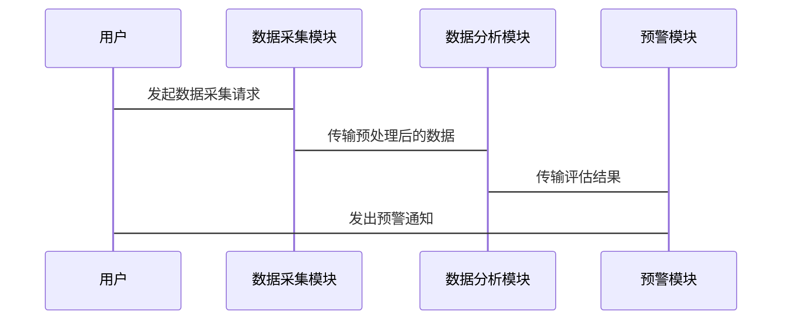

                 


# AI Agent在企业供应链韧性评估与预警中的应用

## 关键词：AI Agent, 供应链韧性, 供应链预警, 企业风险管理, 智能预测模型

## 摘要：  
随着全球化和市场竞争的加剧，企业供应链的韧性和稳定性对企业生存与发展至关重要。AI Agent（人工智能代理）作为一种智能化的决策辅助工具，能够通过实时数据采集、分析和预测，为企业供应链的韧性评估与预警提供强大的技术支持。本文将从AI Agent的基本概念、供应链韧性评估的核心问题、基于AI Agent的预警模型构建，以及系统设计与实现等方面展开详细论述，探讨如何利用AI Agent提升企业供应链的抗风险能力。

---

# 第一部分: AI Agent与企业供应链韧性概述

## 第1章: AI Agent与供应链韧性基础

### 1.1 AI Agent的基本概念

#### 1.1.1 AI Agent的定义与特点  
AI Agent（人工智能代理）是指具有感知环境、自主决策和执行任务能力的智能实体。它能够通过传感器或数据源获取信息，基于预设的目标和规则进行推理和决策，并通过执行器或接口与外部环境交互。AI Agent的特点包括：  
- **自主性**：能够在没有外部干预的情况下独立运行。  
- **反应性**：能够实时感知环境变化并做出响应。  
- **目标导向性**：所有行为均以实现特定目标为导向。  
- **学习能力**：通过数据驱动的方法不断优化自身的决策能力。  

#### 1.1.2 AI Agent的核心功能与分类  
AI Agent的核心功能包括：数据采集、信息处理、决策支持、执行反馈和自适应优化。根据应用场景的不同，AI Agent可以分为以下几类：  
- **反应式AI Agent**：基于实时数据做出快速反应，适用于动态环境。  
- **认知式AI Agent**：具有复杂的推理和规划能力，适用于复杂场景。  
- **协作式AI Agent**：能够与其他系统或人类协同工作，优化整体效率。  

#### 1.1.3 AI Agent在企业中的应用场景  
在企业中，AI Agent广泛应用于智能客服、供应链优化、风险预警等领域。本文重点关注其在供应链韧性评估与预警中的应用。

### 1.2 供应链韧性的概念与重要性

#### 1.2.1 供应链韧性的定义  
供应链韧性是指供应链在面对突发事件、市场波动或其他不确定性因素时，能够保持稳定运作并快速恢复的能力。  

#### 1.2.2 供应链韧性的影响因素  
供应链韧性受多种因素影响，包括：  
- **供应商的稳定性**：供应商是否能够按时按质交付。  
- **物流能力**：物流网络的覆盖范围和运输效率。  
- **库存管理**：库存水平是否能够应对需求波动。  
- **应急响应能力**：企业在突发事件中的应对策略和资源调配能力。  

#### 1.2.3 供应链韧性对企业的重要性  
供应链韧性是企业核心竞争力的重要组成部分。它能够帮助企业：  
- **降低运营风险**：通过提前预警和快速响应，避免供应链中断带来的损失。  
- **优化成本**：通过智能化的库存管理和资源调配，降低运营成本。  
- **提升客户满意度**：通过稳定供应，确保客户订单按时交付。  

### 1.3 AI Agent与供应链韧性的结合

#### 1.3.1 AI Agent在供应链管理中的作用  
AI Agent可以通过实时数据采集、智能分析和决策支持，帮助企业优化供应链管理。例如：  
- **实时监控**：通过传感器或API接口实时采集供应链各环节的数据。  
- **智能预测**：基于历史数据和机器学习模型，预测供应链可能出现的问题。  
- **动态调整**：根据预测结果，自动调整采购、生产或物流计划。  

#### 1.3.2 供应链韧性评估的核心问题  
供应链韧性评估的核心问题包括：  
- **数据的全面性**：如何获取覆盖供应链各环节的高质量数据。  
- **模型的准确性**：如何构建能够准确反映供应链风险的评估模型。  
- **决策的及时性**：如何实现快速响应，避免供应链中断。  

#### 1.3.3 AI Agent在供应链预警中的应用前景  
AI Agent在供应链预警中的应用前景广阔。通过实时监控和智能分析，AI Agent能够提前发现潜在风险，并提供最优的应对策略。例如：  
- **风险预警**：通过异常数据分析，提前发现供应链可能出现的瓶颈或中断。  
- **应急预案**：根据预警结果，自动生成应急预案并执行。  

### 1.4 本章小结  
本章主要介绍了AI Agent的基本概念、供应链韧性的核心问题，以及AI Agent在供应链韧性评估与预警中的应用前景。通过AI Agent的技术支持，企业可以显著提升供应链的抗风险能力。

---

# 第二部分: 供应链韧性评估的理论与方法

## 第2章: 数据采集与预处理

### 2.1 数据来源与采集方法

#### 2.1.1 供应链数据的来源渠道  
供应链数据的来源包括：  
- **内部数据**：企业的ERP系统、CRM系统等内部数据库。  
- **外部数据**：供应商、物流商、客户等外部系统的数据接口。  
- **实时数据**：传感器、物联网设备等实时采集的数据。  

#### 2.1.2 数据采集的常见方法  
数据采集的常见方法包括：  
- **API接口**：通过API接口从外部系统获取数据。  
- **数据抓取**：通过网络爬虫从公开数据源获取数据。  
- **传感器数据**：通过物联网设备实时采集数据。  

#### 2.1.3 数据清洗与预处理  
数据清洗与预处理是数据采集过程中的关键步骤。主要包括：  
- **去重**：去除重复数据。  
- **去噪**：去除异常值或噪声数据。  
- **标准化**：将数据转换为统一的格式。  

### 2.2 数据特征分析

#### 2.2.1 数据特征的分类与选择  
数据特征的分类与选择直接影响模型的性能。常用的特征包括：  
- **时间特征**：如订单时间、交货时间等。  
- **数量特征**：如订单量、库存量等。  
- **地点特征**：如供应商地理位置、物流节点位置等。  

#### 2.2.2 数据分布与异常值处理  
数据分布分析有助于发现数据的分布规律。异常值处理方法包括：  
- **剔除法**：直接删除异常值。  
- **修正法**：对异常值进行平滑处理。  

#### 2.2.3 数据标准化与归一化  
数据标准化与归一化是数据预处理的重要步骤。标准化公式如下：  
$$ z = \frac{x - \mu}{\sigma} $$  
其中，$\mu$ 是均值，$\sigma$ 是标准差。归一化公式如下：  
$$ x' = \frac{x - \min(x)}{\max(x) - \min(x)} $$  

### 2.3 数据存储与管理

#### 2.3.1 数据库设计与存储方案  
数据库设计需要考虑数据的完整性和一致性。常用的关系型数据库设计包括：  
- **订单表**：记录订单信息。  
- **供应商表**：记录供应商信息。  
- **物流表**：记录物流信息。  

#### 2.3.2 数据仓库的构建与管理  
数据仓库是存储和管理大规模数据的系统。构建数据仓库的关键步骤包括：  
- **数据抽取**：从多个数据源抽取数据。  
- **数据转换**：将数据转换为统一的格式。  
- **数据加载**：将数据加载到数据仓库中。  

#### 2.3.3 数据安全与隐私保护  
数据安全与隐私保护是数据管理的重要内容。常用的方法包括：  
- **数据加密**：对敏感数据进行加密存储。  
- **访问控制**：限制未经授权的访问。  

### 2.4 本章小结  
本章主要介绍了供应链数据的采集与预处理方法，包括数据来源、特征分析、存储与管理等内容。通过有效的数据处理，可以为后续的供应链韧性评估提供高质量的数据支持。

---

## 第3章: 供应链韧性评估的分析方法

### 3.1 基于AI Agent的分析框架

#### 3.1.1 分析框架的设计思路  
基于AI Agent的分析框架设计思路包括：  
1. 数据采集与预处理。  
2. 数据特征分析与建模。  
3. 风险预测与预警。  

#### 3.1.2 分析框架的组成部分  
分析框架的组成部分包括：  
- **数据采集模块**：负责数据的采集与预处理。  
- **数据分析模块**：负责数据的特征提取与建模。  
- **预警模块**：负责风险预测与预警。  

#### 3.1.3 分析框架的实现步骤  
分析框架的实现步骤如下：  
1. 采集供应链各环节的数据。  
2. 对数据进行清洗与预处理。  
3. 构建供应链韧性评估模型。  
4. 基于模型进行风险预测与预警。  

### 3.2 供应链韧性评估的指标体系

#### 3.2.1 评估指标的设计原则  
评估指标的设计原则包括：  
- **全面性**：覆盖供应链的各个关键环节。  
- **可量化性**：指标能够量化评估。  
- **可操作性**：指标易于计算和比较。  

#### 3.2.2 评估指标的分类与权重  
供应链韧性评估的指标可以分为以下几类：  
- **供应商稳定性**：供应商按时交付的能力。  
- **物流能力**：物流网络的覆盖范围和运输效率。  
- **库存管理**：库存水平是否能够应对需求波动。  
- **应急响应能力**：企业在突发事件中的应对策略和资源调配能力。  

指标权重可以通过层次分析法（AHP）确定。  

#### 3.2.3 指标体系的构建与验证  
指标体系的构建与验证过程包括：  
1. 确定评估指标。  
2. 设计问卷或收集专家意见。  
3. 使用统计方法验证指标的有效性和可靠性。  

### 3.3 基于AI Agent的预警模型

#### 3.3.1 预警模型的设计思路  
预警模型的设计思路包括：  
1. 确定预警目标。  
2. 构建预警指标体系。  
3. 基于AI Agent进行风险预测与预警。  

#### 3.3.2 预警模型的实现步骤  
预警模型的实现步骤如下：  
1. 采集供应链各环节的数据。  
2. 对数据进行清洗与预处理。  
3. 构建供应链韧性评估模型。  
4. 基于模型进行风险预测与预警。  

#### 3.3.3 预警模型的验证与优化  
预警模型的验证与优化包括：  
1. 使用历史数据验证模型的准确性。  
2. 根据验证结果优化模型参数。  
3. 不断迭代优化模型。  

### 3.4 本章小结  
本章主要介绍了供应链韧性评估的分析方法，包括基于AI Agent的分析框架、指标体系的构建与验证，以及预警模型的设计与实现。

---

# 第三部分: 系统设计与实现

## 第4章: 系统架构设计

### 4.1 系统功能模块划分

#### 4.1.1 数据采集模块  
数据采集模块负责从供应链各环节采集数据。包括：  
- **订单数据**：订单信息、订单状态等。  
- **供应商数据**：供应商信息、供应商交付记录等。  
- **物流数据**：物流信息、运输状态等。  

#### 4.1.2 数据分析模块  
数据分析模块负责对数据进行特征提取和建模。包括：  
- **特征提取**：提取影响供应链韧性的关键特征。  
- **模型构建**：构建供应链韧性评估模型。  

#### 4.1.3 预警模块  
预警模块负责进行风险预测与预警。包括：  
- **风险预测**：基于模型预测供应链可能出现的风险。  
- **预警通知**：通过邮件、短信等方式通知相关人员。  

### 4.2 系统功能设计

#### 4.2.1 数据采集模块的功能设计  
数据采集模块需要实现以下功能：  
- **数据采集**：从多个数据源采集数据。  
- **数据预处理**：清洗和转换数据。  

#### 4.2.2 数据分析模块的功能设计  
数据分析模块需要实现以下功能：  
- **特征提取**：提取影响供应链韧性的关键特征。  
- **模型构建**：基于机器学习算法构建供应链韧性评估模型。  

#### 4.2.3 预警模块的功能设计  
预警模块需要实现以下功能：  
- **风险预测**：基于模型预测供应链可能出现的风险。  
- **预警通知**：通过多种方式通知相关人员。  

### 4.3 系统架构设计

#### 4.3.1 系统架构设计  
系统架构设计采用分层架构，包括：  
- **数据层**：存储和管理数据。  
- **业务逻辑层**：实现数据处理和模型计算。  
- **用户界面层**：提供友好的用户界面。  

#### 4.3.2 系统架构的实现  
系统架构的实现使用微服务架构，包括：  
- **数据服务**：负责数据的采集与管理。  
- **分析服务**：负责数据的分析与建模。  
- **预警服务**：负责风险预测与预警。  

### 4.4 系统接口设计

#### 4.4.1 API接口设计  
系统需要提供以下API接口：  
- **数据采集接口**：用于数据的采集与预处理。  
- **模型计算接口**：用于供应链韧性评估模型的计算。  
- **预警通知接口**：用于风险预警的通知。  

#### 4.4.2 接口实现  
API接口的实现使用RESTful风格，采用JSON格式传输数据。  

### 4.5 系统交互设计

#### 4.5.1 系统交互流程  
系统交互流程包括：  
1. 用户发起数据采集请求。  
2. 系统采集数据并进行预处理。  
3. 系统构建供应链韧性评估模型。  
4. 系统进行风险预测并发出预警。  

#### 4.5.2 交互流程的实现  
交互流程的实现使用Mermaid序列图表示，如下：  



### 4.6 本章小结  
本章主要介绍了系统架构设计，包括功能模块划分、系统架构设计、接口设计和交互流程设计。通过合理的系统设计，可以实现高效的供应链韧性评估与预警。

---

# 第四部分: 项目实战

## 第5章: 项目实战与案例分析

### 5.1 项目背景与需求分析

#### 5.1.1 项目背景  
某大型制造企业希望利用AI Agent技术提升其供应链的抗风险能力。  

#### 5.1.2 项目需求  
- **需求1**：实时监控供应链各环节的状态。  
- **需求2**：预测供应链可能出现的风险并发出预警。  

### 5.2 数据准备与采集

#### 5.2.1 数据来源  
数据来源包括：  
- **内部数据库**：企业的ERP系统。  
- **外部数据源**：供应商和物流商的API接口。  

#### 5.2.2 数据采集与预处理  
数据采集与预处理过程如下：  
1. 从ERP系统中获取订单数据。  
2. 从供应商API接口获取交付记录。  
3. 对数据进行清洗和标准化处理。  

### 5.3 系统核心实现

#### 5.3.1 数据分析模块的实现  
数据分析模块的实现包括：  
- **特征提取**：提取供应商交付时间、物流运输时间等特征。  
- **模型构建**：基于随机森林算法构建供应链韧性评估模型。  

#### 5.3.2 预警模块的实现  
预警模块的实现包括：  
- **风险预测**：基于模型预测供应链可能出现的风险。  
- **预警通知**：通过邮件和短信通知相关人员。  

### 5.4 项目实现代码

#### 5.4.1 数据分析模块的代码  
以下是数据分析模块的Python实现代码：  

```python
import pandas as pd
from sklearn.ensemble import RandomForestClassifier
from sklearn.metrics import accuracy_score

# 数据加载
data = pd.read_csv('supply_chain.csv')

# 特征提取
features = data[['order_time', 'delivery_time', 'logistic_time']]
labels = data['risk_level']

# 模型训练
model = RandomForestClassifier()
model.fit(features, labels)

# 模型预测
predictions = model.predict(features)
print('模型准确率:', accuracy_score(labels, predictions))
```

#### 5.4.2 预警模块的代码  
以下是预警模块的Python实现代码：  

```python
import requests
import json

# 风险预测
def predict_risk(features):
    # 调用数据分析模块的API接口
    response = requests.post('http://localhost:8000/predict', json=features)
    return json.loads(response.text)

# 预警通知
def send_notification(message):
    # 发送邮件或短信通知
    pass

# 主程序
features = {'order_time': 10, 'delivery_time': 5, 'logistic_time': 3}
risk_level = predict_risk(features)
if risk_level >= 3:
    send_notification('供应链风险预警：风险等级为' + str(risk_level))
```

### 5.5 实际案例分析

#### 5.5.1 案例背景  
某制造企业在采购原材料时遇到供应商延迟交付的问题。  

#### 5.5.2 数据分析与建模  
通过数据分析模块，发现供应商的交付时间显著增加，可能影响供应链的稳定性。  

#### 5.5.3 预警结果  
模型预测供应链风险等级为4（最高为5），系统发出预警通知。  

### 5.6 项目小结  
本项目通过实际案例展示了AI Agent在供应链韧性评估与预警中的应用。通过系统的实现，企业能够实时监控供应链状态并提前发出预警，显著提升了供应链的抗风险能力。

---

# 第五部分: 优化与展望

## 第6章: 优化与展望

### 6.1 系统优化

#### 6.1.1 系统性能优化  
系统性能优化包括：  
- **算法优化**：优化随机森林算法的参数，提升预测准确率。  
- **系统架构优化**：采用分布式架构，提升系统的处理能力。  

#### 6.1.2 模型优化  
模型优化包括：  
- **特征选择优化**：使用特征重要性分析，进一步优化特征选择。  
- **模型调优**：通过网格搜索优化模型参数。  

### 6.2 未来展望

#### 6.2.1 技术发展趋势  
未来，AI Agent在供应链管理中的应用将更加智能化和自动化。  
- **自适应优化**：AI Agent能够自适应优化供应链的运营。  
- **智能化决策**：AI Agent能够基于实时数据做出更复杂的决策。  

#### 6.2.2 应用前景  
供应链韧性评估与预警的应用前景广阔。未来，随着AI技术的不断发展，AI Agent将在供应链管理中发挥越来越重要的作用。  

### 6.3 本章小结  
本章主要探讨了系统优化与未来展望，为企业进一步提升供应链韧性评估与预警能力提供了方向。

---

# 第六部分: 结论与建议

## 第7章: 结论与建议

### 7.1 研究总结  
本文详细探讨了AI Agent在企业供应链韧性评估与预警中的应用，提出了基于AI Agent的分析框架和系统设计方法。通过实际案例的验证，证明了AI Agent技术的有效性。  

### 7.2 最佳实践建议  
1. **数据质量管理**：确保数据的准确性和完整性。  
2. **模型优化**：根据实际情况不断优化模型参数。  
3. **系统维护**：定期更新模型和系统，确保系统的稳定运行。  

### 7.3 未来研究方向  
1. **多模态数据融合**：将结构化数据与非结构化数据结合，提升模型的准确性。  
2. **强化学习应用**：探索强化学习在供应链管理中的应用。  
3. **分布式系统架构**：研究分布式架构在供应链管理中的应用。  

### 7.4 本章小结  
本文总结了研究的主要成果，并提出了未来的研究方向和实践建议。

---

# 参考文献  
（此处列出相关文献和资料）

---

# 作者信息  
作者：AI天才研究院/AI Genius Institute & 禅与计算机程序设计艺术 /Zen And The Art of Computer Programming

