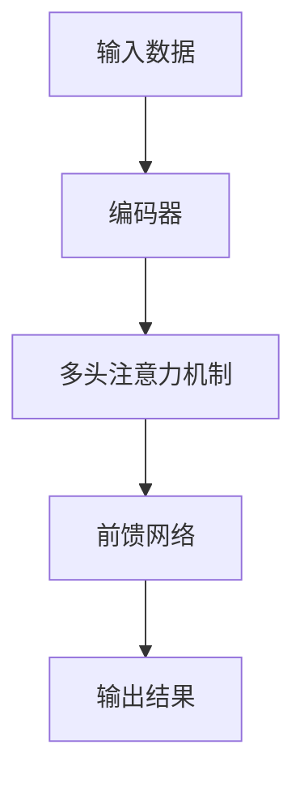
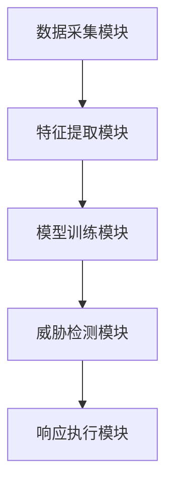

                 


# AI Agent在企业信息安全威胁检测与响应中的应用

> 关键词：AI Agent, 企业信息安全, 威胁检测, 响应策略, 深度学习

> 摘要：本文系统探讨了AI Agent在企业信息安全威胁检测与响应中的应用，从核心原理到系统架构设计，再到项目实战，全面解析了AI Agent如何提升企业安全防护能力。通过数学模型、算法流程图和代码实现，深入浅出地展示了AI Agent在威胁检测与响应中的技术细节和实际应用。

---

## 第一章: AI Agent与企业信息安全威胁检测概述

### 1.1 AI Agent的基本概念

#### 1.1.1 AI Agent的定义与特点

AI Agent（人工智能代理）是指具有自主决策和执行能力的智能体，能够感知环境、理解任务目标并采取相应行动以实现目标。其特点包括：

- **自主性**：能够自主决策，无需外部干预。
- **反应性**：能够实时感知环境变化并做出响应。
- **学习能力**：通过数据和经验不断优化自身行为。

#### 1.1.2 企业信息安全威胁检测的背景与挑战

随着企业数字化转型的推进，网络安全威胁日益复杂。传统基于规则的威胁检测方法难以应对新型攻击手段。AI Agent通过智能化的感知和响应，为企业提供了更高效的威胁检测与防护能力。

#### 1.1.3 AI Agent在威胁检测中的作用与优势

AI Agent能够通过机器学习算法实时分析网络流量、日志数据等信息，快速识别异常行为并采取响应措施。其优势包括：

- **实时性**：能够快速响应，减少攻击影响。
- **准确性**：通过深度学习算法提高威胁检测的准确性。
- **可扩展性**：适用于不同规模和复杂度的企业网络环境。

### 1.2 企业信息安全威胁检测的核心问题

#### 1.2.1 威胁检测的基本原理

威胁检测是指通过分析网络流量、日志数据等信息，识别潜在的安全威胁。其基本原理包括数据采集、特征提取、模型训练和实时检测。

#### 1.2.2 常见的威胁类型与特征

常见的威胁类型包括：

- **网络攻击**：如DDoS、钓鱼攻击等。
- **恶意软件**：如病毒、木马等。
- **内部威胁**：如员工误操作或恶意行为。

威胁特征包括：

- **行为异常**：如非正常时间段的网络访问。
- **模式识别**：如特定的攻击模式。
- **关联性分析**：如多个事件之间的关联性。

#### 1.2.3 威胁检测的难点与解决方案

威胁检测的难点包括：

- **数据量大**：企业网络产生的数据量庞大，难以处理。
- **攻击手段多样**：攻击者不断变换攻击手法，模型难以覆盖所有情况。
- **误报与漏报**：如何在高噪声环境中准确识别威胁是难点。

解决方案包括：

- **基于深度学习的威胁检测**：利用深度学习算法自动提取特征，提高检测准确性。
- **持续学习与优化**：通过实时数据反馈不断优化模型。

### 1.3 AI Agent在威胁检测中的应用现状

#### 1.3.1 AI Agent在威胁检测中的典型应用案例

- **金融行业**：利用AI Agent实时监控交易数据，识别异常交易行为。
- **制造业**：通过AI Agent检测工业控制系统中的异常行为，防止恶意攻击。
- **政府机构**：利用AI Agent实时监控网络流量，防范高级持续性威胁（APT）。

#### 1.3.2 当前技术发展的瓶颈与未来趋势

当前技术发展的瓶颈包括：

- **模型泛化能力不足**：针对特定场景的模型难以扩展到其他场景。
- **计算资源消耗大**：深度学习模型需要大量计算资源。
- **实时性与准确性权衡**：如何在保证准确性的同时实现实时响应是难点。

未来趋势包括：

- **轻量化模型**：通过模型压缩、知识蒸馏等技术减少计算资源消耗。
- **多模态数据融合**：结合网络流量、日志、行为特征等多种数据源，提高检测准确性。
- **零样本学习**：在有限样本情况下，快速适应新威胁。

#### 1.3.3 企业级应用的挑战与机遇

- **挑战**：企业网络环境复杂，数据隐私保护要求高，AI Agent的部署和维护成本高。
- **机遇**：AI Agent能够显著提高威胁检测效率，降低安全运营成本。

---

## 第二章: AI Agent的核心原理

### 2.1 基于Transformer的AI Agent模型

#### 2.1.1 Transformer模型的基本结构

Transformer模型由编码器和解码器组成，每个编码器由多头注意力机制和前馈网络构成。其核心公式包括：

- **多头注意力机制**：
  $$\text{Attention}(Q, K, V) = \text{softmax}\left(\frac{QK^T}{\sqrt{d_k}}\right)V$$
  
  其中，$Q$、$K$、$V$分别为查询、键、值向量，$d_k$为键的维度。

- **前馈网络**：
  $$\text{FFN}(x) = \text{ReLU}(W_1x + b_1)W_2 + b_2$$

#### 2.1.2 注意力机制的核心原理

注意力机制通过计算输入序列中每个位置的重要性，将注意力权重分配给相关位置。其权重计算公式为：
$$\text{weight}_i = \text{softmax}\left(\frac{Q_i K_j^T}{\sqrt{d_k}}\right)$$

通过注意力机制，模型能够关注输入中的关键部分，提升特征提取能力。

#### 2.1.3 基于Transformer的威胁检测模型设计

基于Transformer的威胁检测模型包括以下步骤：

1. **数据预处理**：对网络流量数据进行清洗、标准化。
2. **特征提取**：将数据转换为模型可接受的格式。
3. **模型训练**：使用训练数据训练Transformer模型。
4. **威胁检测**：对实时数据进行编码器编码，计算注意力权重，输出检测结果。

模型结构示意图如下：



---

### 2.2 威胁检测中的特征提取与表示学习

#### 2.2.1 基于深度学习的特征提取方法

深度学习模型（如CNN、RNN）常用于特征提取。以CNN为例，其卷积层公式为：
$$\text{conv}(x) = \max(0, Wx + b)$$

其中，$W$为卷积核，$b$为偏置项。

#### 2.2.2 表示学习的核心思想与实现方式

表示学习旨在将输入数据映射到低维特征空间，便于后续处理。常用方法包括：

- **词嵌入**：如Word2Vec，将单词映射为向量。
- **自监督学习**：通过预任务（如掩码任务）学习特征。

#### 2.2.3 基于图的特征表示方法

图结构数据（如网络流量图）可以通过图卷积网络（GCN）进行特征提取。GCN的传播规则为：
$$H' = \text{softmax}(\alpha H W)$$

其中，$H$为输入特征，$W$为权重矩阵，$\alpha$为归一化系数。

---

### 2.3 基于强化学习的威胁响应策略

#### 2.3.1 强化学习的基本原理

强化学习通过智能体与环境交互，学习最优策略。其核心公式为：
$$Q(s, a) = r + \gamma \max_a Q(s', a)$$

其中，$s$为当前状态，$a$为动作，$r$为奖励，$\gamma$为折扣因子。

#### 2.3.2 威胁响应策略的强化学习建模

在威胁响应中，智能体通过与环境（如网络）交互，选择最优的响应策略。响应策略包括：

1. **隔离受感染主机**：断开网络连接，防止扩散。
2. **阻断恶意流量**：通过防火墙或流量控制设备阻止恶意流量。
3. **更新防护策略**：动态调整安全策略，应对新威胁。

#### 2.3.3 响应策略的评估与优化

通过强化学习，智能体不断优化响应策略，以提高威胁应对能力。评估指标包括：

- **响应时间**：从检测到威胁到采取行动的时间。
- **误报率**：正常情况下误触发响应的次数。
- **漏报率**：未检测到实际威胁的次数。

---

### 2.4 本章小结

本章详细介绍了AI Agent的核心原理，包括基于Transformer的模型、特征提取与表示学习，以及基于强化学习的威胁响应策略。通过这些技术，AI Agent能够有效提升企业信息安全威胁检测与响应能力。

---

## 第三章: 威胁检测与响应的系统架构设计

### 3.1 系统整体架构设计

#### 3.1.1 系统模块划分

系统主要模块包括：

- **数据采集模块**：负责采集网络流量、日志等数据。
- **特征提取模块**：对数据进行特征提取和预处理。
- **模型训练模块**：训练AI Agent模型。
- **威胁检测模块**：实时检测威胁。
- **响应执行模块**：根据检测结果执行响应策略。

#### 3.1.2 各模块之间的交互关系

模块之间的交互关系如下：



---

#### 3.1.3 系统的可扩展性与灵活性设计

系统设计注重模块化和扩展性，便于后续功能扩展和性能优化。主要设计包括：

- **模块化设计**：各模块独立，便于维护和升级。
- **分布式架构**：通过分布式部署提高系统处理能力。
- **动态调整能力**：支持动态添加或删除模块。

---

### 3.2 数据源与数据预处理

#### 3.2.1 数据源的多样性与特征提取

数据源包括：

- **网络流量数据**：如IP地址、端口号、数据包大小等。
- **系统日志**：如登录日志、访问日志等。
- **用户行为数据**：如操作频率、访问模式等。

特征提取方法包括：

- **统计特征**：如均值、方差、最大值等。
- **时序特征**：如趋势、周期性等。
- **关联特征**：如图结构特征。

#### 3.2.2 数据预处理的关键步骤

数据预处理步骤包括：

1. **数据清洗**：去除噪声数据，如重复数据、无效数据。
2. **数据标准化**：将数据归一化，便于模型处理。
3. **数据增强**：通过数据增强技术增加数据多样性。

---

#### 3.2.3 数据增强与数据清洗方法

数据增强方法包括：

- **随机裁剪**：随机裁剪数据，生成新的样本。
- **数据扰动**：对数据进行轻微扰动，增加数据多样性。

数据清洗方法包括：

- **去重**：去除重复数据。
- **填补缺失值**：通过均值、中位数等方式填补缺失值。
- **异常值处理**：识别并处理异常值。

---

### 3.3 威胁检测模型的设计与实现

#### 3.3.1 模型输入与输出的设计

模型输入包括：

- **网络流量数据**：如源IP、目的IP、数据包大小等。
- **系统日志**：如登录时间、操作类型等。
- **用户行为数据**：如操作频率、访问模式等。

模型输出包括：

- **威胁检测结果**：如正常、可疑、攻击。
- **置信度**：模型对检测结果的置信程度。

---

#### 3.3.2 威胁检测模型的实现步骤

实现步骤包括：

1. **数据预处理**：清洗、标准化数据。
2. **特征提取**：提取数据特征，生成输入向量。
3. **模型训练**：使用训练数据训练AI Agent模型。
4. **模型评估**：通过测试数据评估模型性能。
5. **实时检测**：对实时数据进行威胁检测。

---

#### 3.3.3 基于Transformer的威胁检测模型实现

基于Transformer的威胁检测模型实现步骤包括：

1. **数据预处理**：对网络流量数据进行清洗和标准化。
2. **特征提取**：将数据转换为模型可接受的格式。
3. **模型训练**：使用预处理后的数据训练Transformer模型。
4. **模型评估**：通过测试数据评估模型性能。
5. **实时检测**：对实时数据进行编码器编码，计算注意力权重，输出检测结果。

模型实现代码示例：

```python
import torch
import torch.nn as nn

class Transformer(nn.Module):
    def __init__(self, d_model=512, n_head=8, dff=2048):
        super(Transformer, self).__init__()
        self.encoder = nn.TransformerEncoder(
            nn.TransformerEncoderLayer(d_model=d_model, nhead=n_head, dff=dff),
            num_layers=6
        )
        self.classifier = nn.Linear(d_model, 3)

    def forward(self, x):
        x = self.encoder(x)
        x = x.mean(dim=1)
        x = self.classifier(x)
        return x

# 使用示例
model = Transformer()
input_data = torch.randn(10, 512)
output = model(input_data)
print(output.shape)
```

---

### 3.4 本章小结

本章详细介绍了威胁检测与响应系统的架构设计，包括系统整体架构、数据源与数据预处理，以及基于Transformer的威胁检测模型实现。通过这些设计，AI Agent能够高效地进行威胁检测与响应。

---

## 第四章: 威胁响应策略与系统实现

### 4.1 威胁响应策略的设计与实现

#### 4.1.1 威胁响应策略的分类

威胁响应策略包括：

- **主动响应**：如断开网络连接、阻断恶意流量。
- **被动响应**：如记录日志、发出警报。

#### 4.1.2 基于强化学习的威胁响应策略实现

基于强化学习的威胁响应策略实现步骤包括：

1. **状态定义**：定义智能体的当前状态，如网络流量状态、系统日志状态等。
2. **动作定义**：定义智能体可执行的动作，如隔离主机、阻断流量。
3. **奖励机制设计**：定义奖励函数，根据智能体的响应效果给予奖励或惩罚。
4. **策略优化**：通过强化学习算法（如Q-learning、Deep Q-Network）优化响应策略。

---

#### 4.1.3 威胁响应策略的评估与优化

威胁响应策略的评估指标包括：

- **响应时间**：从检测到威胁到采取行动的时间。
- **误报率**：正常情况下误触发响应的次数。
- **漏报率**：未检测到实际威胁的次数。

优化方法包括：

- **参数调优**：通过调整模型参数提高响应效果。
- **经验回放**：通过回放历史数据优化策略。
- **多目标优化**：同时优化多个目标（如响应时间、误报率）。

---

### 4.2 系统实现与部署

#### 4.2.1 系统实现的关键步骤

系统实现步骤包括：

1. **环境搭建**：安装必要的软件和依赖项。
2. **数据采集**：部署数据采集模块，收集网络流量、日志等数据。
3. **特征提取**：对数据进行特征提取和预处理。
4. **模型训练**：训练AI Agent模型。
5. **系统部署**：将系统部署到生产环境，实时监控威胁。

---

#### 4.2.2 系统部署与维护

系统部署注意事项包括：

- **资源分配**：合理分配计算资源，确保系统正常运行。
- **日志管理**：及时记录系统运行日志，便于故障排查。
- **模型更新**：定期更新模型，应对新威胁。

系统维护包括：

- **模型再训练**：定期收集新数据，重新训练模型。
- **系统优化**：根据运行情况优化系统性能。
- **安全加固**：加强系统安全性，防止被攻击。

---

### 4.3 本章小结

本章详细介绍了威胁响应策略与系统实现，包括威胁响应策略的设计与实现，以及系统的部署与维护。通过这些技术，AI Agent能够有效应对企业信息安全威胁。

---

## 第五章: 项目实战与案例分析

### 5.1 项目实战

#### 5.1.1 环境安装与配置

项目实战环境安装步骤：

1. **安装Python**：确保安装最新版本的Python（如Python 3.8+）。
2. **安装依赖项**：使用pip安装必要的库，如torch、numpy、scikit-learn等。
3. **配置开发环境**：安装IDE（如PyCharm、VS Code）并配置虚拟环境。

---

#### 5.1.2 数据集准备与特征工程

数据集准备步骤：

1. **数据收集**：收集网络流量数据、系统日志等。
2. **数据清洗**：去除噪声数据，如重复数据、无效数据。
3. **数据增强**：通过数据增强技术增加数据多样性。

特征工程包括：

- **特征选择**：选择对威胁检测有较大影响的特征。
- **特征转换**：如归一化、标准化等。
- **特征组合**：将多个特征组合成新的特征。

---

#### 5.1.3 模型训练与优化

模型训练步骤：

1. **划分数据集**：将数据集划分为训练集、验证集和测试集。
2. **模型训练**：使用训练数据训练AI Agent模型。
3. **模型评估**：通过验证集和测试集评估模型性能。
4. **模型优化**：通过调整超参数、优化模型结构等提高模型性能。

---

#### 5.1.4 模型部署与实时检测

模型部署步骤：

1. **部署环境准备**：准备生产环境，安装必要的软件和依赖项。
2. **模型部署**：将训练好的模型部署到生产环境。
3. **实时检测**：对实时数据进行威胁检测，输出检测结果。
4. **日志管理**：记录检测结果和日志信息，便于后续分析。

---

### 5.2 案例分析

#### 5.2.1 案例背景与目标

案例背景：某企业遭受勒索软件攻击，需要通过AI Agent进行威胁检测与响应。

案例目标：通过AI Agent实时检测勒索软件行为，采取相应响应措施，防止数据丢失。

---

#### 5.2.2 数据分析与特征提取

数据预处理步骤：

1. **数据清洗**：去除无效数据。
2. **数据增强**：增加数据多样性。
3. **特征提取**：提取网络流量、系统日志等特征。

---

#### 5.2.3 模型训练与评估

模型训练步骤：

1. **划分数据集**：训练集、验证集、测试集。
2. **模型训练**：使用训练数据训练AI Agent模型。
3. **模型评估**：评估模型性能，调整超参数。

---

#### 5.2.4 威胁响应与结果分析

威胁响应步骤：

1. **检测到勒索软件行为**：如异常文件加密、异常网络连接。
2. **采取响应措施**：如断开网络连接、隔离受感染主机。
3. **记录日志**：记录检测结果和响应措施。

结果分析：

- **响应时间**：从检测到威胁到采取行动的时间。
- **响应效果**：是否成功阻止勒索软件攻击。
- **误报与漏报**：是否误报或漏报威胁。

---

### 5.3 本章小结

本章通过一个实际案例，详细介绍了项目实战的全过程，包括环境安装、数据准备、模型训练与部署，以及案例分析。通过这些实战，读者可以更好地理解AI Agent在企业信息安全威胁检测与响应中的应用。

---

## 第六章: 最佳实践与未来展望

### 6.1 最佳实践

#### 6.1.1 数据隐私保护

在AI Agent的部署过程中，必须重视数据隐私保护。具体措施包括：

- **数据加密**：对敏感数据进行加密处理。
- **最小权限原则**：赋予系统最小必要的权限。
- **访问控制**：通过访问控制列表（ACL）限制数据访问权限。

---

#### 6.1.2 模型更新与优化

为了应对不断变化的安全威胁，模型需要定期更新与优化。具体措施包括：

- **持续学习**：通过持续学习算法，模型能够不断适应新的威胁。
- **模型融合**：通过模型融合技术，结合多个模型的优势，提高检测准确性。
- **在线更新**：在生产环境中在线更新模型，减少离线维护时间。

---

#### 6.1.3 系统监控与维护

系统监控与维护是确保AI Agent正常运行的关键。具体措施包括：

- **实时监控**：通过监控工具实时监控系统运行状态。
- **日志分析**：分析系统日志，发现并解决问题。
- **性能优化**：通过性能分析工具优化系统性能。

---

### 6.2 未来展望

随着人工智能技术的不断发展，AI Agent在企业信息安全威胁检测与响应中的应用前景广阔。未来的发展方向包括：

- **轻量化模型**：通过模型压缩、知识蒸馏等技术，降低模型计算资源消耗。
- **多模态数据融合**：结合网络流量、日志、行为特征等多种数据源，提高检测准确性。
- **零样本学习**：在有限样本情况下，快速适应新威胁。
- **自适应安全**：通过自适应机制，动态调整安全策略，应对新威胁。

---

## 作者简介

作者：AI天才研究院（AI Genius Institute） & 禅与计算机程序设计艺术（Zen And The Art of Computer Programming）

---

通过本文的详细讲解，读者可以全面了解AI Agent在企业信息安全威胁检测与响应中的应用，从核心原理到系统实现，再到项目实战，为企业的信息安全防护提供了有力的技术支持。

