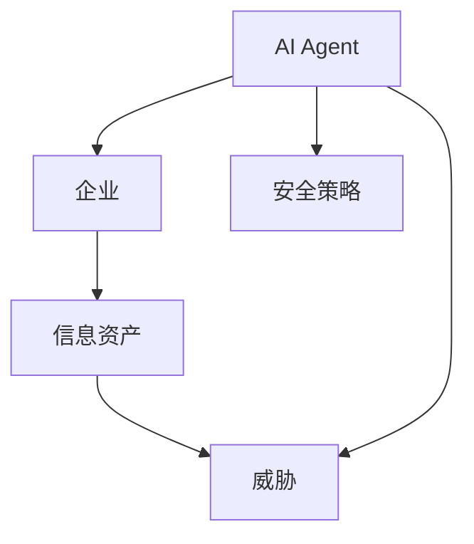
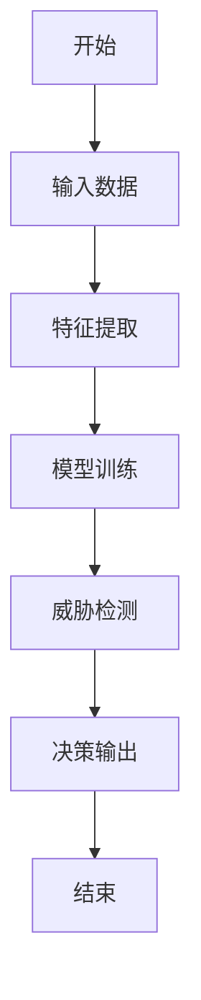
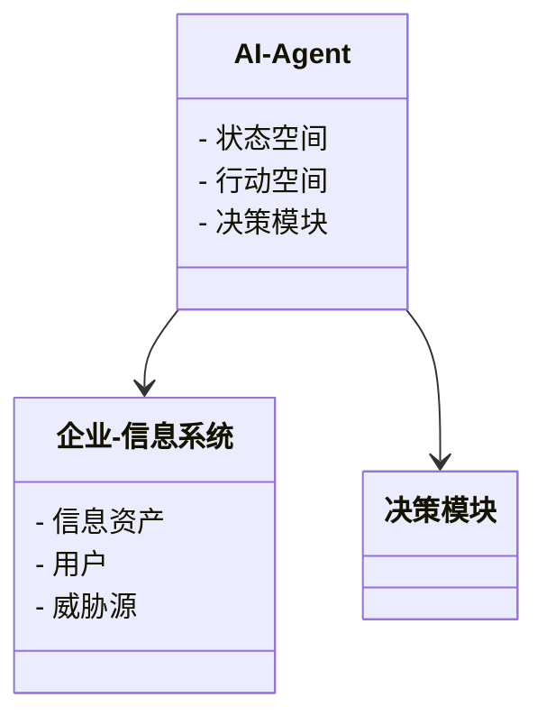
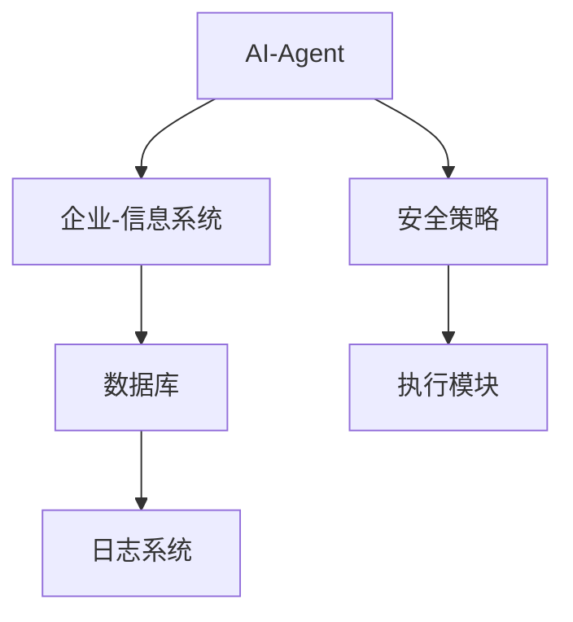
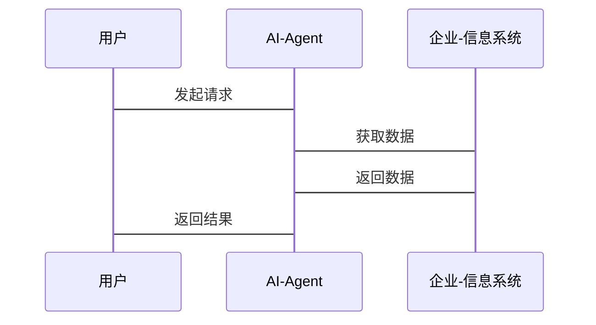

                 


# AI Agent在企业信息安全管理中的应用

**关键词：** AI Agent, 企业信息安全, 威胁检测, 强化学习, 安全策略

**摘要：** 本文探讨了AI Agent在企业信息安全中的应用，分析了AI Agent的核心原理、算法、系统架构及其在实际案例中的应用。通过详细的技术分析和实际案例，展示了AI Agent如何提升企业信息安全的效率和准确性。

---

## 目录大纲

### 第一部分：AI Agent与企业信息安全概述

#### 第1章：AI Agent与企业信息安全概述

##### 1.1 问题背景与描述

- 1.1.1 企业信息安全面临的挑战
  - 数据泄露的严重性
  - 内部威胁与外部攻击的双重威胁
  - 传统安全措施的局限性

- 1.1.2 AI Agent在信息安全中的作用
  - 威胁检测与响应
  - 自动化安全策略执行
  - 实时监控与异常行为分析

- 1.1.3 问题解决的边界与外延
  - AI Agent的应用范围
  - 与其他安全技术的协同工作
  - 企业信息安全体系中的位置

##### 1.2 核心概念与联系

- 1.2.1 AI Agent的核心原理
  - 智能体的基本概念
  - 基于状态的决策机制
  - 自适应学习能力

- 1.2.2 企业信息安全的关键要素
  - 信息资产分类
  - 威胁来源分析
  - 安全策略的制定与执行

- 1.2.3 AI Agent与企业信息安全的实体关系图



##### 1.3 本章小结

---

### 第二部分：AI Agent的核心原理与算法

#### 第2章：AI Agent的算法原理

##### 2.1 AI Agent的基本算法

- 2.1.1 基于概率论的威胁检测算法
  - 概率分布模型
  - 异常行为检测
  - 风险评估方法

- 2.1.2 基于强化学习的决策算法
  - Q-Learning算法
  - 策略梯度方法
  - 奖励机制设计

- 2.1.3 基于图论的关联分析算法
  - 图结构分析
  - 关联规则挖掘
  - 社会网络分析

##### 2.2 算法流程图



##### 2.3 数学模型与公式

- 威胁概率计算公式：

$$ P(\text{威胁}) = \frac{\text{威胁特征匹配数}}{\text{总特征数}} $$

- 决策树模型：

$$ \text{决策} = \argmax_{i} \sum_{j} p(i|j) $$

##### 2.4 代码实现示例

```python
import numpy as np
from sklearn.tree import DecisionTreeClassifier

# 示例数据
X = np.array([[1, 0], [0, 1], [1, 1], [0, 0]])
y = np.array([0, 1, 1, 0])

# 训练模型
model = DecisionTreeClassifier()
model.fit(X, y)

# 预测
print(model.predict([[1, 1]]))  # 输出: [1]
```

##### 2.5 本章小结

---

### 第三部分：系统分析与架构设计

#### 第3章：系统分析与架构设计

##### 3.1 系统架构设计

- 3.1.1 问题场景介绍
  - 典型企业信息安全问题分析
  - AI Agent的应用场景描述
  - 系统目标与功能概述

- 3.1.2 系统功能设计
  - 领域模型设计
  - mermaid类图展示



- 3.1.3 系统架构设计
  - mermaid架构图展示



##### 3.2 系统接口设计与交互流程

- 3.2.1 系统接口设计
  - API接口定义
  - 数据格式与通信协议

- 3.2.2 系统交互流程



##### 3.3 本章小结

---

### 第四部分：项目实战

#### 第4章：项目实战

##### 4.1 环境安装与配置

- 4.1.1 开发环境搭建
  - Python版本要求
  - 依赖库安装（如scikit-learn, numpy等）

##### 4.2 核心代码实现

- 4.2.1 威胁检测模块实现
  - Python代码示例
  - 代码解读与分析

```python
from sklearn.ensemble import RandomForestClassifier

# 示例数据
X = np.array([[1, 0], [0, 1], [1, 1], [0, 0]])
y = np.array([0, 1, 1, 0])

# 训练模型
model = RandomForestClassifier()
model.fit(X, y)

# 预测
print(model.predict([[1, 1]]))  # 输出: [1]
```

- 4.2.2 响应策略模块实现
  - 强化学习算法实现
  - 策略优化与调整

##### 4.3 案例分析与效果评估

- 4.3.1 典型案例分析
  - 某企业信息安全问题的解决方案
  - AI Agent的实际应用效果

- 4.3.2 性能评估与优化
  - 检测准确率分析
  - 响应时间优化
  - 模型鲁棒性测试

##### 4.4 本章小结

---

### 第五部分：总结与展望

#### 第5章：总结与展望

##### 5.1 最佳实践

- 5.1.1 AI Agent在企业信息安全中的应用建议
- 5.1.2 开发与部署中的注意事项
- 5.1.3 常见问题与解决方案

##### 5.2 未来展望

- 5.2.1 AI Agent技术的演进方向
- 5.2.2 新兴技术的融合（如区块链、边缘计算等）
- 5.2.3 行业应用的扩展

##### 5.3 小结

---

## 作者信息

**作者：** AI天才研究院/AI Genius Institute  
**联系邮箱：** [contact@aicourse.com](mailto:contact@aicourse.com)  
**个人简介：** 专注于人工智能与计算机程序设计的研究与实践，致力于通过技术创新为企业信息安全提供解决方案。

---

通过以上目录大纲，文章将系统地介绍AI Agent在企业信息安全中的应用，从理论到实践，帮助读者全面理解并掌握相关技术。

