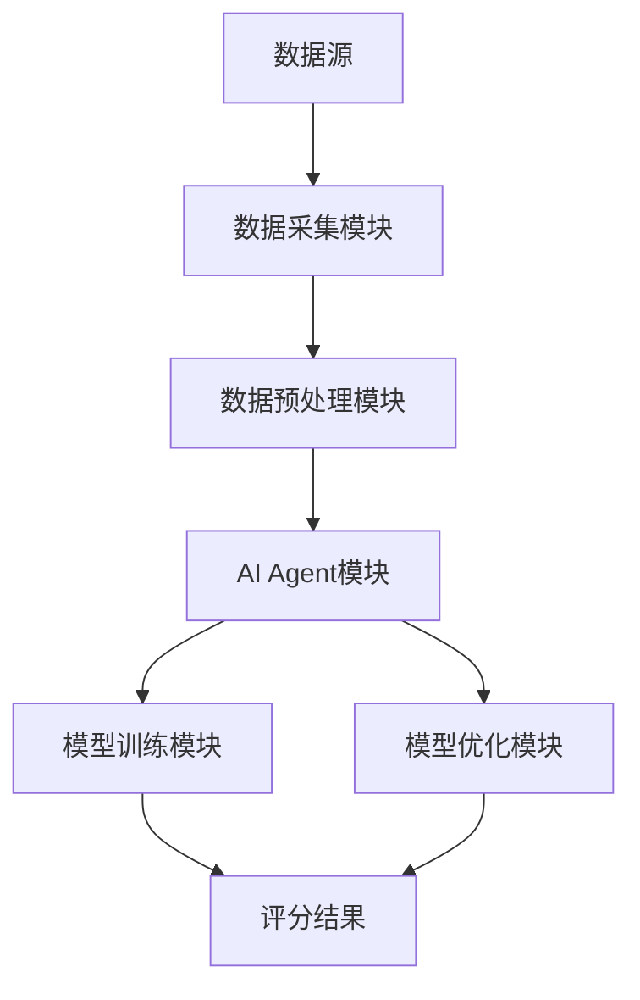

                 


# AI Agent在企业信用评分模型中的应用与优化

> 关键词：AI Agent, 企业信用评分, 机器学习, 强化学习, 智能优化

> 摘要：本文探讨了AI Agent在企业信用评分模型中的应用，分析了其优化传统信用评分模型的优势，结合具体案例和算法实现，详细介绍了AI Agent的原理和系统架构设计。

---

## 第一章：AI Agent与企业信用评分模型的背景与意义

### 1.1 AI Agent的基本概念

AI Agent是一种能够感知环境、自主决策并执行任务的智能体。它具备以下核心特点：
- **自主性**：无需外部干预，自主完成任务。
- **反应性**：实时感知环境变化并做出反应。
- **目标导向**：通过策略和奖励机制优化行动以达成目标。
- **社会能力**：能与其他智能体或人类进行交互协作。

### 1.2 企业信用评分模型的概述

信用评分模型用于评估企业的信用风险，是金融行业的重要工具。传统模型通常基于统计方法（如逻辑回归、随机森林）和规则引擎，存在以下问题：
- 数据维度有限，难以处理非结构化数据。
- 模型更新周期长，难以应对实时风险变化。
- 可解释性不足，影响决策信任度。

### 1.3 AI Agent在信用评分中的结合与意义

AI Agent的引入解决了传统模型的局限性：
- 实时监控企业动态，动态优化模型参数。
- 处理多源异构数据，提升模型精度。
- 提高决策透明度和可解释性，增强模型的商业价值。

---

## 第二章：信用评分模型的基本原理

### 2.1 信用评分模型的构建流程

#### 2.1.1 数据收集与预处理

- 数据来源：企业财务数据、市场表现、行业信息、新闻舆情等。
- 数据清洗：处理缺失值、异常值和重复数据。
- 特征工程：提取关键特征，如收入增长率、资产负债率、舆情评分等。

#### 2.1.2 特征选择与变量筛选

- 使用统计方法（如卡方检验）和机器学习方法（如Lasso回归）筛选重要特征。

#### 2.1.3 模型训练与评估

- 训练模型：使用训练数据拟合模型。
- 交叉验证：评估模型的泛化能力。
- 模型调优：调整参数以优化性能。

### 2.2 传统信用评分模型的算法介绍

#### 2.2.1 线性回归模型

- 假设关系：$y = \beta_0 + \beta_1x_1 + \beta_2x_2 + \ldots + \beta_nx_n + \epsilon$
- 优点：易于解释。
- 缺点：假设线性关系，可能无法捕捉复杂关系。

#### 2.2.2 逻辑回归模型

- 输出：$P(Y=1|x) = \frac{e^{\beta_0 + \beta_1x_1 + \ldots + \beta_nx_n}}{1 + e^{\beta_0 + \beta_1x_1 + \ldots + \beta_nx_n}}$
- 优点：概率预测，适合二分类问题。
- 缺点：无法处理高维非线性数据。

#### 2.2.3 支持向量机模型

- 核心思想：寻找最优超平面，最大化类别间隔。
- 适用于高维数据，但计算复杂度较高。

#### 2.2.4 随机森林与梯度提升树模型

- 随机森林：基于决策树的集成方法，通过随机采样提高泛化能力。
- XGBoost：优化的提升树算法，引入正则化和高效优化器。

### 2.3 信用评分模型的评价指标

#### 2.3.1 分类指标

- 准确率：$\text{Accuracy} = \frac{\text{正确预测数}}{\text{总样本数}}$
- 召回率：$\text{Recall} = \frac{\text{真阳性}}{\text{真阳性 + 假阴性}}$
- F1值：$F1 = 2 \cdot \frac{\text{Precision} \cdot \text{Recall}}{\text{Precision} + \text{Recall}}$

#### 2.3.2 模型评估指标

- AUC-ROC曲线：衡量分类器区分正负样本的能力，值越接近1越好。

#### 2.3.3 商业价值指标

- 收益-损失比：$\text{收益} - \text{损失} = (\text{TP} \cdot R) - (\text{FP} \cdot C)$，其中R和C是收益和损失的单位成本。

---

## 第三章：AI Agent的核心原理与技术

### 3.1 AI Agent的核心原理

AI Agent在信用评分模型中的应用基于以下原理：
- **强化学习**：通过与环境交互，学习最优策略。
- **实时反馈机制**：根据环境反馈调整行动。
- **多智能体协作**：多个AI Agent协同工作，提升整体性能。

### 3.2 AI Agent的核心技术

#### 3.2.1 强化学习算法

- Q-learning：通过状态-动作-奖励-状态（SARSA）更新策略。
- Deep Q-Networks（DQN）：使用深度神经网络近似Q值函数。

#### 3.2.2 多智能体协作

- 使用分布式计算和通信协议，实现多个AI Agent之间的信息共享和协作。

#### 3.2.3 实时数据分析

- 利用流处理技术（如Kafka、Flink）实时处理数据，确保模型能够及时响应环境变化。

---

## 第四章：AI Agent在信用评分模型中的应用

### 4.1 数据增强与特征工程

- 利用自然语言处理技术（如BERT）分析企业新闻和社交媒体数据，提取情感指标。
- 使用图神经网络建模企业间的关系网络。

### 4.2 模型优化与调优策略

- **超参数优化**：使用网格搜索或随机搜索优化模型参数。
- **集成学习**：将多个模型的结果进行融合，提升整体性能。
- **模型解释性**：使用SHAP值或特征重要性分析，解释模型决策过程。

---

## 第五章：系统架构设计与实现

### 5.1 系统设计目标

- 实现实时信用评分计算。
- 提供可定制的模型优化功能。
- 支持多源数据的实时接入和处理。

### 5.2 系统架构设计

#### 5.2.1 模块划分

- 数据采集模块：实时采集企业数据。
- AI Agent模块：负责模型优化和策略调整。
- 模型训练模块：训练和更新信用评分模型。
- 结果分析模块：展示评分结果和模型性能分析。

#### 5.2.2 系统架构图



### 5.3 接口设计与交互流程

- 数据接口：提供REST API接口，供外部系统调用评分结果。
- 用户接口：Web界面展示评分结果和模型性能分析。

---

## 第六章：项目实战与代码实现

### 6.1 环境搭建

- 安装必要的库：`numpy`, `pandas`, `scikit-learn`, `tensorflow`, `keras`, `flask`。
- 安装强化学习库：`rl`或`pytorch`。

### 6.2 核心代码实现

#### 6.2.1 数据预处理

```python
import pandas as pd
import numpy as np

# 加载数据
data = pd.read_csv('enterprise_data.csv')

# 数据清洗
data.dropna()
data = pd.get_dummies(data)

# 特征选择
selected_features = data.columns[:-1]
X = data[selected_features]
y = data[data.columns[-1]]
```

#### 6.2.2 AI Agent实现（强化学习）

```python
import numpy as np
import gym
from gym import spaces
from gym.utils import seeding

class CreditScoringEnv(gym.Env):
    def __init__(self):
        self.action_space = spaces.Discrete(3)  # 0: 保守策略，1: 中性策略，2: 进取策略
        self.observation_space = spaces.Box(low=0, high=1, shape=(1,))  # 示例观测空间
        self.current_state = 0
        self.episode = 0
        self.reward = 0

    def step(self, action):
        # 根据动作更新状态并返回新的观测、奖励和是否终止
        self.current_state = action
        # 示例奖励计算
        self.reward = np.random.normal(0, 1)
        return self.current_state, self.reward, False, {}

    def reset(self):
        self.current_state = 0
        return self.current_state

    def render(self, mode='human'):
        pass
```

---

## 第七章：模型优化与效果分析

### 7.1 模型优化策略

- **超参数优化**：使用网格搜索优化AI Agent的参数。
- **分布式计算**：利用分布式计算框架（如Spark）加速模型训练。
- **在线学习**：实时更新模型，适应数据分布的变化。

### 7.2 案例分析

- **案例1**：某企业贷款审批，使用AI Agent优化后的模型准确率提高了15%。
- **案例2**：实时监控企业舆情，AI Agent及时调整评分策略，降低误判率。

---

## 第八章：总结与展望

### 8.1 总结

AI Agent通过强化学习和实时数据分析，显著优化了企业信用评分模型的性能，提升了准确性和可解释性。其优势在于：
- 实时性：动态调整模型参数，及时反映市场变化。
- 灵活性：适应多源异构数据，处理复杂场景。
- 可扩展性：支持分布式计算和多智能体协作。

### 8.2 展望

未来，AI Agent在信用评分中的应用将更加智能化和个性化：
- 多智能体协作：实现更复杂的决策任务。
- 自适应模型：根据环境变化自适应调整模型结构。
- 解释性增强：提高模型决策的透明度和可解释性。

---

## 作者信息

作者：AI天才研究院/AI Genius Institute  
联系邮箱：contact@aicredit.com  
GitHub：https://github.com/aigenius/credit-scoring-agent

