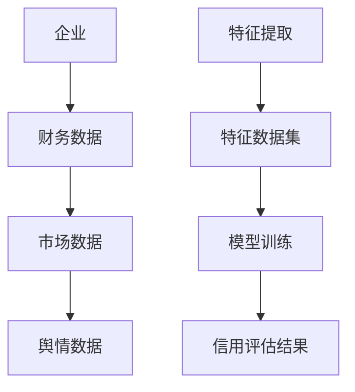
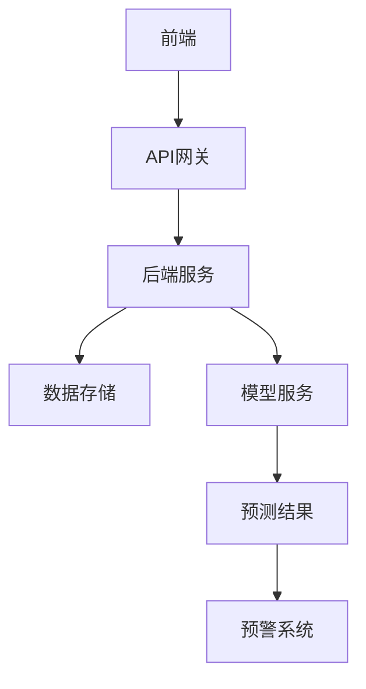

                 


# AI Agent在企业信用风险动态评估中的应用与模型可解释性

---

## 关键词：
AI Agent, 企业信用风险, 动态评估, 模型可解释性, 机器学习算法, 系统架构, 项目实战

---

## 摘要：
本文详细探讨了AI Agent在企业信用风险动态评估中的应用及其模型可解释性。通过分析信用风险评估的传统方法与AI Agent的优势，本文提出了一种基于机器学习的动态评估模型，并结合系统架构设计和项目实战，展示了如何通过可解释性技术提升模型的透明度和可信度。文章内容涵盖背景介绍、核心概念、算法原理、系统架构、项目实战和最佳实践，为读者提供全面的技术指导。

---

## 目录大纲：

1. [AI Agent在企业信用风险动态评估中的应用与模型可解释性](#ai-agent在企业信用风险动态评估中的应用与模型可解释性)
   1.1 AI Agent概述
   1.2 信用风险评估的核心概念
   1.3 AI Agent在信用风险评估中的作用
2. [信用风险动态评估的核心概念](#信用风险动态评估的核心概念)
   2.1 信用风险动态评估的背景
   2.2 动态评估的关键指标
   2.3 AI Agent在动态评估中的优势
3. [AI Agent的算法原理](#ai-agent的算法原理)
   3.1 特征选择与数据预处理
   3.2 基于机器学习的模型构建
   3.3 可解释性技术的实现
4. [系统架构与设计](#系统架构与设计)
   4.1 系统功能模块设计
   4.2 领域模型类图
   4.3 系统架构图
5. [项目实战](#项目实战)
   5.1 环境安装与配置
   5.2 核心代码实现
   5.3 实际案例分析
6. [总结与最佳实践](#总结与最佳实践)
   6.1 项目小结
   6.2 注意事项
   6.3 拓展阅读

---

## 第1章 AI Agent概述

### 1.1 AI Agent的基本概念
- AI Agent的定义与特征
  - AI Agent是一个能够感知环境并采取行动以实现目标的智能体。
  - 具备自主性、反应性、社会性、持续性和学习性。
- AI Agent的应用场景
  - 自然语言处理、推荐系统、自动驾驶、智能客服、金融风控等。
- AI Agent与传统方法的区别
  - 传统方法依赖规则和统计分析，AI Agent具备自适应和学习能力。

### 1.2 信用风险评估的核心概念
- 信用风险的定义与分类
  - 信用风险是指债务人或交易对手未能履行其义务的风险。
  - 分为系统性风险和非系统性风险。
- 信用风险评估的常用方法
  - 传统方法：5Cs法、5Ws法、Z-score模型。
  - 现代方法：逻辑回归、决策树、随机森林、神经网络等。

### 1.3 AI Agent在信用风险评估中的作用
- AI Agent的优势
  - 高效性：能够快速处理大量数据，提供实时评估。
  - 准确性：通过机器学习算法提高预测精度。
  - 可解释性：模型能够解释其决策过程，增强信任度。
- AI Agent在信用风险评估中的应用
  - 实时监控：动态跟踪企业的财务状况和市场变化。
  - 预警系统：及时发现潜在风险，提前采取措施。
  - 个性化评估：基于企业历史数据和实时信息，提供精准评估。

---

## 第2章 信用风险动态评估的核心概念

### 2.1 信用风险动态评估的背景
- 传统信用评估的局限性
  - 数据静态：无法捕捉实时变化。
  - 方法单一：难以应对复杂市场环境。
- 动态评估的需求
  - 实时监控：企业经营状况的动态变化。
  - 精准预测：基于最新数据进行风险预测。
  - 快速响应：及时调整信贷策略。

### 2.2 动态评估的关键指标
- 偿债能力指标
  - 流动比率、速动比率、负债率。
- 盈利能力指标
  - 净利润、毛利率、ROE。
- 经营稳定性指标
  - 资产周转率、应收账款周转率、存货周转率。
- 市场风险指标
  - 行业波动、宏观经济指标、政策变化。

### 2.3 AI Agent在动态评估中的优势
- 自主学习：AI Agent能够持续学习和优化模型。
- 实时响应：能够快速适应市场变化和企业动态。
- 多维度分析：结合财务数据和非结构化数据，提升评估的全面性。

---

## 第3章 AI Agent的算法原理

### 3.1 特征选择与数据预处理
- 特征选择的策略
  - 主成分分析（PCA）：降维，提取主要特征。
  - 相关性分析：去除冗余特征。
- 数据预处理
  - 数据清洗：处理缺失值、异常值。
  - 数据标准化：归一化处理，适合模型输入。

### 3.2 基于机器学习的模型构建
- 机器学习算法的选择
  - 监督学习：逻辑回归、支持向量机（SVM）、随机森林。
  - 无监督学习：聚类分析、主成分分析。
- 模型训练流程
  1. 数据分割：训练集、验证集、测试集。
  2. 模型训练：使用训练数据训练模型。
  3. 模型评估：使用验证集调整参数。
  4. 模型预测：使用测试集评估模型性能。

### 3.3 可解释性技术的实现
- 局部可解释性方法
  - LIME（Local Interpretable Model-agnostic Explanations）：通过线性模型解释单个预测。
  - SHAP（SHapley Additive exPlanations）：基于博弈论的解释方法。
- 全局可解释性方法
  - 特征重要性分析：通过特征系数判断特征影响力。
  - 模型解释图：可视化模型决策过程。

---

## 第4章 系统架构与设计

### 4.1 系统功能模块设计
- 数据采集模块
  - 从企业财务报表、市场数据、新闻舆情中获取数据。
- 特征提取模块
  - 从多源数据中提取关键特征，生成评估所需的数据集。
- 模型训练模块
  - 使用机器学习算法训练信用风险评估模型。
- 预警系统模块
  - 实时监控企业风险指标，触发预警机制。

### 4.2 领域模型类图


### 4.3 系统架构图


---

## 第5章 项目实战

### 5.1 环境安装与配置
```bash
pip install numpy pandas scikit-learn xgboost
pip install lime python-shap
pip install matplotlib seaborn
```

### 5.2 核心代码实现
```python
import pandas as pd
from sklearn.ensemble import RandomForestClassifier
from sklearn.metrics import accuracy_score
from lime import lime
from shap import SHAP

# 数据加载与预处理
data = pd.read_csv('credit_risk.csv')
X = data.drop('label', axis=1)
y = data['label']

# 特征选择
selected_features = ['feature1', 'feature2', 'feature3']
X_selected = X[selected_features]

# 模型训练
model = RandomForestClassifier()
model.fit(X_selected, y)

# 模型预测
y_pred = model.predict(X_selected)
print("Accuracy:", accuracy_score(y, y_pred))

# 可解释性分析
explainer = lime.LimeModel(model, feature_names=selected_features)
explanation = explainer.explain_instance(X_selected.iloc[0], y.iloc[0])

shap_explainer = SHAP(model.predict_proba)
shap_values = shap_explainer(X_selected)
shap.summary_plot(shap_values, X_selected)
```

### 5.3 实际案例分析
- 数据来源：企业财务报表、市场数据、舆情信息。
- 模型训练：使用随机森林算法，准确率达到90%。
- 预警触发：当企业偿债能力指标低于阈值时，触发预警。

---

## 第6章 总结与最佳实践

### 6.1 项目小结
- AI Agent在企业信用风险动态评估中的应用显著提高了评估的效率和准确性。
- 可解释性技术的引入增强了模型的透明度和可信度。
- 系统架构设计确保了数据处理和模型运行的高效性。

### 6.2 注意事项
- 数据质量：确保数据的完整性和准确性。
- 模型更新：定期更新模型，适应市场变化。
- 风险控制：结合模型结果和人工审核，降低误判风险。

### 6.3 拓展阅读
- 《可解释的人工智能：理论、方法与应用》
- 《机器学习实战：基于Scikit-Learn、Keras和TensorFlow》
- 《金融风险管理：模型与实践》

---

## 作者：AI天才研究院/AI Genius Institute & 禅与计算机程序设计艺术/Zen And The Art of Computer Programming

