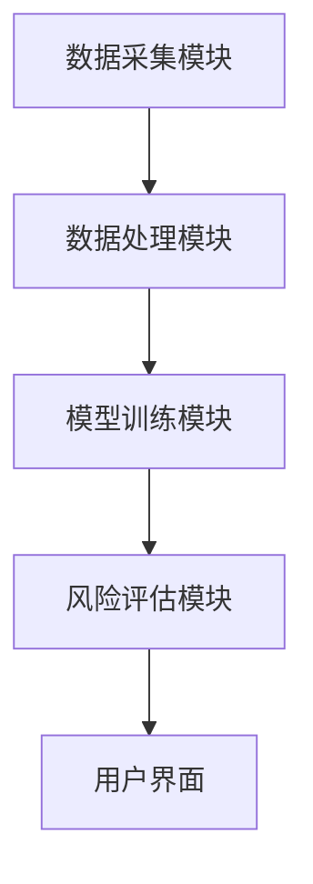
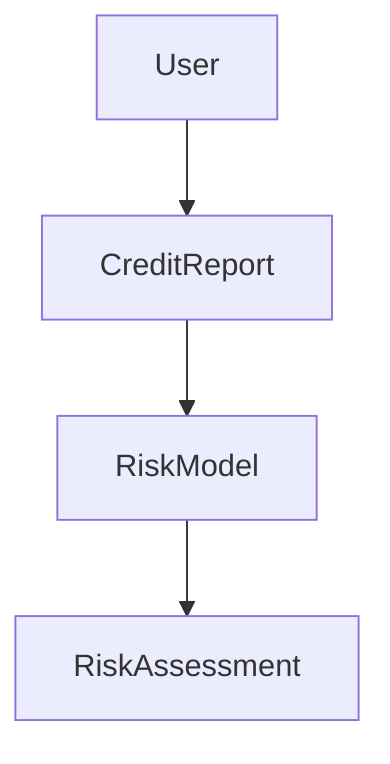
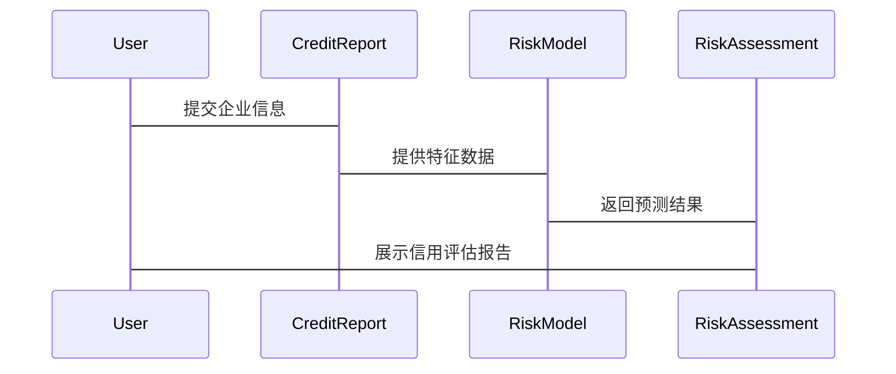

                 

# AI Agent在企业信用风险评估与管理中的应用

## 关键词：AI Agent, 信用风险评估, 企业风险管理, 智能决策系统, 机器学习

## 摘要：  
随着人工智能技术的快速发展，AI Agent（人工智能代理）在企业信用风险评估与管理中的应用越来越广泛。本文从AI Agent的基本概念出发，详细探讨其在信用风险评估中的核心作用，结合实际案例分析AI Agent的优势与挑战。通过理论与实践的结合，本文旨在为企业提供一种高效、智能的信用风险管理解决方案，助力企业在复杂多变的市场环境中降低风险，实现可持续发展。

---

# 第一部分: AI Agent与企业信用风险评估概述

## 第1章: AI Agent与信用风险评估的基本概念

### 1.1 AI Agent的基本概念

#### 1.1.1 AI Agent的定义  
AI Agent是一种智能代理系统，能够感知环境、自主决策并执行任务。它可以分为**简单反射型代理**、**基于模型的反射型代理**、**目标驱动型代理**和**效用驱动型代理**四种类型。AI Agent的核心特征包括**自主性**、**反应性**、**目标导向**和**学习能力**。

#### 1.1.2 AI Agent的核心特征  
- **自主性**：AI Agent能够独立决策，无需人工干预。  
- **反应性**：能够实时感知环境变化并做出响应。  
- **目标导向**：基于预设目标执行任务。  
- **学习能力**：通过机器学习算法不断优化自身的决策能力。  

#### 1.1.3 AI Agent在企业中的应用场景  
AI Agent广泛应用于企业信用风险评估、供应链管理、客户服务等领域。例如，在信用风险评估中，AI Agent可以通过分析企业财务数据、市场动态等信息，预测企业违约概率并提出风险管理建议。

### 1.2 信用风险的基本概念

#### 1.2.1 信用风险的定义  
信用风险是指由于债务人或交易对手无法履行其合约义务，导致债权人或投资者遭受损失的风险。信用风险是企业风险管理的重要组成部分。

#### 1.2.2 信用风险的主要类型  
- **企业信用风险**：由于企业财务状况恶化或管理不善导致的风险。  
- **市场信用风险**：由于市场波动或经济环境变化导致的风险。  
- **交易信用风险**：由于交易对手违约导致的风险。  

#### 1.2.3 信用风险评估的重要性  
信用风险评估是企业信贷决策的核心环节，通过评估客户的信用状况，企业可以制定合理的信贷政策，降低违约风险。

### 1.3 AI Agent与信用风险评估的结合

#### 1.3.1 AI Agent在信用风险评估中的优势  
AI Agent能够快速处理海量数据，发现传统方法难以察觉的模式和趋势。例如，通过自然语言处理（NLP）技术分析企业新闻、社交媒体信息，AI Agent可以更全面地评估企业的信用状况。

#### 1.3.2 AI Agent与传统信用风险评估方法的对比  
传统的信用风险评估方法主要依赖于财务数据和人工分析，效率较低且容易受到主观因素的影响。相比之下，AI Agent能够结合结构化数据和非结构化数据，提供更精准的评估结果。

#### 1.3.3 信用风险评估中AI Agent的应用前景  
随着大数据和人工智能技术的快速发展，AI Agent在信用风险评估中的应用前景广阔。未来，AI Agent可以通过实时数据流处理，动态调整信用评估模型，进一步提高评估的准确性和效率。

## 1.4 本章小结  
本章介绍了AI Agent的基本概念和核心特征，分析了信用风险的基本类型及其评估的重要性，并探讨了AI Agent在信用风险评估中的优势和应用前景。

---

# 第二部分: AI Agent的原理与技术实现

## 第2章: AI Agent的原理与架构

### 2.1 AI Agent的基本原理

#### 2.1.1 AI Agent的核心算法  
AI Agent的核心算法包括**监督学习**、**无监督学习**和**强化学习**。例如，监督学习用于分类任务，无监督学习用于聚类分析，强化学习用于动态决策。

#### 2.1.2 AI Agent的决策机制  
AI Agent的决策机制包括**规则驱动决策**和**数据驱动决策**。规则驱动决策基于预设的规则进行判断，数据驱动决策则依赖于机器学习模型的预测结果。

#### 2.1.3 AI Agent的学习与自适应能力  
AI Agent通过**在线学习**和**离线学习**不断提升自身的决策能力。例如，可以通过强化学习算法优化信用风险评估模型的预测精度。

### 2.2 AI Agent的架构设计

#### 2.2.1 分层架构  
AI Agent的分层架构包括**感知层**、**决策层**和**执行层**。感知层负责数据采集，决策层负责模型推理，执行层负责任务执行。

#### 2.2.2 分布式架构  
分布式架构通过多节点协作实现更强大的计算能力和更高的容错性。例如，在分布式AI Agent架构中，多个节点可以分别处理不同的数据源，最终汇总结果。

#### 2.2.3 模块化架构  
模块化架构将AI Agent的功能划分为多个模块，例如数据处理模块、模型训练模块和决策执行模块。每个模块独立开发和维护，便于功能扩展和升级。

### 2.3 AI Agent的技术实现

#### 2.3.1 数据采集与处理  
AI Agent需要采集企业信用相关的多源数据，包括财务数据、市场数据、舆情数据等。数据处理过程包括数据清洗、特征提取和数据转换。

#### 2.3.2 模型训练与优化  
通过机器学习算法（如随机森林、支持向量机、神经网络等）对数据进行建模，并通过交叉验证优化模型参数。例如，使用XGBoost算法训练信用评分模型。

#### 2.3.3 系统集成与部署  
将AI Agent系统部署到企业IT环境中，与其他系统（如ERP、CRM）进行集成，实现信用风险评估的自动化和智能化。

## 2.4 本章小结  
本章详细介绍了AI Agent的基本原理和架构设计，并探讨了数据采集、模型训练和系统集成的技术实现。

---

# 第三部分: 信用风险评估的理论基础

## 第3章: 信用风险评估的理论基础

### 3.1 信用风险评估的基本方法

#### 3.1.1 信用评分模型  
信用评分模型通过对企业财务数据的分析，预测企业的信用风险等级。例如，使用FICO信用评分模型评估个人信用风险，企业信用评分模型可以参考CAMELS评级系统。

#### 3.1.2 信用评级模型  
信用评级模型将企业分为不同的信用等级，例如AAA、AA、A、BBB、BB、B、CCC、CC、C和D级。信用评级模型通常基于财务指标（如流动性、杠杆率、盈利能力）和非财务指标（如管理质量、行业风险）进行综合评估。

#### 3.1.3 信用风险的定量分析  
信用风险的定量分析方法包括**违约概率（PD）**、**违约损失率（LGD）**和**预期信用损失（ECL）**的计算。例如，使用Merton模型计算企业的违约概率。

### 3.2 信用风险评估的关键指标

#### 3.2.1 违约概率（PD）  
违约概率是指企业在一定期限内违约的可能性。PD的计算通常基于企业的财务状况和行业风险。

#### 3.2.2 违约损失率（LGD）  
违约损失率是指在企业违约时，债权人实际损失的比例。LGD的计算需要考虑回收率、担保等因素。

#### 3.2.3 预期信用损失（ECL）  
预期信用损失是指企业在信用周期内预期的损失。ECL的计算需要结合PD和LGD，并考虑经济周期的影响。

### 3.3 信用风险评估的数学模型

#### 3.3.1 线性回归模型  
线性回归模型用于预测企业的信用风险等级。例如，使用逻辑回归模型预测企业违约的概率。

#### 3.3.2 风险中性定价模型  
风险中性定价模型用于计算企业信用工具的理论价格。例如，使用Merton模型计算企业债券的理论价格。

#### 3.3.3 非参数模型  
非参数模型（如随机森林、梯度提升树）能够更好地处理非线性关系和复杂数据。

---

## 第4章: 信用风险评估的数学模型与算法

### 4.1 信用评分模型的数学公式  
信用评分模型通常基于线性回归或逻辑回归。例如，逻辑回归模型的损失函数为：  
$$ L = -\sum_{i=1}^{n} [y_i \ln p_i + (1 - y_i) \ln (1 - p_i)] $$  
其中，$y_i$ 是标签，$p_i$ 是预测概率。

### 4.2 信用评级模型的数学公式  
信用评级模型通常基于主成分分析（PCA）或聚类分析。例如，主成分分析的特征向量为：  
$$ w = \arg \max (\lambda) $$  
其中，$\lambda$ 是特征值。

### 4.3 违约概率（PD）的计算公式  
违约概率（PD）可以通过历史数据或统计模型计算。例如，使用泊松回归模型：  
$$ PD = \frac{\lambda}{1 + \lambda} $$  
其中，$\lambda$ 是泊松分布的参数。

### 4.4 违约损失率（LGD）的计算公式  
违约损失率（LGD）通常基于历史数据和行业经验。例如，假设某行业的平均LGD为30%，则LGD = 0.3。

### 4.5 预期信用损失（ECL）的计算公式  
预期信用损失（ECL）的计算公式为：  
$$ ECL = EAD \times PD \times LGD $$  
其中，EAD是风险敞口。

### 4.6 机器学习算法在信用风险评估中的应用  
机器学习算法（如XGBoost、LightGBM、神经网络）在信用风险评估中表现出色。例如，使用XGBoost算法训练企业信用评分模型。

---

## 第5章: 系统设计与实现

### 5.1 系统功能设计

#### 5.1.1 数据采集模块  
数据采集模块负责收集企业信用相关的多源数据，包括：  
1. 财务数据：收入、利润、资产负债表等。  
2. 市场数据：行业趋势、宏观经济指标。  
3. 舆情数据：新闻、社交媒体信息。  

#### 5.1.2 数据处理模块  
数据处理模块包括数据清洗、特征提取和数据转换。例如，使用Python的pandas库进行数据清洗，使用scikit-learn库进行特征提取。

#### 5.1.3 模型训练模块  
模型训练模块基于机器学习算法训练信用评分模型或信用评级模型。例如，使用XGBoost算法训练模型，并通过交叉验证优化参数。

#### 5.1.4 风险评估模块  
风险评估模块基于模型预测结果生成信用风险评估报告，包括企业信用等级、违约概率、预期信用损失等。

### 5.2 系统架构设计

#### 5.2.1 系统架构图  
以下是系统的架构图：  

#### 5.2.2 实体关系图  
以下是实体关系图：  

### 5.3 系统接口设计

#### 5.3.1 数据接口  
数据接口负责与外部数据源（如企业数据库、第三方API）对接，获取企业信用数据。

#### 5.3.2 模型接口  
模型接口负责与机器学习模型交互，接收输入数据并返回预测结果。

#### 5.3.3 用户接口  
用户接口是系统的前端部分，提供用户友好的操作界面，展示信用风险评估结果。

### 5.4 系统交互流程图  
以下是系统交互流程图：  

---

## 第6章: 项目实战与案例分析

### 6.1 项目背景  
某银行希望通过引入AI Agent技术，提高企业信用风险评估的效率和准确性。传统方法依赖人工分析，耗时且容易出错，而AI Agent可以通过自动化处理和智能决策显著提升评估效果。

### 6.2 项目需求  
项目需求包括：  
1. 实时采集企业信用数据。  
2. 建立机器学习模型进行信用评分。  
3. 自动生成信用风险评估报告。  

### 6.3 项目实施步骤

#### 6.3.1 数据采集  
通过爬虫技术采集企业的财务数据、市场数据和舆情数据。例如，使用BeautifulSoup和requests库爬取企业新闻。

#### 6.3.2 数据处理  
使用pandas库进行数据清洗，使用scikit-learn库进行特征提取。例如，提取企业的财务比率、市场趋势指标和舆情情感指标。

#### 6.3.3 模型训练  
选择XGBoost算法训练信用评分模型，并通过K折交叉验证优化参数。例如，设置学习率（learning rate）为0.1，树的深度（max_depth）为6。

#### 6.3.4 模型部署  
将训练好的模型部署到生产环境，通过API接口提供信用评分服务。例如，使用Flask框架搭建RESTful API。

#### 6.3.5 系统集成  
将AI Agent系统与银行的信贷管理系统集成，实现信用风险评估的自动化和智能化。

### 6.4 案例分析  
以某制造企业为例，AI Agent系统通过分析企业的财务数据、行业趋势和市场舆情，预测企业的违约概率为5%，信用评分为75分。银行据此制定合理的信贷政策，显著降低了信用风险。

---

## 第7章: 总结与展望

### 7.1 总结  
本文详细探讨了AI Agent在企业信用风险评估中的应用，从理论基础到技术实现，再到系统设计和项目实战，全面展示了AI Agent的优势和价值。通过引入AI Agent技术，企业能够更高效、更准确地进行信用风险管理，降低潜在风险。

### 7.2 展望  
未来，AI Agent在信用风险评估中的应用将更加广泛和深入。随着技术的进步，AI Agent将具备更强的自适应能力和更高的决策精度。例如，通过结合区块链技术，实现信用数据的可信共享和实时更新。

---

# 作者：AI天才研究院/AI Genius Institute & 禅与计算机程序设计艺术 /Zen And The Art of Computer Programming

