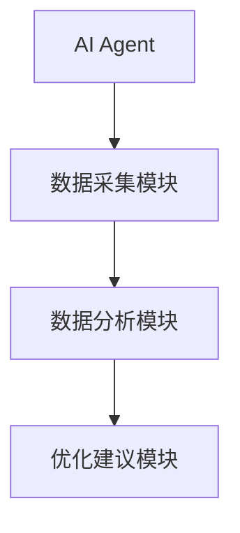

                 


# AI Agent在企业全面质量管理(TQM)中的深度应用

## 关键词：AI Agent, 全面质量管理, 企业质量管理, 智能代理, 数字化转型

## 摘要：  
本文探讨了AI Agent在企业全面质量管理（TQM）中的深度应用，分析了AI Agent如何通过智能化手段优化传统质量管理流程，提升企业质量管理水平。文章从TQM的核心概念、AI Agent的基本原理、算法实现、系统设计、项目实践等多维度展开，详细阐述了AI Agent在TQM中的应用场景、技术实现和实际价值。通过案例分析和系统设计，本文展示了AI Agent在TQM中的巨大潜力和实际应用前景。

---

## 第1章: 全面质量管理（TQM）概述

### 1.1 全面质量管理的核心概念  
全面质量管理（Total Quality Management，TQM）是一种以顾客为中心，通过全组织、全过程、全员参与的方式，持续改进产品和服务质量的管理方法。其核心理念是通过优化每个环节的质量，实现企业整体绩效的提升。  

- **问题背景**：传统的企业质量管理往往依赖人工检查和经验判断，存在效率低、成本高、覆盖不全面等问题。  
- **问题描述**：在数字化转型的背景下，企业质量管理需要更高效、更智能化的解决方案。  
- **问题解决**：引入AI Agent，通过智能化手段实现质量数据的实时采集、分析和优化建议，提升质量管理效率和精准度。  

---

### 1.2 传统质量管理的局限性与AI Agent的优势  

| **传统质量管理**          | **AI Agent在质量管理中的优势**                     |
|---------------------------|---------------------------------------------|
| 依赖人工检查，效率低       | 实现自动化数据采集与分析                         |
| 覆盖范围有限               | 全面覆盖企业质量管理的全生命周期                   |
| 数据分析能力有限           | 基于AI和大数据的深度分析，发现潜在问题           |
| 响应速度慢                 | 实时监控与快速反馈                             |

---

## 第2章: AI Agent与TQM的核心概念分析  

### 2.1 AI Agent的基本概念与特点  

- **定义**：AI Agent是一种具有自主决策能力的智能体，能够根据环境信息自主选择最优行动方案。  
- **特点**：  
  - 数据驱动：基于实时数据进行决策；  
  - 自适应性：能够根据环境变化自动调整策略；  
  - 可扩展性：能够集成多种AI技术（如机器学习、自然语言处理等）。  

---

### 2.2 AI Agent与TQM的关系  

AI Agent在TQM中的作用类似于一个智能化的质量管理助手，它能够：  
1. 实时监控生产过程中的关键质量指标；  
2. 基于历史数据和实时数据，预测潜在的质量问题；  
3. 自动生成优化建议，帮助管理者快速决策。  

---

## 第3章: AI Agent的核心算法与流程  

### 3.1 常见的AI Agent算法  

#### 3.1.1 基于决策树的分类算法  

- **算法流程**：  
  1. 数据预处理：清洗、归一化；  
  2. 构建决策树：使用ID3、C4.5或CART算法；  
  3. 预测与优化：基于决策树进行分类或回归。  

- **数学模型**：  
  $$ entropy = -\sum_{i=1}^{n} p_i \log_2 p_i $$  

- **代码实现**：  
```python
import numpy as np
from sklearn.tree import DecisionTreeClassifier

# 数据预处理
X = np.array([[...], [...]])  # 特征向量
y = np.array([...])  # 标签

# 模型训练
model = DecisionTreeClassifier()
model.fit(X, y)

# 预测
new_data = np.array([[...]])
print(model.predict(new_data))
```

---

## 第4章: AI Agent在全面质量管理中的系统设计  

### 4.1 系统功能设计  

- **功能模块**：  
  - 数据采集模块：实时采集生产过程中的质量数据；  
  - 数据分析模块：基于AI算法进行数据挖掘和预测；  
  - 优化建议模块：自动生成质量改进方案。  

- **系统架构图**：  


---

## 第5章: 项目实战：AI Agent在制造业TQM中的应用  

### 5.1 项目背景与目标  

- **项目背景**：某制造企业希望利用AI技术优化其质量管理流程，降低产品缺陷率。  
- **项目目标**：实现生产过程中的实时质量监控，预测潜在问题并提供优化建议。  

---

### 5.2 环境配置与代码实现  

#### 5.2.1 环境配置  

- **工具**：Python 3.8、TensorFlow 2.0、Scikit-learn 0.24；  
- **数据集**：生产过程中的质量指标数据（如温度、压力、时间等）。  

#### 5.2.2 核心代码实现  

```python
import pandas as pd
from sklearn.ensemble import RandomForestClassifier
from sklearn.metrics import accuracy_score

# 数据加载
data = pd.read_csv('quality_data.csv')

# 特征与标签分离
X = data.drop('defect', axis=1)
y = data['defect']

# 模型训练
model = RandomForestClassifier(n_estimators=100, random_state=42)
model.fit(X, y)

# 预测与评估
test_data = pd.read_csv('test_quality_data.csv')
test_X = test_data.drop('defect', axis=1)
test_y = test_data['defect']
predicted_y = model.predict(test_X)
print(f"模型准确率：{accuracy_score(test_y, predicted_y)}")
```

---

## 第6章: 最佳实践与未来展望  

### 6.1 最佳实践  

- **数据质量管理**：确保数据的准确性和完整性；  
- **模型迭代优化**：定期更新模型，适应新的数据和业务需求；  
- **人机协同**：AI Agent与人工质量管理相结合，最大化效率。  

### 6.2 未来展望  

随着AI技术的不断发展，AI Agent在TQM中的应用将更加广泛和深入。未来，AI Agent可以通过边缘计算和物联网技术，实现更加实时和精准的质量管理。同时，结合区块链技术，AI Agent还可以提升质量管理的透明度和可信度。

---

## 结语  

AI Agent作为一项革命性的技术，正在重新定义企业质量管理的方式。通过本文的深入分析，我们可以看到，AI Agent不仅能够提升质量管理的效率，还能为企业带来更大的竞争优势。未来，随着技术的进一步发展，AI Agent在TQM中的应用潜力将更加巨大。

---

## 作者：AI天才研究院 & 禅与计算机程序设计艺术

